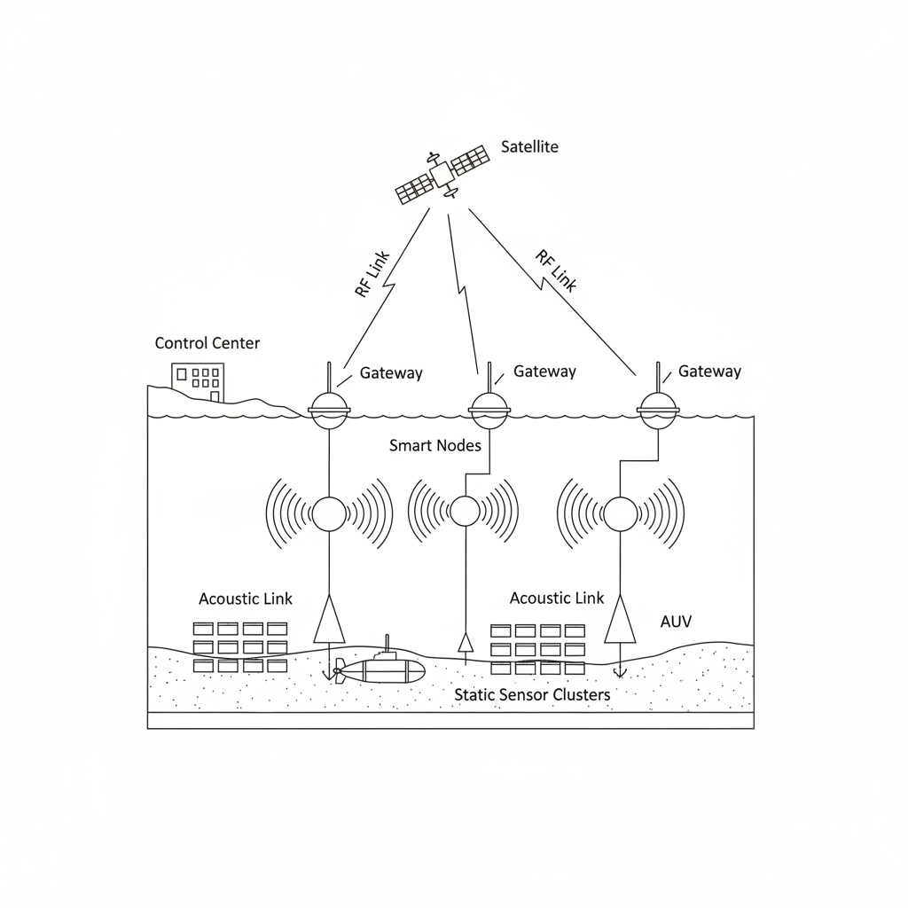

# **Κεφάλαιο 3: Υποβρύχια και επιφανειακά συστήματα ανίχνευσης**

## **Επισκόπηση**

Αυτή η ενότητα αναλύει ολοκληρωμένα συστήματα ανίχνευσης που προσφέρουν αξιόπιστη παρακολούθηση των ωκεανών και συλλογή δεδομένων για εφαρμογές του Θαλάσσιου Διαδικτύου των Πραγμάτων (Muhammad et al., 2025; Sahoo et al., 2025). Η μελέτη καλύπτει έξι κύρια θέματα - ταυτόχρονα - Τα υποβρύχια ασύρματα δίκτυα αισθητήρων χρησιμοποιούνται για τη δημιουργία συνδέσεων βυθού και τρισδιάστατων υποβρύχιων δικτύων (3.1), τα συστήματα ακουστικής επικοινωνίας χρησιμοποιούνται για αξιόπιστη υποβρύχια μεταφορά δεδομένων σε αντίξοες θαλάσσιες συνθήκες (3.2), τα αυτόνομα υποβρύχια οχήματα ενσωματώνονται σε κινητή υποβρύχια ανίχνευση και προσαρμοστική εξερεύνηση (3.3), τα μη επανδρωμένα επιφανειακά οχήματα δικτυώνονται σε κόμβους επιφανειακής επικοινωνίας και διατομεακό συντονισμό (3.4) και συλλέγονται ωκεανογραφικά δεδομένα σε πραγματικό χρόνο και χρησιμοποιείται αισθητήρας ανθεκτικός στη βιορρύπανση.
Σκοπός της παρούσας μελέτης είναι να καταδείξει την αποτελεσματικότητα της παρακολούθησης του θαλάσσιου περιβάλλοντος μέσω διαφορετικών τεχνολογιών ανίχνευσης. Επίσης, θέτει ερευνητικά ερωτήματα που επικεντρώνονται στην αξιοπιστία των δικτύων, την αποδοτικότητα της χρήσης ενέργειας, τη συμβατότητα των συστημάτων και τη μακροπρόθεσμη βιωσιμότητα της ανάπτυξης (Zahra et al. 2025; Ananthi et al. 2024; Lavanya et al., 2025). Οι ενότητες 3.1 έως 3.6 ξεκινούν με απλές υποβρύχιες συνδέσεις και συστήματα ηχητικής επικοινωνίας, οι οποίες αναπτύσσονται περαιτέρω στον αυτοματοποιημένο συντονισμό οχημάτων και στα επιφανειακά δίκτυα και, τέλος, σε εξελιγμένα συστήματα περιβαλλοντικής παρακολούθησης και βιώσιμες μακροπρόθεσμες λύσεις. Αυτές οι ενότητες θέτουν τις βάσεις πάνω στις οποίες τα μοντέλα κυβερνοασφάλειας και οι αναλυτικές πλατφόρμες που συζητούνται στα επόμενα κεφάλαια θα έχουν μια ισχυρή βάση πάνω στην οποία θα βασιστούν (Muhammad et al., 2025; Patterson et al., 2025; Sahoo et al., 2025).
Οι ενότητες στις ενότητες συνδυάζονται για να αναλύσουν τα προβλήματα που σχετίζονται με την υποβρύχια και επιφανειακή ανίχνευση με την τρέχουσα τεχνολογία και πρακτικές εφαρμογές. Οι ενότητες συνεργάζονται για να δημιουργήσουν μια ενιαία βάση δεδομένων που καταδεικνύει πώς τα συνδυασμένα συστήματα θαλάσσιας ανίχνευσης παράγουν εκτεταμένες πληροφορίες λήψης αποφάσεων που απαιτούνται για τη σύγχρονη λειτουργία των ωκεανών και την περιβαλλοντικά ορθή διαχείριση των θαλάσσιων πόρων (SAFE-uIoT, 2024; Kang et al., 2024; Prakash & Zielinski, 2025).
Τα υποβρύχια ασύρματα δίκτυα αισθητήρων (UWSN) αποτελούν απαραίτητο δομικό στοιχείο για την ανάπτυξη θαλάσσιων συστημάτων IoT, παρέχοντας αξιόπιστη παρακολούθηση, διαχείριση πόρων και επικοινωνία σε πραγματικό χρόνο κάτω από την επιφάνεια της θάλασσας. Είναι όλο και πιο απαραίτητα για να βοηθήσουν στην ωκεανογραφική έρευνα, την ανακάλυψη θαλάσσιων πόρων, την πρόβλεψη καταστροφών και τη διαχείριση του περιβάλλοντος - κρίσιμους παράγοντες που συμβάλλουν στον ψηφιακό μετασχηματισμό των ωκεάνιων βιομηχανιών (Muhammad et al., 2025; Zahra et al., 2025).

### Θεωρητικό Υπόβαθρο

Τα τελευταία χρόνια έχουν μετατρέψει τα UWSN από βασικούς ενσύρματους κόμβους σε προηγμένα ασύρματα συστήματα που χρησιμοποιούν ακουστικές, οπτικές και μαγνητοεπαγωγικές μεθόδους επικοινωνίας. Τα τρέχοντα UWSN χρησιμοποιούν πολλαπλούς αισθητήρες που επιτρέπουν τις λειτουργίες του Διαδικτύου των Υποβρύχιων Πραγμάτων (IoUT) μέσω συστημάτων ελέγχου δικτύου που βασίζονται στην Τεχνητή Νοημοσύνη και έξυπνων διαδικασιών συλλογής δεδομένων (Muhammad et al., 2025). Οι κύριες εξελίξεις σε αυτόν τον τομέα περιλαμβάνουν τον έλεγχο των θέσεων των κόμβων, αξιόπιστα τρισδιάστατα συστήματα υποβρύχιας επικοινωνίας και μεθόδους δικτύωσης εξοικονόμησης ενέργειας (Zahra et al., 2025; Khan et al., 2024).

**Εικόνα 3.1**: _Αρχιτεκτονική Υποβρύχιου Ασύρματου Δικτύου Αισθητήρων (UWSN) 3D. Το σύστημα ενσωματώνει στατικούς αισθητήρες βυθού, κόμβους ρυθμιζόμενου βάθους και κινητά AUV για τη δημιουργία ενός ολοκληρωμένου πλέγματος παρακολούθησης του ωκεανού._

### Τεχνικές Προκλήσεις και Προβληματισμοί

Το υδάτινο περιβάλλον βασίζεται στη χρήση ακουστικών κυμάτων στην επικοινωνία, καθώς τα ραδιοσήματα είναι γνωστό ότι εξασθενούν γρήγορα στο νερό. Τα ηχητικά κύματα είναι ένα ασθενές σήμα στα περισσότερα μέρη του κόσμου και παρουσιάζουν επίσης και άλλα προβλήματα, όπως ηχώ και οι διακυμάνσεις των σημάτων που εμποδίζουν τη σωστή μετάδοση δεδομένων και δυσκολίες συγχρονισμού (Muhammad et al., 2025).
Η διάρκεια ζωής του δικτύου περιορίζεται από την παροχή ρεύματος, καθώς οι κόμβοι λειτουργούν με μπαταρίες και συχνά είναι δύσκολο να επαναφορτιστούν μετά την ανάπτυξή τους. Η κύρια πρόκληση εξακολουθεί να είναι ο σχεδιασμός με τη χαμηλότερη δυνατή κατανάλωση ενέργειας και τη μεγαλύτερη δυνατή λειτουργική διάρκεια ζωής (Khan et al., 2024). - Η κίνηση του νερού οδηγεί σε αλλαγές στην τοπολογία του δικτύου, επομένως υπάρχουν προκλήσεις στην ανίχνευση κόμβων, τον συγχρονισμό και τη διατήρηση μιας ισχυρής σύνδεσης (Muhammad et al., 2025).
Υπάρχουν επίσης και άλλα προβλήματα, όπως το υψηλό κόστος υπολογιστικής, η ορατότητα μόνο ορισμένων κόμβων, οι πολυάριθμες βλάβες και η ανασφάλεια σε ζητήματα ασφαλείας, όπως οι κυβερνοεπιθέσεις και οι παραβιάσεις δεδομένων. Αυτά τα ζητήματα ασφάλειας επιδεινώνονται από τις χαμηλές αναπτύξεις και τα αντίπαλα περιβάλλοντα που απαιτούν πλήρεις λύσεις σε θέματα εμπιστευτικότητας, ελέγχου ταυτότητας και ακεραιότητας (Zahra et al., 2025).
Μέθοδοι Έρευνας και Τρέχουσες Τεχνολογίες

Η σύγχρονη χρήση του UWSN περιλαμβάνει ρυθμιζόμενες μεθόδους επικοινωνίας ήχου για την ασφαλή μεταφορά δεδομένων. Οι τρέχουσες μέθοδοι βασίζονται σε μια οικονομικά αποδοτική δρομολόγηση που μειώνει την κατανάλωση ενέργειας διατηρώντας παράλληλα ένα αποδεκτό επίπεδο αξιοπιστίας δεδομένων (Khan et al., 2024). Η μηχανική μάθηση και η βαθιά ενισχυτική μάθηση χρησιμοποιούνται στον έξυπνο σχεδιασμό συνδέσμων, την κατανομή ισχύος και την ελεγχόμενη διαχείριση τοπολογίας, οι οποίες είναι σε θέση να ανταποκριθούν στην μετατόπιση της κατάστασης του κόμβου ή στην μεταβολή της πυκνότητας του δικτύου (Muhammad et al., 2025).
Κινητικότητα βυθομέτρου και εφαρμογή κινητών αυτόνομων υποβρύχιων οχημάτων (AUV) για την επίτευξη καλύτερης κάλυψης και ευρωστίας (Zhu et al., 2024).
Κρυπτογραφία τελευταίας τεχνολογίας, πρωτόκολλα ασφαλούς δρομολόγησης και ευέλικτα μοντέλα διαχείρισης εμπιστοσύνης σχεδιασμένα για το υποβρύχιο περιβάλλον, προστατεύοντας από τις αναδυόμενες κυβερνοαπειλές (Zahra et al., 2025).
Τα UWSN χρησιμοποιούνται αποτελεσματικά στις ακόλουθες εφαρμογές.
Παρακολούθηση θαλάσσιου περιβάλλοντος: Επιτρέπει τη μακροπρόθεσμη παρακολούθηση και ανίχνευση ρύπανσης στη θάλασσα, τις λίμνες και τα ποτάμια (Muhammad et al., 2025).
Πρόληψη κινδύνων: Επιτήρηση σε πραγματικό χρόνο τσουνάμι και σεισμών χρησιμοποιώντας υποθαλάσσιους αισθητήρες (Zahra et al., 2025).
Εξερεύνηση πόρων: Βοήθεια στην υποβρύχια εξόρυξη, αναζήτηση πετρελαίου και φυσικού αερίου με τη συλλογή δεδομένων συνεχώς (Khan et al., 2024).
Ιχθυοκαλλιέργεια: Παρακολούθηση της ποιότητας του νερού και της υγείας των ψαριών για τη βελτίωση της παραγωγής και τη μείωση της σπατάλης πόρων (Muhammad et al., 2025).
Παρακολούθηση αγωγών και υποβρύχιων καλωδίων με έξυπνους αισθητήρες.
Η θαλάσσια ασφάλεια εφαρμόζεται στον έλεγχο των συνόρων, στην ανίχνευση ναρκών και στην επιτήρηση πλοίων ή θαλάσσιων ζώων (Zahra et al., 2025).
Πιθανές κατευθύνσεις μελέτης περιλαμβάνουν τα ακόλουθα. Οι επιστήμονες καλούνται να αναπτύξουν υποβρύχιο εξοπλισμό που καταναλώνει ελάχιστη ενέργεια και είναι σε θέση να συλλέγει ενέργεια από μόνος του, συνεχίζοντας έτσι να λειτουργεί για μεγάλα χρονικά διαστήματα. Οι επιστήμονες θα βελτιώσουν επίσης την ακρίβεια του προσδιορισμού της θέσης των υποβρύχιων κόμβων και του συντονισμού τους σε τρισδιάστατα ταχέως μεταβαλλόμενα περιβάλλοντα, όπως οι κινητοί κόμβοι. Σύμφωνα με πρόσφατη μελέτη, πρέπει να αναπτυχθούν ασφαλή, ευέλικτα πρωτόκολλα, τα οποία είναι ικανά να αντιμετωπίζουν νέες επιθέσεις και επιχειρήσεις σε περιβάλλοντα που χαρακτηρίζονται από τροποποιήσεις των κόμβων και διακυμάνσεις του περιβάλλοντος.
Το σύστημα περιλαμβάνει εξελιγμένη Τεχνητή Νοημοσύνη, πολυεπίπεδα μέτρα ασφαλείας και τυποποιημένη υποδομή για τη διευκόλυνση των πραγματικών δοκιμών και της ανάπτυξης σε μεγάλη κλίμακα, Khan et al., 2024.
Η ακουστική επικοινωνία είναι ο πιο αποτελεσματικός τρόπος επικοινωνίας μεταξύ των θαλάσσιων συστημάτων IoT. Τα ηλεκτρομαγνητικά κύματα δεν μπορούν να φτάσουν μακριά στο νερό, επομένως τα ηχητικά κύματα χρησιμοποιούνται στην επικοινωνία. Τα ακουστικά σήματα των υποβρύχιων συστημάτων του Διαδικτύου των Πραγμάτων υποστηρίζουν βασικές θαλάσσιες δραστηριότητες, όπως η ανίχνευση και η πλοήγηση, η παρακολούθηση και η δημιουργία μελλοντικής τεχνολογίας ωκεανών. Η χρήση ακουστικής επικοινωνίας στον ωκεανό έχει αποδειχθεί ιδιαίτερα επωφελής για την ασφάλεια των λειτουργιών, την προστασία του περιβάλλοντος και την επιστημονική έρευνα, καθώς η ζήτηση για δεδομένα ωκεανών συνεχίζει να αυξάνεται (Xylouris et al., 2024; SAFE-uIoT, 2024).

### Θεωρητικό Υπόβαθρο

Προηγούμενες μελέτες εισήγαγαν τη μετάδοση ήχου για να ξεπεράσουν τα προβλήματα με την επικοινωνία μέσω ραδιοφώνου και φωτός. Τα ηχητικά κύματα κινούνται με περίπου 1.500 μέτρα ανά δευτερόλεπτο και έχουν χρησιμοποιηθεί σε βασικά συστήματα σόναρ, τα οποία έχουν εξελιχθεί σε προηγμένες εφαρμογές δικτύων αισθητήρων. Ο πειραματισμός της υποβρύχιας ακουστικής μεταξύ της ερευνητικής κοινότητας και των ναυτικών μηχανικών έχει οδηγήσει σε μεγάλες εξελίξεις στις αξιόπιστες τεχνικές συλλογής δεδομένων. Πρόσφατες μελέτες δείχνουν ότι οι τεχνικές μηχανικής μάθησης μπορούν να ενισχύσουν την αποτελεσματικότητα της ανίχνευσης ακουστικών σημάτων και της μείωσης του θορύβου σε πραγματικά περιβάλλοντα, βελτιώνοντας έτσι την παρακολούθηση (Panteli et al., 2025; Lyu et al., 2024).

**Πίνακας 3.1**: _Σύγκριση Τεχνολογιών Υποβρύχιας Επικοινωνίας_

| Feature            | Ακουστική Επικοινωνία                                                   | Οπτική Επικοινωνία                                                  | Ηλεκτρομαγνητική (RF) Επικοινωνία                    |
| ------------------ | ----------------------------------------------------------------------- | ------------------------------------------------------------------- | ---------------------------------------------------- |
| Κύριο Μέσο         | Κύματα Πίεσης (Ήχος)                                                    | Κύματα Φωτός (Λέιζερ Κυανού-Πράσινου)                               | Ραδιοκύματα                                          |
| Τυπική Εμβέλεια    | Μεγάλη (km έως 100+ km) espublisher​                                    | Μικρή (< 100 m) arxiv​                                              | Πολύ Μικρή (< 10 m σε θαλασσινό νερό) arxiv​         |
| Ρυθμός Δεδομένων   | Χαμηλός (kbps) ceur-ws​                                                 | Υψηλός (Mbps έως Gbps) ewadirect​                                   | Υψηλός (Mbps) σε μικρή εμβέλεια wirelesslab​         |
| Ταχύτητα Διάδοσης  | ~1,500 m/s (Υψηλή Λανθάνουσα Καθυστέρηση) ewadirect​                    | ~2.25 × 10⁸ m/s (Χαμηλή Λανθάνουσα Καθυστέρηση)                     | ~2.25 × 10⁸ m/s (Χαμηλή Λανθάνουσα Καθυστέρηση)      |
| Βασικές Προκλήσεις | Πολυδιαδρομική Διάδοση, Διασπορά Doppler, Χαμηλό Εύρος Ζώνης ceur-ws+1​ | Θολερότητα, Σκέδαση, Απαίτηση Οπτικής Επαφής (LOS) semanticscholar​ | Υψηλή Εξασθένηση, Απώλειες Αγωγιμότητας wirelesslab​ |
| Ενεργειακή Απόδοση | Χαμηλή (Υψηλή ισχύς ανά bit) espublisher​                               | Υψηλή (Χαμηλή ισχύς ανά bit)                                        | Μέτρια                                               |

### Τεχνικές Προκλήσεις και Προβληματισμοί

Η επικοινωνία εντός του νερού επηρεάζεται αρνητικά λόγω του θαλάσσιου περιβάλλοντος. Τα ακουστικά σήματα επηρεάζονται αρνητικά από τη διακύμανση της θερμοκρασίας, της αλατότητας και της πίεσης του νερού. Οι παρεμβολές και η απώλεια δεδομένων οφείλονται στην πολυδιαδρομική διάδοση. Η καθαρότητα του σήματος μειώνεται περαιτέρω λόγω του θαλάσσιου θορύβου που παράγεται από τα ζώα, τα πλοία και τον καιρό. Τα ταχύτερα ακουστικά σήματα διαχέουν περισσότερη ενέργεια, επομένως οι μηχανικοί χρειάζονται μια αντιστάθμιση μεταξύ του ρυθμού δεδομένων και της εμβέλειας. Τα πιο πρόσφατα ακουστικά πρότυπα για το uIoT στοχεύουν στη μείωση του θορύβου που επηρεάζει αρνητικά τη θαλάσσια ζωή. Οι αισθητήρες πυκνότητας με ενεργειακή έλλειψη και υψηλού κινδύνου αποτελούν ένα άλλο ζήτημα ανησυχίας (SAFE-uIoT, 2024; Xylouris et al., 2024).

### Υπάρχουσες τεχνολογίες και μεθοδολογικές προσεγγίσεις

Οι προκλήσεις μετάδοσης ήχου έχουν αντιμετωπιστεί αποτελεσματικά από συστήματα ακουστικών δικτύων, τα οποία πλέον χρησιμοποιούν προσαρμοστικούς αλγόριθμους ως βασικές λειτουργικές μεθόδους. Το σύστημα μειώνει την υποβάθμιση του σήματος και επεκτείνει την εμβέλεια επικοινωνίας μέσω στρατηγικής τοποθέτησης μόντεμ και κόμβων αισθητήρων που βασίζονται σε περιβαλλοντικά μοντέλα. Οι Lyu et al. (2024) και άλλες πηγές δείχνουν ότι τα συστήματα ανίχνευσης και αφαίρεσης θορύβου με βάση τη μηχανική μάθηση έχουν γίνει τυπικές πρακτικές στην ανίχνευση σήματος, ειδικά όταν πρόκειται για δεδομένα με θόρυβο. Σύμφωνα με τους Xylouris et al. (2024) και Ali et al. (2024), η ανθεκτικότητα και η λειτουργική διάρκεια ζωής του δικτύου αισθητήρων ενισχύονται μέσω της ενσωμάτωσης ενεργειακά αποδοτικών μεθόδων δρομολόγησης και κινητών κόμβων sink. Ο τομέας των λειτουργιών αισθητήρων έχει βιώσει μια αναπτυσσόμενη αγορά ακουστικών αισθητήρων σε συνδυασμό με αναδυόμενα πρότυπα που διευκολύνουν τα συστήματα θαλάσσιας παρακολούθησης σε πραγματικό χρόνο (Research and Markets 2024; SAFE-uIoT 2024).

### Εφαρμογές και Περιπτώσεις Χρήσης

Τα ακουστικά δίκτυα χρησιμεύουν για την παρακολούθηση της βιοποικιλότητας και την παροχή ειδοποιήσεων για καταστροφές και την επιτήρηση των υποδομών, καθώς και της λειτουργίας των οχημάτων. Τα ακουστικά δίκτυα χρησιμοποιούνται για τη λειτουργία οχημάτων, την παρακολούθηση υφάλων, την παρακολούθηση φαλαινών και τον έλεγχο των AUV και ROV, καθώς και για τη συλλογή δεδομένων σε απομακρυσμένες περιοχές. Τα ConeSLP και RLOR είναι δύο από τα πρωτόκολλα δρομολόγησης που αποδεικνύονται ισχυρότερα σε αξιοπιστία και ενεργειακή απόδοση, ειδικά με δίκτυα αισθητήρων μεγάλης κλίμακας. Υπάρχει μια άνθηση στη βιομηχανία ακουστικών μόντεμ και οι επιχειρήσεις λανσάρουν νέα προϊόντα υποβρύχιας επικοινωνίας με επικοινωνία στην ακτή.

### Μελλοντικές Κατευθύνσεις και Ερευνητικά Κενά

Αυτή τη στιγμή, οι επιστήμονες προσπαθούν να αυξήσουν τον ρυθμό και την εμβέλεια των υποβρύχιων δεδομένων και να διασφαλίσουν ότι τα συστήματα είναι φιλικά προς το περιβάλλον. Καλύτερη μείωση θορύβου και αναγνώριση σήματος ερευνώνται χρησιμοποιώντας μηχανική μάθηση. Τα πρότυπα στοχεύουν στην ελαχιστοποίηση της περιβαλλοντικής ζημίας από τον θόρυβο του μόντεμ, δηλαδή των επιπτώσεων στα θαλάσσια θηλαστικά και τους δύτες. Νέοι τομείς έρευνας περιλαμβάνουν την υβριδική δρομολόγηση, την βελτιωμένη αναγνώριση προτύπων και τον συνδυασμό ψηφιακών διδύμων αρχιτεκτονικών. Οι ερευνητές επιχειρούν να μελετήσουν τον μη Γκαουσιανό θόρυβο και να βελτιώσουν την ανθεκτικότητα των δικτύων αισθητήρων υπό τις μεταβαλλόμενες συνθήκες του ωκεανού (Lyu et al., 2024; Panteli et al., 2025; SAFE-uIoT, 2024).
Τα αυτόνομα υποβρύχια οχήματα (AUV) είναι ζωτικής σημασίας στα συστήματα IoT για τη ναυτιλία, για την υποστήριξη της τρέχουσας παρατήρησης των ωκεανών, της διαχείρισης των πόρων και της αντίδρασης σε καταστροφές. Αυτά τα κινητά ρομπότ συλλέγουν δεδομένα σε πραγματικό χρόνο και εξερευνούν με ευέλικτο τρόπο, όπου τα τυπικά πλοία και οι αισθητήρες δεν μπορούν να φτάσουν. Εκτελούν καθήκοντα όπως η εξερεύνηση οικοσυστημάτων, η επιτήρηση υποδομών και οι γρήγορες περιβαλλοντικές έρευνες που επιτρέπουν στους υπεύθυνους λήψης αποφάσεων να συμπληρώνουν κενά πληροφοριών για τη διατήρηση της βιωσιμότητας (Di Ciaccio & Taylor, 2021).

**Εικόνα 3.2**: _Αρθρωτή Αρχιτεκτονική Υλικού ενός Αυτόνομου Υποβρύχιου Οχήματος (AUV). Τα βασικά υποσυστήματα περιλαμβάνουν περιβαλλοντικούς αισθητήρες (CTD, Sonar) και μονάδες πλοήγησης απαραίτητες για προσαρμοστική εξερεύνηση._

### Θεωρητικό Υπόβαθρο

Η τεχνολογία AUV αναπτύσσεται πλέον χάρη στην τεχνητή νοημοσύνη (AI), τους μικρούς αισθητήρες, την υπολογιστική ακμής και την ευφυΐα σμήνους. Τα προηγούμενα μοντέλα βασίζονταν σε προγραμματισμένες αποστολές, αλλά οι σύγχρονες πλατφόρμες είναι ικανές για συντονισμένο έλεγχο σε πραγματικό χρόνο από το IoT και τα προσαρμοστικά συστήματα ελέγχου. Η νοημοσύνη κολύμβησης έχει αναπτυχθεί έτσι ώστε ένας αριθμός οχημάτων να μπορεί να συνεργάζεται στη διαχείριση αποκεντρωμένων αλγορίθμων προκειμένου να επιτευχθούν κοινοί στόχοι (Ananthi et al., 2024).

Τεχνικά Θέματα
Η ενσωμάτωση AUV έχει τις ακόλουθες βασικές τεχνικές προκλήσεις.
Η επικοινωνία είναι αργή: υπάρχει αργή επικοινωνία και πρόκειται για ένα ακουστικό κανάλι που είναι επιρρεπές σε θόρυβο και, ως εκ τούτου, η επικοινωνία δεν είναι εύκολη (Whitt et al., 2020).
Χρήση ενέργειας: η τεχνολογία των μπαταριών περιορίζει τη διάρκεια μιας αποστολής και, ως εκ τούτου, πρέπει να υπάρχει αποτελεσματική διαχείριση ενέργειας (Verma et al., 2021).
Πολυπλοκότητα περιβάλλοντος: Η διακύμανση των ωκεάνιων ρευμάτων και η αβεβαιότητα της τρέχουσας θέσης του ρομπότ απαιτούν ισχυρά προγράμματα ελέγχου και ευφυή (Ananthi et al., 2024).
Η κίνηση δικτύου πρέπει να προστατεύεται και να επεκτείνεται. Οι μεγάλες εργασίες χρειάζονται περισσότερα από ένα AUV για να λειτουργούν μαζί και να μοιράζονται πληροφορίες με ασφάλεια, αλλά αυτό δεν είναι εύκολο, καθώς αυτά τα μηχανήματα έχουν περιορισμένη ισχύ και μπορούν να χειριστούν μόνο μια ορισμένη ποσότητα εξοπλισμού (Ullah et al., 2024).
Οι υπάρχουσες τεχνικές και οι διαδικαστικές προσεγγίσεις στην τρέχουσα τεχνολογία περιλαμβάνουν τη χρήση μιας ιδέας υπολογιστικής αιχμής όπου οι επεξεργαστές που είναι εγκατεστημένοι στις μηχανές επιτρέπουν ταχύτερη προσαρμογή της λειτουργίας και φιλτράρισμα των δεδομένων αισθητήρων. Ο έλεγχος που βασίζεται στην τεχνητή νοημοσύνη χρησιμοποιεί ενισχυτική μάθηση και βαθιά νευρωνικά δίκτυα για την προώθηση ευέλικτης πλοήγησης και ελέγχου ενέργειας (Ananthi et al., 2024). Η συνεργασία των AUV παρέχεται από αποκεντρωμένους αλγόριθμους (συντονισμός σμήνους) σε περίπλοκες εργασίες (Ullah et al., 2024). Τα υβριδικά πρωτόκολλα επικοινωνίας που βασίζονται σε ακουστικές και οπτικές τεχνικές έχουν βελτιωθεί για να επιτρέπουν πιο αποτελεσματική ανταλλαγή πληροφοριών και απόκριση συστήματος (Whitt et al., 2020).

- Στρατηγικές που λαμβάνουν υπόψη την ενέργεια: Η τεχνητή νοημοσύνη ενισχύει την εμβέλεια λειτουργίας με βέλτιστη χρήση της μπαταρίας και έμφαση στην ανίχνευση σε ζωτικές τοποθεσίες (Verma et al., 2021).
  Εφαρμογές και Περιπτώσεις Χρήσης
  Τα AUV εφαρμόζονται στην περιβαλλοντική παρακολούθηση και την επιθεώρηση υποδομών και στην αντιμετώπιση καταστροφών, και συνεργάζονται με μη επανδρωμένα οχήματα επιφανείας. Χρησιμοποιούνται για τη συνεχή παρακολούθηση των θαλάσσιων οικοσυστημάτων. Βοηθούν σε ελέγχους ασφαλείας, μπορούν να χαρτογραφούν γρήγορα σε καταστάσεις έκτακτης ανάγκης και συνεργάζονται με USV για καλύτερη πλοήγηση και συλλογή δεδομένων (Di Ciaccio & Troisi, 2021; Ullah et al., 2024).
  Αυτή τη στιγμή διερευνόμαστε λύσεις υβριδικής ενέργειας, ανώτερη υποβρύχια επικοινωνία, πιο έξυπνη πλοήγηση με τεχνητή νοημοσύνη και στενότερη ομαδική εργασία σε διάφορους κλάδους για την επίλυση ζητημάτων αξιοπιστίας, ενέργειας και ασφάλειας της αποστολής (Verma et al., 2021; Ananthi et al., 2024).

Σκοπός της Μελέτης
Τα μη επανδρωμένα οχήματα επιφανείας (USV) είναι τα κύρια ναυτιλιακά συστήματα IoT για τη συλλογή δεδομένων, την αναμετάδοση πληροφοριών και τη συνεργασία με άλλα αυτόνομα οχήματα. Η δικτύωση των USV συμβάλλει στην ενίσχυση της παρακολούθησης των ωκεανών, στην ενίσχυση της ασφάλειας και στην ενίσχυση της ομαδικής εργασίας στην έρευνα, τη βιομηχανία και την ασφάλεια (Patterson et al., 2025).

### Θεωρητικό Υπόβαθρο

Τα USV εξελίσσονται με επιταχυνόμενο ρυθμό το πρόσφατο παρελθόν. Τα σύγχρονα USV μπορούν να πλοηγηθούν, να κατανοήσουν το περιβάλλον τους και να συνεργαστούν με βάση την τεχνητή νοημοσύνη και τους προηγμένους αισθητήρες, ενώ τα πρώτα ήταν ως επί το πλείστον τηλεχειριζόμενα. Αισθητήρες, αλγόριθμοι λήψης αποφάσεων και επικοινωνία σε πραγματικό χρόνο για συντονισμό είναι οι τρεις τομείς που λαμβάνουν χώρα στην έρευνα αυτή τη στιγμή. Οι ωκεανογραφικές έρευνες διεξάγονται συνήθως με τη χρήση USV, χρησιμοποιούνται επίσης στην έρευνα του κλίματος και για να γεφυρώσουν το χάσμα μεταξύ υποβρύχιων και εναέριων συστημάτων (Wu et al., 2022; Patterson et al., 2025).

### Τεχνικές Προκλήσεις και Προβληματισμοί

Η δικτύωση των USV αντιμετωπίζει αρκετές προκλήσεις. Το ωκεάνιο περιβάλλον αλλάζει συνεχώς, γεγονός που επηρεάζει τους αισθητήρες και τα ασύρματα σήματα. Η επικοινωνία μεταξύ των οχημάτων μπορεί να είναι αργή ή αναξιόπιστη, ειδικά όταν γίνεται προσπάθεια σύνδεσης επιφανειακών, υποβρύχιων και εναέριων συστημάτων. Είναι επίσης απαραίτητο για τα USV να αποφεύγουν τις συγκρούσεις και να συνεργάζονται καλά χρησιμοποιώντας κανόνες όπως ο COLREGS (Διεθνής Κανονισμός για την Αποφυγή Συγκρούσεων στη Θάλασσα), αλλά τα τρέχοντα πρωτόκολλα μερικές φορές δεν διαθέτουν συγκεκριμένα πρότυπα για τον συντονισμό των ομάδων (Wu et al., 2022; Kang et al., 2024).

### Υπάρχουσες τεχνολογίες και μεθοδολογικές προσεγγίσεις

Τα τρέχοντα δίκτυα των USV βασίζονται στην τεχνητή νοημοσύνη και τον αποκεντρωμένο έλεγχο και τη σύντηξη αισθητήρων για την εκτέλεση μιας σειράς εργασιών, όπως ο σχεδιασμός διαδρομής και η αποφυγή εμποδίων, καθώς και η ομαδική εργασία. Η υποβρύχια επικοινωνία συνήθως βασίζεται σε ηχητικά κύματα, ενώ τα σήματα στην επιφάνεια ή στον αέρα βασίζονται σε ραδιοσυχνότητες για τη σύνδεση κόμβων. Τα USV είναι σε θέση να συνδέουν διαφορετικούς τομείς με αναδυόμενα πρωτόκολλα που βασίζονται στην χρονική διαίρεση και την CSMA/CA σύμφωνα με το πρότυπο JANUS, το οποίο επιτρέπει την κοινή χρήση δεδομένων μεταξύ υποβρύχιων, επιφανειακών και εναέριων οχημάτων (Gope et al., 2022; Kang et al., 2024). Για την επεξεργασία δεδομένων αισθητήρων σε πραγματικό χρόνο, τα USV συνήθως ενσωματώνουν πολλαπλούς αισθητήρες, όπως ραντάρ και κάμερες, σόναρ και lidar, με τεχνικές που βασίζονται στην τεχνητή νοημοσύνη (Wu et al., 2022). Τα πλαίσια leader-follower επιτρέπουν την κοινή πλοήγηση και τον σχηματισμό ομάδων, ενώ οι ελεγκτές που βασίζονται στη συναίνεση και τα ενσωματωμένα μοντέλα συμπεριφοράς επιτρέπουν στους στόλους να λειτουργούν με ασφάλεια και αποτελεσματικότητα (Kang et al., 2024).

### Εφαρμογές και Περιπτώσεις Χρήσης

Τα αυτόνομα οχήματα χρησιμοποιούνται για την απόκτηση πληροφοριών για τους ωκεανούς, με σκοπό την αξιοποίηση της επιστήμης των ωκεανών και την παρακολούθηση των κλιματικών αλλαγών, καθώς και της ρύπανσης.

- Πολλαπλά USV, όταν χρησιμοποιούνται σε συνδυασμό, μπορούν να καλύψουν την τεράστια περιοχή, να περικυκλώσουν αντικείμενα και να εκτελέσουν επιχειρήσεις διάσωσης σε καταστάσεις έκτακτης ανάγκης.
- Τα USV χρησιμοποιούνται για τη διασύνδεση υποβρύχιων δικτύων με εναέριους και απομακρυσμένους σταθμούς, καθιστώντας έτσι τα δεδομένα προσβάσιμα σε επιστήμονες και χειριστές.
- Τα ανθεκτικά USV μπορούν να χρησιμοποιηθούν σε ταραγμένα νερά και δύσκολες καιρικές συνθήκες (Patterson et al., 2025).
  Τα δίκτυα USV στο μέλλον απαιτούν αποτελεσματικά μοντέλα κίνησης, έξυπνη τεχνητή νοημοσύνη για την ανάλυση δεδομένων και βελτιωμένα εργαλεία λήψης αποφάσεων που μπορούν να χρησιμοποιηθούν υπό οποιεσδήποτε συνθήκες στον ωκεανό. Απαιτούνται τυποποιημένα πρωτόκολλα ομάδας, βελτιωμένη διαλειτουργικότητα και βελτιωμένη κυβερνοασφάλεια. Οι ερευνητές πρέπει να ενσωματώσουν την πλοήγηση, την ανάλυση σε πραγματικό χρόνο και την επικοινωνία σε απλά και εξαιρετικά αξιόπιστα συστήματα του Θαλάσσιου Διαδικτύου των Πραγμάτων σε μεγάλη κλίμακα (Wu et al., 2022; Patterson et al., 2025).

## **3.5 Συστήματα Παρακολούθησης Θαλάσσιου Περιβάλλοντος**

### **Ερευνητική Σημασία και Συνάφεια**

Τα συστήματα που χρησιμοποιούνται για την παρακολούθηση των συνθηκών του θαλάσσιου περιβάλλοντος είναι ζωτικής σημασίας για την προώθηση της υγείας των ωκεανών και των βιώσιμων δραστηριοτήτων στη θάλασσα. Μπορούν να μετρούν δεδομένα σε πραγματικό χρόνο συνεχώς, γεγονός που μπορεί να δώσει έγκαιρη προειδοποίηση σχετικά με την κλιματική αλλαγή, τη ρύπανση μιας περιοχής και τις αλλαγές στους πόρους στη θάλασσα. Οι εξελίξεις στους τομείς του IoT, της τεχνητής νοημοσύνης και της τεχνολογίας αισθητήρων έχουν βελτιώσει την ταχύτητα και την ακρίβεια αυτών των συστημάτων στην παροχή περιβαλλοντικών δεδομένων, τα οποία βοηθούν τους υπεύθυνους λήψης αποφάσεων, τους ερευνητές και το ευρύ κοινό στη βελτιωμένη προστασία του θαλάσσιου περιβάλλοντος (Xu et al., 2019; Wang et al., 2024).

### **Θεωρητικό Υπόβαθρο**

Στο παρελθόν, οι επιστήμονες χρησιμοποιούσαν πλοία και ανθρώπινα δείγματα για να αναλύσουν τον ωκεανό, κάτι που περιόριζε τη γεωγραφική περιοχή και το χρονικό πλαίσιο των δεδομένων τους. Η ενσωμάτωση του Διαδικτύου των Πραγμάτων (IoT) και των δικτύων αισθητήρων έχει βελτιώσει σημαντικά τη συλλογή θαλάσσιων δεδομένων. Οι παράμετροι μετρώνται από έξυπνους σημαδούρες, Αυτόματα Υποβρύχια Οχήματα (AUV) και συστοιχίες αισθητήρων, οι οποίες περιλαμβάνουν δείκτες όπως η θερμοκρασία, η αλατότητα, το pH, η θολότητα, το διαλυμένο οξυγόνο και τα ηχητικά σήματα των θαλάσσιων ζώων. Τα τρέχοντα συστήματα ηλεκτρονικής ναυτιλίας (E-Marines) χρησιμοποιούσαν πλατφόρμες που βασίζονται στο cloud για να χειρίζονται μεγάλες ποσότητες δεδομένων και να αναπτύσσουν τεχνητή νοημοσύνη στην αυτόματη ανάλυση, καθώς και για να παρέχουν γρήγορη απόκριση σε περιβαλλοντικά ζητήματα όπως οι πετρελαιοκηλίδες και οι επιβλαβείς ανθίσεις φυκιών (Xu et al., 2019; Tett et al., 2020).

### **Τεχνικές Προκλήσεις και Προβληματισμοί**

Η ανάπτυξη συστημάτων παρακολούθησης του θαλάσσιου περιβάλλοντος αντιμετωπίζει συνήθως διάφορες τεχνικές προκλήσεις τόσο στον σχεδιασμό και τη συντήρηση όσο και στη λειτουργία. Τα ρεύματα και η διάβρωση, καθώς και η βιο-ρύπανση και η ιζηματογένεση συνεχίζουν να δημιουργούν προβλήματα που απαιτούν καλούς και ευέλικτους αισθητήρες, σύμφωνα με τον Wang και άλλους συναδέλφους του το 2024. Τα ηλιακά πάνελ, η ενέργεια από τα κύματα και οι νέοι τύποι μπαταριών διατηρούν τους αισθητήρες σε λειτουργία, αλλά σύμφωνα με τους Xu και την ομάδα τους το 2019 παραμένει δύσκολο να ελεγχθεί η ισχύς για μεγάλα χρονικά διαστήματα.

- Επικοινωνία πληροφοριών: Τα ασύρματα δίκτυα, π.χ. LoRa, ZigBee, Satellite, ενδέχεται να παρουσιάσουν διακοπές λειτουργίας λόγω των καιρικών συνθηκών και της κίνησης των ωκεανών (Tett et al., 2020).

- Ποιότητα δεδομένων και κυβερνοασφάλεια: Η ακεραιότητα των δεδομένων και η πρόσβαση σε πραγματικό χρόνο εξακολουθούν να διερευνώνται από ερευνητές που καταπολεμούν τις κυβερνοεπιθέσεις (Wang et al., 2024).

- Βιολογική ρύπανση και συντήρηση: Οι αισθητήρες και οι αγκυροβόλια σχεδιάζονται για την ελαχιστοποίηση της ρύπανσης και της διακοπής εργασιών, αλλά το κόστος λειτουργίας και ο χρόνος συντήρησης εξακολουθούν να αποτελούν πρόβλημα.
  Τεχνολογίες αιχμής μαζί με τη μεθοδολογία εφαρμογής τους
  Τα υπάρχοντα δίκτυα παρατήρησης των ωκεανών διαθέτουν αισθητήρες πραγματικού χρόνου εγκατεστημένους σε ένα συγκεκριμένο μοτίβο συστοιχιών και αυτόνομες λειτουργίες πλατφορμών.
- Πλωτήρες αισθητήρων με αισθητήρες CTD, φθοριόμετρα, υδρόφωνα, αισθητήρες θολότητας και ανιχνευτές ακουστικών ρευμάτων Doppler χρησιμοποιούνται για τη μέτρηση της ποιότητας του νερού και της συμπεριφοράς της θαλάσσιας ζωής (Xu et al., 2019).
- Τα δεδομένα για τους ρύπους, τους κοραλλιογενείς υφάλους και τα ιχθυαποθέματα συλλέγονται με τη χρήση υποβρύχιων drones που διαθέτουν χημικούς και βιολογικούς αισθητήρες (Apprill et al., 2023).
  Το σύστημα διαθέτει αναλυτικά στοιχεία βασισμένα στην Τεχνητή Νοημοσύνη που προβλέπουν τις περιπτώσεις ρύπανσης και παρακολουθούν την υγεία του οικοσυστήματος, και τα συστήματα είναι ικανά να ανιχνεύουν πλαστικά υπολείμματα με βάση την όραση υπολογιστή και να προβλέπουν τις επιπτώσεις των πετρελαιοκηλίδων (Wang et al., 2024).

Ορισμένες από τις μελέτες περιπτώσεων, όπως το Δίκτυο Ποιότητας Νερού του Μεγάλου Κοραλλιογενούς Υφάλου και τα έργα της Ευρωπαϊκής Πράσινης Συμφωνίας (SMARTPOL και CLARION), χρησιμοποιούν δίκτυα πολλαπλών αισθητήρων, πληροφορίες τηλεπισκόπησης και Τεχνητή Νοημοσύνη σε συνδυασμό για την παρακολούθηση ρύπων και αλλαγών στο οικοσύστημα σε πραγματικό χρόνο (Thompson et al., 2024; Tett et al., 2020).

### **Εφαρμογές και Σενάρια Χρήσης**

Τα συστήματα παρακολούθησης περιβάλλοντος (EMS) μπορούν να χρησιμοποιηθούν στον πραγματικό κόσμο με διάφορους τρόπους. Μπορούν να χρησιμοποιηθούν σε κοραλλιογενείς υφάλους και ιχθυοτροφεία και παράκτιους οικοτόπους για την παρακολούθηση της κλιματικής αλλαγής (Apprill et al., 2023). Είναι σε θέση να εντοπίζουν πετρελαιοκηλίδες και να παρακολουθούν σημεία ρύπανσης μέσω αισθητήρων σε πραγματικό χρόνο και δορυφορικών εικόνων (Thompson et al., 2024). Έχουν την ικανότητα να προβλέπουν καταστροφές και να προειδοποιούν το κοινό για τσουνάμι, τυφώνες και άνθιση τοξικών φυκιών (Wang et al., 2024). Διαθέτουν επίσης μια εφαρμογή για κινητά που επιτρέπει στους πολίτες επιστήμονες να αναφέρουν τι βλέπουν και μια πλατφόρμα cloud για την εκτέλεση της ανάλυσης των δεδομένων (Xu et al., 2019).

- **Επίβλεψη προστατευόμενων περιοχών, αλιείας και λιμενικών δραστηριοτήτων** χρησιμοποιώντας έξυπνα δίκτυα αισθητήρων μαζί με προγνωστική ανάλυση (Tett et al., 2020).
  Κενά στην έρευνα και μελλοντικές κατευθύνσεις

Τώρα οι επιστήμονες επεκτείνονται σε μεγαλύτερα δίκτυα αισθητήρων, καλύτερα υλικά και πιο ενοποιημένα δεδομένα.

- Οι αισθητήρες και οι σημαδούρες έχουν εφοδιαστεί με νέα αντιρρυπαντικά και ανθεκτικά σύνθετα υλικά για τη μείωση του χρόνου εκτόξευσης (Wang et al., 2024).
- Στο μέλλον, οι επιστήμονες θα προσπαθήσουν να ενσωματώσουν μοντέλα βαθιάς μάθησης, διάφορους τύπους αισθητήρων σε συνδυασμό και εργαλεία πρόβλεψης σχετικά με τη ρύπανση και τους κλιματικούς κινδύνους (Xu et al., 2019).
- Η διαλειτουργικότητα και η κοινή χρήση δεδομένων παγκοσμίως συνεχίζουν να αποτελούν πονοκέφαλο για τα θαλάσσια δίκτυα IoT (Tett et al., 2020).
  Η προστασία των δικτύων θαλάσσιων αισθητήρων αποτελεί έναν αναδυόμενο τομέα διεπιστημονικής έρευνας (Thompson et al., 2024).

Η αποτελεσματικότητα της επιστήμης της αλιείας ενισχύεται μέσω της αυξημένης συλλογής δεδομένων από την κοινότητα και της διαχείρισης βάσει στοιχείων (Apprill et al., 2023).
Η διαρκής ανάπτυξη τεχνολογίας αισθητήρων είναι θεμελιώδης για τη συλλογή αξιόπιστων δεδομένων για το θαλάσσιο Διαδίκτυο των Πραγμάτων (IoT), την παρακολούθηση του περιβάλλοντος και τα αυτόνομα συστήματα. Η βιορύπανση - ο αποικισμός από βακτήρια, φύκια και θυλακόπια - απειλεί τους αισθητήρες υποβαθμίζοντας την απόδοση, μειώνοντας τη διάρκεια ζωής και αυξάνοντας τις απαιτήσεις συντήρησης. Η ανάπτυξη τεχνολογίας αισθητήρων ανθεκτικής στη βιορύπανση είναι κρίσιμη για τη διατήρηση αξιόπιστης συλλογής ωκεανογραφικών δεδομένων και τη μεγιστοποίηση της αποδοτικότητας της ναυτιλιακής βιομηχανίας (Sahoo et al., 2025).

### Θεωρητικό Υπόβαθρο

Παραδοσιακές μέθοδοι που περιλαμβάνουν επιστρώσεις με βάση τον χαλκό και μηχανικούς καθαριστές, καθώς και προγραμματισμένο καθαρισμό, έχουν χρησιμοποιηθεί για τη μείωση της βιορύπανσης των αισθητήρων τις τελευταίες δεκαετίες. Η αυξανόμενη ανησυχία για τις τοξικές επιπτώσεις στο περιβάλλον, καθώς και οι αυστηρότεροι κανονισμοί που θεσπίζονται παγκοσμίως, έχουν αναγκάσει τους επιστήμονες να αναζητήσουν φιλικές προς το περιβάλλον εναλλακτικές λύσεις. Η νέα έρευνα βασίζεται σε μη τοξικές αντιρρυπαντικές επιστρώσεις και υδρόφοβα νανοϋλικά, καθώς και σε επιφάνειες εμπνευσμένες από τη βιολογία που χρησιμοποιούν τις εξελίξεις στην επιστήμη των πολυμερών και την επιφανειακή μηχανική. Πρόσφατες μελέτες δείχνουν ότι τα δυναμικά συστήματα αντιρρυπαντικής προστασίας, όπως η συνεχής ανανέωση των επιφανειών και ο ενεργός καθαρισμός των εκτεθειμένων περιοχών, έχουν υψηλή αξία. Οι νανοδομημένες επιστρώσεις και τα υλικά εμπνευσμένα από τη βιολογία έχουν πιθανές τεχνικές που μπορούν να ελαχιστοποιήσουν τον σχηματισμό βιοφίλμ και δεν αποτελούν απειλή για το περιβάλλον (Sahoo et al., 2025; Subbaiyan et al., 2024).

### Τεχνικές Προκλήσεις και Προβληματισμοί

Το παραθαλάσσιο περιβάλλον παρουσιάζει συγκεκριμένες τεχνικές απαιτήσεις για την αντιρρυπαντική προστασία των αισθητήρων. Οι αισθητήρες εκτίθενται σε ακανόνιστες συνθήκες θερμοκρασίας, σημαντική συγκέντρωση αλατιού και έντονη θαλάσσια ζωή, καθώς και σε ταραγμένη κίνηση του νερού. Πολλές από τις τυπικές τεχνικές αντιρρυπαντικής προστασίας είτε φθείρονται γρήγορα είτε μπορεί να οδηγήσουν σε ρύπανση των υδάτων. Οι αισθητήρες χρειάζονται ανθεκτικές προστατευτικές επιστρώσεις που δεν είναι τοξικές και αυτοκαθαριζόμενες ή αναγεννώμενες για να παραμείνουν λειτουργικές για μεγάλο χρονικό διάστημα. Οι αισθητήρες μπορούν να καθαριστούν μηχανικά, αλλά αυτό θα αυξήσει την πολυπλοκότητα του συστήματος και την κατανάλωση ενέργειας. Η διάβρωση των ανιχνευτών μετάλλων, οι οργανισμοί ανθεκτικοί στο βιοφίλμ και ο οπτικός ιστός απεικόνισης των αισθητήρων είναι άλλα σημαντικά τεχνικά προβλήματα (Sahoo et al., 2025; Pereira et al., 2024).
Συμβατικές Τεχνολογίες και Μεθοδολογικές Προσεγγίσεις

Πολυμερείς και Νανοσύνθετες Επικαλύψεις: Οι επιφάνειες από νανοδομημένο τιτάνιο και υδρόφοβες ρητίνες είναι σε θέση να ελαχιστοποιήσουν σημαντικά την προσκόλληση μικροβίων, να παρατείνουν τη διάρκεια ζωής των αισθητήρων και να ενισχύσουν την ακρίβεια των δεδομένων (Sahoo et al., 2025).
Αυτοκαθαριζόμενα Συστήματα: Το βιοφίλμ και τα υπολείμματα αφαιρούνται από αυτοματοποιημένα καθαριστικά και συσκευές υπερήχων που μεγιστοποιούν τη διάρκεια ανάπτυξης των αισθητήρων των κοινών αισθητήρων που περιλαμβάνουν CTD και φθορόμετρα (ShipUniverse, 2024).
Οπτική, ηλεκτροχημική και ανίχνευση με βάση την τεχνητή νοημοσύνη: Οι αισθητήρες υπεριώδους φθορισμού, ροής θερμότητας και η ανάλυση εικόνας με βάση την τεχνητή νοημοσύνη χρησιμοποιούνται για την έγκαιρη ανίχνευση ρύπανσης, γεγονός που βοηθά στον ακριβή σχεδιασμό της συντήρησης (ShipUniverse, 2024).

Ανιχνευτές χλωρίου μικροηλεκτρόλυσης: Αυτοί οι αισθητήρες έχουν δοκιμαστεί στο πεδίο και είναι αποτελεσματικοί στην προστασία από τη βιολογική ρύπανση για πάνω από 40 ημέρες χωρίς σημαντική απόκλιση σήματος (ShipUniverse, 2024).
Αισθητήρες κατά της βιορρύπανσης στον τομέα της μακροπρόθεσμης παρατήρησης των ωκεανών

Παρατήρηση σε πραγματικό χρόνο βιομηχανικών περιουσιακών στοιχείων

- Τα προγράμματα ανίχνευσης νερού, κλίματος και ρύπανσης που βρίσκονται στη θάλασσα για μεγάλο χρονικό διάστημα διεξάγονται από ερευνητικούς οργανισμούς και σκάφη.
- Η ανθεκτική λειτουργία πλατφορμών και άλλων βιομηχανικών περιουσιακών στοιχείων και εγκαταστάσεων. Αισθητήρες που αντιστέκονται στη βιορρύπανση
  Υλικό απελευθέρωσης & Δυναμικό υλικό: Οι επιφάνειες που έχουν σχεδιαστεί για την απελευθέρωση ρύπων αντιστέκονται μέσω της φυσικής και της χημείας, πράγμα που σημαίνει ότι πρέπει να εφαρμοστεί μικρότερη ποσότητα παραδοσιακών προσθέτων θανάτωσης (Sahoo et al., 2025).
  Μπορούν επίσης να υπάρχουν μη επανδρωμένα επιφανειακά και υποβρύχια οχήματα που μπορούν να λειτουργούν αυτόματα και δεν χρειάζεται να συντηρούνται τακτικά όταν τα μέτρα κατά της ρύπανσης είναι ιδιαίτερα αποτελεσματικά (Sahoo et al., 2025; ShipUniverse, 2024).

Τήρηση των περιβαλλοντικών νόμων των θαλασσών (ShipUniverse, 2024), καθώς τα έξυπνα λιμάνια και οι ελεγχόμενες ναυτιλιακές βιομηχανίες απαιτούν υψηλή ακεραιότητα δεδομένων και αξιόπιστη απόδοση.
Κενά στην Έρευνα στην Μελλοντική Κατεύθυνση της Έρευνας

Μερικές μελλοντικές ευκαιρίες για αισθητήρες ανθεκτικούς στη βιορρύπανση είναι οι εξής: ανάπτυξη φιλικών προς το περιβάλλον, βιοεμπνευσμένων αντιρρυπαντικών επιστρώσεων που στοχεύουν σε συγκεκριμένα πλάσματα με χαμηλό περιβαλλοντικό κίνδυνο (Subbaiyan et al., 2024; Pereira et al., 2024).- Η ενσωμάτωση πολυτροπικών αισθητήρων, έξυπνων αλγορίθμων καθαρισμού και προγνωστικής συντήρησης που χρησιμοποιούν Τεχνητή Νοημοσύνη και μηχανική μάθηση (ShipUniverse, 2024). Νανοδομημένες και έξυπνες επιστρώσεις που επεκτείνουν την έρευνα για την περαιτέρω παράταση της αξιόπιστης διάρκειας ζωής και απόδοσης των μη τοξικών αισθητήρων.

- Διεξήχθησαν επιτόπιες έρευνες για να προσδιοριστεί η αποτελεσματικότητα και η οικονομική αποδοτικότητα του θαλάσσιου περιβάλλοντος σε διάφορες περιοχές (Sahoo et al., 2025).
- Η εταιρεία είναι συνεπής με τους ταχέως εξελισσόμενους διεθνείς κανονισμούς για την καταγραφή μη τοξικών τεχνικών κατά της ρύπανσης που τροφοδοτούν την ανάπτυξη νέων υλικών επικάλυψης και τεχνικών καθαρισμού (ShipUniverse, 2024).

## Συμπεράσματα

Αυτό το κεφάλαιο συζήτησε όλες τις τεχνολογίες ανίχνευσης υπογείων και επιφανειακών δεδομένων που χρησιμοποιούνται σήμερα και δημιουργούν το αρχικό επίπεδο συλλογής δεδομένων για τα συστήματα του Θαλάσσιου Διαδικτύου των Πραγμάτων (MiOT). Αυτές οι δύο τεχνολογίες ανίχνευσης συνεργάζονται για την επίλυση όλων των διακριτών επιπλοκών των ωκεάνιων περιβαλλόντων, παρέχοντας παράλληλα σε προηγμένα συστήματα ανίχνευσης απαραίτητες δυνατότητες συλλογής δεδομένων για σύγχρονες επιχειρήσεις λήψης αποφάσεων σε θαλάσσιες επιχειρήσεις και διαχείριση βιώσιμων πόρων (Muhammad et al., 2025; Xu et al., 2019).

Ενδεικτικά Αποτελέσματα
Τα τρέχοντα μετασχηματιστικά συστήματα ανίχνευσης ωκεανών συγκλίνουν υποβρύχιους ασύρματους αισθητήρες με τεχνολογία ακουστικής επικοινωνίας και αυτοδύναμα συστήματα οχημάτων για να παρέχουν πλήρη τρισδιάστατη παρακολούθηση των ωκεανών που οι παραδοσιακές μέθοδοι δεν μπορούν να επιτύχουν (Muhammad et al., 2025; Xylouris et al., 2024). Οι τρέχουσες τεχνολογίες ανίχνευσης αντιμετωπίζουν τρεις σημαντικές δυσκολίες που περιλαμβάνουν τη βιορύπανση και τη διαχείριση ενέργειας, καθώς και σοβαρές περιβαλλοντικές συνθήκες που απαιτούν δημιουργικές προσεγγίσεις, όπως η αυτοδύναμη τεχνολογία καθαρισμού και η τεχνολογία συλλογής ενέργειας, καθώς και ο σχεδιασμός ανθεκτικών υλικών (Sahoo et al., 2025; Khan et al., 2024).

Η συμπερίληψη της τεχνητής νοημοσύνης μαζί με την τεχνολογία μηχανικής μάθησης στα συστήματα θαλάσσιας ανίχνευσης οδηγεί σε μια μετασχηματιστική αλλαγή στις δυνατότητες παρακολούθησης των ωκεανών λόγω της προγνωστικής ανάλυσης δεδομένων και των έξυπνων συστημάτων σχεδιασμού διαδρομών, της έξυπνης επιλογής δεδομένων και της αυτοματοποιημένης τεχνολογίας περιβαλλοντικής επιθεώρησης (Wang et al., 2024; Ananthi et al., 2024). Ο διατομεακός συντονισμός μεταξύ των επίγειων, υποβρύχιων και εναέριων συστημάτων δημιουργεί μια ολοκληρωμένη εικόνα του σεναρίου και αυξάνει την επιχειρησιακή ευελιξία, με τα μη επανδρωμένα οχήματα να λειτουργούν ως κρίσιμοι κόμβοι για τον συντονισμό μεταξύ των παραδοσιακών ορίων του θαλάσσιου τομέα (Patterson et al., 2025; Ullah et al., 2024). Περιορισμοί και ερευνητικά κενά.

### Τεχνολογικά εμπόδια σήμερα

- Οι περιορισμοί εύρους ζώνης και καθυστέρησης επικοινωνίας στα υποβρύχια περιβάλλοντα εξακολουθούν να περιορίζουν τη μεταφορά δεδομένων σε πραγματικό χρόνο, ειδικά τα δεδομένα αισθητήρων υψηλής ανάλυσης και το βίντεο που απαιτούνται σε λεπτομερή περιβαλλοντική έρευνα (Xylouris et al., 2024; Whitt et al., 2020).
- Η περίοδος λειτουργίας των αυτόνομων υποβρύχιων οχημάτων και των δικτύων αισθητήρων εξ αποστάσεως περιορίζεται από την κατάσταση της τεχνολογίας των μπαταριών, η οποία εισάγει επίσης βασικούς περιορισμούς στις μακροπρόθεσμες αποστολές παρακολούθησης και την χωρική κάλυψη (Verma et al., 2021; Khan et al., 2024).
- Οι ελλείψεις τυποποίησης στα πρωτόκολλα επικοινωνίας αισθητήρων και στις μορφές δεδομένων εμποδίζουν τη συμβατότητα διαφορετικών συστημάτων ανίχνευσης και κατασκευαστών, δημιουργώντας έτσι προβλήματα ενσωμάτωσης σε ολοκληρωμένα δίκτυα θαλάσσιας ανίχνευσης (Tett et al., 2020; Xu et al., 2019).
  Δεν υπάρχουν πολλές εφαρμογές μεγάλης κλίμακας, καθώς οι τεχνολογίες ανίχνευσης έχουν δοκιμαστεί σε εργαστηριακά περιβάλλοντα ή μικρές εφαρμογές, αντί για ολόκληρα ωκεάνια λειτουργικά σενάρια που απαιτούν τη συμμετοχή πολλαπλών ομάδων και πόρων (Muhammad et al., 2025; Apprill et al., 2023).
- Τα ολοκληρωμένα πλαίσια κυβερνοασφάλειας που έχουν σχεδιαστεί για την υποστήριξη κατανεμημένων δικτύων αισθητήρων βρίσκονται ακόμη στα αρχικά στάδια ανάπτυξης, ιδίως σε σχέση με τους στόλους αυτόνομων οχημάτων και τα υποβρύχια δίκτυα αισθητήρων που αναπτύσσονται σε απομακρυσμένες τοποθεσίες (Zahra et al., 2025; Wang et al., 2024). Η μακροπρόθεσμη επίδραση των εγκαταστάσεων αισθητήρων, καθώς και των συστημάτων ακουστικής επικοινωνίας, παραμένει προς εξέταση, καθώς υπάρχει ανάγκη να κατανοηθεί ο αντίκτυπός τους στη θαλάσσια ζωή και τη δυναμική των οικοσυστημάτων (SAFE-uIoT, 2024; Thompson et al., 2024). Τα ακόλουθα είναι οι συνεισφορές αυτής της έρευνας.

### Ερευνητικές Συνεισφορές

Το κεφάλαιο παρέχει τη θεμελιώδη βάση ανίχνευσης που είναι απαραίτητη για τη δημιουργία του Θαλάσσιου Διαδικτύου Συστημάτων. Η εργασία ενσωματώνει διάφορες σύγχρονες έρευνες ανίχνευσης κάτω από το νερό και πάνω από την επιφάνεια σε ένα συνεκτικό πλαίσιο έξι τομέων, το οποίο αντιμετωπίζει τα ζητήματα που αντιμετωπίζουν τα ωκεάνια περιβάλλοντα. Η εργασία καταδεικνύει τον τρόπο με τον οποίο πολλαπλές τεχνολογίες μπορούν να λειτουργήσουν ως μέρος ενός πλήρους συστήματος ανίχνευσης για την υποστήριξη προηγμένων αποστολών στη θάλασσα, οι οποίες περιλαμβάνουν UWSN και ακουστική επικοινωνία και αυτόνομα οχήματα, επιφανειακά δίκτυα, περιβαλλοντική παρακολούθηση και αντοχή στη βιορύπανση (π.χ., Muhammad et al., 2025; Xu et al., 2019).

Το κεφάλαιο αναπτύσσει ένα συστηματικό πλαίσιο βάσει του οποίου μπορεί να συλληφθεί το σύστημα ανίχνευσης ως τα διάφορα στοιχεία της ευρύτερης αρχιτεκτονικής του Θαλάσσιου Διαδικτύου των Πραγμάτων. Αυτή η προσέγγιση συνδυάζει την τυπική ωκεανογραφική παρακολούθηση με τις αναδυόμενες απαιτήσεις του Διαδικτύου των Πραγμάτων με ένα πλαίσιο για το πώς οι πληροφορίες ανίχνευσης μπορούν να είναι επωφελείς σε πραγματικές θαλάσσιες λειτουργίες που συνίστανται στην προστασία του περιβάλλοντος και την αξιοποίηση των πόρων και σε αυτοσυντηρούμενες λειτουργίες (π.χ., Wang et al., 2024; Patterson et al., 2025).

Αυτή η ανάλυση υποστηρίζει άμεσα τα επόμενα τμήματα της διατριβής, καθορίζοντας τις απαιτήσεις υποδομής συλλογής δεδομένων για τα πλαίσια κυβερνοασφάλειας στη θάλασσα (Κεφάλαιο 4), τις πλατφόρμες ανάλυσης δεδομένων (Κεφάλαιο 7) και τις προκλήσεις ολοκλήρωσης συστημάτων (Κεφάλαιο 9). Τα στοιχεία δείχνουν ότι το Ναυτιλιακό Διαδίκτυο των Πραγμάτων (IoT) πρέπει να εγκατασταθεί όταν πολλά πεδία ανίχνευσης βελτιώνονται ταυτόχρονα και όχι μόνο μεμονωμένες βελτιώσεις τεχνολογίας (π.χ., Ananthi et al., 2024; Lavanya et al., 2025).

Αυτό το κεφάλαιο υποδεικνύει ότι τα συστήματα θαλάσσιας ανίχνευσης βρίσκονται πλέον σε ένα κρίσιμο στάδιο τεχνολογικής ανάπτυξης. Τα παλιομοδίτικα συστήματα παρακολούθησης αντικαθίστανται ραγδαία από έξυπνους, προσαρμοστικούς αισθητήρες, οι οποίοι είναι ενσωματωμένοι και μπορούν να βοηθήσουν τις αυτόνομες, βασισμένες σε δεδομένα θαλάσσιες επιχειρήσεις του μέλλοντος. Αυτή η νέα τεχνολογία έχει δύο σημαντικές επιπτώσεις: μας επιτρέπει να γνωρίζουμε τον ωκεανό καλύτερα από πριν, αλλά περιπλέκει επίσης την εγκατάσταση της τεχνολογίας και τον έλεγχο του θαλάσσιου περιβάλλοντος (Sahoo et al., 2025; Prakash & Zielinski, 2025).

## Βιβλιογραφία

Gope, P., Goudarzi, A., & Panaousis, E. (2022). Survey paper Internet of underwater things communication: Architecture, technologies, research challenges and future opportunities. _Computer Communications, 196_, 158–177. https://doi.org/10.1016/j.comcom.2022.09.023

Ananthi, M., Lakshmana Kumar, R., BalaAnand Muthu, & Punitha, P. (2025). Adaptive marine intelligence and sensing architecture for autonomous underwater ecosystem monitoring using AI and IoT integration. _Intelligent Data Analysis: An International Journal_. Advance online publication. https://doi.org/10.1177/1088467X251339271

Xu, G., Shi, Y., Sun, X., & Shen, W. (2019). Internet of Things in marine environment monitoring: A review. _Sensors, 19_(7), 1576. https://doi.org/10.3390/s19071576

Di Ciaccio, F., & Troisi, S. (2021). Monitoring marine environments with Autonomous Underwater Vehicles: A bibliometric analysis. _Results in Engineering, 11_, 100225\. [https://doi.org/10.1016/j.rineng.2021.100225](https://doi.org/10.1016/j.rineng.2021.100225)

Grosjean, V. (2024, October 17). Advanced sensors to provide real-time data for marine technology test ranges. _Ocean Science Technology News_. https://www.oceansciencetechnology.com/news/advanced-sensors-to-provide-real-time-data-for-marine-technology-test-ranges/

Kang, Z., Li, Z., & Wang, H. (2024). Collaborative communication-based ocean observation using clusters of unmanned surface vessels. _Frontiers in Marine Science, 11_, Article 1388617. https://doi.org/10.3389/fmars.2024.1388617

Khan, S. U., Khan, S., & Imran, M. (2024). Energy-efficient routing protocols for UWSNs: A review. _Journal of King Saud University – Computer and Information Sciences_. https://www.sciencedirect.com/science/article/pii/S1319157824002179

Lavanya, P., et al. (2025). Real-Time Ocean Monitoring and Early Warning Systems With IoT. _Journal of Ocean and Internet of Things Innovations_. [https://journals.stmjournals.com/joiti/article=2025/view=195499/](https://journals.stmjournals.com/joiti/article=2025/view=195499/)

Lyu, Y., Cheng, X., & Wang, Y. (2024). Automatic modulation identification for underwater acoustic signals based on the space–time neural network. Frontiers in Marine Science, 11, 1334134. https://doi.org/10.3389/fmars.2024.1334134

Market Research Intellect. (n.d.). Biofouling control clean sensor market size, share & industry trends analysis 2033. Retrieved December 27, 2025, from https://www.marketresearchintellect.com/product/biofouling-control-clean-sensor-market/

Tett, P., Gowen, R. J., Painting, S. J., Elliott, M., Forster, R., Mills, D. K., Bresnan, E., Capuzzo, E., Fernandes, T. F., Foden, J., Geider, R. J., Gilpin, L., Huxham, M., Lancelot, C., McQuatters-Gollop, A., Malcolm, S., Saux-Picart, S., Platt, T., & Skjoldal, H. R. (2020). Marine monitoring in Europe: Is it adequate to address environmental threats and pressures? _Ocean Science, 16_(1), 235–252. https://doi.org/10.5194/os-16-235-2020

Muhammad, A., Li F., B. C., Khan Z. U., D. E., & Khan F., F. G. (2025). Exploration of contemporary modernization in UWSNs in the context of localization including opportunities for future research in machine learning and deep learning. _Scientific Reports, 15_, 5672. https://www.nature.com/articles/s41598-025-89916-y

Panteli, E., Santos, P. E., & Humphrey, N. (2025). AquaSignal: An integrated framework for robust underwater acoustic analysis. _arXiv preprint_. https://arxiv.org/abs/2505.14285

Patterson, R. G., Foltz, G. R., Hodges, B. A., & Reeves Eyre, J. E. (2025). Uncrewed surface vehicles in the Global Ocean Observing System: A new frontier for observing and monitoring at the air–sea interface. _Frontiers in Marine Science, 12_, 1523585. https://doi.org/10.3389/fmars.2025.1523585

Ali, S., Nadeem, M., Ahmed, S., Khan, F., Khan, M., & Alharbi, A. (2024). Acoustic sensors data transmission integrity and endurance with IoT-enabled location-aware framework. _PeerJ Computer Science, 10_, e2452. https://doi.org/10.7717/peerj-cs.2452

Pereira, D., Almeida, J. R., Cidade, H., & Correia-da-Silva, M. (2024). Proof of concept of natural and synthetic antifouling agents in coatings. _Marine Drugs, 22_(7), 291. https://doi.org/10.3390/md22070291

Prakash, N., & Zielinski, O. (2025). AI-enhanced real-time monitoring of marine pollution: Part 1—A state-of-the-art and scoping review. _Frontiers in Marine Science, 12_, 1486615. https://doi.org/10.3389/fmars.2025.1486615

Research and Markets. (2024). _Underwater acoustic communication market report 2025_. Research and Markets. https://www.researchandmarkets.com/reports/5879505

Apprill, A., Albright, R., Berumen, M. L., DeCarlo, T. M., Fabina, N. S., Fox, M. D., Gove, J. M., Haas, A. F., Hochberg, E. J., Holbrook, S. J., Knowlton, N., Lenihan, H. S., Madin, J. S., Morrow, K. M., Nelson, C. E., Sala, E., Silbiger, N. J., Smith, J. E., Washburn, L., & Wyatt, A. S. J. (2023). Toward a new era of coral reef monitoring. Environmental Science & Technology, 57(7), 2603–2618. https://doi.org/10.1021/acs.est.2c05369

SAFE-uIoT. (2024). Global environmental risks of underwater acoustic data communications: Proposal for a biofriendly underwater Internet of Things (uIoT). SCOR International. https://scor-int.org/wp-content/uploads/2024/05/SAFE-uIoT_Proposal_2024.pdf

Sahoo, B. N., Thomas, P. J., Thomas, P., & Greve, M. M. (2025). Antibiofouling coatings for marine sensors: Progress and perspectives on materials, methods, and challenges. ACS Sensors, 10(3), 471–489. https://doi.org/10.1021/acssensors.4c02670

Sangprasert, N. (2025). A smart marine debris management system for clear oceans. Cleaner Waste Systems, 11, 100262. https://www.sciencedirect.com/science/article/pii/S2772912525000600

ShipUniverse. (2024, July 31). Biofouling detection sensors made simple: 2025 update. ShipUniverse. https://www.shipuniverse.com/tech/biofouling-detection-sensors-made-simple-2025-update/

Subbaiyan, R., & Gupta, A. (2024). Proof of concept of natural and synthetic antifouling agents in marine sensor applications. International Journal of Environmental Science and Technology, 21(2), 765–784. https://doi.org/10.1007/s13762-024-05251-x

**Thompson, K., et al. (2024). Smart reef monitoring: IoT and AI applications in coral reef conservation. _Marine Pollution Bulletin_, 197\*, 113456\. [https://doi.org/10.1016/j.marpolbul.2024.113456](https://doi.org/10.1016/j.marpolbul.2024.113456)**

Ullah, I., Ali, F., Sharafian, A., et al. (2024). Optimizing underwater connectivity through multi-attribute decision-making for underwater IoT deployments using remote sensing technologies. _Frontiers in Marine Science, 11_, 1468481\. [https://doi.org/10.3389/fmars.2024.1468481](https://doi.org/10.3389/fmars.2024.1468481)

Verma, J., et al. (2021). Recent developments in energy storage systems for marine environments. _Materials Advances, 2_, 844-861.

**Wang, H., et al. (2024). Machine learning applications in real-time ocean monitoring systems. _Computers & Geosciences_, 178\*, 105432\. [https://doi.org/10.1016/j.cageo.2024.105432](https://doi.org/10.1016/j.cageo.2024.105432)**

Whitt, C., et al. (2020). Future vision for autonomous ocean observations. _Frontiers in Marine Science, 7_, 697\.

Wu, G., Liu, J., & Li, P. (2022). Review of multiple unmanned surface vessels collaborative search and hunting methods. _International Journal of Advanced Robotic Systems, 19_(2), 1-20. https://doi.org/10.1177/17298806221091885

Xylouris, G., Nomikos, N., Kalafatelis, A., Giannopoulos, A., Spantideas, S., & Trakadas, P. (2024). Sailing into the future: Technologies, challenges, and opportunities for maritime communication networks in the 6G era. _Frontiers in Communications and Networks, 5_, 1439529. https://doi.org/10.3389/frcmn.2024.1439529

Zahra, N., Khawatmi, S., & Kassab, B. A. (2025). A comprehensive survey of security challenges and modern solutions in underwater wireless sensor networks. _International Journal of Computer Applications, 187_(32), 24-33. https://doi.org/10.5120/ijca2025925570

Zhu, R., Qian, Y., & Wang, W. (2024). Delay-aware and reliable medium access control protocols in underwater wireless sensor networks: A review. _Computer Networks, 248_, Article 109249\. [https://doi.org/10.1016/j.comnet.2024.109249](https://doi.org/10.1016/j.comnet.2024.109249)

