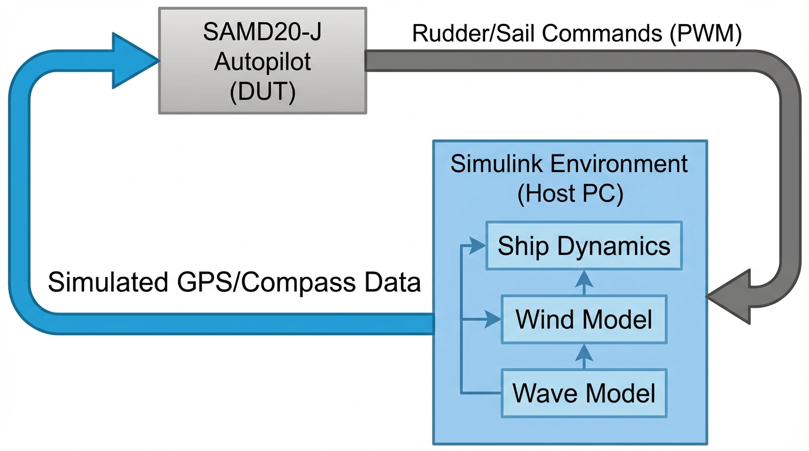

# **Κεφάλαιο 6: Ψηφιακό Δίδυμο και Τεχνολογίες Προσομοίωσης**

## **Επισκόπηση**

Η τεχνολογία του Ψηφιακού Διδύμου (Digital Twin) αποτελεί το θεμέλιο λίθο για τη μετάβαση της σύγχρονης ναυτιλίας προς το Maritime IoT (MIoT) και την αυτόνομη πλοήγηση. Ορίζεται ως ένα δυναμικό, εικονικό αντίγραφο ενός φυσικού συστήματος που επιτρέπει την αμφίδρομη ροή δεδομένων και τον έλεγχο σε πραγματικό χρόνο, λειτουργώντας ως ο συνδετικός κρίκος μεταξύ του φυσικού και του κυβερνοχώρου (Madusanka et al, 2023; Menges et al, 2024).

Οι βασικοί πυλώνες του κεφαλαίου περιλαμβάνουν την αρχιτεκτονική λειτουργία των ψηφιακών διδύμων, τη μοντελοποίηση της απόδοσης του πλοίου, τα προηγμένα συστήματα προγνωστικής συντήρησης και τη χρήση εικονικών πρωτοτύπων μέσω τεχνικών Hardware-in-the-Loop. Επιπλέον, εξετάζεται η κλιμάκωση αυτών των τεχνολογιών σε επίπεδο "Συστήματος Συστημάτων" (System of Systems), ενσωματώνοντας πλοία, λιμένες και περιβαλλοντικά μοντέλα του ωκεανού.

Η σύνθεση αυτών των πυλώνων επιτρέπει τη δημιουργία ενός ολοκληρωμένου πλαισίου λήψης αποφάσεων, όπου οι προσομοιώσεις υψηλής πιστότητας τροφοδοτούνται από MIoT δεδομένα για τη βελτιστοποίηση της πλοήγησης και της ενεργειακής αποδοτικότητας. Η διαλειτουργικότητα μεταξύ ετερογενών μοντέλων και η χρήση κατανεμημένης νοημοσύνης (Federated Learning) διασφαλίζουν ότι η ψηφιακή αναπαράσταση δεν είναι απλώς μια στατική εικόνα, αλλά ένα ενεργό εργαλείο επιχειρησιακού ελέγχου.

Το παρόν κεφάλαιο συνδέεται άμεσα με τις τεχνολογίες αυτόνομης πλοήγησης που αναλύθηκαν προηγουμένως (Κεφάλαιο 5), προσφέροντας το απαραίτητο περιβάλλον δοκιμών και ελέγχου. Ταυτόχρονα, προετοιμάζει το έδαφος για την ανάλυση δεδομένων μεγάλης κλίμακας και την Τεχνητή Νοημοσύνη (Κεφάλαιο 7), καθορίζοντας τις δομές δεδομένων και τις απαιτήσεις συγχρονισμού που απαιτούνται για την υποστήριξη της έξυπνης ναυτιλίας.

---

## **6.1 Αρχιτεκτονική και Λειτουργία Ψηφιακού Διδύμου**

### **Σπουδαιότητα και Σκοπιμότητα της Έρευνας**

Η υιοθέτηση των Ψηφιακών Διδύμων είναι κρίσιμη για την ασφαλή εισαγωγή των Αυτόνομων Επιφανειακών Πλοίων (MASS), καθώς προσφέρει ένα περιβάλλον ελέγχου όπου οι στρατηγικές πλοήγησης αξιολογούνται χωρίς κίνδυνο για το φυσικό κεφάλαιο. Χωρίς την ύπαρξη ενός ακριβούς ψηφιακού αντιγράφου, η διαχείριση της πολυπλοκότητας των MIoT συστημάτων καθίσταται αδύνατη, οδηγώντας σε αυξημένο κίνδυνο ατυχημάτων και λειτουργική αναποτελεσματικότητα. Η τεχνολογία αυτή επιτρέπει τη μετατροπή των δεδομένων από "ψηφιακές σκιές" (digital shadows) σε ενεργά συστήματα ελέγχου κλειστού βρόχου, διασφαλίζοντας ότι η αυτοματοποίηση βασίζεται σε ακριβή μοντέλα φυσικής συμπεριφοράς και όχι μόνο σε στατιστικές προβλέψεις.

### **Θεωρητικό Υπόβαθρο**

Η έννοια του Ψηφιακού Διδύμου εξελίχθηκε από την αεροδιαστημική βιομηχανία, με εμβληματικά παραδείγματα το πρόγραμμα Apollo της NASA και τις δοκιμαστικές εξέδρες Iron Bird της Airbus (Madusanka et al, 2023). Στον ναυτιλιακό τομέα, το θεωρητικό πλαίσιο βασίζεται στην προοδευτική κλίμακα έξι επιπέδων (Level 0-5), η οποία περιγράφει την ωριμότητα του συστήματος από την απλή 3D γεωμετρική αναπαράσταση (Επίπεδο 0) έως την πλήρη αυτονομία με κλειστό βρόχο ελέγχου (Επίπεδο 5). Η μετάβαση από το επίπεδο της "ψηφιακής σκιάς" στο πλήρες Ψηφιακό Δίδυμο απαιτεί την ενσωμάτωση αμφίδρομης ροής δεδομένων, όπου το εικονικό μοντέλο μπορεί να επιδρά άμεσα στη φυσική μονάδα (Menges et al, 2024; Karakostas et al, 2024).

**Πίνακας 6.1:** Επίπεδα Αυτονομίας Ψηφιακού Διδύμου για Αυτόνομα Επιφανειακά Πλοία.

| Επίπεδο | Ονομασία                    | Τύπος Μοντελοποίησης     | Σύνδεση Δεδομένων               | Βασική Λειτουργία                                              |
| :-----: | :-------------------------- | :----------------------- | :------------------------------ | :------------------------------------------------------------- |
|  **0**  | Αυτόνομο (Standalone)       | Offline (Εκτός σύνδεσης) | Καμία                           | Τρισδιάστατη γεωμετρική αναπαράσταση, οπτικοποίηση σχεδιασμού. |
|  **1**  | Περιγραφικό (Descriptive)   | Online (Εντός σύνδεσης)  | Μονόδρομη (Φυσικό προς Ψηφιακό) | Επίγνωση κατάστασης, παρακολούθηση αισθητήρων.                 |
|  **2**  | Διαγνωστικό (Diagnostic)    | Online                   | Μονόδρομη (Φυσικό προς Ψηφιακό) | Παρακολούθηση κατάστασης, διάγνωση σφαλμάτων.                  |
|  **3**  | Προγνωστικό (Predictive)    | Online                   | Μονόδρομη (Φυσικό προς Ψηφιακό) | Πρόβλεψη μελλοντικών καταστάσεων, προγνωστική συντήρηση.       |
|  **4**  | Καθοδηγητικό (Prescriptive) | Online                   | Μονόδρομη (Φυσικό προς Ψηφιακό) | Υποστήριξη λήψης αποφάσεων, επιχειρησιακές συστάσεις.          |
|  **5**  | Αυτόνομο (Autonomous)       | Online                   | Αμφίδρομη (Κλειστός Βρόχος)     | Αυτόνομος έλεγχος, αποφυγή συγκρούσεων, αυτενέργεια.           |

### **Τεχνικές Προκλήσεις και Προβληματισμοί**

Η κύρια πρόκληση στον ναυτιλιακό χώρο έγκειται στην επίτευξη συγχρονισμού σε πραγματικό χρόνο υπό περιορισμούς εύρους ζώνης και υψηλής λανθάνουσας κατάστασης (latency) κατά την υπερπόντια επικοινωνία. Η διαχείριση ετερογενών δεδομένων από πολλαπλές πηγές απαιτεί σύνθετα στάδια επεξεργασίας, όπως αφαίρεση θορύβου και εξαγωγή χαρακτηριστικών, τα οποία συχνά συγκρούονται με την ανάγκη για άμεση απόκριση (Wu et al, 2021). Επιπλέον, η "multiphysics" μοντελοποίηση εισάγει τεράστια υπολογιστική πολυπλοκότητα, καθώς πρέπει να συζευχθούν υδροδυναμικά, θερμοδυναμικά και μηχανικά φαινόμενα σε ένα ενιαίο σύστημα που παραμένει λειτουργικό σε πραγματικό χρόνο (Assani et al, 2022).

### **Υφιστάμενες Τεχνολογίες και Μεθοδολογικές Προσεγγίσεις**

Οι σύγχρονες προσεγγίσεις στηρίζονται σε κατανεμημένες αρχιτεκτονικές που συνδυάζουν υπηρεσίες Νέφους (Cloud) για ανάλυση μεγάλης κλίμακας και Edge Computing για τοπική επεξεργασία σε πραγματικό χρόνο. Η χρήση "Multiphysics" μοντελοποίησης επιτρέπει την ακριβή αποτύπωση της υδρο-μηχανικής σύζευξης, προβλέποντας την κίνηση του πλοίου υπό την επίδραση στοχαστικών δυνάμεων (κύματα, άνεμος). Σημαντική είναι επίσης η χρήση ειδικών GPU επιταχυντών για τη μη γραμμική μοντελοποίηση της ελεύθερης επιφάνειας και της αλληλεπίδρασης κύματος-κύτους, εξασφαλίζοντας την απαιτούμενη πιστότητα για συστήματα αποφυγής συγκρούσεων (Manandhar et al, 2025; Sun et al, 2023).

### **Εφαρμογές και Σενάρια Χρήσης**

Τα Ψηφιακά Δίδυμα εφαρμόζονται ήδη στη διαχείριση στόλου για τον προσδιορισμό τάσεων στην κατανάλωση καυσίμων και την αυτοματοποιημένη ανταλλαγή δεδομένων με συστήματα ERP και CMMS. Στο πλοίο Dolphin 1, το Ψηφιακό Δίδυμο χρησιμοποιείται για τον ακριβή προσδιορισμό της κινηματικής των έξι βαθμών ελευθερίας, συγχρονίζοντας τη φυσική κατάσταση με το μαθηματικό μοντέλο μέσω ενός συστήματος διόρθωσης τριών σταδίων (Xia et al, 2024). Επίσης, οι τεχνολογίες αυτές επιτρέπουν την προσομοίωση σεναρίων "τι θα γινόταν αν" (what-if scenarios) για τη βελτιστοποίηση της πλοήγησης και τη μείωση των εκπομπών ρύπων.

### **Μελλοντικές Κατευθύνσεις και Ερευνητικά Κενά**

Το κυριότερο ερευνητικό έλλειμμα αφορά τη διαδικασία κλιμάκωσης (scalability) των ψηφιακών διδύμων από το επίπεδο της μεμονωμένης μονάδας στο επίπεδο του στόλου χωρίς απώλεια απόδοσης. Απαιτείται περαιτέρω έρευνα στην ενοποίηση της νοημοσύνης του στόλου και στη διασφάλιση της ακεραιότητας των δεδομένων κατά την αυτόνομη εκτέλεση εντολών. Η μελλοντική ενσωμάτωση 6G επικοινωνιών και πιο προηγμένων PINNs (Physics-Informed Neural Networks) αναμένεται να γεφυρώσει το χάσμα μεταξύ στατικής προσομοίωσης και πλήρως αυτόνομης, αυτοεκπαιδευόμενης λειτουργίας εν πλω.

## **6.2 Μοντελοποίηση Απόδοσης Πλοίου και Βελτιστοποίηση**

### **Σπουδαιότητα και Σκοπιμότητα της Έρευνας**

Η ακριβής μοντελοποίηση της απόδοσης του πλοίου είναι θεμελιώδης για τη μείωση του λειτουργικού κόστους και του περιβαλλοντικού αποτυπώματος της ναυτιλίας. Σε ένα περιβάλλον MIoT, η δυνατότητα πρόβλεψης της υδροδυναμικής αντίστασης και της κατανάλωσης καυσίμου σε πραγματικό χρόνο επιτρέπει τη δυναμική βελτιστοποίηση της πλοήγησης (weather routing). Η έρευνα σε αυτόν τον τομέα σκοπεύει στην αντικατάσταση των παραδοσιακών, στατικών μοντέλων με δυναμικά ψηφιακά δίδυμα που προσαρμόζονται στις μεταβαλλόμενες συνθήκες του κύτους (π.χ. βιορρύπανση) και του περιβάλλοντος, διασφαλίζοντας τη βιωσιμότητα των θαλάσσιων μεταφορών.

### **Θεωρητικό Υπόβαθρο**

Η μοντελοποίηση της απόδοσης έχει εξελιχθεί από τις εμπειρικές φόρμουλες και τις δοκιμές σε δεξαμενές ρυμούλκησης προς την Υπολογιστική Ρευστοδυναμική (CFD) και τις προσεγγίσεις που βασίζονται σε δεδομένα (data-driven). Η θεωρητική βάση στηρίζεται στην αριθμητική επίλυση των εξισώσεων Navier-Stokes για την αλληλεπίδραση ρευστού-κύτους (Sun et al, 2023). Παράλληλα, η χρήση νευρωνικών δικτύων για την ανάλυση χρονοσειρών έχει εισάγει μια νέα διάσταση στη θεωρία της πρόβλεψης, επιτρέποντας τη μοντελοποίηση μη γραμμικών εξαρτήσεων μεταξύ παραμέτρων όπως η ταχύτητα, ο κυματισμός και η κατανάλωση, τις οποίες οι κλασικές στατιστικές μέθοδοδοι αδυνατούν να αποτυπώσουν πλήρως (Kujala et al, 2022).

### **Τεχνικές Προκλήσεις και Προβληματισμοί**

Η κύρια τεχνική πρόκληση είναι η υπολογιστική απαίτηση των CFD προσομοιώσεων, οι οποίες απαιτούν τεράστια ισχύ για την επίλυση μη γραμμικών φαινομένων στην ελεύθερη επιφάνεια του νερού. Επιπλέον, η ενσωμάτωση MIoT δεδομένων σε πραγματικό χρόνο απαιτεί την εξάλειψη του θορύβου από τους αισθητήρες (επιταχυνσιόμετρα, μετρητές ροής) ώστε να μην αλλοιώνεται η εγκυρότητα των προβλέψεων. Ένας άλλος προβληματισμός αφορά τη "γήρανση" των μοντέλων: η σταδιακή συσσώρευση θαλάσσιων οργανισμών στο κύτος (fouling) μεταβάλλει τις υδροδυναμικές ιδιότητες του πλοίου, καθιστώντας τα αρχικά μοντέλα σχεδιασμού ανακριβή με την πάροδο του χρόνου (Wang et al, 2019).

### **Υφιστάμενες Τεχνολογίες και Μεθοδολογικές Προσεγγίσεις**

Οι τρέχουσες μεθοδολογίες συνδυάζουν CFD επιταχυνόμενο από GPU για την ψηφιακή αναπαράσταση της "λεκάνης δοκιμών" με αρχιτεκτονικές βαθιάς μάθησης για την πρόβλεψη κατανάλωσης. Συγκεκριμένα, χρησιμοποιούνται Επαναλαμβανόμενα Νευρωνικά Δίκτυα (RNNs) και δίκτυα Μακράς Βραχύχρονης Μνήμης (LSTM), τα οποία εκπαιδεύονται σε ιστορικά δεδομένα ταξιδιών και αισθητήρων MIoT. Αυτές οι τεχνολογίες επιτρέπουν τη δημιουργία μοντέλων που λαμβάνουν υπόψη πολυμεταβλητές χρονοσειρές, όπως η διεύθυνση του ανέμου και ο προσανατολισμός των κυμάτων, επιτυγχάνοντας ανώτερη ακρίβεια σε σχέση με τις παραδοσιακές μεθόδους (Kujala et al, 2022; Sun et al, 2023).

### **Εφαρμογές και Σενάρια Χρήσης**

Στην πράξη, τα ψηφιακά δίδυμα απόδοσης χρησιμοποιούνται για την εκτίμηση της απώλειας ταχύτητας λόγω βιορρύπανσης, επιτρέποντας τον βέλτιστο προγραμματισμό του καθαρισμού του κύτους (Wang et al, 2019). Σενάρια "ψηφιακής λεκάνης" επιτρέπουν την επαναληπτική βελτιστοποίηση της πλοήγησης μέσω αξιολόγησης χιλιάδων πιθανών διαδρομών υπό διαφορετικές καιρικές συνθήκες. Η χρήση MIoT βρόχων ανατροφοδότησης διασφαλίζει ότι οι προσομοιώσεις ενημερώνονται συνεχώς από τις πραγματικές οριακές συνθήκες που αντιμετωπίζει το πλοίο εν πλω, βελτιώνοντας την εγκυρότητα των υδροδυναμικών προβλέψεων (Wang et al, 2022).

### **Μελλοντικές Κατευθύνσεις και Ερευνητικά Κενά**

Η έρευνα τείνει προς τη δημιουργία αυτο-διορθούμενων μοντέλων που θα μπορούν να εντοπίζουν και να ενσωματώνουν αυτόματα τις μεταβολές στην υδροδυναμική συμπεριφορά χωρίς ανθρώπινη παρέμβαση. Ένα σημαντικό ερευνητικό κενό παραμένει η τυποποίηση της ανταλλαγής δεδομένων μεταξύ διαφορετικών παρόχων προσομοίωσης, ώστε να δημιουργηθούν ομοσπονδιακά μοντέλα απόδοσης. Η περαιτέρω ενσωμάτωση PINNs (Physics-Informed Neural Networks) αναμένεται να μειώσει την εξάρτηση από τεράστιους όγκους δεδομένων εκπαίδευσης, επιτρέποντας τη μοντελοποίηση της απόδοσης ακόμη και σε νέα πλοία με περιορισμένο ιστορικό λειτουργίας.

## **6.3 Προγνωστικά Συστήματα Συντήρησης**

### **Σπουδαιότητα και Σκοπιμότητα της Έρευνας**

Στα σύγχρονα MIoT οικοσυστήματα, η Προγνωστική Συντήρηση (Predictive Maintenance) αποτελεί μια επιτακτική στρατηγική για τη διασφάλιση της επιχειρησιακής συνέχειας και τη μείωση του τεράστιου κόστους των απρόβλεπτων βλαβών. Η μετάβαση από τις παραδοσιακές μεθόδους "επισκευής κατόπιν βλάβης" σε συστήματα που προβλέπουν την αποτυχία πριν αυτή συμβεί, είναι ζωτικής σημασίας για τα κυβερνο-υλικά συστήματα των αυτόνομων πλοίων. Χωρίς την προγνωστική ικανότητα των Ψηφιακών Διδύμων, οι αλληλεξαρτήσεις μεταξύ των υποσυστημάτων καθιστούν τη συντήρηση μια κοστοβόρα και αναποτελεσματική διαδικασία, θέτοντας σε κίνδυνο την ασφάλεια του πληρώματος και του φορτίου (Chen, 2025).

### **Θεωρητικό Υπόβαθρο**

Ιστορικά, η ναυτιλιακή συντήρηση βασιζόταν σε στατικά χρονικά διαστήματα ή στην αντίδραση σε αποτυχίες. Το θεωρητικό υπόβαθρο της προγνωστικής συντήρησης στηρίζεται στη χρήση ψηφιακών αντιγράφων που παρακολουθούν την "υγεία" των εξαρτημάτων σε πραγματικό χρόνο. Η εξέλιξη αυτή οδηγεί προς την Προληπτική (Prescriptive) συντήρηση, όπου το σύστημα όχι μόνο προβλέπει τη βλάβη αλλά προτείνει και τις βέλτιστες ενέργειες αποκατάστασης. Η θεωρία αυτή ενισχύεται από υβριδικές προσεγγίσεις που συνδυάζουν στατιστικά μοντέλα με τους φυσικούς νόμους που διέπουν τη φθορά των υλικών (Chen, 2025; Kalafatelis et al, 2024).

### **Τεχνικές Προκλήσεις και Προβληματισμοί**

Μια από τις μεγαλύτερες προκλήσεις είναι η διαθεσιμότητα και η ιδιωτικότητα των ευαίσθητων επιχειρησιακών δεδομένων όταν εμπλέκονται εξωτερικοί πάροχοι. Επιπλέον, η μετάδοση τεράστιων όγκων δεδομένων (terabytes) από αισθητήρες δονήσεων και θερμικών μετρήσεων από πλοία που βρίσκονται σε ανοικτή θάλασσα προς το Νέφος είναι τεχνικά και οικονομικά ανέφικτη λόγω του περιορισμένου εύρους ζώνης των δορυφορικών επικοινωνιών (Wireless Logic, 2024). Τέλος, τα αμιγώς data-centric μοντέλα συχνά αποτυγχάνουν να γενικεύσουν σε σπάνια φαινόμενα καταστροφικών βλαβών, καθώς τα διαθέσιμα ιστορικά δεδομένα εκπαίδευσης για τέτοιες περιπτώσεις είναι εξαιρετικά σπάνια (Xia et al, 2024).

### **Υφιστάμενες Τεχνολογίες και Μεθοδολογικές Προσεγγίσεις**

Οι τρέχουσες τεχνολογίες μετέρχονται αλγόριθμους Μηχανικής Μάθησης όπως SVM, Random Forest και LSTM για την ταυτοποίηση ανώμαλων συμπεριφορών. Για την αντιμετώπιση των περιορισμών μετάδοσης, χρησιμοποιείται η Αποκεντρωμένη Μάθηση (Federated Learning), όπου η εκπαίδευση των μοντέλων γίνεται τοπικά στις edge υποδομές του πλοίου και μόνο οι παράμετροι των μοντέλων αποστέλλονται στον κεντρικό εξυπηρετητή. Μια άλλη ρηξικέλευθη προσέγγιση είναι τα Physics-Informed Νευρωνικά Δίκτυα (PINNs), τα οποία ενσωματώνουν τους νόμους της φυσικής στη διαδικασία εκπαίδευσης, αναγκάζοντας τις προβλέψεις να είναι στατιστικά δυνατές και φυσικά πιθανές (Kalafatelis et al, 2025; Xia et al, 2024).

### **Εφαρμογές και Σενάρια Χρήσης**

Η εφαρμογή του Federated Learning επιτρέπει τη δημιουργία "συλλογικής νοημοσύνης" σε έναν στόλο, όπου ο εντοπισμός μιας βλάβης σε ένα πλοίο στη Βόρεια Θάλασσα βελτιώνει άμεσα τις προγνωστικές ικανότητες ενός πανομοιότυπου πλοίου στον Ινδικό Ωκεανό, χωρίς την ανταλλαγή ανεπεξέργαστων δεδομένων. Στο αυτόνομο σκάφος Dolphin 1, η χρήση PINNs επέτρεψε τη δημιουργία αυτοεκπαιδευόμενων μοντέλων που προσαρμόζονται στις θαλάσσιες συνθήκες σε πραγματικό χρόνο, προβλέποντας την υδροδυναμική απόδοση και την κατάσταση του κύτους με υψηλή ακρίβεια (Kalafatelis et al, 2025; Xia et al, 2024).

### **Μελλοντικές Κατευθύνσεις και Ερευνητικά Κενά**

Η μελλοντική έρευνα στοχεύει στην πλήρη αυτοματοποίηση του κύκλου συντήρησης, όπου το Ψηφιακό Δίδυμο θα μπορεί να παραγγέλνει αυτόματα ανταλλακτικά και να προγραμματίζει την επόμενη επίσκεψη σε λιμένα βάσει της πρόβλεψης βλάβης. Ένα σημαντικό ερευνητικό κενό παραμένει η ανάπτυξη προτύπων για την ερμηνευσιμότητα (explainability) των AI μοντέλων, ώστε οι μηχανικοί να κατανοούν τη φυσική αιτία πίσω από μια προγνωστική ειδοποίηση. Επίσης, η ενσωμάτωση blockchain για τη διασφάλιση της ακεραιότητας των αρχείων συντήρησης σε αποκεντρωμένα δίκτυα αποτελεί έναν αναδυόμενο τομέα έρευνας.

## **6.4 Εικονικά Πρωτότυπα**

### **Σπουδαιότητα και Σκοπιμότητα της Έρευνας**

Η δημιουργία Εικονικών Πρωτοτύπων (Virtual Prototyping) είναι απαραίτητη για την ανάπτυξη αυτόνομων ναυτιλιακών συστημάτων, καθώς επιτρέπει τη δοκιμή ακραίων και επικίνδυνων σεναρίων σε ένα ασφαλές περιβάλλον. Το παράδοξο της αυτόνομης πλοήγησης απαιτεί τα συστήματα να δοκιμάζονται σε συνθήκες σύγκρουσης ή ταραχώδους θάλασσας για να αποδειχθούν αξιόπιστα, κάτι που είναι πρακτικά αδύνατο και επικίνδυνο να συμβεί με φυσικά πλοία. Τα εικονικά πρωτότυπα γεφυρώνουν αυτό το χάσμα, προσφέροντας μαθηματικά εφάμιλλα περιβάλλοντα που επιτρέπουν την εξάλειψη σφαλμάτων λογισμικού και τον έλεγχο της υλικής απόκρισης πριν από την καθελκύση (Xia et al, 2024).

### **Θεωρητικό Υπόβαθρο**

Τα εικονικά πρωτότυπα αποτελούν την εξέλιξη του Computer-Aided Design (CAD), μεταβαίνοντας από τη γεωμετρική αναπαράσταση στη συμπεριφορική μοντελοποίηση. Η θεωρία στηρίζεται στην αυστηρή αντιστοίχιση φυσικών και εικονικών παραμέτρων, χρησιμοποιώντας σύνθετα συστήματα συντεταγμένων, όπως το Γεωδαιτικό Σύστημα Αναφοράς και το Σύστημα Συντεταγμένων Πλοίου, για την περιγραφή των έξι βαθμών ελευθερίας (Xia et al, 2024).

**Εικόνα 6.1**: _Μοντέλο Εικονικής-Φυσικής Αντιστοίχισης του Αυτόνομου Πλοίου Dolphin 1. Το διάγραμμα απεικονίζει τον συγχρονισμό μεταξύ του φυσικού σκάφους και του ψηφιακού διδύμου του, επισημαίνοντας τα συστήματα συντεταγμένων που χρησιμοποιούνται για την κινηματική ευθυγράμμιση. (Πηγή: Προσαρμογή από Xia et al., 2024)_

Κεντρικό ρόλο παίζει η προσομοίωση Hardware-in-the-Loop (HITL), η οποία συνδέει φυσικές μονάδες ελέγχου (PLCs, αυτόματους πιλότους) με ψηφιακά μοντέλα δυναμικής πλοίου και περιβάλλοντος (Akiyama et al, 2023).

### **Τεχνικές Προκλήσεις και Προβληματισμοί**

Η κύρια τεχνική πρόκληση αφορά τη διαλειτουργικότητα (interoperability) μεταξύ ετερογενών μοντέλων προσομοίωσης που αναπτύσσονται σε διαφορετικά λογισμικά (π.χ. Simulink, Python, Kongsberg). Η ανάγκη για συγχρονισμό δεδομένων μεταξύ διαφορετικών παρόχων χωρίς την αποκάλυψη του πηγαίου κώδικα (IP protection) αποτελεί σημαντικό εμπόδιο. Επιπλέον, η ακρίβεια της HITL προσομοίωσης εξαρτάται από την ικανότητα του προσομοιωτή να εισάγει εικονικά δεδομένα αισθητήρων στις φυσικές θύρες των μικροελεγκτών με μηδενική καθυστέρηση, ώστε να μην αλλοιώνεται η συμπεριφορά των αλγορίθμων ελέγχου (Akiyama et al, 2023; DNV, 2020).

### **Υφιστάμενες Τεχνολογίες και Μεθοδολογικές Προσεγγίσεις**

Για την επίλυση των προβλημάτων διαλειτουργικότητας χρησιμοποιούνται Ανοιχτές Πλατφόρμες Προσομοίωσης (OSP), οι οποίες τυποποιούν τη συν-προσομοίωση μέσω κεντρικών διεπαφών. Η τεχνολογία HITL χρησιμοποιείται ευρέως για τον έλεγχο Συστημάτων Διαχείρισης Ισχύος (PMS), όπου ψηφιακά δίδυμα γεννητριών συνδέονται με φυσικούς πίνακες διανομής μέσω OPC τεχνολογίας (Lee, 2024). Επίσης, η Αρχιτεκτονική Υψηλού Επιπέδου (HLA) επιτρέπει κατανεμημένες προσομοιωτικές ομοσπονδίες, όπου διαφορετικοί προσομοιωτές (π.χ. λιμένα και πλοίου) μπορούν να αλληλεπιδρούν σε πραγματικό χρόνο από διαφορετικές γεωγραφικές τοποθεσίες (Pear, 2025).

### **Εφαρμογές και Σενάρια Χρήσης**

Στην περίπτωση του αυτόνομου ιστιοφόρου SeaLeon, ένα HITL testbed επέτρεψε την ανακάλυψη ενός λογικού ελαττώματος στον αυτόματο πιλότο που προκαλούσε ακραίες αποκλίσεις πορείας, το οποίο ήταν αδύνατο να εντοπιστεί με απλές δοκιμές (Akiyama et al, 2023).

**Εικόνα 6.2**: _Αρχιτεκτονική Hardware-in-the-Loop (HIL) για το Αυτόνομο Ιστιοφόρο SeaLeon. Η διάταξη συνδέει τον φυσικό μικροελεγκτή του αυτόματου πιλότου με ένα περιβάλλον Simulink που προσομοιώνει τις ωκεάνιες συνθήκες για την επικύρωση της λογικής ελέγχου. (Πηγή: Προσαρμογή από Akiyama et al., 2023)_

Στα πλοία μεταφοράς LNG, η HITL προσομοίωση διασφαλίζει την αποφυγή blackouts μέσω της δοκιμής σεναρίων ξαφνικής υπερφόρτωσης και εισαγωγής εικονικών σφαλμάτων στους διακόπτες ισχύος (Lee, 2024).

 Το λιμάνι του Ρότερνταμ χρησιμοποιεί τέτοια εικονικά περιβάλλοντα για την προετοιμασία της άφιξης αυτόνομων πλοίων, επιτρέποντας τη διαπραγμάτευση μηχανής-με-μηχανή για θέσεις ελλιμενισμού (Keegan, 2019).

### **Μελλοντικές Κατευθύνσεις και Ερευνητικά Κενά**

Η μελλοντική έρευνα εστιάζει στη δημιουργία "ψηφιακών πιστοποιητικών" (digital twins for certification), όπου η έγκριση ενός νέου συστήματος θα βασίζεται σε εκτεταμένες δοκιμές σε πιστοποιημένα εικονικά πρωτότυπα. Ένα σημαντικό ερευνητικό κενό είναι η έλλειψη ενοποιημένων προτύπων για την πιστότητα (fidelity) της προσομοίωσης, ώστε να διασφαλίζεται ότι τα αποτελέσματα του εικονικού χώρου είναι πάντα μεταφέρσιμα στον υλικό. Η ενσωμάτωση Cloud-HIL αρχιτεκτονικών αναμένεται να επιτρέψει την απομακρυσμένη πρόσβαση σε ακριβά testbeds, προωθώντας την καινοτομία σε μικρότερους παίκτες της ναυτιλιακής βιομηχανίας.

## **6.5 Μοντελοποίηση System of Systems (SoS)**

### **Σπουδαιότητα και Σκοπιμότητα της Έρευνας**

Η επέκταση του Ψηφιακού Διδύμου από το επίπεδο του μεμονωμένου πλοίου στο επίπεδο του "Συστήματος Συστημάτων" (System of Systems - SoS) είναι απαραίτητη για τη συνολική βελτιστοποίηση της ναυτιλίας. Η έρευνα σε αυτό το πεδίο αντιμετωπίζει κρίσιμα προβλήματα όπως το φαινόμενο "Rush to Wait", όπου η έλλειψη συντονισμού μεταξύ πλοίων και λιμένων οδηγεί σε αναίτια κατανάλωση καυσίμων και πολυήμερες αναμονές. Η δημιουργία ενός Δικτύου Ψηφιακών Διδύμων επιτρέπει τη μετατροπή της ναυτιλιακής αλυσίδας σε ένα έξυπνο, αυτο-οργανούμενο οικοσύστημα που μεγιστοποιεί την αποδοτικότητα και μειώνει το περιβαλλοντικό αποτύπωμα σε παγκόσμια κλίμακα (Zhou et al, 2024; Qin et al, 2024).

### **Θεωρητικό Υπόβαθρο**

Ένα SoS ορίζεται ως μια συλλογή ανεξάρτητων συστημάτων που συνδυάζουν τους πόρους τους για την επίτευξη σύνθετων στόχων που κανένα δεν θα μπορούσε να πετύχει μόνο του. Στη ναυτιλία, αυτό μεταφράζεται σε μια ομοσπονδία Ψηφιακών Διδύμων πλοίων, λιμένων και υποδομών (Yang et al, 2010). Κορυφαία έκφανση αυτής της θεωρίας είναι το "Ψηφιακό Δίδυμο του Ωκεανού" (Ocean Digital Twin), το οποίο λειτουργεί ως το κεντρικό σημείο αναφοράς για όλα τα βιομηχανικά δίδυμα, παρέχοντας υπερ-τοπικές μετεωρολογικές και ωκεανογραφικές προβλέψεις (Iliad Project, n.d). Η θεωρητική αυτή προσέγγιση υποστηρίζεται από αναδυόμενα πρότυπα όπως το IEEE P3501 (Iliad Project, 2024).

### **Τεχνικές Προκλήσεις και Προβληματισμοί**

Η κύρια πρόκληση στη μοντελοποίηση SoS είναι η διαχείριση της "Επείγουσας Συμπεριφοράς" (Emergent Behavior), δηλαδή των απρόβλεπτων καταστάσεων που προκύπτουν από την αλληλεπίδραση χιλιάδων αυτόνομων πρακτόρων (πλοία, γερανοί, φορτηγά). Η διασφάλιση της διαλειτουργικότητας μεταξύ ετερογενών πλατφορμών (π.χ. IBM Watson, Cisco Kinetic) και ο συγχρονισμός δεδομένων σε πραγματικό χρόνο αποτελούν τεχνικά εμπόδια. Επιπλέον, η βελτιστοποίηση ενός μόνο κόμβου (π.χ. αποδοτικότητα πλοίου) συχνά αποδεικνύεται άσκοπη αν δεν αντιμετωπιστούν οι ανεπάρκειες σε επίπεδο συστήματος, όπως οι καθυστερήσεις ελλιμενισμού (Zhou et al, 2024; Yang et al, 2010).

### **Υφιστάμενες Τεχνολογίες και Μεθοδολογικές Προσεγγίσεις**

Για τη μοντελοποίηση των SoS δυναμικών χρησιμοποιείται η Μοντελοποίηση με Συστήματα Πρακτόρων (Agent-Based Modeling - ABM), όπου κάθε οντότητα δρά ως ανεξάρτητος πράκτορας με δική του λογική και στόχους (Delcea et al, 2023). Η τεχνολογία "Αφίξεων Πάνω στην Ώρα" (Just-In-Time - JIT) επιτρέπει την αμφίδρομη επικοινωνία μεταξύ των διδύμων πλοίου και λιμένα για τον καθορισμό της βέλτιστης ταχύτητας άφιξης (GIA, 2020). Η αρχιτεκτονική του Iliad project χρησιμοποιεί Τεχνητή Νοημοσύνη για την εναρμόνιση ετερογενών δεδομένων από δορυφόρους και υποθαλάσσιους αισθητήρες σε μια ομογενή ψηφιακή μορφή (Iliad Project, 2024).

### **Εφαρμογές και Σενάρια Χρήσης**

Το λιμάνι του Ρότερνταμ αποτελεί πρότυπο εφαρμογής SoS, χρησιμοποιώντας Ψηφιακό Δίδυμο για τη διαπραγμάτευση μηχανής-με-μηχανή για θέσεις ελλιμενισμού (Keegan, 2019). Η ABM προσομοίωση εφαρμόζεται ήδη στα Στενά της Μαλάκα και στο Βανκούβερ για την πρόβλεψη κυκλοφοριακής συμφόρησης μέσω της ανάλυσης των αποφάσεων χιλιάδων καπετάνιων (Delcea et al, 2023). Στο πλαίσιο του Iliad project, το Ψηφιακό Δίδυμο του Ωκεανού επιτρέπει σε πλοία να αιτούνται υπερ-τοπικές προβλέψεις για τη βελτιστοποίηση της διαδρομής τους, ενώ φάρμες υδατοκαλλιέργειας το χρησιμοποιούν για την πρόβλεψη διασποράς ρύπων (Iliad Project, 2024).

### **Μελλοντικές Κατευθύνσεις και Ερευνητικά Κενά**

Η μελλοντική έρευνα στρέφεται προς την "Έξυπνη Διαχείριση Ναυτιλιακών Μεταφορών", όπου η αυτο-οργάνωση του συστήματος θα βασίζεται σε αρχές της Θεωρίας Παιγνίων για την επίτευξη συνολικής αυτάρκειας. Ένα σημαντικό ερευνητικό κενό παραμένει η ανάπτυξη αλγορίθμων που θα αποτρέπουν ακούσιες αρνητικές συμπεριφορές (π.χ. κυκλοφοριακή συμφόρηση λόγω νέων αλγορίθμων αποφυγής συγκρούσεων) κατά την αλληλεπίδραση αυτόνομων και επανδρωμένων πλοίων. Η ενσωμάτωση κβαντικών υπολογιστών για την επίλυση των τεράστιων προβλημάτων βελτιστοποίησης ενός παγκόσμιου ναυτιλιακού SoS αποτελεί έναν μακρινό αλλά ελπιδοφόρο στόχο.

## **Συμπεράσματα**

Το παρόν κεφάλαιο ανέλυσε το μετασχηματιστικό ρόλο του Ψηφιακού Διδύμου και των τεχνολογιών προσομοίωσης στη σύγχρονη ναυτιλία. Διαπιστώθηκε ότι το Ψηφιακό Δίδυμο δεν αποτελεί απλώς μια στατική απεικόνιση, αλλά ένα δυναμικό "Σύστημα Συστημάτων" που επιτρέπει την αμφίδρομη αλληλεπίδραση μεταξύ φυσικού και ψηφιακού χώρου. Η ενσωμάτωση προηγμένων τεχνικών όπως η "multiphysics" μοντελοποίηση, το Federated Learning και τα PINNs, προσφέρει τη δυνατότητα για ακριβή πρόβλεψη της απόδοσης, προληπτική συντήρηση και ασφαλή δοκιμή αυτόνομων συστημάτων μέσω HITL προσομοιώσεων. Η κλιμάκωση αυτών των τεχνολογιών σε επίπεδο λιμένα και ωκεανού, μέσω πρωτοβουλιών όπως το Iliad Project, θέτει τις βάσεις για μια πλήρως διασυνδεδεμένη και βιώσιμη θαλάσσια εμπορική δραστηριότητα, όπου η λήψη αποφάσεων βασίζεται σε δεδομένα πραγματικού χρόνου και προσομοιώσεις υψηλής πιστότητας.

#### **Κύρια Συμπεράσματα**

- **Σύζευξη Φυσικής και Δεδομένων**: Η χρήση PINNs και υδρο-μηχανικής μοντελοποίησης επιτρέπει τη δημιουργία ψηφιακών διδύμων που παραμένουν φυσικά πιθανά και στατιστικά ακριβή, ξεπερνώντας τους περιορισμούς των απλών data-centric μοντέλων.
- **Αποκεντρωμένη Νοημοσύνη**: Το Federated Learning αναδεικνύεται ως η βέλτιστη λύση για την προγνωστική συντήρηση σε στόλους, διασφαλίζοντας την ιδιωτικότητα των δεδομένων και την αποδοτικότητα του εύρους ζώνης των δορυφορικών επικοινωνιών.
- **Ασφάλεια μέσω Εικονικών Πρωτοτύπων**: Οι HITL προσομοιώσεις και οι πλατφόρμες OSP αποτελούν τον μοναδικό ασφαλή τρόπο για τη δοκιμή ακραίων σεναρίων και την πιστοποίηση αυτόνομων συστημάτων πριν την επιχειρησιακή τους χρήση.
- **Συντονισμός SoS**: Η βελτιστοποίηση της ναυτιλίας απαιτεί τη μετάβαση από το μεμονωμένο πλοίο στο "Δίκτυο Ψηφιακών Διδύμων", όπου η επικοινωνία πλοίου-λιμένα (JIT) μειώνει δραστικά την κατανάλωση καυσίμων και τις καθυστερήσεις.

#### **Περιορισμοί και Ερευνητικά Κενά**

**Τρέχοντες Τεχνικοί Περιορισμοί:**

- Υψηλές υπολογιστικές απαιτήσεις των CFD προσομοιώσεων για εφαρμογές πραγματικού χρόνου.
- Περιορισμένο εύρος ζώνης για τη μετάδοση δεδομένων υψηλής συχνότητας από αισθητήρες δονήσεων και θερμότητας.

**Αναγνωρισμένα Ερευνητικά Κενά:**

- Έλλειψη τυποποιημένων προτύπων για την πιστότητα και τη μεταφερσιμότητα των εικονικών δοκιμών στον υλικό χώρο.
- Περιορισμένη έρευνα στην ερμηνευσιμότητα (explainability) των AI μοντέλων που υποστηρίζουν τις προγνωστικές ειδοποιήσεις.

**Εμπόδια Υλοποίησης:**

- Δυσκολία στη διαλειτουργικότητα μεταξύ ετερογενών εμπορικών λογισμικών προσομοίωσης χωρίς αποκάλυψη πηγαίου κώδικα.
- Υψηλό κόστος αρχικής επένδυσης για τη δημιουργία και συντήρηση πλήρως λειτουργικών ψηφιακών αντιγράφων για ολόκληρους στόλους.

#### **Ερευνητικές Συνεισφορές**

Το κεφάλαιο αυτό συμβάλλει στη διατριβή ορίζοντας το τεχνολογικό πλαίσιο μέσα στο οποίο οι MIoT αισθητήρες και οι αυτόνομοι αλγόριθμοι μετατρέπονται σε επιχειρησιακή αξία. Μέσω της ανάλυσης της αρχιτεκτονικής SoS και των τεχνικών HITL, τεκμηριώνεται η αναγκαιότητα ενός ενδιάμεσου στρώματος προσομοίωσης για την επίτευξη ασφαλούς και αποδοτικής αυτόνομης ναυτιλίας. Η σύνθεση των υφιστάμενων τεχνολογιών και των ερευνητικών κενών παρέχει έναν οδικό χάρτη για την ανάπτυξη της προτεινόμενης αρχιτεκτονικής της διατριβής.

## **Βιβλιογραφία**

Akiyama, T., Roncin, K., & Bousquet, J.-F. (2023). A Hardware-in-the-Loop Simulator to Optimize Autonomous Sailboat Performance in Real Ocean Conditions. Journal of Marine Science and Engineering, 11(6), 1104. https://doi.org/10.3390/jmse11061104

Assani, N., Matic, P., & Katalinic, M. (2022). Ship’s Digital Twin—A Review of Modelling Challenges and Applications. Applied Sciences, 12(12), 6039. https://doi.org/10.3390/app12126039

Chen, S. (2025). Towards prescriptive maintenance using digital twins and artificial intelligence [Licentiate thesis, Chalmers University of Technology]. Chalmers Research. https://research.chalmers.se/publication/547701/file/547701_Fulltext.pdf

Delcea, C., & Chirita, N. (2023). Exploring the Applications of Agent-Based Modeling in Transportation. Applied Sciences, 13(17), 9815. https://doi.org/10.3390/app13179815

DNV. (2020, February 9). Open Simulation Platform – the next generation of digital twins. https://www.dnv.com/expert-story/maritime-impact/Open-Simulation-Platform-the-next-generation-of-digital-twins/

GEF-UNDP-IMO GloMEEP Project & Global Industry Alliance to Support Low Carbon Shipping. (2020). Just in time arrival guide: Barriers and potential solutions. International Maritime Organization. https://greenvoyage2050.imo.org/wp-content/uploads/2021/01/GIA-just-in-time-hires.pdf

Iliad Project. (n.d.). Digital twins of the ocean. Retrieved December 9, 2025, from https://ocean-twin.eu/

Iliad Project. (2024, December 3). First Iliad-inspired IEEE standards project for DTEs gets green light to go ahead. https://ocean-twin.eu/news/first-iliad-inspired-ieee-standards-project-for-dtes-gets-green-light-to-go-ahead-

Kalafatelis, A. S., Nomikos, N., Giannopoulos, A., & Trakadas, P. (2024). A Survey on Predictive Maintenance in the Maritime Industry Using Machine and Federated Learning. Institute of Electrical and Electronics Engineers (IEEE). https://doi.org/10.36227/techrxiv.173473250.04784922/v1

Kalafatelis, A. S., Nomikos, N., Giannopoulos, A., Alexandridis, G., Karditsa, A., & Trakadas, P. (2025). Towards Predictive Maintenance in the Maritime Industry: A Component-Based Overview. Journal of Marine Science and Engineering, 13(3), 425. https://doi.org/10.3390/jmse13030425

Karakostas, B., & Katsoulakos, T. (Eds.). (2024). State-of-the-Art Digital Twin Applications for Shipping Sector Decarbonization. In Advances in Logistics, Operations, and Management Science. IGI Global. https://doi.org/10.4018/978-1-6684-9848-4

Keegan, M. J. (2019, Winter). Driving digital transformation: A perspective from Erwin Rademaker, Program Manager, Port of Rotterdam Authority. The Business of Government, 68–72. https://businessofgovernment.org/sites/default/files/Driving%20Digital%20Transformation.pdf

Kujala, P., et al. (2022). A ship digital twin for safe and sustainable ship operations. https://research.aalto.fi/files/143956445/A-Ship-Digital-Twin-for-Safe-and-Sustainable-Ship-Operations.pdf

Lee, K. (2024). Development of Hardware-in-the-Loop Simulation Test Bed to Verify and Validate Power Management System for LNG Carriers. Journal of Marine Science and Engineering, 12(7), 1236. https://doi.org/10.3390/jmse12071236

Madusanka, N. S., Fan, Y., Yang, S., & Xiang, X. (2023). Digital Twin in the Maritime Domain: A Review and Emerging Trends. Journal of Marine Science and Engineering, 11(5), 1021. https://doi.org/10.3390/jmse11051021

Manandhar, B., Dunkel Vance, K., Rawat, D. B., & Yilmaz, N. (2025). Leveraging Digital Twin Technology for Sustainable and Efficient Public Transportation. Applied Sciences, 15(6), 2942. https://doi.org/10.3390/app15062942

Menges, D., & Rasheed, A. (2024). Digital Twin for Autonomous Surface Vessels: Enabler for Safe Maritime Navigation (Version 1). arXiv. https://doi.org/10.48550/ARXIV.2411.03465

Pear, C. (2025, February 24). Top 5 interoperability standards for digital twins. Anvil Labs. https://anvil.so/post/top-5-interoperability-standards-for-digital-twins

Qin, B., Pan, H., Dai, Y., Si, X., Huang, X., Yuen, C., & Zhang, Y. (2024). Machine and Deep Learning for Digital Twin Networks: A Survey. IEEE Internet of Things Journal, 11(21), 34694–34716. https://doi.org/10.1109/jiot.2024.3416733

Sun, X., Cai, M., & Ding, J. (2023). A GPU-accelerated method for 3D nonlinear Kelvin ship wake patterns simulation. Applied Sciences, 13(22), 12148. https://doi.org/10.3390/app132212148

Wang, H., et al. (2019). Data-driven ship digital twin for estimating the speed loss caused by the marine fouling. Ocean Engineering. https://www.sciencedirect.com/science/article/abs/pii/S0029801819302616

Wireless Logic. (2024, June 19). Embracing IoT and digital twins in the maritime industry. https://wirelesslogic.com/blog/embracing-iot-in-the-maritime-industry

Wu, Q., Mao, Y., Chen, J., & Wang, C. (2021). Application Research of Digital Twin-Driven Ship Intelligent Manufacturing System: Pipe Machining Production Line. Journal of Marine Science and Engineering, 9(3), 338. https://doi.org/10.3390/jmse9030338

Xia, G., Zhou, Z., Han, F., Peng, X., Zhao, W., Wu, Y., & Lin, Q. (2024). Real-time digital twin of autonomous ships based on virtual-physical mapping model. Physics of Fluids, 36(8). https://doi.org/10.1063/5.0222332

Yang, K., Chen, Y., Lu, Y., & Zhao, Q. (2010). The study of guided emergent behavior in system of systems requirement analysis. 2010 5th International Conference on System of Systems Engineering, 1-5 10.1109/SYSOSE.2010.5544033. https://doi.org/10.1109/SYSOSE.2010.5544033

Zhou, F., Yu, K., Xie, W., Lyu, J., Zheng, Z., & Zhou, S. (2024). Digital twin-enabled smart maritime logistics management in the context of Industry 5.0. IEEE Access, 12, 10920–10931. https://doi.org/10.1109/ACCESS.2024.3354838

