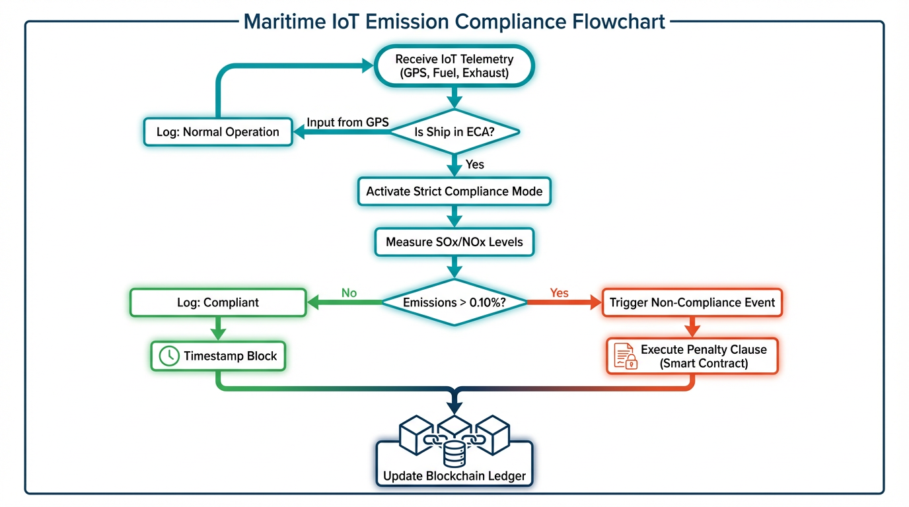

# **Κεφάλαιο 8: Βιωσιμότητα και Πράσινο Ναυτιλιακό Διαδίκτυο των Πραγμάτων (Green Maritime IoT)**

## **Επισκόπηση**

Το Πράσινο Ναυτιλιακό Διαδίκτυο των Πραγμάτων (Green Maritime IoT - GMIoT) ορίζεται ως το πλαίσιο ενσωμάτωσης τεχνολογιών αιχμής που στοχεύουν στην ελαχιστοποίηση του περιβαλλοντικού αποτυπώματος της ναυτιλίας μέσω της ενεργειακής αποδοτικότητας και της οικολογικής βιωσιμότητας. Η στροφή αυτή επιβάλλεται από τις αυστηρές κατευθυντήριες γραμμές του Διεθνούς Οργανισμού Ναυσιπλοΐας (IMO), οι οποίες στοχεύουν στον πλήρη αποανθρακοποίηση του κλάδου έως το 2050 (Mushtaq et al., 2025). Το GMIoT δεν αποτελεί απλώς μια προσθήκη ψηφιακών εργαλείων, αλλά μια θεμελιώδη αναθεώρηση του κύκλου ζωής των ναυτιλιακών δραστηριοτήτων, συνδυάζοντας την "πράσινη" σχεδίαση υλικού με την ευφυή διαχείριση πόρων.

Οι πυλώνες στους οποίους εδράζεται η ανάλυση του παρόντος κεφαλαίου περιλαμβάνουν τα συστήματα συλλογής ενέργειας και το βιοδιασπώμενο υλικό, τα ενεργειακά αποδοτικά πρωτόκολλα επικοινωνίας (ακουστικά και LoRaWAN), καθώς και την εφαρμογή της Τεχνητής Νοημοσύνης για την ανίχνευση μόλυνσης. Επιπλέον, εξετάζεται η χρήση των Ψηφιακών Διδύμων για τη δυναμική ανάλυση κύκλου ζωής (LCA), η ενσωμάτωση τεχνολογιών Blockchain για την αυτοματοποιημένη ρυθμιστική συμμόρφωση, και ο κρίσιμος ρόλος των υβριδικών υποδομών συνδεσιμότητας. Οι τομείς αυτοί συνιστούν ένα ολοκληρωμένο οικοσύστημα που επιτρέπει τη μετάβαση σε μια πραγματικά βιώσιμη γαλάζια οικονομία.

Η σύνθεση αυτών των πυλώνων δημιουργεί μια συνέργεια όπου το υλικό χαμηλής κατανάλωσης τροφοδοτείται από το περιβάλλον, ενώ η ευφυΐα του δικτύου διασφαλίζει ότι κάθε μεταδιδόμενο bit πληροφορίας έχει το ελάχιστο δυνατό ενεργειακό κόστος. Η Τεχνητή Νοημοσύνη και τα Ψηφιακά Δίδυμα μετατρέπουν τα ακατέργαστα δεδομένα σε στρατηγικές αποφάσεις για τη μείωση των ρύπων, ενώ το Blockchain παρέχει την απαραίτητη διαφάνεια και εμπιστοσύνη στις περιβαλλοντικές αναφορές. Με αυτόν τον τρόπο, η τεχνολογική πολυπλοκότητα μετατρέπεται σε λειτουργική απλότητα, επιτρέποντας στα αυτόνομα συστήματα να λειτουργούν ως θεματοφύλακες του θαλάσσιου οικοσυστήματος.

Το παρόν κεφάλαιο αποτελεί τη φυσική συνέχεια της ανάλυσης των δεδομένων και της Τεχνητής Νοημοσύνης (Κεφάλαιο 7), εφαρμόζοντας τις θεωρητικές προσεγγίσεις σε προβλήματα βιωσιμότητας. Παράλληλα, θέτει τις βάσεις για τις μελλοντικές κατευθύνσεις και τις αναδυόμενες τεχνολογίες (Κεφάλαιο 10), σκιαγραφώντας το όραμα μιας ναυτιλίας που είναι ταυτόχρονα πλήρως ψηφιοποιημένη και περιβαλλοντικά ουδέτερη. Ο οδικός αυτός χάρτης αναδεικνύει την ανάγκη για μια ολιστική προσέγγιση, όπου η τεχνολογική πρόοδος συμβαδίζει με την οικολογική ευθύνη.

---

## **8.1 Συστήματα Συλλογής Ενέργειας και Πράσινο Υλικό**

**Πίνακας 8.1:** Σύγκριση Πηγών Συλλογής Ενέργειας σε Θαλάσσια Περιβάλλοντα.

| Πηγή Ενέργειας | Εκτ. Πυκνότητα Ισχύος | Βασικά Πλεονεκτήματα | Προκλήσεις στο Θαλάσσιο Περιβάλλον |
|:---|:---|:---|:---|
| **Ηλιακή (Φωτοβολταϊκά)** | ~15 mW/cm² | Υψηλότερη πυκνότητα ισχύος; Ώριμη τεχνολογία; Ιδανική για κόμβους επιφανείας (σημαδούρες, AIS). | Διαλείπουσα λειτουργία (μέρα/νύχτα); Σκίαση από κύματα; Βιο-συσσώρευση (φύκια); Διάβρωση. |
| **Κινητική (Πιεζοηλεκτρική)** | ~200-500 µW/cm³ | Συνεχής διαθεσιμότητα (δονήσεις μηχανής, κύματα); Ιδανική για έλεγχο δομικής ακεραιότητας. | Μηχανική κόπωση; Μεταβλητή συχνότητα κυμάτων; Χαμηλότερη πυκνότητα από την ηλιακή. |
| **RF / SWIPT** | ~0.1 µW/cm² | Ασύρματη παροχή ενέργειας; Ταυτόχρονη μεταφορά πληροφορίας & ισχύος; Δεν απαιτείται αλλαγή μπαταριών. | Πολύ χαμηλή πυκνότητα ισχύος; Εξάρτηση από την απόσταση της πηγής; Χαμηλή απόδοση μετατροπής. |

### **Σπουδαιότητα και Σκοπιμότητα της Έρευνας**

Η ενεργειακή αυτονομία των αισθητήρων στο θαλάσσιο περιβάλλον αποτελεί την κρισιμότερη παράκληση για την επιτυχία του MIoT. Σε απομακρυσμένες υποδομές όπως οι σημαδούρες ή τα υποθαλάσσια δίκτυα, η αντικατάσταση μπαταριών είναι συχνά λογιστικά αδύνατη ή οικονομικά ασύμφορη, οδηγώντας σε "νεκρούς" κόμβους και κενά στην παρακολούθηση. Η αποτυχία υλοποίησης αυτοσυντηρούμενων συστημάτων εμποδίζει την κλιμάκωση των αυτόνομων δικτύων, καθιστώντας τα ευάλωτα και αυξάνοντας το κόστος συντήρησης. Επιπλέον, η συσσώρευση ηλεκτρονικών αποβλήτων (e-waste) από αναλώσιμους αισθητήρες απειλεί άμεσα τη θαλάσσια βιοποικιλότητα, καθιστώντας επιτακτική την έρευνα σε βιοδιασπώμενα υλικά.

### **Θεωρητικό Υπόβαθρο**

Η εξέλιξη των Ασύρματων Δικτύων Αισθητήρων (WSNs) πέρασε από τη φάση της στατικής ενεργειακής διαχείρισης στη σύγχρονη εποχή των Ασύρματων Δικτύων Αισθητήρων Συλλογής Ενέργειας (EH-WSNs). Ιστορικά, η έρευνα επικεντρώθηκε στην ηλιακή ενέργεια ως την πιο προφανή πηγή, όμως οι ιδιαιτερότητες του θαλάσσιου περιβάλλοντος (κίνηση κυμάτων, σκίαση) οδήγησαν στην ανάπτυξη προηγμένων μοντέλων όπως το θεώρημα μέγιστης μεταφοράς ισχύος προσαρμοσμένο σε δυναμικές συνθήκες. Παράλληλα, η θεωρία της πιεζοηλεκτρικής μετατροπής και των τριηλεκτρικών νανογεννητριών (TENGs) προσέφερε νέες διεξόδους για την άντληση ενέργειας από την κινητική κατάσταση των πλοίων και των κυμάτων (Ismail et al., 2021). Πρόσφατα, η έννοια της "ηλεκτρονικής παροδικών φαινομένων" εισήγαγε τη δυνατότητα χρήσης υλικών που αποσυντίθενται ελεγχόμενα, αλλάζοντας το παράδειγμα από την "ανθεκτικότητα" στην "προγραμματισμένη εξαφάνιση".

### **Τεχνικές Προκλήσεις και Προβληματισμοί**

Η συλλογή ενέργειας στη θάλασσα αντιμετωπίζει μοναδικές προκλήσεις, με κυριότερη τους έξι βαθμούς ελευθερίας (6-DoF) που προκαλούν οι κυματισμοί, μειώνοντας την αποδοτικότητα των φωτοβολταϊκών λόγω συνεχών αλλαγών στη γωνία πρόσπτωσης. Η διάβρωση των επιφανειών από θαλάσσιους οργανισμούς (biofouling) μειώνει δραματικά την απορρόφηση φωτός, ενώ η υψηλή αλατότητα απειλεί την ακεραιότητα των μεταλλικών μερών των γεννητριών. Επιπλέον, η συλλογή ενέργειας από ραδιοσυχνότητες (RF Harvesting) σε μεταλλικά περιβάλλοντα όπως τα πλοία παρουσιάζει έντονα φαινόμενα πολυδιαδρομικής διάδοσης, απαιτώντας ακριβείς μηχανισμούς διαχωρισμού ισχύος για να μην επηρεάζεται η ποιότητα της επικοινωνίας (Lu et al., 2018).

### **Υφιστάμενες Τεχνολογίες και Μεθοδολογικές Προσεγγίσεις**

Σήμερα, η τεχνολογία αιχμής περιλαμβάνει αλγορίθμους Ελέγχου Ηλιακής Φόρτισης (MPPT) που προβλέπουν την περιοδική κίνηση των κυμάτων για βελτιστοποίηση της εμπέδησης του φορτίου. Για την κινητική ενέργεια, χρησιμοποιούνται πιεζοηλεκτρικοί μετατροπείς (PZT) που συντονίζονται με τις δονήσεις του άξονα της προπέλας, καθώς και Tubular Permanent Magnet Linear Γεννήτριες (TPM-LiG) για την αξιοποίηση της "φουσκοθαλασσιάς". Οι γεννήτριες αυτές βελτιστοποιούνται μέσω γενετικών αλγορίθμων και soft-computing για τη μεγιστοποίηση της μαγνητικής ροής σε χαμηλές συχνότητες (0.1 - 0.5 Hz). Στο επίπεδο του SWIPT (Simultaneous Wireless Information and Power Transfer), οι γνωστικοί αισθητήρες (CST) χρησιμοποιούν μηχανισμούς διαχωρισμού ισχύος για την ταυτόχρονη λήψη δεδομένων και ενέργειας από το σήμα Wi-Fi του πλοίου.

### **Εφαρμογές και Σενάρια Χρήσης**

Οι πρακτικές εφαρμογές περιλαμβάνουν την αυτοτροφοδοτούμενη παρακολούθηση της δομικής ακεραιότητας των πλοίων, όπου αισθητήρες PZT λειτουργούν επ' αόριστον χωρίς συντήρηση. Σενάρια περιβαλλοντικής επιτήρησης χρησιμοποιούν βιοδιασπώμενους αισθητήρες από μόλυβδο, σίδηρο και ψευδάργυρο για τον εντοπισμό πετρελαιοκηλίδων, οι οποίοι διαλύονται σε μη τοξικά υποπροϊόντα μετά την ολοκλήρωση της επιχείρησης (Hosseini et al., 2020). Επίσης, η χρήση TENGs σε "έξυπνα περιβλήματα" επιτρέπει τη συλλογή ενέργειας από την τριβή του νερού στο κύτος, προσφέροντας μια κατανεμημένη πηγή ισχύος για τα συστήματα πλοήγησης.

### **Μελλοντικές Κατευθύνσεις και Ερευνητικά Κενά**

Η μελλοντική έρευνα εστιάζει στην ανάπτυξη υβριδικών συστημάτων συλλογής ενέργειας που συνδυάζουν ηλιακή, κινητική και RF πηγές για τη διασφάλιση αδιάλειπτης λειτουργίας. Ένα σημαντικό ερευνητικό κενό παραμένει η μακροχρόνια ανθεκτικότητα των βιοδιασπώμενων υλικών σε ακραίες πιέσεις και θερμοκρασίες της βαθιάς θάλασσας. Επιπλέον, η βελτιστοποίηση της αναλογίας διαχωρισμού ισχύος στα SWIPT συστήματα μέσω Τεχνητής Νοημοσύνης αποτελεί πεδίο έντονης δραστηριότητας, με στόχο τη δημιουργία πλήρως "παρασιτικών" δικτύων που τρέφονται από το ηλεκτρομαγνητικό νέφος του πλοίου χωρίς να επιβαρύνουν το κύριο δίκτυο.

---

## **8.2 Ενεργειακά Αποδοτικά Πρωτόκολλα και Δίκτυα**

### **Σπουδαιότητα και Σκοπιμότητα της Έρευνας**

Η αποδοτικότητα των πρωτοκόλλων επικοινωνίας στο MIoT είναι καθοριστική, καθώς το επίπεδο ελέγχου πρόσβασης στο μέσο (MAC) λειτουργεί ως ο ρυθμιστής της ενεργειακής κατανάλωσης. Στην ανοιχτή θάλασσα και στα υποβρύχια περιβάλλοντα, η ενέργεια που δαπανάται για την ακρόαση του καναλιού, τις συγκρούσεις πακέτων και τις αναμεταδόσεις μπορεί να εξαντλήσει γρήγορα τους πόρους των κόμβων. Η ανάπτυξη "πράσινων" πρωτοκόλλων είναι απαραίτητη για τη διασφάλιση της αξιοπιστίας των αυτόνομων σκαφών, καθώς μια αποτυχία στη σύνδεση λόγω ενεργειακής εξάντλησης μπορεί να οδηγήσει σε απώλεια ελέγχου ή περιβαλλοντικά ατυχήματα.

### **Θεωρητικό Υπόβαθρο**

Η θεωρία της επικοινωνίας στο θαλάσσιο περιβάλλον διαφοροποιείται ριζικά από τη χερσαία. Στα υποβρύχια δίκτυα (UWSNs), η χρήση ακουστικών κυμάτων επιβάλλει τεράστιες καθυστερήσεις διάδοσης και περιορισμένο εύρος ζώνης, καθιστώντας τα παραδοσιακά πρωτόκολλα όπως το ALOHA ή το CSMA πλήρως αναποτελεσματικά. Η εξέλιξη των πρωτοκόλλων MAC για UWSNs κινήθηκε από τους στατικούς μηχανισμούς (TDMA) προς τις προσαρμοστικές λύσεις που χρησιμοποιούν Μηχανική Μάθηση (Kulla et al., 2022). Αντίστοιχα, στη LoRaWAN τεχνολογία, το θεωρητικό μοντέλο διάδοσης "δύο ακτίνων" (two-ray model) περιγράφει πώς η επιφάνεια της θάλασσας λειτουργεί ως κάτοπτρο, προκαλώντας καταστροφικές παρεμβολές που απαιτούν προηγμένες τεχνικές σταθεροποίησης του σήματος.

### **Τεχνικές Προκλήσεις και Προβληματισμοί**

Οι κύριες τεχνικές προκλήσεις περιλαμβάνουν την αντιμετώπιση των διαλείψεων πολλαπλής διαδρομής (multipath fading) και τη διαχείριση του "κύκλου λειτουργίας" (duty cycle) των αισθητήρων. Στα ακουστικά δίκτυα, οι δυναμικές αλλαγές στην αλατότητα και τη θερμοκρασία επηρεάζουν την ταχύτητα του ήχου, ενώ η κίνηση των κόμβων λόγω ρευμάτων δυσχεραίνει τον συγχρονισμό. Στα δίκτυα LoRaWAN, η ταλάντωση του σκάφους (pitch and roll) εκτρέπει τις κατευθυντικές δέσμες των κεραιών, οδηγώντας σε απώλεια της ζεύξης με τους χερσαίους σταθμούς (gateways). Η πρόκληση έγκειται στην ηλεκτρονική σταθεροποίηση της ραδιοζεύξης χωρίς την ανάγκη για ενεργοβόρους μηχανικούς ιχνηλάτες.

### **Υφιστάμενες Τεχνολογίες και Μεθοδολογικές Προσεγγίσεις**

Στα UWSNs, το πρωτόκολλο DAWPC-MAC χρησιμοποιεί Βαθιά Ενισχυτική Μάθηση (DRL) για να προσαρμόζει δυναμικά την ισχύ μετάδοσης και την ώρα ενεργοποίησης των κόμβων με βάση το SNR και την υπολειπόμενη ενέργεια. Εναλλακτικά, το UWAN-MAC προσφέρει μια ελαφρύτερη λύση με τοπικά συγχρονισμένες χρονοθυρίδες, επιτρέποντας στους αισθητήρες να παραμένουν σε κατάσταση ύπνου στο 96% του χρόνου τους (Park et al., 2007). Στον τομέα του LoRaWAN, χρησιμοποιούνται Προηγμένα Συστήματα Κεραιών (AAS), όπως οι Φασικά Ελεγχόμενες Κεραίες (Phased Array Antennas), οι οποίες μετατοπίζουν ηλεκτρονικά τη δέσμη ακτινοβολίας για να διατηρούν τη σύνδεση ανεξάρτητα από τις κινήσεις του σκάφους.

### **Εφαρμογές και Σενάρια Χρήσης**

Το DAWPC-MAC έχει αποδείξει την αξία του σε σενάρια υποθαλάσσιας παρακολούθησης, βελτιώνοντας το ποσοστό παράδοσης πακέτων κατά 14% και τη συνολική ωφέλεια του δικτύου κατά 60%. Το UWAN-MAC εφαρμόζεται σε απλούς κόμβους αισθητήρων για τη μέτρηση περιβαλλοντικών παραμέτρων στο βυθό, ελαχιστοποιώντας τις συγκρούσεις πακέτων κάτω από το 4%. Στην επιφάνεια, οι κεραίες στρεφόμενου λοβού (Switched Beam Antennas) επιτρέπουν σε αυτόνομα σκάφη να διατηρούν συνεχή επικοινωνία με την ακτή σε αποστάσεις έως 15 χιλιόμετρα, εναλλάσσοντας αυτόματα τον τομέα ακτινοβολίας που προσφέρει το ισχυρότερο σήμα (Lyimo et al., 2025).

### **Μελλοντικές Κατευθύνσεις και Ερευνητικά Κενά**

Οι μελλοντικές κατευθύνσεις επικεντρώνονται στην ενσωμάτωση AI αλγορίθμων απευθείας στο υλικό των κεραιών (AI-ML Antennas) για την πρόβλεψη της κλίσης του σκάφους μέσω δεδομένων IMU σε πραγματικό χρόνο. Ένα σημαντικό ερευνητικό κενό παραμένει η ανάπτυξη πρωτοκόλλων που μπορούν να λειτουργήσουν σε υβριδικά περιβάλλοντα (ακουστικά και RF ταυτόχρονα), διασφαλίζοντας την απρόσκοπτη μεταφορά δεδομένων από το βυθό στην ξηρά. Επίσης, η βελτιστοποίηση της κατανάλωσης ενέργειας κατά τη διάρκεια της εκπαίδευσης των DRL μοντέλων "on-the-fly" αποτελεί πρόκληση για τους κόμβους με εξαιρετικά περιορισμένους πόρους.

---

## **8.3 Τεχνητή Νοημοσύνη στην Περιβαλλοντική Προστασία**

### **Σπουδαιότητα και Σκοπιμότητα της Έρευνας**

Η ενεργός προστασία του θαλάσσιου περιβάλλοντος απαιτεί μηχανισμούς ανίχνευσης που υπερβαίνουν τις δυνατότητες της ανθρώπινης επιθεώρησης. Η ρύπανση από πετρελαιοκηλίδες και πλαστικά απορρίμματα αποτελεί μια από τις μεγαλύτερες απειλές για τα οικοσυστήματα, και η έγκαιρη παρέμβαση είναι κρίσιμη για τον περιορισμό της ζημιάς. Η αυτοματοποιημένη ανάλυση δεδομένων από δορυφόρους, UAVs και αυτόνομα υποβρύχια οχήματα (AUVs) επιτρέπει την επιτήρηση τεράστιων θαλάσσιων εκτάσεων σε πραγματικό χρόνο, προσφέροντας ένα επίπεδο προστασίας που ήταν παλαιότερα ανέφικτο.

### **Θεωρητικό Υπόβαθρο**

Η θεωρητική βάση της περιβαλλοντικής επιτήρησης στηρίζεται στη Βαθιά Μάθηση (Deep Learning) και την Επεξεργασία Εικόνας. Τα Συνελικτικά Νευρωνικά Δίκτυα (CNNs) έχουν εξελιχθεί από απλούς ταξινομητές σε σύνθετες αρχιτεκτονικές όπως το Mask R-CNN για την κατάτμηση αντικειμένων. Στην υποθαλάσσια ιχνηλάτηση χημικών ουσιών, η θεωρία αντλεί έμπνευση από τη βιολογία, μιμούμενη τη συμπεριφορά εντόμων (νυχτοπεταλούδες) και καρκινοειδών (αστακοί) κατά τον εντοπισμό φερορμονών (Wei Li et al., 2006). Η μετάβαση από τους απλούς ευριστικούς αλγορίθμους στις τεχνικές Βαθιάς Ενισχυτικής Μάθησης (DRL) επιτρέπει στα AUVs να πλοηγούνται σε χαοτικά πλούμια μόλυνσης με πρωτοφανή ακρίβεια.

**Εικόνα 8.1**: _Βιο-εμπνευσμένες Στρατηγικές Ιχνηλάτησης Χημικών Πλουμίων. (α) Στρατηγική εμπνευσμένη από νυχτοπεταλούδες (Moth-inspired) με συμπεριφορές εφόρμησης (surge) και πλάγιας αναζήτησης (casting). (β) Στρατηγική εμπνευσμένη από αστακούς (Lobster-inspired) με χρήση στερεο-χημικής ανίχνευσης και ρεοταξίας._

### **Τεχνικές Προκλήσεις και Προβληματισμοί**

Οι τεχνικές προκλήσεις περιλαμβάνουν την επεξεργασία δεδομένων μεγάλων διαστάσεων (όπως οι υπερφασματικές εικόνες) και την απόρριψη των "ψευδώς θετικών" αποτελεσμάτων. Στην επιφάνεια, ο αφρός της θάλασσας και η αντανάκλαση του ηλίου μπορούν να συγχύσουν τα CNNs, οδηγώντας σε εσφαλμένη αναγνώριση κυμάτων ως απορριμμάτων. Υποβρυχίως, οι αναταράξεις και τα ρεύματα διασπούν τη συνεχή ροή των χημικών ουσιών σε διαλειμματικές κηλίδες, καθιστώντας την ιχνηλάτηση της πηγής εξαιρετικά δύσκολη. Επιπλέον, η ανάγκη για επεξεργασία των δεδομένων στο "άκρο" (edge computing) επιβάλλει αυστηρούς περιορισμούς στην υπολογιστική πολυπλοκότητα των μοντέλων.

### **Υφιστάμενες Τεχνολογίες και Μεθοδολογικές Προσεγγίσεις**

Σήμερα, χρησιμοποιούνται υβριδικά μοντέλα που συνδυάζουν το ResNet-50 για εξαγωγή χαρακτηριστικών με κεφαλές ανίχνευσης ενός σταδίου για ταχύτητα. Για τον διαχωρισμό πετρελαίου από φύκη, επιστρατεύονται υπερφασματικοί αισθητήρες και Multi-scale CNNs (MS-CNNs) που αναλύουν ταυτόχρονα τη χημική υπογραφή και τη γεωμετρία (Hong et al., 2025). Τα SAR ραντάρ επιτρέπουν την ανίχνευση κηλίδων μέσω της "ισοπέδωσης" του κυματισμού που προκαλεί το πετρέλαιο. Στα AUVs, ο αλγόριθμος "Ηθοποιού-Κριτή" (Actor-Critic) επιτρέπει την ομαλή πλοήγηση προς την πηγή της διαρροής, ενώ η νοημοσύνη σμήνου (swarm intelligence) επιτρέπει σε πολλαπλούς πράκτορες να χαρτογραφούν συλλογικά την έκταση της μόλυνσης.

### **Εφαρμογές και Σενάρια Χρήσης**

Εφαρμογές SAR χρησιμοποιούνται από δορυφορικά συστήματα για τον εντοπισμό παράνομων απορρίψεων πετρελαίου κατά τη διάρκεια της νύχτας ή υπό συννεφιά. Σενάρια υποθαλάσσιων ατυχημάτων (π.χ. ραγισμένοι αγωγοί) αντιμετωπίζονται με σμήνη AUVs που χρησιμοποιούν βιολογικά εμπνευσμένους αλγορίθμους για την εύρεση της πηγής πριν η ρύπανση φτάσει στην επιφάνεια. Το μοντέλο Faster R-CNN εφαρμόζεται σε UAVs για τον καθαρισμό λιμανιών από πλαστικά, επιτρέποντας την αυτόματη καθοδήγηση σκαφών περισυλλογής απορριμμάτων (Prakash et al., 2025).

### **Μελλοντικές Κατευθύνσεις και Ερευνητικά Κενά**

Η μελλοντική έρευνα εστιάζει στη δημιουργία πλήρως αυτόνομων συστημάτων "αντίληψης και δράσης" (sense-and-act), όπου η ανίχνευση οδηγεί άμεσα σε αυτοματοποιημένη επιχείρηση καθαρισμού. Ένα σημαντικό ερευνητικό κενό παραμένει η αξιόπιστη λειτουργία των αλγορίθμων ιχνηλάτησης σε περιβάλλοντα με πολλαπλές, ταυτόχρονες πηγές μόλυνσης. Επιπλέον, η ανάπτυξη μοντέλων AI που μπορούν να εκπαιδευτούν με ελάχιστα δεδομένα (few-shot learning) είναι απαραίτητη για την αναγνώριση σπάνιων ή νέων τύπων ρύπων, όπου οι υπάρχουσες βάσεις δεδομένων είναι ελλιπείς.

---

## **8.4 Ψηφιακά Δίδυμα και Δυναμική Ανάλυση Βιωσιμότητας**

### **Σπουδαιότητα και Σκοπιμότητα της Έρευνας**

Η ακριβής αξιολόγηση του περιβαλλοντικού αντικτύπου της ναυτιλίας είναι αδύνατη μέσω στατικών μοντέλων που βασίζονται σε θεωρητικές παραδοχές. Η μεταβλητότητα των καιρικών συνθηκών, οι αλλαγές στην ταχύτητα και η κατάσταση του φορτίου επηρεάζουν δυναμικά τις εκπομπές ρύπων. Η έρευνα στα Ψηφιακά Δίδυμα (Digital Twins) επιτρέπει τη δημιουργία ενός εικονικού αντιγράφου του πλοίου που τροφοδοτείται με πραγματικά δεδομένα, προσφέροντας τη δυνατότητα για δυναμική Ανάλυση Κύκλου Ζωής (Dynamic LCA). Αυτό είναι κρίσιμο για τη λήψη αποφάσεων σε πραγματικό χρόνο που μειώνουν το ανθρακικό αποτύπωμα και εξασφαλίζουν τη βιωσιμότητα των επιχειρήσεων.

### **Θεωρητικό Υπόβαθρο**

Η παραδοσιακή Ανάλυση Κύκλου Ζωής (LCA) λειτουργεί ως "στιγμιότυπο", χρησιμοποιώντας γενικευμένες βάσεις δεδομένων (π.χ. Ecoinvent) για τον υπολογισμό των επιπτώσεων. Η θεωρητική εξέλιξη προς τη Δυναμική LCA συνίσταται στη σύνδεση των Δεδομένων Αξιολόγησης Επιπτώσεων Κύκλου Ζωής (LCI) απευθείας με τηλεμετρικά συστήματα IoT. Η προσέγγιση αυτή μετατρέπει τη στατική ανάλυση σε μια συνεχή διαδικασία παρακολούθησης, όπου το Ψηφιακό Δίδυμο λειτουργεί ως ο κεντρικός κόμβος επεξεργασίας πληροφοριών από μετρητές καυσίμων, αναλυτές καυσαερίων και αισθητήρες ροπής (Savva et al., 2025).

### **Τεχνικές Προκλήσεις και Προβληματισμοί**

Οι κύριες τεχνικές προκλήσεις αφορούν το συγχρονισμό των δεδομένων μεταξύ του φυσικού πλοίου και του Ψηφιακού Διδύμου, καθώς και την επεξεργασία του τεράστιου όγκου πληροφοριών σε πραγματικό χρόνο. Οι καθυστερήσεις στη μετάδοση των δεδομένων μπορούν να οδηγήσουν σε ανακριβείς προβλέψεις, ενώ η ενοποίηση δεδομένων από ετερογενείς αισθητήρες απαιτεί προηγμένες τεχνικές σημασιολογικής διαλειτουργικότητας. Επιπλέον, το πρόβλημα της δρομολόγησης (routing) αποτελεί μια συνεχή πρόκληση, καθώς οι στόχοι της ελαχιστοποίησης του κόστους και των εκπομπών είναι συχνά αντικρουόμενοι.

### **Υφιστάμενες Τεχνολογίες και Μεθοδολογικές Προσεγγίσεις**

Σήμερα, χρησιμοποιούνται Συστήματα Διαχείρισης Ενέργειας (EMS) που ενσωματώνουν Ψηφιακά Δίδυμα για τη βελτιστοποίηση υβριδικών συστημάτων πρόωσης (π.χ. μπαταρίες και ρότορες ανέμου). Το EMS αναλύει τις απαιτήσεις φόρτου και αποφασίζει για την κατανομή ισχύος σε κλάσματα δευτερολέπτου, αποφεύγοντας την ενεργοποίηση ρυπογόνων γεννητριών για σύντομες αιχμές ζήτησης (González-Cancelas et al., 2025). Για τη βελτιστοποίηση της δρομολόγησης, επιστρατεύονται Multi-Population Multi-Objective Evolutionary Αλγόριθμοι (MP-MOEA), οι οποίοι εξερευνούν ταυτόχρονα πολλαπλές διαδρομές μέσω δυναμικής κωδικοποίησης (Liu et al., 2025).

### **Εφαρμογές και Σενάρια Χρήσης**

Εφαρμογές δυναμικής LCA επιτρέπουν στους διαχειριστές στόλων να παρατηρούν πώς οι αλλαγές στην ταχύτητα κατά τη διάρκεια ενός δρομολογίου επηρεάζουν άμεσα το ανθρακικό αποτύπωμα. Σενάρια έξυπνης κατανομής ισχύος εφαρμόζονται σε σκάφη με ρότορες Flettner, όπου το σύστημα αυτόματα μειώνει την ισχύ της κύριας μηχανής όταν οι αιολικές συνθήκες είναι ευνοϊκές. Επίσης, Ψηφιακά Δίδυμα λιμένων χρησιμοποιούνται για τη διαχείριση των περιουσιακών στοιχείων και τη μείωση του χρόνου αναμονής των πλοίων, μειώνοντας έμμεσα τις εκπομπές ρύπων κατά την πρόσδεση.

### **Μελλοντικές Κατευθύνσεις και Ερευνητικά Κενά**

Η μελλοντική έρευνα προσανατολίζεται προς τη δημιουργία "Γνωστικών Ψηφιακών Διδύμων" (Cognitive Digital Twins) που διαθέτουν ικανότητες αυτο-εκμάθησης και πρόβλεψης βλαβών πριν αυτές συμβούν. Ένα σημαντικό ερευνητικό κενό παραμένει η έλλειψη τυποποιημένων πρωτοκόλλων για την ανταλλαγή δεδομένων LCA μεταξύ διαφορετικών ενδιαφερόμενων μερών (πλοιοκτήτες, ναυλωτές, ρυθμιστικές αρχές). Επιπλέον, η ενσωμάτωση κοινωνικών παραμέτρων (Social LCA) στα δυναμικά μοντέλα αποτελεί μια αναδυόμενη πρόκληση για την ολιστική αξιολόγηση της βιωσιμότητας στη γαλάζια οικονομία.

---

## **8.5 Blockchain και Αυτοματοποιημένη Ρυθμιστική Συμμόρφωση**

### **Σπουδαιότητα και Σκοπιμότητα της Έρευνας**

Η εμπορευματοποίηση των περιβαλλοντικών δεδομένων μέσω συστημάτων όπως το Σύστημα Εμπορίας Εκπομπών (ETS) της ΕΕ καθιστά την ακεραιότητα των πληροφοριών οικονομικά κρίσιμη. Το παραδοσιακό σύστημα αναφορών είναι επιρρεπές σε ανθρώπινα σφάλματα και σκόπιμες παραποιήσεις, δημιουργώντας ένα έλλειμμα εμπιστοσύνης μεταξύ των ναυτιλιακών εταιρειών και των ρυθμιστικών αρχών. Η έρευνα σε αρχιτεκτονικές Blockchain είναι απαραίτητη για τη δημιουργία ενός αμετάβλητου και διαφανούς μητρώου περιβαλλοντικών συμβάντων, διασφαλίζοντας ότι η συμμόρφωση με τους διεθνείς κανονισμούς (π.χ. CII, MARPOL) βασίζεται σε αδιάψευστα δεδομένα.

### **Θεωρητικό Υπόβαθρο**

Η θεωρητική προσέγγιση της συμμόρφωσης μετατοπίζεται από την εκ των υστέρων (ex-post) επιθεώρηση στην αυτοματοποιημένη και συνεχή (real-time) επικύρωση. Το Blockchain με άδεια (permissioned blockchain) προσφέρει τη θεωρητική βάση για την εξισορρόπηση μεταξύ της ανάγκης για ιδιωτικότητα και της υπολογιστικής αποδοτικότητας. Τα Έξυπνα Συμβόλαια (Smart Contracts) θεωρούνται ως ντετερμινιστικές μηχανές καταστάσεων που εκτελούν κώδικα όταν πληρούνται συγκεκριμένες περιβαλλοντικές συνθήκες, αντικαθιστώντας την υποκειμενική ανθρώπινη κρίση με αλγοριθμική ακρίβεια (Quigley et al., 2025).

**Εικόνα 8.2**: _Λογικό Διάγραμμα Ροής Έξυπνου Συμβολαίου για την Αυτοματοποιημένη Περιβαλλοντική Συμμόρφωση σε Περιοχές Ελέγχου Εκπομπών (ECAs)._

### **Τεχνικές Προκλήσεις και Προβληματισμοί**

Η κύρια τεχνική πρόκληση είναι η εμπορική ευαισθησία των δεδομένων, καθώς οι πλοιοκτήτες διστάζουν να αποκαλύψουν επιχειρησιακές λεπτομέρειες (ταχύτητα, κατανάλωση) σε δημόσια ή κοινόχρηστα δίκτυα. Επίσης, η διασφάλιση της "εμπιστοσύνης στο άκρο" (trust at the edge) αποτελεί πρόκληση, καθώς το Blockchain μπορεί να εγγυηθεί μόνο ότι τα δεδομένα δεν άλλαξαν μετά την εγγραφή τους, αλλά όχι ότι ήταν σωστά κατά τη συλλογή τους. Η υπολογιστική επιβάρυνση της κρυπτογραφίας σε περιορισμένους IoT πόρους και η ανάγκη για διαλειτουργικότητα μεταξύ διαφορετικών πλατφορμών Blockchain αποτελούν επιπλέον εμπόδια.

### **Υφιστάμενες Τεχνολογίες και Μεθοδολογικές Προσεγγίσεις**

Σήμερα, προτείνονται πλαίσια που χρησιμοποιούν VPNs και ιδιωτικά APNs για την ασφαλή μεταφορά δεδομένων από τους αισθητήρες στο Blockchain. Τα Έξυπνα Συμβόλαια χρησιμοποιούν γεωχωρικά δεδομένα (geofencing) για να αναγνωρίζουν αυτόματα την είσοδο σε Περιοχές Ελέγχου Εκπομπών (ECA) και να επιβάλλουν αυστηρότερα όρια εκπομπών θείου (π.χ. 0.10%). Η τεχνολογία των Αποδείξεων Μηδενικής Γνώσης (Zero-Knowledge Proofs - ZKPs) επιτρέπει στους πλοιοκτήτες να αποδεικνύουν τη συμμόρφωσή τους χωρίς να αποκαλύπτουν τα ευαίσθητα υποκείμενα δεδομένα (Curado et al., 2025).

### **Εφαρμογές και Σενάρια Χρήσης**

Εφαρμογές αυτοματοποιημένης συμμόρφωσης επιτρέπουν την έκδοση ψηφιακών πιστοποιητικών CII χωρίς χειροκίνητη παρέμβαση. Σενάρια ελέγχου MARPOL Annex VI χρησιμοποιούν Έξυπνα Συμβόλαια που συγκρίνουν τη ροή καυσίμων με τη θέση του πλοίου, κηρύσσοντας αυτόματα συμβάντα μη-συμμόρφωσης αν οι εκπομπές υπερβαίνουν τα όρια εντός προστατευόμενων ζωνών (Saidu et al., 2025). Επίσης, η χρήση Blockchain για την ιχνηλασιμότητα των καυσίμων διασφαλίζει ότι το πλοίο χρησιμοποιεί το κατάλληλο "πράσινο" καύσιμο σύμφωνα με τις προδιαγραφές του ναυλωτή.

### **Μελλοντικές Κατευθύνσεις και Ερευνητικά Κενά**

Η μελλοντική έρευνα εστιάζει στην ενσωμάτωση Τεχνητής Νοημοσύνης στο Blockchain (AI-on-Blockchain) για την πρόβλεψη τάσεων συμμόρφωσης και την αυτο-διόρθωση των επιχειρησιακών παραμέτρων. Ένα σημαντικό ερευνητικό κενό παραμένει η νομική αναγνώριση των Έξυπνων Συμβολαίων ως αποδεικτικών στοιχείων σε διεθνή δικαστήρια ναυτικού δικαίου. Επιπλέον, η ανάπτυξη "ελαφρών" (lightweight) αλγορίθμων ZKPs που μπορούν να εκτελεστούν απευθείας από IoT αισθητήρες χαμηλής ισχύος αποτελεί κρίσιμο πεδίο για την πλήρη αποκέντρωση του συστήματος.

---

## **8.6 Υποδομές Συνδεσιμότητας και Ασφάλειας**

### **Σπουδαιότητα και Σκοπιμότητα της Έρευνας**

Η πρακτική εφαρμογή του Πράσινου MIoT βασίζεται θεμελιωδώς στην αδιάλειπτη και ασφαλή συνδεσιμότητα. Χωρίς μια αξιόπιστη υποδομή μεταφοράς δεδομένων, οι λύσεις που βασίζονται σε Ψηφιακά Δίδυμα και Blockchain καθίστανται ανενεργές, καθώς τα κενά στις τηλεμετρικές αναφορές ακυρώνουν την πιστοποίηση της συμμόρφωσης. Η έρευνα σε υβριδικές υποδομές είναι κρίσιμη για τη διασφάλιση της παγκόσμιας κάλυψης των αυτόνομων σκαφών, προστατεύοντας παράλληλα τα ευαίσθητα περιβαλλοντικά δεδομένα από κυβερνοεπιθέσεις που θα μπορούσαν να οδηγήσουν σε παραποίηση των αναφορών ρύπανσης.

### **Θεωρητικό Υπόβαθρο**

Το θεωρητικό πλαίσιο της ναυτιλιακής συνδεσιμότητας εξελίσσεται από τις μεμονωμένες ραδιοζεύξεις προς το παράδειγμα της "Υβριδικής Συνδεσιμότητας". Αυτό περιλαμβάνει τη θεωρία της απρόσκοπτης μετάβασης (seamless handover) μεταξύ δικτύων κινητής τηλεφωνίας (για παράκτιες περιοχές) και δορυφορικών δικτύων (για την ανοιχτή θάλασσα). Η προσέγγιση αυτή στοχεύει στη βελτιστοποίηση του κόστους και του εύρους ζώνης, διασφαλίζοντας ότι η ροή των IoT δεδομένων παραμένει σταθερή ανεξάρτητα από τη γεωγραφική θέση του σκάφους (Roshier, 2024).

### **Τεχνικές Προκλήσεις και Προβληματισμοί**

Η κύρια τεχνική πρόκληση είναι η διατήρηση της ασφάλειας των δεδομένων κατά τη μετάβαση μεταξύ διαφορετικών φορέων δικτύου. Η χρήση του δημόσιου διαδικτύου για τη μεταφορά ζωτικών περιβαλλοντικών δεδομένων εγκυμονεί κινδύνους υποκλοπής και πλαστογράφησης. Επίσης, η διαχείριση της περιαγωγής (roaming) για στόλους παγκόσμιας εμβέλειας δημιουργεί λογιστική πολυπλοκότητα, καθώς η ανάγκη για πολλαπλές συμφωνίες με τοπικούς παρόχους μπορεί να οδηγήσει σε κενά κάλυψης ή υπερβολικές χρεώσεις δεδομένων.

### **Υφιστάμενες Τεχνολογίες και Μεθοδολογικές Προσεγγίσεις**

Σήμερα, χρησιμοποιούνται υποδομές ασφαλούς υπέρθεσης (overlay infrastructure), όπου γίνεται χρήση προκαθορισμένων ιδιωτικών IPs και εγκαθιδρύονται ασφαλή VPNs απευθείας από την κάρτα SIM (Wireless Logic, 2024). Η τεχνολογία των SIM πολλαπλών δικτύων (Multi-network SIMs) επιτρέπει στους αισθητήρες να παραμένουν συνδεδεμένοι επιλέγοντας αυτόματα τον ισχυρότερο διαθέσιμο πάροχο. Αυτές οι τεχνολογίες απομονώνουν τα IoT δεδομένα από το δημόσιο δίκτυο μέσω ιδιωτικών APNs, δημιουργώντας ένα "κρυπτογραφημένο τούνελ" από το πλοίο προς το cloud.

### **Εφαρμογές και Σενάρια Χρήσης**

Εφαρμογές υβριδικής συνδεσιμότητας επιτρέπουν στα Ψηφιακά Δίδυμα να λαμβάνουν δεδομένα υψηλής συχνότητας μέσω 4G/5G όταν το πλοίο βρίσκεται κοντά σε λιμάνια, και να μεταβαίνουν σε δορυφορική τηλεμετρία χαμηλότερου εύρους ζώνης κατά τη διάρκεια του πλου. Σενάρια ασφαλούς συμμόρφωσης χρησιμοποιούν ιδιωτικά APNs για να διασφαλίσουν ότι οι αναφορές εκπομπών που προορίζονται για το Blockchain δεν μπορούν να παραβιαστούν από εξωτερικούς παράγοντες. Η προσέγγιση της "μίας SIM" εφαρμόζεται για τη διαχείριση παγκόσμιων στόλων, απλοποιώντας τη διοικητική υποστήριξη και διασφαλίζοντας τη συνεχή επιτήρηση της ρύπανσης.

### **Μελλοντικές Κατευθύνσεις και Ερευνητικά Κενά**

Η μελλοντική έρευνα εστιάζει στην ενσωμάτωση δικτύων LEO (Low Earth Orbit) δορυφόρων για την παροχή υψηλού εύρους ζώνης σε ολόκληρο τον πλανήτη με χαμηλή καθυστέρηση. Ένα σημαντικό ερευνητικό κενό παραμένει η ανάπτυξη προτύπων για την ασφαλή διαλειτουργικότητα μεταξύ ιδιωτικών IoT δικτύων και κρατικών υποδομών επιτήρησης. Επιπλέον, η βελτιστοποίηση της κατανάλωσης ενέργειας των τηλεπικοινωνιακών μονάδων κατά τη διάρκεια της αναζήτησης δικτύου σε απομακρυσμένες περιοχές αποτελεί πρόκληση για την πλήρη ενεργειακή αυτονομία των αυτόνομων συστημάτων.

---

## **Συμπεράσματα**

Η ανάλυση του Πράσινου Ναυτιλιακού ΙοΤ αναδεικνύει μια θεμελιώδη μετατόπιση προς την τεχνολογικά υποστηριζόμενη βιωσιμότητα, όπου η ψηφιοποίηση και η οικολογική ευθύνη συγκλίνουν σε ένα ενιαίο λειτουργικό πλαίσιο. Η ενσωμάτωση προηγμένων συστημάτων συλλογής ενέργειας, ενεργειακά αποδοτικών πρωτοκόλλων και ευφυών αλγορίθμων επιτήρησης επιτρέπει στη ναυτιλιακή βιομηχανία να ανταποκριθεί στις πιεστικές περιβαλλοντικές προκλήσεις του 21ου αιώνα. Μέσω της χρήσης Ψηφιακών Διδύμων και Blockchain, η συμμόρφωση μετατρέπεται από μια γραφειοκρατική υποχρέωση σε μια διαφανή, αυτοματοποιημένη διαδικασία που βασίζεται σε αδιάψευστα δεδομένα, ενισχύοντας την εμπιστοσύνη μεταξύ όλων των εμπλεκόμενων μερών και προωθώντας τη μετάβαση σε μια κλιματικά ουδέτερη ναυσιπλοΐα.

### **Κύρια Συμπεράσματα**

- **Ενεργειακή Αυτονομία:** Η υιοθέτηση EH-WSNs και υβριδικών τεχνικών συλλογής ενέργειας (ηλιακή, κινητική, RF) είναι απαραίτητη για τη μακροχρόνια βιωσιμότητα των αυτόνομων δικτύων MIoT.
- **Ευφυής Επιτήρηση:** Η χρήση DL μοντέλων και βιολογικά εμπνευσμένων αλγορίθμων ιχνηλάτησης επιτρέπει την έγκαιρη ανίχνευση και αντιμετώπιση περιβαλλοντικών ατυχημάτων με ελάχιστη ανθρώπινη παρέμβαση.
- **Δυναμική Αξιολόγηση:** Τα Ψηφιακά Δίδυμα και η Δυναμική LCA προσφέρουν μια ακριβή εικόνα του περιβαλλοντικού αποτυπώματος, επιτρέποντας τη βελτιστοποίηση της κατανάλωσης ενέργειας σε πραγματικό χρόνο.
- **Αμετάβλητη Συμμόρφωση:** Το Blockchain και τα Έξυπνα Συμβόλαια εξαλείφουν την αβεβαιότητα στις περιβαλλοντικές αναφορές, παρέχοντας ένα ασφαλές και αδιάβλητο πλαίσιο ρυθμιστικής συμμόρφωσης.

### **Περιορισμοί και Ερευνητικά Κενά**

**Τρέχοντες Τεχνικοί Περιορισμοί:**

- Χαμηλή πυκνότητα ισχύος της συλλογής ενέργειας RF σε σύγκριση με τις απαιτήσεις των αισθητήρων υψηλής συχνότητας.
- Περιορισμένη ανθεκτικότητα των βιοδιασπώμενων υλικών σε ακραίες θαλάσσιες συνθήκες πίεσης και διάβρωσης.

**Αναγνωρισμένα Ερευνητικά Κενά:**

- Έλλειψη μοντέλων AI (few-shot learning) για την αναγνώριση νέων τύπων ρύπων με περιορισμένα δεδομένα εκπαίδευσης.
- Απουσία τυποποιημένων πρωτοκόλλων για τη διαλειτουργικότητα μεταξύ διαφορετικών πλατφορμών Blockchain στη ναυτιλία.

**Εμπόδια Υλοποίησης:**

- Υψηλό αρχικό κόστος εγκατάστασης υβριδικών υποδομών συνδεσιμότητας και συστημάτων AAS.
- Νομική ασάφεια όσον αφορά την αποδοχή των αυτοματοποιημένων αναφορών Blockchain από τις διεθνείς ρυθμιστικές αρχές.

### **Ερευνητικές Συνεισφορές**

Το παρόν κεφάλαιο συνεισφέρει στη διδακτορική διατριβή μέσω της σύνθεσης ενός ολιστικού πλαισίου για το Green MIoT, το οποίο ενοποιεί το υλικό, τα πρωτόκολλα και τις λογισμικές εφαρμογές κάτω από την ομπρέλα της βιωσιμότητας. Προτείνει συγκεκριμένες αρχιτεκτονικές για την αυτοματοποιημένη συμμόρφωση και την περιβαλλοντική προστασία, αναδεικνύοντας πώς οι αναδυόμενες τεχνολογίες μπορούν να μετατρέψουν τους περιβαλλοντικούς περιορισμούς σε επιχειρησιακά πλεονεκτήματα. Η εργασία αυτή θέτει τις βάσεις για τη μελλοντική ανάπτυξη αυτόνομων σκαφών που λειτουργούν ως ενεργοί προστάτες του θαλάσσιου οικοσυστήματος.

---

## **Βιβλιογραφία**

Mushtaq, M. U., Venter, H., Singh, A., & Owais, M. (2025). Advances in Energy Harvesting for Sustainable Wireless Sensor Networks: Challenges and Opportunities. Hardware, 3(1), 1. [https://doi.org/10.3390/hardware3010001](https://doi.org/10.3390/hardware3010001)

Ismail, M. I. M., Dziyauddin, R. A., Ahmad, R., Ahmad, N., Ahmad, N. A., & Hamid, A. M. A. (2021). A Review of Energy Harvesting in Localization for Wireless Sensor Node Tracking. IEEE Access, 9, 60108–60122. [https://doi.org/10.1109/access.2021.3072061](https://doi.org/10.1109/access.2021.3072061)

Pirisi, A., Mussetta, M., Gruosso, G., & Zich, R. E. (2010). Automated TPM-LiG modeling for WSN subsystems in marine environment. In 2010 International Conference on Electromagnetics in Advanced Applications (pp. 733–736). 2010 International Conference on Electromagnetics in Advanced Applications (ICEAA). IEEE. [https://doi.org/10.1109/iceaa.2010.5651174](https://doi.org/10.1109/iceaa.2010.5651174)

Lu, W., Nan, T., Gong, Y., Qin, M., Liu, X., Xu, Z., & Na, Z. (2018). Joint Resource Allocation for Wireless Energy Harvesting Enabled Cognitive Sensor Networks. IEEE Access, 6, 22480–22488. [https://doi.org/10.1109/access.2018.2827022](https://doi.org/10.1109/access.2018.2827022)

Hosseini, E. S., Dervin, S., Ganguly, P., & Dahiya, R. (2020). Biodegradable Materials for Sustainable Health Monitoring Devices. ACS Applied Bio Materials, 4(1), 163–194. [https://doi.org/10.1021/acsabm.0c01139](https://doi.org/10.1021/acsabm.0c01139)

Ava Singh, (2025, April 16). Revolutionary biodegradable sensors are changing how we monitor Ocean Health. Marine Biodiversity Science Center. [http://www.marinebiodiversity.ca/revolutionary-biodegradable-sensors-are-changing-how-we-monitor-ocean-health/](http://www.marinebiodiversity.ca/revolutionary-biodegradable-sensors-are-changing-how-we-monitor-ocean-health/)

Kulla, E., Matsuo, K., & Barolli, L. (2022). MAC Layer Protocols for Underwater Acoustic Sensor Networks: A Survey. In Lecture Notes in Networks and Systems (pp. 211–220). Springer International Publishing. [https://doi.org/10.1007/978-3-031-08819-3_21](https://doi.org/10.1007/978-3-031-08819-3_21)

Rahman, W. U., Gang, Q., Zhou, F., Tahir, M., Ali, W., Adil, M., & Khattak, M. I. (2025). Deep Q-Learning Based Adaptive MAC Protocol with Collision Avoidance and Efficient Power Control for UWSNs. Journal of Marine Science and Engineering, 13(3), 616. [https://doi.org/10.3390/jmse13030616](https://doi.org/10.3390/jmse13030616)

Park, M. K., & Rodoplu, V. (2007). UWAN-MAC: An Energy-Efficient MAC Protocol for Underwater Acoustic Wireless Sensor Networks. IEEE Journal of Oceanic Engineering, 32(3), 710–720. [https://doi.org/10.1109/joe.2007.899277](https://doi.org/10.1109/joe.2007.899277)

Lyimo, M., Mgawe, B., Leo, J., Dida, M., & Michael, K. (2025). Adaptive Antenna for Maritime LoRaWAN: A Systematic Review on Performance, Energy Efficiency, and Environmental Resilience. Sensors, 25(19), 6110. [https://doi.org/10.3390/s25196110](https://doi.org/10.3390/s25196110)

Prakash, N., & Zielinski, O. (2025). AI-enhanced real-time monitoring of marine pollution: Part 1—A state-of-the-art and scoping review. _Frontiers in Marine Science, 12_, 1486615. https://doi.org/10.3389/fmars.2025.1486615

Hong, D., Li, C., Yokoya, N., Zhang, B., Jia, X., Plaza, A., Gamba, P., Benediktsson, J. A., & Chanussot, J. (2025). Hyperspectral Imaging (Version 1). arXiv. [https://doi.org/10.48550/ARXIV.2508.08107](https://doi.org/10.48550/ARXIV.2508.08107)

Wei Li, Farrell, J. A., Shuo Pang, & Arrieta, R. M. (2006). Moth-inspired chemical plume tracing on an autonomous underwater vehicle. IEEE Transactions on Robotics, 22(2), 292–307. [https://doi.org/10.1109/tro.2006.870627](https://doi.org/10.1109/tro.2006.870627)

Grasso, F.W., Consi, T.R., Mountain, D.C., & Atema, J. (2000). Biomimetic robot lobster performs chemo-orientation in turbulence using a pair of spatially separated sensors: Progress and challenges. Robotics Auton. Syst., 30, 115-131 [https://www.semanticscholar.org/paper/Biomimetic-robot-lobster-performs-chemo-orientation-Grasso-Consi/c42ac2272ee730cccbe20d50b00aee59bf3c2a01](https://www.semanticscholar.org/paper/Biomimetic-robot-lobster-performs-chemo-orientation-Grasso-Consi/c42ac2272ee730cccbe20d50b00aee59bf3c2a01)

Wang, T., Ma, X., Ma, L., & Zhao, Y. (2023). An Emergency Port Decision-Making Method for Maritime Accidents in Arctic Waters. Journal of Marine Science and Engineering, 11(7), 1330. [https://doi.org/10.3390/jmse11071330](https://doi.org/10.3390/jmse11071330)

Fujita, I. K., Soldera, C. R., Biasi, Â. R., Almeida, C. C. de, Cardoso, K. C., Gazzola, J., & Fabbro, I. M. D. (2025). Analysis of optical techniques as non-destructive test to detect internal failure in materials. Caderno Pedagógico, 22(1), [https://doi.org/10.54033/cadpedv22n1-215](https://doi.org/10.54033/cadpedv22n1-215)

Savva, C., Koidis, C., Achillas, C., Mertzanakis, C., Koumpakis, D.-A., Michailidou, A. V., & Vlachokostas, C. (2025). User-Friendly, Real-Time LCA Tool for Dynamic Sustainability Assessment and Support of EPD Schemes Towards Circular Bioenergy Pathways. Sustainability, 17(18), 8106. [https://doi.org/10.3390/su17188106](https://doi.org/10.3390/su17188106)

González-Cancelas, N., Martínez Martínez, P., Vaca-Cabrero, J., & Camarero-Orive, A. (2025). Optimization of Port Asset Management Using Digital Twin and BIM/GIS in the Context of Industry 4.0: A Case Study of Spanish Ports. Processes, 13(3), 705. [https://doi.org/10.3390/pr13030705](https://doi.org/10.3390/pr13030705)

Liu, T., Liu, J., & Xu, H. (2025). A multi-population multi-objective maritime inventory routing optimization algorithm with three-level dynamic encoding. Scientific Reports, 15(1). [https://doi.org/10.1038/s41598-025-86091-y](https://doi.org/10.1038/s41598-025-86091-y)

Quigley, W. C., Rahouti, M., & Weiss, G. M. (2025). A Secure Blockchain-Assisted Framework for Real-Time Maritime Environmental Compliance Monitoring (Version 1). arXiv. [https://doi.org/10.48550/ARXIV.2503.08707](https://doi.org/10.48550/ARXIV.2503.08707)

Saidu, Y., Shuhidan, S. M., Aliyu, D. A., Abdul Aziz, I., & Adamu, S. (2025). Convergence of Blockchain, IoT, and AI for Enhanced Traceability Systems: A Comprehensive Review. IEEE Access, 13, 16838–16865. [https://doi.org/10.1109/access.2025.3528035](https://doi.org/10.1109/access.2025.3528035)

Curado Silveirinha, J., Bhandari, M., Ferreira, J. C., & Martins, A. L. (2025). Enhancing maritime supply chain security and efficiency: a review of Zero-Knowledge Proofs in blockchain applications. Maritime Policy & Management, 1–23. [https://doi.org/10.1080/03088839.2025.2580502](https://doi.org/10.1080/03088839.2025.2580502)

Roshier, Gemma. “Embracing IoT and Digital Twins in the Maritime Industry.” Wirelesslogic.com, Wireless Logic Limited, 19 June 2024, [wirelesslogic.com/blog/embracing-iot-in-the-maritime-industry](http://wirelesslogic.com/blog/embracing-iot-in-the-maritime-industry)

“Maritime Connectivity: Essential for the Future of Shipping.” Wirelesslogic.com, 2025, [wirelesslogic.com/sectors/maritime](http://wirelesslogic.com/sectors/maritime)

