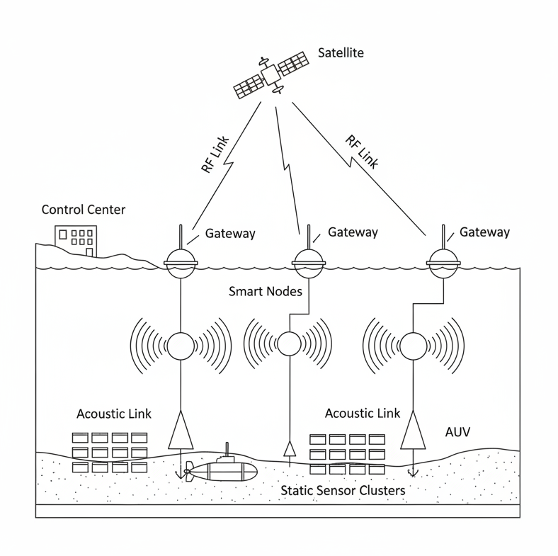
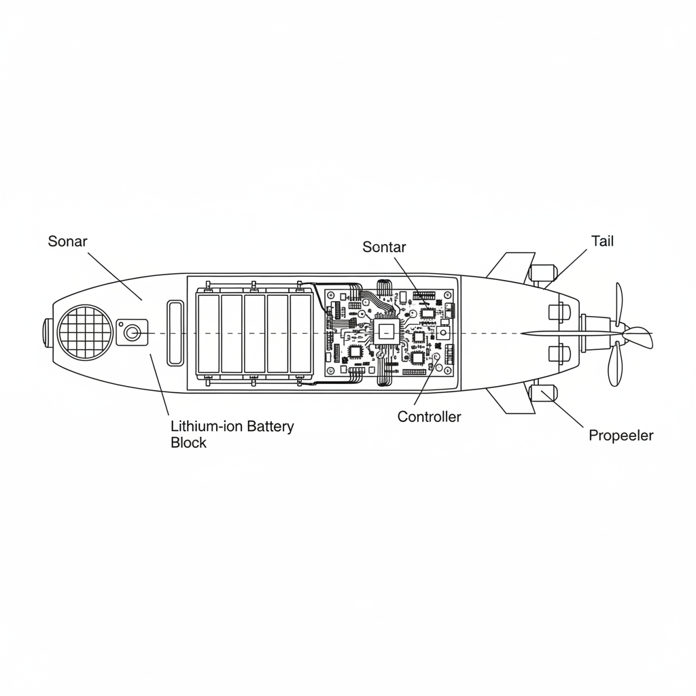
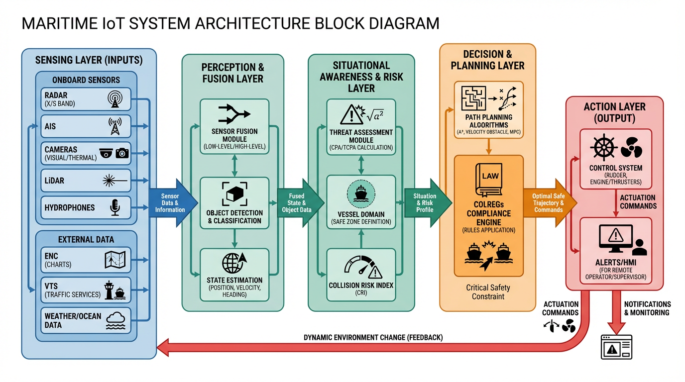
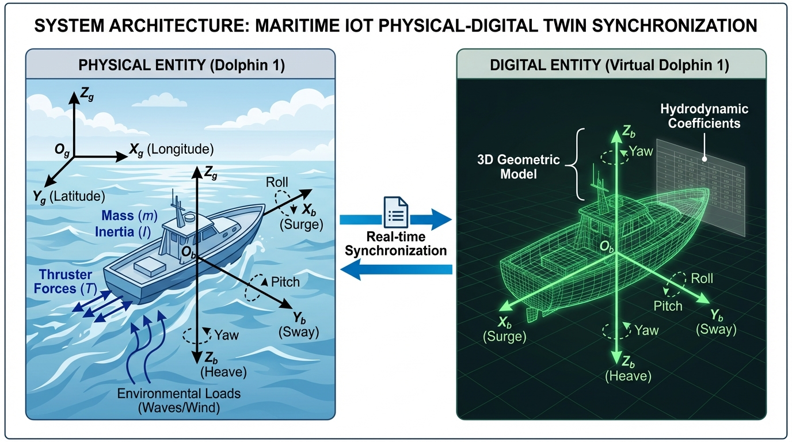

# Κεφάλαιο 2: Δίκτυα Ναυτιλιακών Επικοινωνιών

## Επισκόπηση

Αυτό το κεφάλαιο ασχολείται με την υποδομή επικοινωνίας του Θαλάσσιου Διαδικτύου των Πραγμάτων. Το κεφάλαιο εξετάζει τον σχεδιασμό συστημάτων και τα λειτουργικά συστήματα (βάσει των Lin et al., 2010; Xylouris et al., 2024) που υποστηρίζουν αποτελεσματική και επεκτεινόμενη επικοινωνία μεταξύ πλοίων και παράκτιων βάσεων, καθώς και εναέριων συστημάτων και δορυφόρων σε ωκεάνιες περιοχές.

Οι επτά τομείς προσοχής περιλαμβάνουν τα Δίκτυα που Ορίζονται από Λογισμικό (SDN) για προγραμματισμό, τα Μη Επίγεια Δίκτυα (NTN) με 5G/6G για την παροχή παγκόσμιας κάλυψης, τα Ετερογενή Δίκτυα Επικοινωνίας, τα Ναυτιλιακά Γνωστικά Ραδιοδίκτυα, τα πρωτόκολλα Αποθήκευσης και Προώθησης, την Ναυτιλιακή Υπολογιστική Ακρών και Ομίχλης και τα Δίκτυα Ανεκτικής Καθυστέρησης (DTN) για την υποστήριξη συνδέσεων υψηλής καθυστέρησης (Jung et al., 2023; Xylouris et al., 2024; Lin et al., 2010).

Στόχος είναι να καταδειχθεί πώς αυτά τα στοιχεία συνεργάζονται για την αντιμετώπιση των περιορισμών της αποστολής, συμπεριλαμβανομένης της αναξιόπιστης σύνδεσης, του παρατεταμένου χρόνου απόκρισης και των δύσκολων συνθηκών λειτουργίας. Η μελέτη θέτει επίσης ερωτήματα σχετικά με την ενορχήστρωση και την ευρωστία του συστήματος και την πλήρη απόδοση του συστήματος (π.χ., Lin et al., 2010; Woźniak, 2018). Ο σχεδιασμός επιπέδου ελέγχου και η ενσωμάτωση υποδομής διαστήματος-εδάφους συζητούνται στις ενότητες 2.1-2.7, και οι ενότητες εξηγούν πώς να χρησιμοποιείται η διατεχνολογική παράδοση και διαχείριση φάσματος, η μεταφορά δεδομένων με ανοχή σφαλμάτων και η κατανεμημένη υπολογιστική, και η χρήση των δικτύων στα συστήματα ανίχνευσης και αυτονομίας, καθώς και στα συστήματα ασφαλείας που συζητούνται στα επόμενα κεφάλαια (π.χ., Jung et al., 2023; Xylouris et al., 2024).

Τα τμήματα αυτής της εργασίας είναι αλληλένδετα, καθώς συνδέουν τα ναυτιλιακά ζητήματα με πρόσφατες προσεγγίσεις και παραδείγματα περιπτώσεων χρήσης, και παρέχουν μια ενοποιημένη βάση δεδομένων που θα χρησιμοποιηθεί στο συμπέρασμα του κεφαλαίου καθώς και στη διατριβή που θα ακολουθήσει (π.χ., Xylouris et al., 2024; Lin et al., 2010).

## 2.1: Δίκτυα που ορίζονται από λογισμικό (SDN) σε ναυτιλιακά περιβάλλοντα

### Σπουδαιότητα και Σκοπιμότητα της Έρευνας

Η ναυτιλιακή βιομηχανία βιώνει έναν σημαντικό ψηφιακό μετασχηματισμό λόγω της αυξημένης χρήσης συνδεδεμένων συσκευών και της αυξανόμενης ζήτησης για έξυπνα συστήματα IoT στη Ναυτιλία για τη διαχείριση πλοίων και λιμένων, καθώς και λειτουργιών υπεράκτιων πλατφορμών (Niknami et al., 2023). Τα ναυτιλιακά δίκτυα λειτουργούν με σταθερά συστήματα υλικού που χρησιμοποιούν άκαμπτες μεθόδους ελέγχου για να δημιουργήσουν λειτουργικούς περιορισμούς κατά τη διάρκεια μεταβαλλόμενων θαλάσσιων συνθηκών και περιορισμένης διαθεσιμότητας ηλεκτρομαγνητικού φάσματος, καθώς και κυμαινόμενων περιβαλλοντικών συνθηκών (Niknami et al., 2023). Το SDN παρέχει διαχείριση πόρων δικτύου μέσω προγραμματιζόμενων συστημάτων ελέγχου που επιτρέπουν την προσαρμογή δικτύου βάσει πολιτικής για τη σύνδεση διαφορετικών ναυτιλιακών καναλιών επικοινωνίας για καλύτερη απόδοση επικοινωνίας και σταθερότητα συστήματος και ταχύτερους χρόνους απόκρισης (Niknami et al., 2023). Η ικανότητα αυτής της δυνατότητας να λαμβάνει αυτόνομες αποφάσεις είναι ύψιστης σημασίας για την περιβαλλοντική παρατήρηση και την αποτελεσματικότητα της ναυτιλιακής λειτουργίας τόσο σε θαλάσσια περιβάλλοντα όσο και σε λιμενικές εγκαταστάσεις, όπου οι εφαρμογές απαιτούν διαφορετικά επίπεδα χρόνου απόκρισης και προσβασιμότητας υπηρεσιών, καθώς και αξιοπιστία επικοινωνίας (Xylouris et al., 2024).

### Θεωρητικό Υπόβαθρο

Το SDN αποσυνδέει το επίπεδο εντολών από το επίπεδο δεδομένων και η εντολή μπορεί είτε να είναι συγκεντρωτική είτε να κατανεμηθεί με ιεραρχικό τρόπο, και η δρομολόγηση, οι πολιτικές και η κατανομή πόρων (Niknami et al., 2023) μπορούν να ελέγχονται από τους προγραμματιζόμενους ελεγκτές. Στις ναυτιλιακές εφαρμογές, αυτό συνδυάζει ποικίλους τομείς, δηλαδή το δορυφορικό και επίγειο ραδιόφωνο, και το αναμετάδοση UAV σε ένα ενιαίο πακέτο ελέγχου, το οποίο επιβάλλει την ποιότητα υπηρεσίας και την αξιοπιστία έναντι των αλλαγών στην τοπολογία και των προσωρινών συνδέσεων (Xylouris et al., 2024). Το SDN και τα Software-Defined Radios (SDR) ενσωματώθηκαν σε πρώιμη έρευνα για την ενίσχυση της χρήσης του φάσματος και την υποστήριξη της δυναμικής δρομολόγησης στην θαλάσσια κινητικότητα και τις συνθήκες καναλιών (Niknami et al., 2023). Η επόμενη έρευνα επικεντρώθηκε σε αρχιτεκτονικές SDN πολλαπλών ελεγκτών και κατανεμημένες αρχιτεκτονικές για την επίλυση του προβλήματος της καθυστέρησης και της ανοχής διαμέρισης στις τεράστιες ωκεάνιες περιοχές (Niknami et al., 2023). Η εικονικοποίηση δικτύου που λειτουργεί στην κοινή υποδομή επιτρέπει την ύπαρξη ανεξάρτητων λογικών δικτύων (slices), όπως δεδομένα πλοήγησης, βιντεοεπιτήρηση και παρακολούθηση φορτίου, τα οποία παρέχουν διαφοροποιημένη απόδοση (Niknami et al., 2023). Οι δορυφορικές υπηρεσίες LEO που διαχειρίζονται από SDN έρχονται να καλύψουν απομακρυσμένες θαλάσσιες περιοχές και παρέχουν παράδοση σύμφωνα με την πολιτική με ασύρματη και ασύρματη και επίγεια μετάδοση (Lin et al., 2010).

### Τεχνικές Προκλήσεις και Προβληματισμοί

Το θαλάσσιο περιβάλλον εισάγει ιδιαίτερες παραμέτρους που εμποδίζουν την ομαλή λειτουργία των συστημάτων SDN. Οι μεγάλες περιοχές οδηγούν σε μεγάλες καθυστερήσεις και δημιουργούν επίσης ακανόνιστα σημεία σύνδεσης με πλοία εν κινήσει, γεγονός που περιπλέκει την έγκαιρη λήψη αποφάσεων για την κυκλοφορία SDN (Xylouris et al., 2024). Η συνεχής αλλαγή στη δομή του δικτύου λόγω κινούμενων αντικειμένων απαιτεί γρήγορες προσαρμογές του συστήματος. Η έλλειψη φάσματος και η αυστηρή διαχείρισή του από τις ναυτιλιακές ρυθμιστικές αρχές και τους παγκόσμιους φορείς όπως ο IMO και η ITU απαιτεί έξυπνη χρήση του φάσματος για τη διατήρηση του κατάλληλου εύρους ζώνης (Niknami et al., 2023). Οι κακές καιρικές συνθήκες μειώνουν την ισχύ της ραδιοσύνδεσης και εισάγουν ποικίλα κανάλια επικοινωνίας που απαιτούν έξυπνες μεθόδους επικοινωνίας και ισχυρή ρύθμιση συστήματος (Niknami et al., 2023). Η περιορισμένη παροχή ενέργειας στα ναυτιλιακά συστήματα, ιδίως σε αυτόνομα πλοία και συστήματα αισθητήρων, απαιτεί SDN χαμηλής ισχύος μαζί με λειτουργίες SDR. Η υπάρχουσα επιβολή του νόμου σχετικά με τις τροποποιήσεις υλικού δημιουργεί καθυστερήσεις στην εφαρμογή της τεχνολογίας, ενώ παράλληλα καθιστά πιο σημαντικές τις τροποποιήσεις συστημάτων που βασίζονται στο λογισμικό (Xylouris et al., 2024). Τα δίκτυα SDN αυξάνουν τους κινδύνους ασφαλείας επειδή το κεντρικό επίπεδο ελέγχου είναι ευάλωτο σε κυβερνοεπιθέσεις, οι οποίες μπορεί να οδηγήσουν σε εκτεταμένη βλάβη δικτύου. Για τον σκοπό αυτό, τα ναυτιλιακά συστήματα SDN πρέπει να προστατεύονται από ισχυρά μέτρα ασφαλείας. (Ghafoor et al., 2020; Niknami et al., 2023).

### Υφιστάμενες Τεχνολογίες και Μεθοδολογικές Προσεγγίσεις

Συστήματα SDN πολλαπλών ελεγκτών εγκαθίστανται πλέον σε πλοία και σταθμούς ξηράς για την ενίσχυση της χρονικής καθυστέρησης και την παροχή ανοχής σφαλμάτων σε συστήματα ναυτιλιακών επικοινωνιών (Xylouris et al., 2024). Αυτοί οι ελεγκτές χρησιμοποιούνται για τον έλεγχο της εικονικοποίησης δικτύου, της δυναμικής δρομολόγησης της κίνησης και της ιεράρχησης QoS σε πραγματικό χρόνο. Η συμβατότητα με την τεχνολογία SDR επιτρέπει την ευελιξία συχνότητας και τη διαμόρφωση, η οποία είναι σημαντική για το εξελισσόμενο περιβάλλον του ναυτιλιακού καναλιού (Niknami et al., 2023).
Ο συνδυασμός των τεχνικών γνωσιακής ραδιοεπικοινωνίας με το SDN επιτρέπει τη δυναμική χρήση του φάσματος και τα συστήματα θα αποφεύγουν αυτόματα τις παρεμβολές και επομένως το φάσμα θα χρησιμοποιείται πιο αποτελεσματικά (Ghafoor et al., 2020). Το SDN υποστηρίζεται από την Υπολογιστική Ομίχλης και την Υπολογιστική Ακρών (Edge and Fog Computing) καθώς η υπολογιστική ισχύς μεταφέρεται πιο κοντά στις πηγές δεδομένων, για παράδειγμα πλοία ή πλατφόρμες, γεγονός που μειώνει την ανάγκη αποστολής δεδομένων πίσω σε απομακρυσμένες τοποθεσίες και βελτιώνει τις αποκρίσεις σε εφαρμογές, οι οποίες είναι ευαίσθητες στο χρόνο (Xylouris et al., 2024).
Ο συνδυασμός των δύο δικτύων παρέχει παρόμοια δυνατότητα μετάβασης μεταξύ των δορυφορικών και των επίγειων συνδέσεων, και αυτό μπορεί να διαχειρίζεται από έναν ελεγκτή SDN για να επιτευχθεί ισχυρή σύνδεση στο διαδίκτυο παντού (Niknami et al., 2023).
Οι αλγόριθμοι Τεχνητής Νοημοσύνης (AI) και ML αρχίζουν να βελτιώνουν τους ελεγκτές SDN προκειμένου να εκτελούν προγνωστικό έλεγχο δικτύου, πρόβλεψη κυκλοφορίας και ανίχνευση ανωμαλιών, αλλά αυτές οι μέθοδοι θα πρέπει να τροποποιηθούν στο ναυτιλιακό επιχειρησιακό περιβάλλον (Niknami et al., 2023).

### Εφαρμογές και Σενάρια Χρήσης

Τα συστήματα θαλάσσιας δικτύωσης που βασίζονται σε SDN έχουν χρησιμοποιηθεί σε διαφορετικά περιβάλλοντα πραγματικού κόσμου. Τα έργα Smart Port βασίζονται στο SDN για την έξυπνη κατανομή του φορτίου δικτύου μεταξύ διαφορετικών χρηστών λιμένων, γεγονός που ενισχύει την αποτελεσματικότητα στις λειτουργίες φορτίου, τον έλεγχο της κυκλοφορίας των πλοίων και την παρακολούθηση του περιβάλλοντος (Niknami et al., 2023). Η Maersk και άλλες ναυτιλιακές εταιρείες χρησιμοποιούν λύσεις ελέγχου δικτύου που βασίζονται σε SDN για την υποστήριξη αυτόνομων συνδέσεων πλοίων, οι οποίες εγγυώνται αξιόπιστη παροχή πληροφοριών κατάστασης πλοίου και οδηγιών ελέγχου (Xylouris et al., 2024).
Τα μη επανδρωμένα εναέρια αναμεταδότες που λειτουργούν ως αερομεταφερόμενοι κόμβοι ελεγχόμενοι από SDN διευρύνουν την πρόσβαση στο δίκτυο σε απομακρυσμένες θαλάσσιες περιοχές και βελτιώνουν τη συλλογή δεδομένων αισθητήρων και την κατανόηση της κατάστασης (Ghafoor et al., 2020). Τα συστήματα παρέχουν ανώτερη απόδοση συνδεσιμότητας με μειωμένο χρόνο καθυστέρησης και αυξημένους ρυθμούς μεταφοράς δεδομένων σε σύγκριση με τα παραδοσιακά συστήματα στατικής υποδομής. Η εφαρμογή SDN σε λιμάνια τους επιτρέπει να επωφελούνται από την τεχνολογία τεμαχισμού δικτύου, η οποία επιτρέπει σε πολλές εφαρμογές να εκτελούνται ταυτόχρονα με ξεχωριστές απαιτήσεις απόδοσης (Niknami et al., 2023).

### Μελλοντικές Κατευθύνσεις και Ερευνητικά Κενά

Δεν υπάρχει επαρκής διερεύνηση σχετικά με τους τρόπους με τους οποίους το SDN μπορεί να χρησιμοποιηθεί για τον έλεγχο των ναυτιλιακών δικτύων που αντιμετωπίζουν απώλεια σήματος. Οι ερευνητές πρέπει να αναπτύξουν συσκευές με τεχνητή νοημοσύνη που μπορούν να ανιχνεύουν δυσλειτουργίες και να τις διορθώνουν αυτόνομα. Οι ερευνητές θα πρέπει να εξετάσουν πώς να χρησιμοποιήσουν το SDN για να συνδυάσουν δορυφορικά δίκτυα 5G και 6G και άλλες νεοσύστατες τεχνολογίες για την παροχή γρήγορων υπηρεσιών διαδικτύου σε πλοία σε όλο τον κόσμο (Niknami et al., 2023; Shang et al., 2025).
Το τρέχον πρόβλημα είναι πώς να λειτουργήσουν τα πρωτόκολλα SDN σε παγκόσμιους στόλους και διάφορους εξοπλισμούς. Το φιλικό προς τη ναυτιλία υλικό SDR και τα στοιχεία SDN εξοικονόμησης ενέργειας θα καταστήσουν δυνατή την ανάπτυξη μικρότερων αυτόνομων πλοίων αλλού (Xylouris et al., 2024).
Υπάρχει ανάγκη για πλαίσια κυβερνοασφάλειας που είναι συμβατά με την ευέλικτη αρχιτεκτονική SDN και μπορούν να χειριστούν απειλές που σχετίζονται με τη ναυτιλία, προκειμένου να προστατεύσουν τις βασικές θαλάσσιες υποδομές και να διασφαλίσουν ασφαλείς αυτόνομες λειτουργίες (Ghafoor et al., 2020).

## 2.2: Ενσωμάτωση Μη Επίγειων Δικτύων (NTN) και 5G/6G στις Ναυτιλιακές Επικοινωνίες

### Σπουδαιότητα και Σκοπιμότητα της Έρευνας

Τα Μη Επίγεια Δίκτυα (NTN), δηλαδή οι δορυφόροι χαμηλής τροχιάς (LEO) και τα μη επανδρωμένα αεροσκάφη (UAV), μετασχηματίζουν τις επικοινωνίες στη ναυτιλιακή βιομηχανία. Συνδυάζονται με την τεχνολογία 5G και 6G για να παρέχουν αξιόπιστη κάλυψη απομακρυσμένων ωκεάνιων επιχειρήσεων. Αυτή η αξιοπιστία είναι εξαιρετικά χρήσιμη για τις εφαρμογές του Ναυτιλιακού Διαδικτύου των Πραγμάτων (IoT), δηλαδή την αυτόνομη ναυτιλία, τα έξυπνα λιμάνια και την ασφάλεια στη θάλασσα (Jung et al., 2023; Xylouris et al., 2024).

### Θεωρητικό Υπόβαθρο

Οι γεωστατικοί δορυφόροι ήταν το κύριο μέσο θαλάσσιας επικοινωνίας στο παρελθόν. Καλύπτουν μια ευρεία περιοχή, αλλά είναι αργοί στην απόκριση και μπορούν να χειριστούν μόνο μια μικρή ποσότητα δεδομένων. Τα νέα μη επίγεια δίκτυα που αποτελούνται από δορυφόρους χαμηλής τροχιάς της Γης και πλατφόρμες που βασίζονται σε αεροσκάφη είναι ταχύτερα και μπορούν να χρησιμοποιηθούν με τα τρέχοντα πλοία και τις μεγάλης κλίμακας λειτουργίες δεδομένων. Σύμφωνα με κριτικές, τα νέα δίκτυα χρησιμοποιούν υπολογιστική αιχμής και κατανεμημένα συστήματα για την ενίσχυση των συνδέσεων του Διαδικτύου των Πραγμάτων και των αναγκών σε δεδομένα σε πραγματικό χρόνο σε θαλάσσια περιβάλλοντα (Jung et al., 2023; Xylouris et al., 2024).

### Τεχνικές Προκλήσεις και Προβληματισμοί

Τα NTN σε θαλάσσια περιβάλλοντα αντιμετωπίζουν αρκετές προκλήσεις, όπως ο απρόβλεπτος καιρός, η απώλεια σήματος λόγω απόστασης, τα μεταβαλλόμενα ραδιοσήματα και η μικρή διάρκεια ζωής της μπαταρίας των UAV και των κινητών πλατφορμών. Η ενσωμάτωση των NTN με συστήματα 5G ή 6G δημιουργεί επίσης προβλήματα παρεμβολών από δορυφόρους και επίγειες ζεύξεις, η εναλλαγή σημάτων κίνησης πλοίων και ο σχεδιασμός διαδρομής των UAV για τη βελτιστοποίηση της κάλυψης και τη μείωση της κατανάλωσης ενέργειας. Ένα άλλο πρόβλημα είναι η συνεργασία των συστημάτων στην ξηρά, στον αέρα και στη θάλασσα (Jung et al., 2023; Xylouris et al., 2024; Lindenbergs et al., 2023).

### Υφιστάμενες Τεχνολογίες και Μεθοδολογικές Προσεγγίσεις

Προς το παρόν, τα ναυτιλιακά δίκτυα αποκτούν ασφαλέστερες και ταχύτερες υπηρεσίες σύνδεσης δεδομένων με τους δορυφόρους Starlink, OneWeb LEO και άλλες παρόμοιες υπηρεσίες. Η επικοινωνία δεδομένων μπορεί επίσης να βελτιωθεί με UAV, επεκτείνοντας την κάλυψη σε περιοχές όπου δεν υπάρχουν διαθέσιμες δορυφορικές ή επίγειες συνδέσεις, κάτι που είναι ιδιαίτερα χρήσιμο σε πολυσύχναστα λιμάνια.

**Εικόνα 2.1**: _Αρχιτεκτονική Ενσωματωμένου Μη Επίγειου Δικτύου (NTN) πολλαπλών επιπέδων για ναυτιλιακό 6G. Το διάγραμμα απεικονίζει την κάθετη ιεραρχία που συνδέει δορυφόρους LEO (Διαστημικό Επίπεδο) και αναμεταδότες UAV (Εναέριο Επίπεδο) με αυτόνομα σκάφη επιφανείας (Ναυτιλιακό Επίπεδο) για την εξασφάλιση καθολικής κάλυψης._

Η τελευταία έκδοση της τεχνολογίας 5G and 6G προσφέρει στα πλοία εξατομικευμένα χαρακτηριστικά, όπως η τεμαχισμός δικτύου και η υποστήριξη Internet of Things (IoT) σε τεράστια κλίμακα. Σύμφωνα με τα ευρήματα της νέας έρευνας, ο συνδυασμός επίγειων ασύρματων δικτύων mesh and σύνδεσης NTN παρέχει στα πλοία και στις υπεράκτιες εγκαταστάσεις μια αξιόπιστη, ευέλικτη και οικονομικά αποδοτική επικοινωνία (Jung et al., 2023; Xylouris et al., 2024; Lindenbergs et al., 2023).

### Εφαρμογές και Σενάρια Χρήσης

Η ενσωμάτωση μεταξύ του δικτύου 5G/6G και του NTN είναι ένας κρίσιμος παράγοντας που οδηγεί σε πολλαπλές καινοτομίες στον ναυτιλιακό τομέα. Τα έξυπνα λιμάνια διαθέτουν συνδεδεμένες συσκευές για τον έλεγχο του φορτίου και την παρακολούθηση της κατάστασης του νερού. Οι δορυφορικές λύσεις LEO επιτρέπουν την απομακρυσμένη συντήρηση και την αυτοοδηγούμενη πλοήγηση και ιατρικές υπηρεσίες στη θάλασσα. Τα δίκτυα αναμετάδοσης UAV διατηρούν τις συνδέσεις των πλοίων στις περιοχές όπου τα κανονικά σήματα αποτυγχάνουν. Αυτές οι τεχνολογίες ενσωμάτωσης παρέχουν τη δυνατότητα συνεχούς βιντεοεπιτήρησης και αντιμετώπισης έκτακτης ανάγκης, καθώς και διαχείρισης στόλου και παρακολούθησης εξοπλισμού σε πλοία και λιμάνια (Jung et al., 2023; Xylouris et al., 2024; MOL, 2023).

### Μελλοντικές Κατευθύνσεις και Ερευνητικά Κενά

Συνιστάται οι μελλοντικοί ερευνητές να συνεχίσουν να μελετούν την ενσωμάτωση χερσαίων και διαστημικών δικτύων, τη διαχείριση της κίνησης δεδομένων από την Τεχνητή Νοημοσύνη και την βελτιωμένη κίνηση των ταχέως κινούμενων σκαφών. Η Μηχανική Μάθηση θα χρησιμοποιηθεί για τον καλύτερο συντονισμό δορυφόρων, UAV και αισθητήρων πλοίων στα επόμενα συστήματα 6G. Άλλα σημαντικά καθήκοντα του μέλλοντος περιλαμβάνουν την εφαρμογή διεθνών προτύπων και τον σχεδιασμό δικτύων που καταναλώνουν λιγότερη ενέργεια (Jung et al., 2023; Xylouris et al., 2024).

## 2.3: Ετερογενή Δίκτυα Επικοινωνιών

### Σπουδαιότητα και Σκοπιμότητα της Έρευνας

Η επικοινωνία πραγμάτων (IoT) σε ναυτιλιακά περιβάλλοντα απαιτεί Ετερογενή Δίκτυα Επικοινωνίας. Επιτρέπουν την επικοινωνία μεταξύ πλοίων, λιμένων και άλλων θαλάσσιων συστημάτων μέσω μιας ποικιλίας τεχνολογιών επικοινωνίας. Παρέχουν ασφαλείς συνδέσεις σε κανονικές λειτουργίες, ασφάλεια και συλλογή ανθρώπινων και αυτοματοποιημένων δεδομένων. Η επικοινωνία πολλαπλών δικτύων, όπως δορυφόρος, ραδιοφωνικός, κινητός και άλλοι, καθιστά τη ναυτιλία πιο έξυπνη. Προσφέρει αυτοματοποιημένη λειτουργία στο λιμάνι, ένα χαρακτηριστικό που είναι απαραίτητο για τον μετασχηματισμό των θαλάσσιων βιομηχανιών σε σημαντικό αριθμό. (Xylouris et al., 2024; Hoeft et al., 2023).

### Θεωρητικό Υπόβαθρο

Οι θαλάσσιες επικοινωνίες έχουν εξελιχθεί από τη χρήση διαφορετικών ραδιοφωνικών και δορυφορικών συστημάτων σε ολοκληρωμένα δίκτυα που συνδυάζουν διαστημικούς, εναέριους και χερσαίους πόρους. Σύμφωνα με πρόσφατες μελέτες, τα υβριδικά δίκτυα μπορούν να παρέχουν συνδεσιμότητα σε πλοία μακριά από την ακτή και να διατηρούν τη μετάδοση δεδομένων υπό αντίξοες συνθήκες. Τα πλοία έχουν βοηθηθεί στην απρόσκοπτη σύνδεση και στη μείωση της κατανάλωσης ενέργειας από τεχνικές μηχανικής μάθησης, οι οποίες περιλαμβάνουν βαθιά μάθηση για την επιλογή της καλύτερης ασύρματης σύνδεσης. Οι πλατφόρμες του IoT για τη ναυτιλία εργάζονται επί του παρόντος για να διασφαλίσουν ότι οι διάφοροι αισθητήρες και συσκευές είναι εύκολα συμβατοί (Lin et al., 2010; Hoeft et al., 2023; Li et al., 2023).

### Τεχνικές Προκλήσεις και Προβληματισμοί

Ο συνδυασμός πολλαπλών τύπων δικτύων στη θάλασσα αποτελεί μεγάλη πρόκληση. Τα ασύρματα σήματα μπορεί να είναι ασθενή ή παραμορφωμένα ή να έχουν παρεμβολές λόγω νερού και καιρού. Τα δορυφορικά συστήματα έχουν μια τεράστια περιοχή λειτουργίας, αλλά είναι δαπανηρά και έχουν χαμηλή ταχύτητα. Τα χερσαία δίκτυα έχουν υψηλότερη ταχύτητα, αλλά είναι διαθέσιμα μόνο κοντά την ακτή. Τα πλοία πρέπει να διαθέτουν ισχυρά συστήματα όταν διέρχονται από δίκτυα για να διατηρούν την επικοινωνία. Οι διαφορές δικτύου θα μπορούσαν να δυσκολέψουν την ανταλλαγή δεδομένων για τις συσκευές, επειδή χρησιμοποιούν διαφορετικά πρότυπα ή δεν έχουν μπαταρία. Είναι επίσης δύσκολο να δοθεί προτεραιότητα στα σημαντικά μηνύματα και να διατηρηθούν όλα ασφαλή, επομένως απαιτούνται σοφές μέθοδοι κοινής χρήσης πόρων δικτύου και μετάφρασης δεδομένων.

### Υφιστάμενες Τεχνολογίες και Μεθοδολογικές Προσεγγίσεις

Τα δίκτυα ραδιοεπικοινωνιών, το Wi-Fi και τα δίκτυα κινητής τηλεφωνίας (4G/5G), καθώς και τα δορυφορικά δίκτυα συνδυάζονται για τη δημιουργία συστημάτων θαλάσσιας επικοινωνίας. Τα συστήματα που βασίζονται στην Τεχνητή Νοημοσύνη παρέχουν τις κατάλληλες επιλογές σύνδεσης και μοιράζονται την κίνηση σε διαφορετικά δίκτυα. Η ενέργεια μπορεί να μειωθεί και η κοινή χρήση δεδομένων μεταξύ πολλών συσκευών μπορεί να σταθεροποιηθεί χρησιμοποιώντας απλές τεχνικές. Με το σύστημα netBaltic, τα πλοία μπορούν να επικοινωνούν ασύρματα με την ακτή και με τα άλλα πλοία χωρίς τη χρήση του δορυφόρου, επιτρέποντας την σύνδεση περισσότερων πλοίων. Τα δεδομένα αισθητήρων, τα δεδομένα θέσης και τα δεδομένα εντολών μοιράζονται γρήγορα μεταξύ των USV και των υποβρύχιων ρομπότ μέσω συστημάτων που βασίζονται στο IoT (Hoeft et al., 2023; Li et al., 2023; Woźniak et al., 2018).

### Εφαρμογές και Σενάρια Χρήσης

Τα δίκτυα αποτελούν την εξαιρετική τεχνολογία που εφαρμόζεται για την αυτοματοποίηση των ναυτιλιακών δραστηριοτήτων και την ασφάλειά τους στη θάλασσα. Η παρακολούθηση πλοίων σε πραγματικό χρόνο και η διαχείριση φορτίου είναι μερικές από τις σημαντικές εργασίες που εκτελούν αυτά τα δίκτυα στα έξυπνα λιμάνια και τις αλυσίδες εφοδιασμού. Τα ραδιοσήματα και τα δορυφορικά δίκτυα χρησιμοποιούνται από ρομποτικά πλοία και το υλικό τηλεχειρισμού για τη μετάδοση των θέσεών τους και την αποφυγή συγκρούσεων. Τα αυτόματα συστήματα συλλέγουν αυτές τις πληροφορίες για να προβλέπουν τις κινήσεις των πλοίων και να βελτιστοποιούν την ασφάλεια σε πολυσύχναστες ναυτιλιακές διαδρομές. Πολλαπλά πλοία συνδέονται μεταξύ τους μέσω δικτύων για τη μετάδοση των πληροφοριών σε μεγαλύτερη απόσταση και για την ενίσχυση της επικοινωνίας των στόλων (Li et al., 2023; Hoeft et al., 2023; Woźniak, 2018).

### Μελλοντικές Κατευθύνσεις και Ερευνητικά Κενά

Οι ερευνητές προσπαθούν να καταλάβουν πώς το 6G μπορεί να συνεργαστεί με την Τεχνητή Νοημοσύνη και τη Μηχανική Μάθηση (ML) και τη συνεργατική νοημοσύνη για να βελτιώσει και να ασφαλέσει τις συνδέσεις. Πρέπει να υπάρχει μια λύση για την επίλυση ζητημάτων όπως η δυνατότητα εναλλαγής μεταξύ των δορυφορικών, ραδιοφωνικών και επίγειων δικτύων, η εξοικονόμηση ενέργειας και η πρόληψη των παρεμβολών σήματος σε περιοχές με συμφόρηση στο νερό. Πρέπει να υπάρχει μια κοινή μέθοδος και ένα βολικό σύστημα για την ένωση όλων των πλοίων και αισθητήρων. Τα δίκτυα θα απαιτούν πιο έξυπνο έλεγχο, ισχυρό εξοπλισμό και ανώτερη συνεργασία συσκευών για την αποτελεσματική επικοινωνία σε απομακρυσμένες και ταραγμένες ωκεάνιες περιοχές (Xylouris et al., 2024; Lin et al., 2010).

## 2.4: Ναυτιλιακά Δίκτυα Γνωστικού Ραδιοφώνου (Cognitive Radio)

### Σπουδαιότητα και Σκοπιμότητα της Έρευνας

Είναι υποχρεωτικό να υπάρχει αποτελεσματική διαχείριση του φάσματος στα σύγχρονα συστήματα θαλάσσιας επικοινωνίας. Η κίνηση ασύρματου δικτύου στη θάλασσα προκαλεί υπερφόρτωση του δικτύου από τις συμβατικές τεχνικές κατανομής φάσματος, επιβράδυνση της επικοινωνίας και μείωση της αξιοπιστίας των λειτουργιών λόγω του αυξανόμενου αριθμού σκαφών, αισθητήρων και άλλων ασύρματων συσκευών. Ο συντονισμός των πλοίων, η μεταφορά δεδομένων IoT στη θάλασσα και η ασφαλής πλοήγηση υποστηρίζονται από τα Γνωσιακά Ραδιοδίκτυα, καθώς παρέχουν έξυπνες προσεγγίσεις χρήσης φάσματος που είναι πιο προσαρμόσιμες και ασφαλείς (Ghafoor & Koo, 2020; και Zheng et al., 2023).

### Θεωρητικό Υπόβαθρο

Η τεχνολογία Cognitive Radio (CR) επιτρέπει στις συσκευές να ανιχνεύουν ελεύθερα κανάλια επικοινωνίας και να τα χρησιμοποιούν χωρίς να παρεμβαίνουν σε εξουσιοδοτημένους χρήστες. Αυτές είναι οι προηγούμενες μελέτες που προσπάθησαν να προσαρμόσουν τέτοιες προσεγγίσεις σε θαλάσσια σκάφη και υπεράκτιες πλατφόρμες στη θάλασσα. Κύριος στόχος τους ήταν να αντιμετωπίσουν το πρόβλημα του περιορισμένου φάσματος, της διακύμανσης της κατάστασης της θάλασσας και της κινητικότητας των πλοίων. Η συνεργατική ανίχνευση φάσματος και η κεντρική διαχείριση φάσματος έχουν ως αποτέλεσμα τη βελτίωση της ακρίβειας της ανίχνευσης στα πλοία υπό κινητικότητα και μεταβαλλόμενα ραδιοσήματα που προκαζούνται από το κύμα της θάλασσας και τον καιρό (Ghafoor & Koo, 2020; Zheng et al., 2023).

### Τεχνικές Προκλήσεις και Προβληματισμοί

Οι θάλασσες είναι επιρρεπείς σε θόρυβο όταν λειτουργούν με Γνωστικά Ραδιοδίκτυα. Τα ραδιοσήματα διαταράσσονται από την κίνηση του νερού, γεγονός που οδηγεί σε κακές συνδέσεις και σφάλματα στην ανίχνευση καναλιών. Τα σκάφη έχουν μικρή ισχύ για να λειτουργήσουν με πολύπλοκες επικοινωνίες και οι δορυφορικές συνδέσεις προσθέτουν καθυστέρηση. Δεν υπάρχει μόνιμη υποδομή στην ανοιχτή θάλασσα, επομένως οι κινητές πλατφόρμες πρέπει να μεταδίδουν πληροφορίες φάσματος όταν βρίσκονται σε κίνηση. Οι κανόνες ορίζουν ότι τα γνωστικά ραδιοδίκτυα δεν πρέπει να διαταράσσουν τα συστήματα επικοινωνίας έκτακτης ανάγκης. Αυτό καθιστά ακόμη πιο δύσκολο τον σχεδιασμό και τη λειτουργία (Ghafoor & Koo, 2020; Zheng et al., 2023).

### Υφιστάμενες Τεχνολογίες και Μεθοδολογικές Προσεγγίσεις

Οι υπάρχουσες τεχνικές σάρωσης φάσματος, όπως η σάρωση με βάση την ενέργεια, μπορούν να εφαρμοστούν από τα Ναυτιλιακά Γνωστικά Ραδιοδίκτυα για τον εντοπισμό αχρησιμοποίητων καναλιών. Η πρακτική της κοινής σάρωσης είναι δημοφιλής και βοηθά στην ενίσχυση της ακρίβειας των αποφάσεων των πλοίων που ανταλλάσσουν δεδομένα με ένα κεντρικό κέντρο διαχείρισης ή μεταξύ τους. Ο συνδυασμός Δικτύωσης που Ορίζεται από Λογισμικό και Γνωστικής Ραδιοφωνίας παρέχει κεντρικό αλλά δυναμικό έλεγχο των συχνοτήτων που χρησιμοποιούνται από τα πλοία και άλλους χρήστες. (Ghafoor & Koo, 2010; Zheng et al., 2023). Τα συστήματα μπορούν να τροποποιηθούν ανάλογα με τις ανάγκες της στιγμής και να βελτιώσουν τη μετάδοση δεδομένων σε δύσκολες συνθήκες.

### Εφαρμογές και Σενάρια Χρήσης

Η ανταλλαγή δεδομένων μεταξύ πλοίων, η περιβαλλοντική επιτήρηση σε πραγματικό χρόνο και η αυτοματοποιημένη υποστήριξη πλοίων είναι μερικά από αυτά τα δίκτυα. Το Cognitive Radio, χρησιμοποιώντας κεντρική διαχείριση, χρησιμοποιείται σε ορισμένα λιμάνια και ερευνητικές αποστολές για τη λειτουργία διαφορετικών τύπων εξοπλισμού και λειτουργιών. Έχει διαπιστωθεί ότι τέτοια συστήματα μπορούν να βελτιώσουν την απόδοση δεδομένων, να ελαχιστοποιήσουν τις παρεμβολές και να ενισχύσουν την αξιοπιστία της θαλάσσιας επικοινωνίας (Ghafoor & Koo, 2020; Zheng et al., 2023).

### Μελλοντικές Κατευθύνσεις και Ερευνητικά Κενά

Περαιτέρω μελέτες ενδιαφέρονται για τον τρόπο βελτίωσης της ανίχνευσης φάσματος όταν τα κύματα αλλάζουν, για τη χρήση Τεχνητής Νοημοσύνης για τον έλεγχο της χρήσης ραδιοσυχνοτήτων και της κατανάλωσης ενέργειας, και για τον συνδυασμό νέων ασύρματων τεχνολογιών όπως το 6G. Τα δίκτυα μετάδοσης, τα οποία επιτρέπουν στα σκάφη και τα ρομπότ να λαμβάνουν εντολές τοπικά, μπορούν να ενισχύσουν την αξιοπιστία του συστήματος. Είναι επίσης επιθυμητό να υπάρχει ενισχυμένη διεθνής συνεργασία και κανονισμοί, ώστε αυτά τα συστήματα να λειτουργούν αρμονικά και με ασφάλεια παγκοσμίως (Ghafoor & Koo, 2020; Zheng et al., 2023).

## 2.5: Πρωτόκολλα Αποθήκευσης και Προώθησης (Store‑and‑Forward)

### Σπουδαιότητα και Σκοπιμότητα της Έρευνας

Οι μέθοδοι αποθήκευσης και προώθησης (S&F) είναι ζωτικής σημασίας για τα ναυτιλιακά συστήματα IoT, καθώς επιτρέπουν τη συνεχή επικοινωνία σε απομακρυσμένα νερά όπου η συνεχής επικοινωνία ενδέχεται να μην είναι εφικτή. Στη θάλασσα, πλατφόρμες όπως πλοία ή σημαδούρες δεν είναι πάντα συνδεδεμένες λόγω μειωμένης δορυφορικής κάλυψης ή μεταβαλλόμενων καιρικών συνθηκών. Για να διασφαλιστεί η ασφαλής και αξιόπιστη εκτέλεση των ναυτιλιακών επιχειρήσεων (Monzon Baeza et al., 2024), τα πρωτόκολλα S&F διατηρούν δεδομένα σε δορυφόρους ή συσκευές πύλης μέχρι να είναι διαθέσιμη μια σύνδεση.

### Θεωρητικό Υπόβαθρο

Τέτοιες τεχνικές αποθήκευσης και προώθησης (S&F) είναι πιο χρήσιμες στις μέρες μας λόγω της παρουσίας δορυφόρων χαμηλής τροχιάς (LEO) και δικτύων μη επίγειων δικτύων (NTN) και θαλάσσιων δικτύων κινητής τηλεφωνίας όπως το NB-IoT και το LTE-M. Σύμφωνα με μια μελέτη, η S&F μπορεί να χρησιμοποιηθεί για την επέκταση της κάλυψης των δικτύων IoT σε περιοχές του ωκεανού όπου τα επίγεια δίκτυα δεν μπορούν να φτάσουν εύκολα, με μειωμένο κόστος (Monzon Baeza et al., 2024). Οι νέες προσθήκες είναι πρωτόκολλα δικτύου ανεκτικών καθυστερήσεων (DTN) που μπορούν να συνδέσουν κινούμενες πλατφόρμες ακόμη και όταν υπάρχουν προσωρινά κενά στη σύνδεση. Η τεχνολογία S&F επιτρέπει στα συστήματα επικοινωνίας του Ναυτιλιακού IoT να μετακινούνται από επίγειες υποδομές σε ισχυρά και οικονομικά αποδοτικά συστήματα (Monzon Baeza et al., 2024).

### Τεχνικές Προκλήσεις και Προβληματισμοί

Τα πρωτόκολλα αποθήκευσης και προώθησης (S&F) είναι λειτουργικά, αλλά αντιμετωπίζουν τεχνικά ζητήματα. Η δρομολόγηση δεδομένων σε δορυφορικά δίκτυα S&F είναι δύσκολη λόγω της κίνησης των δορυφόρων, των προσωρινών συνδέσεων και των καθυστερήσεων σε άκαιρο χρόνο, οι οποίες προκαλούν απρόβλεπτες καθυστερήσεις και υπερφόρτωση δεδομένων σε ενδιάμεσους κόμβους. Αυτό απαιτεί ένα καλά σχεδιασμένο πρόγραμμα παράδοσης δεδομένων και διαχείρισης buffer (Monzon Baeza et al., 2024). Τα συστήματα S&F εγγράφονται επίσης στο δίκτυο και ελέγχονται μεταξύ πολλαπλών δορυφορικών περασμάτων. Η ασφάλεια δεν μπορεί ποτέ να τεθεί σε κίνδυνο, καθώς οι περίοδοι μη μετάδοσης ενδέχεται να εκθέσουν εμπιστευτικά δεδομένα. Οι ακεραιότητες των συστημάτων S&F πρέπει να διασφαλίζουν την αυθεντικότητα και την αυθεντικότητα των δεδομένων μέσω της ταυτόχρονης επαλήθευσης ταυτότητας διαφόρων τμημάτων δικτύου (SINTEF Ocean, 2024).

### Υφιστάμενες Τεχνολογίες και Μεθοδολογικές Προσεγγίσεις

Προς το παρόν, οι λειτουργίες Επιστήμης και Επικοινωνιών (S&F) χρησιμοποιούνται από πλατφόρμες Ναυτιλιακού Διαδικτύου (IoT) σε εγκαταστάσεις δορυφόρων για την ενίσχυση της ανθεκτικότητας και την ελαχιστοποίηση της απώλειας δεδομένων. Για να διασφαλιστεί η ασφάλεια των δεδομένων ελλείψει συνδέσεων, οι λειτουργίες δικτύου κατανέμονται κυρίως μεταξύ δορυφόρων και επίγειων τμημάτων (Monzon Baeza et al., 2024). Οι λύσεις περιλαμβάνουν τυποποιημένες διεπαφές και πρωτόκολλα που εκθέτουν τις δυνατότητες Επιστήμης και Επικοινωνιών (S&F) του δικτύου και των χρηστών, προσφέρουν ελέγχους για την ιεράρχηση της παράδοσης και τη δυναμική διαχείριση των ποσοστώσεων δεδομένων. Οι ναυτιλιακές εφαρμογές NB-IoT διαθέτουν πλέον δυνατότητα Επιστήμης και Επικοινωνιών (S&F) με παρακολούθηση πλοίων και εμπορευματοκιβωτίων σε μεγάλες διαβάσεις στον ωκεανό (Noto et al., 2023).

### Εφαρμογές και Σενάρια Χρήσης

Η αποθήκευση και προώθηση είναι πιο αποτελεσματική σε λειτουργίες του Ναυτιλιακού Διαδικτύου των Πραγμάτων που δεν είναι άμεσες, π.χ. στην περιβαλλοντική παρακολούθηση, τη διαχείριση περιουσιακών στοιχείων και την εφοδιαστική, όταν η επικοινωνία πρέπει να είναι αξιόπιστη, αλλά η παράδοση είναι πιο σημαντική από την άμεση επικοινωνία (Monzon Baeza et al., 2024). Η τεχνολογία S&F χρησιμοποιείται από φορτηγά πλοία για τον συγχρονισμό βάσεων δεδομένων και τη μετάδοση δεδομένων πίσω στο cloud όταν αποκαθίσταται μια σύνδεση. Τα ρυθμιστικά συστήματα και τα συστήματα ασφαλείας χρησιμοποιούν επίσης την S&F για την παράδοση μηνυμάτων έκτακτης ανάγκης κατά τη διάρκεια διακοπών δικτύου. Κατά τη δοκιμή με ναυτιλιακά συστήματα 5GT, παρατηρείται ότι τα δίκτυα που βασίζονται στην S&F μπορούν να χρησιμοποιηθούν για την παροχή υψηλών φορτίων κυκλοφορίας με χαμηλή απώλεια πακέτων και έτσι να βοηθήσουν στην ευρύτερη υιοθέτησή τους (Noto et al., 2023).

### Μελλοντικές Κατευθύνσεις και Ερευνητικά Κενά

Η δρομολόγηση των δορυφορικών και χερσαίων δικτύων πρέπει επίσης να επιταχυνθεί. Η παράδοση των δορυφόρων πρέπει επίσης να βελτιωθεί. Η διαδικασία εναλλαγής μεταξύ δορυφορικών και χερσαίων δικτύων πρέπει επίσης να αυτοματοποιηθεί (Monzon Baeza et al., 2024). Επιπλέον, η ασφάλεια και η ιδιωτικότητα πρέπει να μελετηθούν, καθώς τα δορυφορικά και χερσαία δίκτυα χρησιμοποιούνται από ολοένα και περισσότερους ανθρώπους. Τα δορυφορικά και χερσαία δίκτυα εξετάζονται για τη σύνδεση με τα θαλάσσια δίκτυα 5G και τα επόμενα 6G. Άλλα ερωτήματα περιλαμβάνουν την παροχή αξιόπιστων υπηρεσιών και την ανάπτυξη δικτύων που είναι ευέλικτα στις εξελισσόμενες επιχειρηματικές απαιτήσεις (Monzon Baeza et al., 2024).

## 2.6: Ναυτιλιακή Υπολογιστική Άκρου (Edge) και Ομίχλης (Fog)

### Σπουδαιότητα και Σκοπιμότητα της Έρευνας

Τα συστήματα ναυτιλιακού Διαδικτύου των Πραγμάτων (IoT) απαιτούν ολοένα και πιο κοντινή υπολογιστική ισχύ από τα πλοία και τους αισθητήρες. Τα συστήματα Edge και Fog Computing λειτουργούν σε απομακρυσμένα θαλάσσια περιβάλλοντα ή περιβάλλοντα με χαμηλό εύρος ζώνης για να επιτρέπουν αναλύσεις σε πραγματικό χρόνο, χαμηλή καθυστέρηση και υψηλή ενεργειακή απόδοση σε πλοία και πλατφόρμες. Αυτά τα παραδείγματα κατανεμημένης πληροφορικής δεν βοηθούν μόνο την έξυπνη ναυτιλιακή βιομηχανία, τις λιμενικές λειτουργίες σε πραγματικό χρόνο, καθώς και τις αυτόματες λύσεις θαλάσσιας ασφάλειας να αναπτυχθούν (Chen et al., 2025; Sanikommu et al., 2025).

### Θεωρητικό Υπόβαθρο

Σε ναυτιλιακά περιβάλλοντα, το Edge Computing επιτρέπει την επεξεργασία δεδομένων κοντά στην πηγή τους, η οποία μπορεί να βρίσκεται είτε σε ένα πλοίο είτε εντός τοπικής ναυτιλιακής υποδομής. Το σύστημα Fog Computing επιτρέπει σε πολλές τοπικές συσκευές να συνεργάζονται μέσω κατανεμημένης επεξεργασίας και προσωρινής αποθήκευσης πληροφοριών.

**Εικόνα 2.2**: _Πρακτική εφαρμογή κόμβων ναυτιλιακής υπολογιστικής άκρου (edge computing). Το NVIDIA Jetson Nano (αριστερά) χρησιμοποιείται ως Επιταχυντής AI Edge για εργασίες υψηλού εύρους ζώνης όπως η ανίχνευση αντικειμένων (YOLO), ενώ το Banana Pro (δεξιά) χρησιμεύει ως ισχυρή πύλη IoT (IoT Gateway) για συγκέντρωση αισθητήρων και τηλεμετρία._

Συστήματα διαχείρισης δεδομένων που βασίζονται σε πλοία χρησιμοποιούν Τεχνητή Νοημοσύνη Edge και σύντηξη αισθητήρων για την επεξεργασία τηλεμετρίας και τη βελτίωση της απόδοσης του κινητήρα, ενώ παράλληλα υποστηρίζουν γρήγορη λήψη αποφάσεων σε δύσκολες θαλάσσιες συνθήκες, σύμφωνα με τους Chen et al. (2025). Ο τομέας έχει αποκτήσει βελτιωμένα συστήματα επιτήρησης και παρακολούθησης του περιβάλλοντος μέσω ανίχνευσης πλοίων και λιμένων σε πραγματικό χρόνο, βασισμένα σε προηγμένα μοντέλα Βαθιάς Μάθησης που εκτελούνται σε συσκευές edge, σύμφωνα με τους Sanikommu et al. (2025).

### Τεχνικές Προκλήσεις και Προβληματισμοί

Τα συστήματα Edge και Fog Computing αντιμετωπίζουν πολλά αποκλειστικά εμπόδια στο θαλάσσιο περιβάλλον. Τα πλοία αντιμετωπίζουν συνεχή κενά συνδεσιμότητας, κυμαινόμενες συνθήκες δικτύου και σοβαρούς περιορισμούς πόρων σε ισχύ και υλικό. Η παραδοσιακή προσέγγιση της χρήσης επεξεργασίας που βασίζεται στο cloud δεν μπορεί να χρησιμοποιηθεί στη θάλασσα επειδή προκαλεί μεγάλες καθυστερήσεις και οι συνδέσεις δικτύου δεν είναι σταθερές. (Sanikommu et al., 2025). Οι συσκευές Edge πρέπει να χειρίζονται πολλαπλά συστήματα υλικού, να συγχρονίζουν αποτελεσματικά τα δεδομένα και να προστατεύουν από επιθέσεις τόσο online όσο και offline (Sanikommu et al., 2025). Τα συστήματα Fog πρέπει να διαχειρίζονται τα κινούμενα πλοία και τις μεταβαλλόμενες δομές δικτύου και τις νομικές απαιτήσεις, καθώς και να προστατεύουν ευαίσθητα επιχειρηματικά και περιβαλλοντικά δεδομένα (Xylouris et al., 2024).

### Υφιστάμενες Τεχνολογίες και Μεθοδολογικές Προσεγγίσεις

Τα σύγχρονα ναυτιλιακά δίκτυα υιοθετούν κατανεμημένες αρχιτεκτονικές υπολογισμού που συνδυάζουν κόμβους edge εγκατεστημένους σε πλοία με διακομιστές fog που βρίσκονται είτε σε λιμενικές εγκαταστάσεις είτε εντός ναυτιλιακών στόλων. Ο ιεραρχικός συνδυασμός του cloud, της fog και της edge computing οδηγεί σε αποτελεσματική ανάλυση χαμηλής καθυστέρησης βασισμένη στην Τεχνητή Νοημοσύνη, η οποία είναι απαραίτητη σε τομείς όπως η ανίχνευση συγκρούσεων και η παρακολούθηση πλοίων και ο έλεγχος εκπομπών (Chen et al., 2025; Ghoshal et al., 2024; Farooq et al., 2022). Ο έλεγχος πόρων, οι τεχνικές εκφόρτωσης και η Ομοσπονδιακή Μάθηση επιτρέπουν σε πολλά πλοία και μη επανδρωμένα συστήματα να χρησιμοποιούν με ασφάλεια μοντέλα χωρίς να χρειάζεται να καταχωρούν όλα τα δεδομένα, γεγονός που μειώνει τις απαιτήσεις μετάδοσης και την καθυστέρηση, και ταυτόχρονα ενισχύει τη συμμόρφωση και τη βελτιστοποίηση ενέργειας στη θάλασσα (Sanikommu et al., 2025; Xylouris et al., 2024).

### Εφαρμογές και Σενάρια Χρήσης

Τα συστήματα Maritime Edge και Fog Computing χρησιμοποιούνται για την παρακολούθηση της απόδοσης των πλοίων σε πραγματικό χρόνο, την αναγνώριση πλοίων από απομακρυσμένες εικόνες, την ανίχνευση περιβαλλοντικής ρύπανσης και την επιχειρησιακή ασφάλεια (Chen et al., 2025; Sanikommu et al., 2025). Οι συσκευές Edge επί του πλοίου επεξεργάζονται δεδομένα αισθητήρων σχετικά με την κατανάλωση καυσίμου, την καταπόνηση του κύτους και τα ναυτικά σήματα τοπικά, επιτρέποντας την έγκαιρη πληροφόρηση για τα πληρώματα των πλοίων και τις ομάδες της ξηράς. Τα συστήματα ανίχνευσης πλοίων και λιμένων που βασίζονται σε μοντέλα Deep Learning είναι πολύ ακριβή και κλιμακώσιμα, παρέχοντας ένα αποτελεσματικό σύστημα θαλάσσιας επιτήρησης σε περιβάλλον περιορισμένων πόρων (Sanikommu et al., 2025).

### Μελλοντικές Κατευθύνσεις και Ερευνητικά Κενά

Οι ερευνητές έχουν διεξαγή έρευνα σχετικά με τη βελτίωση των πλαισίων ναυτιλιακής πληροφορικής. Αυτά τα πλαίσια βοηθούν στην κίνηση αντικειμένων, την εκμάθηση μηχανών και τις συσκευές του Διαδικτύου των Πραγμάτων με λιγότερη ισχύ στον ωκεανό (Xylouris, 2024; Ghoshal, 2024). Άλλες καλές ενδείξεις είναι τα συστήματα ομίχλης πολλαπλών περιοχών που εφαρμόζονται σε ολόκληρο τον ωκεανό, συνδέοντας την Τεχνητή Νοημοσύνη στα άκρα με αυτοματοποιημένα σκάφη και την άμεση ανάλυση του καιρού και των κανονισμών. Άλλα ζητήματα αφορούν την ασφάλεια, την κοινή χρήση δεδομένων και την παροχή πόρων Τεχνητής Νοημοσύνης σε πραγματικές ωκεάνιες επιχειρήσεις (Sanikommu, 2025; Farooq, 2022).

## 2.7: Δίκτυα Ανεκτικά σε Καθυστερήσεις (DTN)

### Σπουδαιότητα και Σκοπιμότητα της Έρευνας

Τα Δίκτυα Ανεκτικής Καθυστέρησης (DTN) είναι απαραίτητα σε θαλάσσια περιβάλλοντα, καθώς παρέχουν έναν αξιόπιστο τρόπο παροχής δεδομένων σε περιόδους αργής ή διακοπτόμενης επικοινωνίας. Υπάρχουν μεγάλες αποστάσεις στον ωκεανό, κακές καιρικές συνθήκες και έλλειψη υποδομής επικοινωνίας, επομένως τα DTN είναι σημαντικά για να βοηθήσουν τα πλοία να κινούνται, σε συστήματα ασφαλείας και δίκτυα αισθητήρων, αντιμετωπίζοντας σύνθετα προβλήματα επικοινωνίας. (Lin et al., 2010; Koukis et al., 2024).

### Θεωρητικό Υπόβαθρο

Η τεχνολογία DTN σχεδιάστηκε αρχικά για χρήση σε βαθιά πεδία του διαστήματος και σε απομονωμένα επίγεια δίκτυα, αλλά σήμερα είναι επίσης ζωτικής σημασίας στον τομέα των θαλάσσιων και υποβρύχιων επικοινωνιών. Στην περίπτωση των DTN, η παράδοση πακέτων πραγματοποιείται χρησιμοποιώντας μια προσέγγιση αποθήκευσης και προώθησης, όπου οι κόμβοι χρησιμοποιούνται για την προσωρινή αποθήκευση (buffer) πακέτων μέχρι τη λήψη μιας χρησιμοποιήσιμης σύνδεσης επικοινωνίας. Τα τυπικά πρωτόκολλα δρομολόγησης DTN, δηλαδή τα Epidemic, MaxProp, PRoPHETv2, και οι αλγόριθμοι που βασίζονται σε προβλέψεις, ελέγχονται για την αποτελεσματικότητά τους στην επικοινωνία δεδομένων από πλοίο σε πλοίο και από πλοίο σε ακτή σε μεγάλες αποστάσεις και σε αναξιόπιστες συνδέσεις (Lin et al., 2010; Koukis et al., 2024; Pohlchuck et al., 2024).

**Πίνακας 2.1**: _Σύγκριση Πρωτοκόλλων Δρομολόγησης DTN για Ναυτιλιακά Δίκτυα_

| Feature                               | **Epidemic Routing**                                                                              | **PRoPHETv2**                                                                                   | **MaxProp**                                                                                                           |
| :------------------------------------ | :------------------------------------------------------------------------------------------------ | :---------------------------------------------------------------------------------------------- | :-------------------------------------------------------------------------------------------------------------------- |
| **Στρατηγική Δρομολόγησης**           | **Βασισμένη σε πλημμύρα**: Αντιγράφει μηνύματα σε κάθε κόμβο που συναντά.                         | **Πιθανοτική**: Χρησιμοποιεί ιστορικό επαφών για πρόβλεψη πιθανότητας παράδοσης.                | **Βασισμένη σε προτεραιότητα**: Χρησιμοποιεί ουρές κατάταξης βάσει πιθανότητας παράδοσης και επιβεβαιώσεων.           |
| **Ποσοστό Παράδοσης**                 | **Υψηλό**: Μέγιστη πιθανότητα παράδοσης σε αραιά δίκτυα λόγω μαζικού πλεονασμού.                  | **Μεσαίο-Υψηλό**: Καλή παράδοση όταν η κίνηση κόμβων ακολουθεί προβλέψιμα πρότυπα.              | **Υψηλό**: Βελτιωμένο έναντι του PRoPHETv2 σε σύνθετα σενάρια λόγω εκτίμησης καθολικής γνώσης.                        |
| **Επιβάρυνση / Χρήση Ενδιάμ. Μνήμης** | **Πολύ Υψηλή**: Καταναλώνει ταχέως χώρο μνήμης και εύρος ζώνης· επιρρεπές σε συμφόρηση.           | **Χαμηλή**: Μειώνει τον πλεονασμό προωθώντας μόνο σε κόμβους με υψηλότερη πιθανότητα παράδοσης. | **Μεσαία**: Διαγράφει αποτελεσματικά τα παραδοθέντα μηνύματα αλλά απαιτεί αποθήκευση για υπολογισμούς προτεραιότητας. |
| **Υπολογιστικό Κόστος**               | **Χαμηλό**: Απλή λογική «αντιγραφή-σε-όλους» που απαιτεί ελάχιστη επεξεργαστική ισχύ.             | **Μεσαίο**: Απαιτεί υπολογισμό μεταβατικών πιθανοτήτων ($P_{(a,b)}$).                           | **Υψηλό**: Απαιτεί σύνθετο υπολογισμό κόστους διαδρομών Dijkstra και επιβεβαιώσεων.                                   |
| **Βέλτιστη Ναυτιλιακή Εφαρμογή**      | Σήματα έκτακτης ανάγκης όπου η παράδοση είναι κρίσιμη και η ισχύς/εύρος ζώνης είναι δευτερεύοντα. | Πορθμεία ή επιβατηγά πλοία με τακτικά, προβλέψιμα δρομολόγια και προγράμματα.                   | Ναυτικές ομάδες εργασίας ή στόλοι με συντονισμένα αλλά δυναμικά πρότυπα κίνησης.                                      |

### Τεχνικές Προκλήσεις και Προβληματισμοί

Το μεγάλο πρόβλημα που αντιμετωπίζουν αυτά τα DTN στη θάλασσα είναι οι βραχύβιες συνδέσεις και η χαμηλή ταχύτητα μετάδοσης. Η θαλασσοταραχή έχει ως αποτέλεσμα την απώλεια πακέτων, τον κατακερματισμό και τη συμφόρηση. Δεδομένου ότι υπάρχουν όρια στην ισχύ των πλοίων και των αισθητήρων, η δρομολόγηση DTN θα πρέπει να είναι ενεργειακά αποδοτική. Η αξιόπιστη μετάδοση μηνυμάτων και η επανασυναρμολόγηση κατακερματισμένων δεδομένων είναι η μεγάλη πρόκληση σε αυτό το περιβάλλον, η οποία πρέπει να λυθεί με καλύτερη διαχείριση buffer και προσαρμοστικούς αλγόριθμους (Lin et al., 2010; Pohlchuck et al., 2024; Falidouri, 2025).

### Υφιστάμενες Τεχνολογίες και Μεθοδολογικές Προσεγγίσεις

Η τεχνολογία που είναι διαθέσιμη στην τρέχουσα αγορά συνδυάζει εργαλεία προγνωστικής ανάλυσης δρομολόγησης, συστήματα επικοινωνίας δορυφόρου-εδάφους και συστήματα αντιστάθμισης καθυστέρησης που βασίζονται στη Μηχανική Μάθηση. Για την εξοικονόμηση ενέργειας, οι συσκευές IoT χαμηλής ισχύος φορτίζουν ευκαιριακά και χρησιμοποιούνται προγνωστικοί παράγοντες που βασίζονται σε νευρωνικά δίκτυα για την υποστήριξη της λύσης. Τα σύγχρονα πρωτόκολλα χρησιμοποιούν στρατηγικές εμπνευσμένες από τη συμπεριφορά και βιολογικά μοντέλα για να διατηρήσουν τη συνέχεια της επικοινωνίας σε περιόδους διακοπών υπηρεσίας και περιορισμένων πόρων σε θαλάσσια περιβάλλοντα (Koukis et al., 2024; Falidouri, 2025; Lin et al., 2010).

### Εφαρμογές και Σενάρια Χρήσης

Τα ναυτιλιακά DTN χρησιμοποιούνται εκτενώς στην επικοινωνία μεταξύ πλοίων και πλοίων-ξηράς, σε υποβρύχια δίκτυα αισθητήρων, στην παρακολούθηση περιουσιακών στοιχείων και φορτίου, καθώς και σε επικοινωνίες έκτακτης ανάγκης. Αυτά τα δίκτυα συνεχίζουν να λειτουργούν για την πλοήγηση, την παρακολούθηση καιρού, τον συντονισμό της εφοδιαστικής και την ανίχνευση ρύπανσης. Σε περίπτωση κανονικής βλάβης του δικτύου, τα DTN μπορούν να παρέχουν μια ισχυρή εφεδρική λύση για την αποστολή δεδομένων σε απομακρυσμένες ωκεάνιες περιοχές (Pohlchuck et al., 2024; DTN, 2022; Lin et al., 2010).

### Μελλοντικές Κατευθύνσεις και Ερευνητικά Κενά

Μελλοντικές ερευνητικές εργασίες θα επικεντρωθούν στη βελτιστοποίηση της δρομολόγησης δεσμίδων, στη συγχώνευση πλαισίων DTN με τα ναυτιλιακά Ψηφιακά Δίδυμα, στην κλιμάκωση μεγεθών μπλοκ δεδομένων και στις αυτόνομες λειτουργίες που λαμβάνουν υπόψη την ενέργεια. Υπάρχει μια αυξανόμενη ανάγκη τυποποίησης των πρωτοκόλλων DTN στη ναυτιλιακή συνδεσιμότητα επόμενης γενιάς (Lin et al., 2010; Koukis et al., 2024; Falidouri, 2025).

## Συμπεράσματα

Η ενότητα εξετάζει πώς τα δίκτυα θαλάσσιων επικοινωνιών έχουν μετατραπεί σε ψηφιακά συστήματα που υποστηρίζουν το Ναυτιλιακό Διαδίκτυο των Πραγμάτων (MIoT). Δείχνει πώς η τεχνητή νοημοσύνη (AI) μπορεί να χρησιμοποιηθεί σε πλοία, ώστε να αποτρέπονται ατυχήματα και να παρακολουθούνται άλλες κρίσιμες λειτουργίες στη θάλασσα. Το κεφάλαιο αναφέρει ότι τα δορυφορικά καθώς και τα επίγεια συστήματα επικοινωνιών δεν αποτελούν μειονεκτήματα, καθώς θα μπορούσαν να χρησιμοποιηθούν για την ενίσχυση του Ναυτιλιακού Διαδικτύου των Πραγμάτων. Το κεφάλαιο εντοπίζει τα νέα ζητήματα που προκύπτουν στο μέλλον, εντοπίζοντας τα ελαττώματα των συστημάτων επικοινωνιών και προτείνοντας τροποποιήσεις. Η κυκλοφορία του σχεδιασμού του δικτύου επικοινωνιών του Ναυτιλιακού Διαδικτύου των Πραγμάτων είναι σημαντική, καθώς θα βοηθήσει στον μετασχηματισμό της ναυτιλιακής βιομηχανίας σε ένα μηχανογραφημένο σύστημα.

### Κύρια Συμπεράσματα

- Τα συστήματα ναυτιλιακών επικοινωνιών μεταβάλλονται από βασικά, μονοτεχνολογικά συστήματα σε προηγμένα, ενοποιημένα, αυτοματοποιημένα πλαίσια που αντιμετωπίζουν διάφορες δυσκολίες στην επικοινωνία με τους ωκεανούς, όπως σποραδικές συνδέσεις, αργές μεταφορές δεδομένων και δύσκολο περιβάλλον.
- Το Ναυτιλιακό Διαδίκτυο των Πραγμάτων λειτουργεί μέσω επτά βασικών στοιχείων που περιλαμβάνουν την ενσωμάτωση SDN και NTN και πολλαπλές τεχνολογίες δικτύου, καθώς και πρωτόκολλα Cognitive Radio και Store-and-Forward, καθώς και Edge/Fog Computing και DTN, για να προσφέρουν πλήρη επικοινωνία με τους ωκεανούς αντί για ξεχωριστές τεχνολογικές λειτουργίες.
- Οι σύγχρονες ναυτιλιακές επιχειρήσεις χρειάζονται έξυπνα και ευέλικτα συστήματα, καθώς η διαχείριση νευρωνικών δικτύων σημαιών, η διαχείριση φάσματος αισθητήρων και η ευέλικτη εύρεση διαδρομής έχουν καταστεί απαραίτητες λειτουργίες.
- Το Ναυτιλιακό Διαδίκτυο των Πραγμάτων χρειάζεται τις ζωτικές του βάσεις στο Edge Computing μαζί με διασκορπισμένο πνευματικό δυναμικό που υποστηρίζει την άμεση επεξεργασία δεδομένων, τους μειωμένους χρόνους απόκρισης και την καλύτερη χρήση ενέργειας σε πλοία και πλατφόρμες.

### Περιορισμοί και Ερευνητικά Κενά

**Τρέχοντες Τεχνικοί Περιορισμοί**
Τα μη επανδρωμένα πλοία και οι αισθητήρες στη θάλασσα δεν είναι εξοπλισμένοι με επαρκή ισχύ, επομένως, δεν μπορούν να αναπτυχθούν προηγμένα συστήματα επικοινωνίας και υπολογιστών. Οι αναποτελεσματικοί διεθνείς ναυτιλιακοί νόμοι από πολλαπλές αρχές καθιστούν τα συστήματα μεταξύ πλοίων και τα συστήματα αυτά προβληματικά και η εγκατάστασή τους απαιτεί περισσότερο χρόνο. Δεν υπάρχει ομοιότητα στην ενσωμάτωση του IoT στη θάλασσα μεταξύ πλοίων και διεθνών αρχών.

**Ερευνητικά Κενά που Εντοπίστηκαν**
Οι λύσεις που βασίζονται στο Touchstone, δηλαδή οι προτεινόμενες λύσεις μπορούν να εκτελεστούν σε δοκιμαστικές πλατφόρμες, αλλά η συμβατική δοκιμή τους σε μεγάλη ωκεάνια κλίμακα εξακολουθεί να είναι ανεπαρκής, εξ ου και το ερώτημα σχετικά με την επεκτασιμότητά τους.
Υπάρχει έλλειψη αποτελεσματικών πλαισίων SDN για τη ναυτιλία με εξειδικευμένες δυνατότητες κυβερνοάμυνας των θαλάσσιων δικτύων IoT.
Η έρευνα πρώτης γενιάς για το 6G στη ναυτιλία βρίσκεται ακόμη στο στάδιο της σύλληψης και όχι της εφαρμογής, και η πλειονότητα των μελετών είναι φουτουριστικές στην ανάλυση και τον ορισμό περιπτώσεων χρήσης αντί να επικεντρώνονται στην εκτέλεση.

**Εμπόδια Υλοποίησης**
Ακριβά έξοδα εγκατάστασης των δορυφορικών και εναέριων συστημάτων επικοινωνιών, ιδίως μεταξύ μικρών ναυτιλιακών φορέων. Πολυπλοκότητα σύνδεσης παλαιών ναυτιλιακών συστημάτων με νέα συστήματα του Διαδικτύου των Πραγμάτων. Μικρός αριθμός ειδικευμένων εργαζομένων για τη λειτουργία και την εργασία με προηγμένα συστήματα ναυτιλιακών επικοινωνιών.

### Ερευνητικές Συνεισφορές

Το κεφάλαιο καθορίζει το πλαίσιο δικτύωσης που απαιτείται για το Ναυτιλιακό Διαδίκτυο των Πραγμάτων (IoT) μέσω του πλαισίου επτά πυλώνων του, το οποίο συνθέτει την υπάρχουσα έρευνα για τις θαλάσσιες επικοινωνίες. Η ανάλυση δείχνει ότι η ενορχήστρωση SDN και η ενσωμάτωση NTN, τα ετερογενή δίκτυα και τα πρωτόκολλα γνωστικής ραδιοεπικοινωνίας και αποθήκευσης και προώθησης, καθώς και η υπολογιστική άκρη και ομίχλη και το DTN επιλύουν συλλογικά προβλήματα θαλάσσιας συνδεσιμότητας. Το κεφάλαιο οργανώνει τα συστήματα ναυτιλιακών επικοινωνιών σε ολοκληρωμένα οικοσυστήματα αντί να τα αντιμετωπίζει ως ξεχωριστές τεχνολογίες. Η ολιστική προσέγγιση ενοποιεί τα παραδοσιακά συστήματα ναυτιλιακών επικοινωνιών με τις νέες απαιτήσεις του Διαδικτύου των Πραγμάτων (IoT), παρέχοντας ένα πλαίσιο που συνδέει τα σχέδια δικτύων με τις επιχειρησιακές ναυτιλιακές δραστηριότητες. Η ανάλυση υποστηρίζει τα ακόλουθα κεφάλαια διατριβής δημιουργώντας το πλαίσιο επικοινωνίας που απαιτείται για την κατασκευή υλικού στο Κεφάλαιο 3 και την επεξεργασία δεδομένων στο Κεφάλαιο 4 και την ενσωμάτωση συστημάτων στο Κεφάλαιο 5. Τα στοιχεία δείχνουν ότι το Ναυτιλιακό Διαδίκτυο των Πραγμάτων (IoT) πρέπει να αναπτύξει διάφορους τεχνολογικούς τομείς ταυτόχρονα αντί να αναβαθμίζει μεμονωμένα στοιχεία ξεχωριστά. Η ενότητα καταδεικνύει ότι τα δίκτυα ναυτιλιακών επικοινωνιών βιώνουν μια σημαντική καμπή και οι παραδοσιακές προσεγγίσεις αντικαθίστανται από έξυπνα, προσαρμόσιμα και ολοκληρωμένα συστήματα ικανά να υποστηρίξουν αυτόνομες και βασισμένες σε δεδομένα ναυτιλιακές επιχειρήσεις στο μέλλον.

# Κεφάλαιο 3: Υποβρύχια και επιφανειακά συστήματα ανίχνευσης

## **Επισκόπηση**

Αυτή η ενότητα αναλύει ολοκληρωμένα συστήματα ανίχνευσης που προσφέρουν αξιόπιστη παρακολούθηση των ωκεανών και συλλογή δεδομένων για εφαρμογές του Θαλάσσιου Διαδικτύου των Πραγμάτων (Muhammad et al., 2025; Sahoo et al., 2025). Η μελέτη καλύπτει έξι κύρια θέματα - ταυτόχρονα - Τα υποβρύχια ασύρματα δίκτυα αισθητήρων χρησιμοποιούνται για τη δημιουργία συνδέσεων βυθού και τρισδιάστατων υποβρύχιων δικτύων (3.1), τα συστήματα ακουστικής επικοινωνίας χρησιμοποιούνται για αξιόπιστη υποβρύχια μεταφορά δεδομένων σε αντίξοες θαλάσσιες συνθήκες (3.2), τα αυτόνομα υποβρύχια οχήματα ενσωματώνονται σε κινητή υποβρύχια ανίχνευση και προσαρμοστική εξερεύνηση (3.3), τα μη επανδρωμένα επιφανειακά οχήματα δικτυώνονται σε κόμβους επιφανειακής επικοινωνίας και διατομεακό συντονισμό (3.4) και συλλέγονται ωκεανογραφικά δεδομένα σε πραγματικό χρόνο και χρησιμοποιείται αισθητήρας ανθεκτικός στη βιορρύπανση.
Σκοπός της παρούσας μελέτης είναι να καταδείξει την αποτελεσματικότητα της παρακολούθησης του θαλάσσιου περιβάλλοντος μέσω διαφορετικών τεχνολογιών ανίχνευσης. Επίσης, θέτει ερευνητικά ερωτήματα που επικεντρώνονται στην αξιοπιστία των δικτύων, την αποδοτικότητα της χρήσης ενέργειας, τη συμβατότητα των συστημάτων και τη μακροπρόθεσμη βιωσιμότητα της ανάπτυξης (Zahra et al. 2025; Ananthi et al. 2024; Lavanya et al., 2025). Οι ενότητες 3.1 έως 3.6 ξεκινούν με απλές υποβρύχιες συνδέσεις και συστήματα ηχητικής επικοινωνίας, οι οποίες αναπτύσσονται περαιτέρω στον αυτοματοποιημένο συντονισμό οχημάτων και στα επιφανειακά δίκτυα και, τέλος, σε εξελιγμένα συστήματα περιβαλλοντικής παρακολούθησης και βιώσιμες μακροπρόθεσμες λύσεις. Αυτές οι ενότητες θέτουν τις βάσεις πάνω στις οποίες τα μοντέλα κυβερνοασφάλειας και οι αναλυτικές πλατφόρμες που συζητούνται στα επόμενα κεφάλαια θα έχουν μια ισχυρή βάση πάνω στην οποία θα βασιστούν (Muhammad et al., 2025; Patterson et al., 2025; Sahoo et al., 2025).
Οι ενότητες στις ενότητες συνδυάζονται για να αναλύσουν τα προβλήματα που σχετίζονται με την υποβρύχια και επιφανειακή ανίχνευση με την τρέχουσα τεχνολογία και πρακτικές εφαρμογές. Οι ενότητες συνεργάζονται για να δημιουργήσουν μια ενιαία βάση δεδομένων που καταδεικνύει πώς τα συνδυασμένα συστήματα θαλάσσιας ανίχνευσης παράγουν εκτεταμένες πληροφορίες λήψης αποφάσεων που απαιτούνται για τη σύγχρονη λειτουργία των ωκεανών και την περιβαλλοντικά ορθή διαχείριση των θαλάσσιων πόρων (SAFE-uIoT, 2024; Kang et al., 2024; Prakash & Zielinski, 2025).
Τα υποβρύχια ασύρματα δίκτυα αισθητήρων (UWSN) αποτελούν απαραίτητο δομικό στοιχείο για την ανάπτυξη θαλάσσιων συστημάτων IoT, παρέχοντας αξιόπιστη παρακολούθηση, διαχείριση πόρων και επικοινωνία σε πραγματικό χρόνο κάτω από την επιφάνεια της θάλασσας. Είναι όλο και πιο απαραίτητα για να βοηθήσουν στην ωκεανογραφική έρευνα, την ανακάλυψη θαλάσσιων πόρων, την πρόβλεψη καταστροφών και τη διαχείριση του περιβάλλοντος - κρίσιμους παράγοντες που συμβάλλουν στον ψηφιακό μετασχηματισμό των ωκεάνιων βιομηχανιών (Muhammad et al., 2025; Zahra et al., 2025).

### Θεωρητικό Υπόβαθρο

Τα τελευταία χρόνια έχουν μετατρέψει τα UWSN από βασικούς ενσύρματους κόμβους σε προηγμένα ασύρματα συστήματα που χρησιμοποιούν ακουστικές, οπτικές και μαγνητοεπαγωγικές μεθόδους επικοινωνίας. Τα τρέχοντα UWSN χρησιμοποιούν πολλαπλούς αισθητήρες που επιτρέπουν τις λειτουργίες του Διαδικτύου των Υποβρύχιων Πραγμάτων (IoUT) μέσω συστημάτων ελέγχου δικτύου που βασίζονται στην Τεχνητή Νοημοσύνη και έξυπνων διαδικασιών συλλογής δεδομένων (Muhammad et al., 2025). Οι κύριες εξελίξεις σε αυτόν τον τομέα περιλαμβάνουν τον έλεγχο των θέσεων των κόμβων, αξιόπιστα τρισδιάστατα συστήματα υποβρύχιας επικοινωνίας και μεθόδους δικτύωσης εξοικονόμησης ενέργειας (Zahra et al., 2025; Khan et al., 2024).

**Εικόνα 3.1**: _Αρχιτεκτονική Υποβρύχιου Ασύρματου Δικτύου Αισθητήρων (UWSN) 3D. Το σύστημα ενσωματώνει στατικούς αισθητήρες βυθού, κόμβους ρυθμιζόμενου βάθους και κινητά AUV για τη δημιουργία ενός ολοκληρωμένου πλέγματος παρακολούθησης του ωκεανού._

### Τεχνικές Προκλήσεις και Προβληματισμοί

Το υδάτινο περιβάλλον βασίζεται στη χρήση ακουστικών κυμάτων στην επικοινωνία, καθώς τα ραδιοσήματα είναι γνωστό ότι εξασθενούν γρήγορα στο νερό. Τα ηχητικά κύματα είναι ένα ασθενές σήμα στα περισσότερα μέρη του κόσμου και παρουσιάζουν επίσης και άλλα προβλήματα, όπως ηχώ και οι διακυμάνσεις των σημάτων που εμποδίζουν τη σωστή μετάδοση δεδομένων και δυσκολίες συγχρονισμού (Muhammad et al., 2025).
Η διάρκεια ζωής του δικτύου περιορίζεται από την παροχή ρεύματος, καθώς οι κόμβοι λειτουργούν με μπαταρίες και συχνά είναι δύσκολο να επαναφορτιστούν μετά την ανάπτυξή τους. Η κύρια πρόκληση εξακολουθεί να είναι ο σχεδιασμός με τη χαμηλότερη δυνατή κατανάλωση ενέργειας και τη μεγαλύτερη δυνατή λειτουργική διάρκεια ζωής (Khan et al., 2024). - Η κίνηση του νερού οδηγεί σε αλλαγές στην τοπολογία του δικτύου, επομένως υπάρχουν προκλήσεις στην ανίχνευση κόμβων, τον συγχρονισμό και τη διατήρηση μιας ισχυρής σύνδεσης (Muhammad et al., 2025).
Υπάρχουν επίσης και άλλα προβλήματα, όπως το υψηλό κόστος υπολογιστικής, η ορατότητα μόνο ορισμένων κόμβων, οι πολυάριθμες βλάβες και η ανασφάλεια σε ζητήματα ασφαλείας, όπως οι κυβερνοεπιθέσεις και οι παραβιάσεις δεδομένων. Αυτά τα ζητήματα ασφάλειας επιδεινώνονται από τις χαμηλές αναπτύξεις και τα αντίπαλα περιβάλλοντα που απαιτούν πλήρεις λύσεις σε θέματα εμπιστευτικότητας, ελέγχου ταυτότητας και ακεραιότητας (Zahra et al., 2025).
Μέθοδοι Έρευνας και Τρέχουσες Τεχνολογίες

Η σύγχρονη χρήση του UWSN περιλαμβάνει ρυθμιζόμενες μεθόδους επικοινωνίας ήχου για την ασφαλή μεταφορά δεδομένων. Οι τρέχουσες μέθοδοι βασίζονται σε μια οικονομικά αποδοτική δρομολόγηση που μειώνει την κατανάλωση ενέργειας διατηρώντας παράλληλα ένα αποδεκτό επίπεδο αξιοπιστίας δεδομένων (Khan et al., 2024). Η μηχανική μάθηση και η βαθιά ενισχυτική μάθηση χρησιμοποιούνται στον έξυπνο σχεδιασμό συνδέσμων, την κατανομή ισχύος και την ελεγχόμενη διαχείριση τοπολογίας, οι οποίες είναι σε θέση να ανταποκριθούν στην μετατόπιση της κατάστασης του κόμβου ή στην μεταβολή της πυκνότητας του δικτύου (Muhammad et al., 2025).
Κινητικότητα βυθομέτρου και εφαρμογή κινητών αυτόνομων υποβρύχιων οχημάτων (AUV) για την επίτευξη καλύτερης κάλυψης και ευρωστίας (Zhu et al., 2024).
Κρυπτογραφία τελευταίας τεχνολογίας, πρωτόκολλα ασφαλούς δρομολόγησης και ευέλικτα μοντέλα διαχείρισης εμπιστοσύνης σχεδιασμένα για το υποβρύχιο περιβάλλον, προστατεύοντας από τις αναδυόμενες κυβερνοαπειλές (Zahra et al., 2025).
Τα UWSN χρησιμοποιούνται αποτελεσματικά στις ακόλουθες εφαρμογές.
Παρακολούθηση θαλάσσιου περιβάλλοντος: Επιτρέπει τη μακροπρόθεσμη παρακολούθηση και ανίχνευση ρύπανσης στη θάλασσα, τις λίμνες και τα ποτάμια (Muhammad et al., 2025).
Πρόληψη κινδύνων: Επιτήρηση σε πραγματικό χρόνο τσουνάμι και σεισμών χρησιμοποιώντας υποθαλάσσιους αισθητήρες (Zahra et al., 2025).
Εξερεύνηση πόρων: Βοήθεια στην υποβρύχια εξόρυξη, αναζήτηση πετρελαίου και φυσικού αερίου με τη συλλογή δεδομένων συνεχώς (Khan et al., 2024).
Ιχθυοκαλλιέργεια: Παρακολούθηση της ποιότητας του νερού και της υγείας των ψαριών για τη βελτίωση της παραγωγής και τη μείωση της σπατάλης πόρων (Muhammad et al., 2025).
Παρακολούθηση αγωγών και υποβρύχιων καλωδίων με έξυπνους αισθητήρες.
Η θαλάσσια ασφάλεια εφαρμόζεται στον έλεγχο των συνόρων, στην ανίχνευση ναρκών και στην επιτήρηση πλοίων ή θαλάσσιων ζώων (Zahra et al., 2025).
Πιθανές κατευθύνσεις μελέτης περιλαμβάνουν τα ακόλουθα. Οι επιστήμονες καλούνται να αναπτύξουν υποβρύχιο εξοπλισμό που καταναλώνει ελάχιστη ενέργεια και είναι σε θέση να συλλέγει ενέργεια από μόνος του, συνεχίζοντας έτσι να λειτουργεί για μεγάλα χρονικά διαστήματα. Οι επιστήμονες θα βελτιώσουν επίσης την ακρίβεια του προσδιορισμού της θέσης των υποβρύχιων κόμβων και του συντονισμού τους σε τρισδιάστατα ταχέως μεταβαλλόμενα περιβάλλοντα, όπως οι κινητοί κόμβοι. Σύμφωνα με πρόσφατη μελέτη, πρέπει να αναπτυχθούν ασφαλή, ευέλικτα πρωτόκολλα, τα οποία είναι ικανά να αντιμετωπίζουν νέες επιθέσεις και επιχειρήσεις σε περιβάλλοντα που χαρακτηρίζονται από τροποποιήσεις των κόμβων και διακυμάνσεις του περιβάλλοντος.
Το σύστημα περιλαμβάνει εξελιγμένη Τεχνητή Νοημοσύνη, πολυεπίπεδα μέτρα ασφαλείας και τυποποιημένη υποδομή για τη διευκόλυνση των πραγματικών δοκιμών και της ανάπτυξης σε μεγάλη κλίμακα, Khan et al., 2024.
Η ακουστική επικοινωνία είναι ο πιο αποτελεσματικός τρόπος επικοινωνίας μεταξύ των θαλάσσιων συστημάτων IoT. Τα ηλεκτρομαγνητικά κύματα δεν μπορούν να φτάσουν μακριά στο νερό, επομένως τα ηχητικά κύματα χρησιμοποιούνται στην επικοινωνία. Τα ακουστικά σήματα των υποβρύχιων συστημάτων του Διαδικτύου των Πραγμάτων υποστηρίζουν βασικές θαλάσσιες δραστηριότητες, όπως η ανίχνευση και η πλοήγηση, η παρακολούθηση και η δημιουργία μελλοντικής τεχνολογίας ωκεανών. Η χρήση ακουστικής επικοινωνίας στον ωκεανό έχει αποδειχθεί ιδιαίτερα επωφελής για την ασφάλεια των λειτουργιών, την προστασία του περιβάλλοντος και την επιστημονική έρευνα, καθώς η ζήτηση για δεδομένα ωκεανών συνεχίζει να αυξάνεται (Xylouris et al., 2024; SAFE-uIoT, 2024).

### Θεωρητικό Υπόβαθρο

Προηγούμενες μελέτες εισήγαγαν τη μετάδοση ήχου για να ξεπεράσουν τα προβλήματα με την επικοινωνία μέσω ραδιοφώνου και φωτός. Τα ηχητικά κύματα κινούνται με περίπου 1.500 μέτρα ανά δευτερόλεπτο και έχουν χρησιμοποιηθεί σε βασικά συστήματα σόναρ, τα οποία έχουν εξελιχθεί σε προηγμένες εφαρμογές δικτύων αισθητήρων. Ο πειραματισμός της υποβρύχιας ακουστικής μεταξύ της ερευνητικής κοινότητας και των ναυτικών μηχανικών έχει οδηγήσει σε μεγάλες εξελίξεις στις αξιόπιστες τεχνικές συλλογής δεδομένων. Πρόσφατες μελέτες δείχνουν ότι οι τεχνικές μηχανικής μάθησης μπορούν να ενισχύσουν την αποτελεσματικότητα της ανίχνευσης ακουστικών σημάτων και της μείωσης του θορύβου σε πραγματικά περιβάλλοντα, βελτιώνοντας έτσι την παρακολούθηση (Panteli et al., 2025; Lyu et al., 2024).

**Πίνακας 3.1**: _Σύγκριση Τεχνολογιών Υποβρύχιας Επικοινωνίας_

| Feature            | Ακουστική Επικοινωνία                                                   | Οπτική Επικοινωνία                                                  | Ηλεκτρομαγνητική (RF) Επικοινωνία                    |
| ------------------ | ----------------------------------------------------------------------- | ------------------------------------------------------------------- | ---------------------------------------------------- |
| Κύριο Μέσο         | Κύματα Πίεσης (Ήχος)                                                    | Κύματα Φωτός (Λέιζερ Κυανού-Πράσινου)                               | Ραδιοκύματα                                          |
| Τυπική Εμβέλεια    | Μεγάλη (km έως 100+ km) espublisher​                                    | Μικρή (< 100 m) arxiv​                                              | Πολύ Μικρή (< 10 m σε θαλασσινό νερό) arxiv​         |
| Ρυθμός Δεδομένων   | Χαμηλός (kbps) ceur-ws​                                                 | Υψηλός (Mbps έως Gbps) ewadirect​                                   | Υψηλός (Mbps) σε μικρή εμβέλεια wirelesslab​         |
| Ταχύτητα Διάδοσης  | ~1,500 m/s (Υψηλή Λανθάνουσα Καθυστέρηση) ewadirect​                    | ~2.25 × 10⁸ m/s (Χαμηλή Λανθάνουσα Καθυστέρηση)                     | ~2.25 × 10⁸ m/s (Χαμηλή Λανθάνουσα Καθυστέρηση)      |
| Βασικές Προκλήσεις | Πολυδιαδρομική Διάδοση, Διασπορά Doppler, Χαμηλό Εύρος Ζώνης ceur-ws+1​ | Θολερότητα, Σκέδαση, Απαίτηση Οπτικής Επαφής (LOS) semanticscholar​ | Υψηλή Εξασθένηση, Απώλειες Αγωγιμότητας wirelesslab​ |
| Ενεργειακή Απόδοση | Χαμηλή (Υψηλή ισχύς ανά bit) espublisher​                               | Υψηλή (Χαμηλή ισχύς ανά bit)                                        | Μέτρια                                               |

### Τεχνικές Προκλήσεις και Προβληματισμοί

Η επικοινωνία εντός του νερού επηρεάζεται αρνητικά λόγω του θαλάσσιου περιβάλλοντος. Τα ακουστικά σήματα επηρεάζονται αρνητικά από τη διακύμανση της θερμοκρασίας, της αλατότητας και της πίεσης του νερού. Οι παρεμβολές και η απώλεια δεδομένων οφείλονται στην πολυδιαδρομική διάδοση. Η καθαρότητα του σήματος μειώνεται περαιτέρω λόγω του θαλάσσιου θορύβου που παράγεται από τα ζώα, τα πλοία και τον καιρό. Τα ταχύτερα ακουστικά σήματα διαχέουν περισσότερη ενέργεια, επομένως οι μηχανικοί χρειάζονται μια αντιστάθμιση μεταξύ του ρυθμού δεδομένων και της εμβέλειας. Τα πιο πρόσφατα ακουστικά πρότυπα για το uIoT στοχεύουν στη μείωση του θορύβου που επηρεάζει αρνητικά τη θαλάσσια ζωή. Οι αισθητήρες πυκνότητας με ενεργειακή έλλειψη και υψηλού κινδύνου αποτελούν ένα άλλο ζήτημα ανησυχίας (SAFE-uIoT, 2024; Xylouris et al., 2024).

### Υπάρχουσες τεχνολογίες και μεθοδολογικές προσεγγίσεις

Οι προκλήσεις μετάδοσης ήχου έχουν αντιμετωπιστεί αποτελεσματικά από συστήματα ακουστικών δικτύων, τα οποία πλέον χρησιμοποιούν προσαρμοστικούς αλγόριθμους ως βασικές λειτουργικές μεθόδους. Το σύστημα μειώνει την υποβάθμιση του σήματος και επεκτείνει την εμβέλεια επικοινωνίας μέσω στρατηγικής τοποθέτησης μόντεμ και κόμβων αισθητήρων που βασίζονται σε περιβαλλοντικά μοντέλα. Οι Lyu et al. (2024) και άλλες πηγές δείχνουν ότι τα συστήματα ανίχνευσης και αφαίρεσης θορύβου με βάση τη μηχανική μάθηση έχουν γίνει τυπικές πρακτικές στην ανίχνευση σήματος, ειδικά όταν πρόκειται για δεδομένα με θόρυβο. Σύμφωνα με τους Xylouris et al. (2024) και Ali et al. (2024), η ανθεκτικότητα και η λειτουργική διάρκεια ζωής του δικτύου αισθητήρων ενισχύονται μέσω της ενσωμάτωσης ενεργειακά αποδοτικών μεθόδων δρομολόγησης και κινητών κόμβων sink. Ο τομέας των λειτουργιών αισθητήρων έχει βιώσει μια αναπτυσσόμενη αγορά ακουστικών αισθητήρων σε συνδυασμό με αναδυόμενα πρότυπα που διευκολύνουν τα συστήματα θαλάσσιας παρακολούθησης σε πραγματικό χρόνο (Research and Markets 2024; SAFE-uIoT 2024).

### Εφαρμογές και Περιπτώσεις Χρήσης

Τα ακουστικά δίκτυα χρησιμεύουν για την παρακολούθηση της βιοποικιλότητας και την παροχή ειδοποιήσεων για καταστροφές και την επιτήρηση των υποδομών, καθώς και της λειτουργίας των οχημάτων. Τα ακουστικά δίκτυα χρησιμοποιούνται για τη λειτουργία οχημάτων, την παρακολούθηση υφάλων, την παρακολούθηση φαλαινών και τον έλεγχο των AUV και ROV, καθώς και για τη συλλογή δεδομένων σε απομακρυσμένες περιοχές. Τα ConeSLP και RLOR είναι δύο από τα πρωτόκολλα δρομολόγησης που αποδεικνύονται ισχυρότερα σε αξιοπιστία και ενεργειακή απόδοση, ειδικά με δίκτυα αισθητήρων μεγάλης κλίμακας. Υπάρχει μια άνθηση στη βιομηχανία ακουστικών μόντεμ και οι επιχειρήσεις λανσάρουν νέα προϊόντα υποβρύχιας επικοινωνίας με επικοινωνία στην ακτή.

### Μελλοντικές Κατευθύνσεις και Ερευνητικά Κενά

Αυτή τη στιγμή, οι επιστήμονες προσπαθούν να αυξήσουν τον ρυθμό και την εμβέλεια των υποβρύχιων δεδομένων και να διασφαλίσουν ότι τα συστήματα είναι φιλικά προς το περιβάλλον. Καλύτερη μείωση θορύβου και αναγνώριση σήματος ερευνώνται χρησιμοποιώντας μηχανική μάθηση. Τα πρότυπα στοχεύουν στην ελαχιστοποίηση της περιβαλλοντικής ζημίας από τον θόρυβο του μόντεμ, δηλαδή των επιπτώσεων στα θαλάσσια θηλαστικά και τους δύτες. Νέοι τομείς έρευνας περιλαμβάνουν την υβριδική δρομολόγηση, την βελτιωμένη αναγνώριση προτύπων και τον συνδυασμό ψηφιακών διδύμων αρχιτεκτονικών. Οι ερευνητές επιχειρούν να μελετήσουν τον μη Γκαουσιανό θόρυβο και να βελτιώσουν την ανθεκτικότητα των δικτύων αισθητήρων υπό τις μεταβαλλόμενες συνθήκες του ωκεανού (Lyu et al., 2024; Panteli et al., 2025; SAFE-uIoT, 2024).
Τα αυτόνομα υποβρύχια οχήματα (AUV) είναι ζωτικής σημασίας στα συστήματα IoT για τη ναυτιλία, για την υποστήριξη της τρέχουσας παρατήρησης των ωκεανών, της διαχείρισης των πόρων και της αντίδρασης σε καταστροφές. Αυτά τα κινητά ρομπότ συλλέγουν δεδομένα σε πραγματικό χρόνο και εξερευνούν με ευέλικτο τρόπο, όπου τα τυπικά πλοία και οι αισθητήρες δεν μπορούν να φτάσουν. Εκτελούν καθήκοντα όπως η εξερεύνηση οικοσυστημάτων, η επιτήρηση υποδομών και οι γρήγορες περιβαλλοντικές έρευνες που επιτρέπουν στους υπεύθυνους λήψης αποφάσεων να συμπληρώνουν κενά πληροφοριών για τη διατήρηση της βιωσιμότητας (Di Ciaccio & Taylor, 2021).

**Εικόνα 3.2**: _Αρθρωτή Αρχιτεκτονική Υλικού ενός Αυτόνομου Υποβρύχιου Οχήματος (AUV). Τα βασικά υποσυστήματα περιλαμβάνουν περιβαλλοντικούς αισθητήρες (CTD, Sonar) και μονάδες πλοήγησης απαραίτητες για προσαρμοστική εξερεύνηση._

### Θεωρητικό Υπόβαθρο

Η τεχνολογία AUV αναπτύσσεται πλέον χάρη στην τεχνητή νοημοσύνη (AI), τους μικρούς αισθητήρες, την υπολογιστική ακμής και την ευφυΐα σμήνους. Τα προηγούμενα μοντέλα βασίζονταν σε προγραμματισμένες αποστολές, αλλά οι σύγχρονες πλατφόρμες είναι ικανές για συντονισμένο έλεγχο σε πραγματικό χρόνο από το IoT και τα προσαρμοστικά συστήματα ελέγχου. Η νοημοσύνη κολύμβησης έχει αναπτυχθεί έτσι ώστε ένας αριθμός οχημάτων να μπορεί να συνεργάζεται στη διαχείριση αποκεντρωμένων αλγορίθμων προκειμένου να επιτευχθούν κοινοί στόχοι (Ananthi et al., 2024).

Τεχνικά Θέματα
Η ενσωμάτωση AUV έχει τις ακόλουθες βασικές τεχνικές προκλήσεις.
Η επικοινωνία είναι αργή: υπάρχει αργή επικοινωνία και πρόκειται για ένα ακουστικό κανάλι που είναι επιρρεπές σε θόρυβο και, ως εκ τούτου, η επικοινωνία δεν είναι εύκολη (Whitt et al., 2020).
Χρήση ενέργειας: η τεχνολογία των μπαταριών περιορίζει τη διάρκεια μιας αποστολής και, ως εκ τούτου, πρέπει να υπάρχει αποτελεσματική διαχείριση ενέργειας (Verma et al., 2021).
Πολυπλοκότητα περιβάλλοντος: Η διακύμανση των ωκεάνιων ρευμάτων και η αβεβαιότητα της τρέχουσας θέσης του ρομπότ απαιτούν ισχυρά προγράμματα ελέγχου και ευφυή (Ananthi et al., 2024).
Η κίνηση δικτύου πρέπει να προστατεύεται και να επεκτείνεται. Οι μεγάλες εργασίες χρειάζονται περισσότερα από ένα AUV για να λειτουργούν μαζί και να μοιράζονται πληροφορίες με ασφάλεια, αλλά αυτό δεν είναι εύκολο, καθώς αυτά τα μηχανήματα έχουν περιορισμένη ισχύ και μπορούν να χειριστούν μόνο μια ορισμένη ποσότητα εξοπλισμού (Ullah et al., 2024).
Οι υπάρχουσες τεχνικές και οι διαδικαστικές προσεγγίσεις στην τρέχουσα τεχνολογία περιλαμβάνουν τη χρήση μιας ιδέας υπολογιστικής αιχμής όπου οι επεξεργαστές που είναι εγκατεστημένοι στις μηχανές επιτρέπουν ταχύτερη προσαρμογή της λειτουργίας και φιλτράρισμα των δεδομένων αισθητήρων. Ο έλεγχος που βασίζεται στην τεχνητή νοημοσύνη χρησιμοποιεί ενισχυτική μάθηση και βαθιά νευρωνικά δίκτυα για την προώθηση ευέλικτης πλοήγησης και ελέγχου ενέργειας (Ananthi et al., 2024). Η συνεργασία των AUV παρέχεται από αποκεντρωμένους αλγόριθμους (συντονισμός σμήνους) σε περίπλοκες εργασίες (Ullah et al., 2024). Τα υβριδικά πρωτόκολλα επικοινωνίας που βασίζονται σε ακουστικές και οπτικές τεχνικές έχουν βελτιωθεί για να επιτρέπουν πιο αποτελεσματική ανταλλαγή πληροφοριών και απόκριση συστήματος (Whitt et al., 2020).

- Στρατηγικές που λαμβάνουν υπόψη την ενέργεια: Η τεχνητή νοημοσύνη ενισχύει την εμβέλεια λειτουργίας με βέλτιστη χρήση της μπαταρίας και έμφαση στην ανίχνευση σε ζωτικές τοποθεσίες (Verma et al., 2021).
  Εφαρμογές και Περιπτώσεις Χρήσης
  Τα AUV εφαρμόζονται στην περιβαλλοντική παρακολούθηση και την επιθεώρηση υποδομών και στην αντιμετώπιση καταστροφών, και συνεργάζονται με μη επανδρωμένα οχήματα επιφανείας. Χρησιμοποιούνται για τη συνεχή παρακολούθηση των θαλάσσιων οικοσυστημάτων. Βοηθούν σε ελέγχους ασφαλείας, μπορούν να χαρτογραφούν γρήγορα σε καταστάσεις έκτακτης ανάγκης και συνεργάζονται με USV για καλύτερη πλοήγηση και συλλογή δεδομένων (Di Ciaccio & Troisi, 2021; Ullah et al., 2024).
  Αυτή τη στιγμή διερευνόμαστε λύσεις υβριδικής ενέργειας, ανώτερη υποβρύχια επικοινωνία, πιο έξυπνη πλοήγηση με τεχνητή νοημοσύνη και στενότερη ομαδική εργασία σε διάφορους κλάδους για την επίλυση ζητημάτων αξιοπιστίας, ενέργειας και ασφάλειας της αποστολής (Verma et al., 2021; Ananthi et al., 2024).

Σκοπός της Μελέτης
Τα μη επανδρωμένα οχήματα επιφανείας (USV) είναι τα κύρια ναυτιλιακά συστήματα IoT για τη συλλογή δεδομένων, την αναμετάδοση πληροφοριών και τη συνεργασία με άλλα αυτόνομα οχήματα. Η δικτύωση των USV συμβάλλει στην ενίσχυση της παρακολούθησης των ωκεανών, στην ενίσχυση της ασφάλειας και στην ενίσχυση της ομαδικής εργασίας στην έρευνα, τη βιομηχανία και την ασφάλεια (Patterson et al., 2025).

### Θεωρητικό Υπόβαθρο

Τα USV εξελίσσονται με επιταχυνόμενο ρυθμό το πρόσφατο παρελθόν. Τα σύγχρονα USV μπορούν να πλοηγηθούν, να κατανοήσουν το περιβάλλον τους και να συνεργαστούν με βάση την τεχνητή νοημοσύνη και τους προηγμένους αισθητήρες, ενώ τα πρώτα ήταν ως επί το πλείστον τηλεχειριζόμενα. Αισθητήρες, αλγόριθμοι λήψης αποφάσεων και επικοινωνία σε πραγματικό χρόνο για συντονισμό είναι οι τρεις τομείς που λαμβάνουν χώρα στην έρευνα αυτή τη στιγμή. Οι ωκεανογραφικές έρευνες διεξάγονται συνήθως με τη χρήση USV, χρησιμοποιούνται επίσης στην έρευνα του κλίματος και για να γεφυρώσουν το χάσμα μεταξύ υποβρύχιων και εναέριων συστημάτων (Wu et al., 2022; Patterson et al., 2025).

### Τεχνικές Προκλήσεις και Προβληματισμοί

Η δικτύωση των USV αντιμετωπίζει αρκετές προκλήσεις. Το ωκεάνιο περιβάλλον αλλάζει συνεχώς, γεγονός που επηρεάζει τους αισθητήρες και τα ασύρματα σήματα. Η επικοινωνία μεταξύ των οχημάτων μπορεί να είναι αργή ή αναξιόπιστη, ειδικά όταν γίνεται προσπάθεια σύνδεσης επιφανειακών, υποβρύχιων και εναέριων συστημάτων. Είναι επίσης απαραίτητο για τα USV να αποφεύγουν τις συγκρούσεις και να συνεργάζονται καλά χρησιμοποιώντας κανόνες όπως ο COLREGS (Διεθνής Κανονισμός για την Αποφυγή Συγκρούσεων στη Θάλασσα), αλλά τα τρέχοντα πρωτόκολλα μερικές φορές δεν διαθέτουν συγκεκριμένα πρότυπα για τον συντονισμό των ομάδων (Wu et al., 2022; Kang et al., 2024).

### Υπάρχουσες τεχνολογίες και μεθοδολογικές προσεγγίσεις

Τα τρέχοντα δίκτυα των USV βασίζονται στην τεχνητή νοημοσύνη και τον αποκεντρωμένο έλεγχο και τη σύντηξη αισθητήρων για την εκτέλεση μιας σειράς εργασιών, όπως ο σχεδιασμός διαδρομής και η αποφυγή εμποδίων, καθώς και η ομαδική εργασία. Η υποβρύχια επικοινωνία συνήθως βασίζεται σε ηχητικά κύματα, ενώ τα σήματα στην επιφάνεια ή στον αέρα βασίζονται σε ραδιοσυχνότητες για τη σύνδεση κόμβων. Τα USV είναι σε θέση να συνδέουν διαφορετικούς τομείς με αναδυόμενα πρωτόκολλα που βασίζονται στην χρονική διαίρεση και την CSMA/CA σύμφωνα με το πρότυπο JANUS, το οποίο επιτρέπει την κοινή χρήση δεδομένων μεταξύ υποβρύχιων, επιφανειακών και εναέριων οχημάτων (Gope et al., 2022; Kang et al., 2024). Για την επεξεργασία δεδομένων αισθητήρων σε πραγματικό χρόνο, τα USV συνήθως ενσωματώνουν πολλαπλούς αισθητήρες, όπως ραντάρ και κάμερες, σόναρ και lidar, με τεχνικές που βασίζονται στην τεχνητή νοημοσύνη (Wu et al., 2022). Τα πλαίσια leader-follower επιτρέπουν την κοινή πλοήγηση και τον σχηματισμό ομάδων, ενώ οι ελεγκτές που βασίζονται στη συναίνεση και τα ενσωματωμένα μοντέλα συμπεριφοράς επιτρέπουν στους στόλους να λειτουργούν με ασφάλεια και αποτελεσματικότητα (Kang et al., 2024).

### Εφαρμογές και Περιπτώσεις Χρήσης

Τα αυτόνομα οχήματα χρησιμοποιούνται για την απόκτηση πληροφοριών για τους ωκεανούς, με σκοπό την αξιοποίηση της επιστήμης των ωκεανών και την παρακολούθηση των κλιματικών αλλαγών, καθώς και της ρύπανσης.

- Πολλαπλά USV, όταν χρησιμοποιούνται σε συνδυασμό, μπορούν να καλύψουν την τεράστια περιοχή, να περικυκλώσουν αντικείμενα και να εκτελέσουν επιχειρήσεις διάσωσης σε καταστάσεις έκτακτης ανάγκης.
- Τα USV χρησιμοποιούνται για τη διασύνδεση υποβρύχιων δικτύων με εναέριους και απομακρυσμένους σταθμούς, καθιστώντας έτσι τα δεδομένα προσβάσια σε επιστήμονες και χειριστές.
- Τα ανθεκτικά USV μπορούν να χρησιμοποιηθούν σε ταραγμένα νερά και δύσκολες καιρικές συνθήκες (Patterson et al., 2025).
  Τα δίκτυα USV στο μέλλον απαιτούν αποτελεσματικά μοντέλα κίνησης, έξυπνη τεχνητή νοημοσύνη για την ανάλυση δεδομένων και βελτιωμένα εργαλεία λήψης αποφάσεων που μπορούν να χρησιμοποιηθούν υπό οποιεσδήποτε συνθήκες στον ωκεανό. Απαιτούνται τυποποιημένα πρωτόκολλα ομάδας, βελτιωμένη διαλειτουργικότητα και βελτιωμένη κυβερνοασφάλεια. Οι ερευνητές πρέπει να ενσωματώσουν την πλοήγηση, την ανάλυση σε πραγματικό χρόνο και την επικοινωνία σε απλά και εξαιρετικά αξιόπιστα συστήματα του Θαλάσσιου Διαδικτύου των Πραγμάτων σε μεγάλη κλίμακα (Wu et al., 2022; Patterson et al., 2025).

## **3.5 Συστήματα Παρακολούθησης Θαλάσσιου Περιβάλλοντος**

### **Ερευνητική Σημασία και Συνάφεια**

Τα συστήματα που χρησιμοποιούνται για την παρακολούθηση των συνθηκών του θαλάσσιου περιβάλλοντος είναι ζωτικής σημασίας για την προώθηση της υγείας των ωκεανών και των βιώσιμων δραστηριοτήτων στη θάλασσα. Μπορούν να μετρούν δεδομένα σε πραγματικό χρόνο συνεχώς, γεγονός που μπορεί να δώσει έγκαιρη προειδοποίηση σχετικά με την κλιματική αλλαγή, τη ρύπανση μιας περιοχής και τις αλλαγές στους πόρους στη θάλασσα. Οι εξελίξεις στους τομείς του IoT, της τεχνητής νοημοσύνης και της τεχνολογίας αισθητήρων έχουν βελτιωθεί την ταχύτητα και την ακρίβεια αυτών των συστημάτων στην παροχή περιβαλλοντικών δεδομένων, τα οποία βοηθούν τους υπεύθυνους λήψης αποφάσεων, τους ερευνητές και το ευρύ κοινό στη βελτιωμένη προστασία του θαλάσσιου περιβάλλοντος (Xu et al., 2019; Zhang et al., 2025).

### **Θεωρητικό Υπόβαθρο**

Στο παρελθόν, οι επιστήμονες χρησιμοποιούσαν πλοία και ανθρώπινα δείγματα για να αναλύσουν τον ωκεανό, κάτι που περιόριζε τη γεωγραφική περιοχή και το χρονικό πλαίσιο των δεδομένων τους. Η ενσωμάτωση του Διαδικτύου των Πραγμάτων (IoT) και των δικτύων αισθητήρων έχει βελτιώσει σημαντικά τη συλλογή θαλάσσιων δεδομένων. Οι παράμετροι μετρώνται από έξυπνους σημαδούρες, Αυτόματα Υποβρύχια Οχήματα (AUV) και συστοιχίες αισθητήρων, οι οποίες περιλαμβάνουν δείκτες όπως η θερμοκρασία, η αλατότητα, το pH, η θολότητα, το διαλυμένο οξυγόνο και τα ηχητικά σήματα των θαλάσσιων ζώων. Τα τρέχοντα συστήματα ηλεκτρονικής ναυτιλίας (E-Marines) χρησιμοποιούσαν πλατφόρμες που βασίζονται στο cloud για να χειρίζονται μεγάλες ποσότητες δεδομένων και να αναπτύσσουν τεχνητή νοημοσύνη στην αυτόματη ανάλυση, καθώς και για να παρέχουν γρήγορη απόκριση σε περιβαλλοντικά ζητήματα όπως οι πετρελαιοκηλίδες και οι επιβλαβείς ανθίσεις φυκιών (Xu et al., 2019; Tett et al., 2020).

### **Τεχνικές Προκλήσεις και Προβληματισμοί**

Η ανάπτυξη συστημάτων παρακολούθησης του θαλάσσιου περιβάλλοντος αντιμετωπίζει συνήθως διάφορες τεχνικές προκλήσεις τόσο στον σχεδιασμό και τη συντήρηση όσο και στη λειτουργία. Τα ρεύματα και η διάβρωση, καθώς και η βιο-ρύπανση και η ιζηματογένεση συνεχίζουν να δημιουργούν προβλήματα που απαιτούν καλούς και ευέλικτους αισθητήρες, σύμφωνα με τον Wang και άλλους συναδέλφους του το 2024. Τα ηλιακά πάνελ, η ενέργεια από τα κύματα και οι νέοι τύποι μπαταριών διατηρούν τους αισθητήρες σε λειτουργία, αλλά σύμφωνα με τους Xu και την ομάδα τους το 2019 παραμένει δύσκολο να ελεγχθεί η ισχύς για μεγάλα χρονικά διαστήματα.

- Επικοινωνία πληροφοριών: Τα ασύρματα δίκτυα, π.χ. LoRa, ZigBee, Satellite, ενδέχεται να παρουσιάσουν διακοπές λειτουργίας λόγω των καιρικών συνθηκών και της κίνησης των ωκεανών (Tett et al., 2020).

- Ποιότητα δεδομένων και κυβερνοασφάλεια: Η ακεραιότητα των δεδομένων και η πρόσβαση σε πραγματικό χρόνο εξακολουθούν να διερευνώνται από ερευνητές που καταπολεμούν τις κυβερνοεπιθέσεις (Zhang et al., 2025).

- Βιολογική ρύπανση και συντήρηση: Οι αισθητήρες και οι αγκυροβόλια σχεδιάζονται για την ελαχιστοποίηση της ρύπανσης και της διακοπή εργασιών, αλλά το κόστος λειτουργίας και ο χρόνος συντήρησης εξακολουθούν να αποτελούν πρόβλημα.
  Τεχνολογίες αιχμής μαζί με τη μεθοδολογία εφαρμογής τους
  Τα υπάρχοντα δίκτυα παρατήρησης των ωκεανών διαθέτουν αισθητήρες πραγματικού χρόνου εγκατεστημένους σε ένα συγκεκριμένο μοτίβο συστοιχιών και αυτόνομες λειτουργίες πλατφορμών.
- Πλωτήρες αισθητήρων με αισθητήρες CTD, φθοριόμετρα, υδρόφωνα, αισθητήρες θολότητας και ανιχνευτές ακουστικών ρευμάτων Doppler χρησιμοποιούνται για τη μέτρηση της ποιότητας του νερού και της συμπεριφοράς της θαλάσσιας ζωής (Xu et al., 2019).
- Τα δεδομένα για τους ρύπους, τους κοραλλιογενείς υφάλους και τα ιχθυαποθέματα συλλέγονται με τη χρήση υποβρύχιων drones που διαθέτουν χημικούς και βιολογικούς αισθητήρες (Apprill et al., 2023).
  Το σύστημα διαθέτει αναλυτικά στοιχεία βασισμένα στην Τεχνητή Νοημοσύνη που προβλέπουν τις περιπτώσεις ρύπανσης και παρακολουθούν την υγεία του οικοσυστήματος, και τα συστήματα είναι ικανά να ανιχνεύουν πλαστικά υπολείμματα με βάση την όραση υπολογιστή και να προβλέπουν τις επιπτώσεις των πετρελαιοκηλίδων (Zhang et al., 2025).

Ορισμένες από τις μελέτες περιπτώσεων, όπως το Δίκτυο Ποιότητας Νερού του Μεγάλου Κοραλλιογενούς Υφάλου και τα έργα της Ευρωπαϊκής Πράσινης Συμφωνίας (SMARTPOL και CLARION), χρησιμοποιούν δίκτυα πολλαπλών αισθητήρων, πληροφορίες τηλεπισκόπησης και Τεχνητή Νοημοσύνη σε συνδυασμό για την παρακολούθηση ρύπων και αλλαγών στο οικοσύστημα σε πραγματικό χρόνο (Victor et al., 2024; Tett et al., 2020).

### **Εφαρμογές και Σενάρια Χρήσης**

Τα συστήματα παρακολούθησης περιβάλλοντος (EMS) μπορούν να χρησιμοποιηθούν στον πραγματικό κόσμο με διάφορους τρόπους. Μπορούν να χρησιμοποιηθούν σε κοραλλιογενείς υφάλους και ιχθυοτροφεία και παράκτιους οικοτόπους για την παρακολούθηση της κλιματικής αλλαγής (Apprill et al., 2023). Είναι σε θέση να εντοπίζουν πετρελαιοκηλίδες και να παρακολουθούν σημεία ρύπανσης μέσω αισθητήρων σε πραγματικό χρόνο και δορυφορικών εικόνων (Victor et al., 2024). Έχουν την ικανότητα να προβλέπουν καταστροφές και να προειδοποιούν το κοινό για τσουνάμι, τυφώνες και άνθιση τοξικών φυκιών (Zhang et al., 2025). Διαθέτουν επίσης μια εφαρμογή για κινητά που επιτρέπει στους πολίτες επιστήμονες να αναφέρουν τι βλέπουν και μια πλατφόρμα cloud για την εκτέλεση της ανάλυσης των δεδομένων (Xu et al., 2019).

- **Επίβλεψη προστατευόμενων περιοχών, αλιείας και λιμενικών δραστηριοτήτων** χρησιμοποιώντας έξυπνα δίκτυα αισθητήρων μαζί με προγνωστική ανάλυση (Tett et al., 2020).
  Κενά στην έρευνα και μελλοντικές κατευθύνσεις

Τώρα οι επιστήμονες επεκτείνονται σε μεγαλύτερα δίκτυα αισθητήρων, καλύτερα υλικά και πιο ενοποιημένα δεδομένα.

- Οι αισθητήρες και οι σημαδούρες έχουν εφοδιαστεί με νέα αντιρρυπαντικά και ανθεκτικά σύνθετα υλικά για τη μείωση του χρόνου εκτόξευσης (Zhang et al., 2025).
- Στο μέλλον, οι επιστήμονες θα προσπαθήσουν να ενσωματώσουν μοντέλα βαθιάς μάθησης, διάφορους τύπους αισθητήρων σε συνδυασμό και εργαλεία πρόβλεψης σχετικά με τη ρύπανση και τους κλιματικούς κινδύνους (Xu et al., 2019).
- Η διαλειτουργικότητα και η κοινή χρήση δεδομένων παγκοσμίως συνεχίζουν να αποτελούν πονοκέφαλο για τα θαλάσσια δίκτυα IoT (Tett et al., 2020).
  Η προστασία των δικτύων θαλάσσιων αισθητήρων αποτελεί έναν αναδυόμενο τομέα διεπιστημονικής έρευνας (Thompson et al., 2024).

Η αποτελεσματικότητα της επιστήμης της αλιείας ενισχύεται μέσω της αυξημένης συλλογής δεδομένων από την κοινότητα και της διαχείρισης βάσει στοιχείων (Apprill et al., 2023).
Η διαρκής ανάπτυξη τεχνολογία αισθητήρων είναι θεμελιώδης για τη συλλογή αξιόπιστων δεδομένων για το θαλάσσιο Διαδίκτυο των Πραγμάτων (IoT), την παρακολούθηση του περιβάλλοντος και τα αυτόνομα συστήματα. Η βιορύπανση - ο αποικισμός από βακτήρια, φύκια και θυλακόπια - απειλεί τους αισθητήρες υποβαθμίζοντας την απόδοση, μειώνοντας τη διάρκεια ζωής και αυξάνοντας τις απαιτήσεις συντήρησης. Η ανάπτυξη τεχνολογίας αισθητήρων ανθεκτικής στη βιορύπανση είναι κρίσιμη για τη διατήρηση αξιόπιστης συλλογής ωκεανογραφικών δεδομένων και τη μεγιστοποίηση της αποδοτικότητας της ναυτιλιακής βιομηχανίας (Sahoo et al., 2025).

### Θεωρητικό Υπόβαθρο

Παραδοσιακές μέθοδοι που περιλαμβάνουν επιστρώσεις με βάση τον χαλκό και μηχανικούς καθαριστές, καθώς και προγραμματισμένο καθαρισμό, έχουν χρησιμοποιηθεί για τη μείωση της βιορύπανσης των αισθητήρων τις τελευταίες δεκαετίες. Η αυξανόμενη ανησυχία για τις τοξικές επιπτώσεις στο περιβάλλον, καθώς και οι αυστηρότεροι κανονισμοί που θεσπίζονται παγκοσμίως, έχουν αναγκάσει τους επιστήμονες να αναζητήσουν φιλικές προς το περιβάλλον εναλλακτικές λύσεις. Η νέα έρευνα βασίζεται σε μη τοξικές αντιρρυπαντικές επιστρώσεις και υδρόφοβα νανοϋλικά, καθώς και σε επιφάνειες εμπνευσμένες από τη βιολογία που χρησιμοποιούν τις εξελίξεις στην επιστήμη των πολυμερών και την επιφανειακή μηχανική. Πρόσφατες μελέτες δείχνουν ότι τα δυναμικά συστήματα αντιρρυπαντικής προστασίας, όπως η συνεχής ανανέωση των επιφανειών και ο ενεργός καθαρισμός των εκτεθειμένων περιοχών, έχουν υψηλή αξία. Οι νανοδομημένες επιστρώσεις και τα υλικά εμπνευσμένα από τη βιολογία έχουν πιθανές τεχνικές που μπορούν να ελαχιστοποιήσουν τον σχηματισμό βιοφίλμ και δεν αποτελούν απειλή για το περιβάλλον (Sahoo et al., 2025; Subbaiyan et al., 2024).

### Τεχνικές Προκλήσεις και Προβληματισμοί

Το παραθαλάσσιο περιβάλλον παρουσιάζει συγκεκριμένες τεχνικές απαιτήσεις για την αντιρρυπαντική προστασία των αισθητήρων. Οι αισθητήρες εκτίθενται σε ακανόνιστες συνθήκες θερμοκρασίας, σημαντική συγκέντρωση αλατιού και έντονη θαλάσσια ζωή, καθώς και σε ταραγμένη κίνηση του νερού. Πολλές από τις τυπικές τεχνικές αντιρρυπαντικής προστασίας είτε φθείρονται γρήγορα είτε μπορεί να οδηγήσουν σε ρύπανση των υδάτων. Οι αισθητήρες χρειάζονται ανθεκτικές προστατευτικές επιστρώσεις που δεν είναι τοξικές και αυτοκαθαριζόμενες ή αναγεννώμενες για να παραμείνουν λειτουργικές για μεγάλο χρονικό διάστημα. Οι αισθητήρες μπορούν να καθαριστούν μηχανικά, αλλά αυτό θα αυξήσει την πολυπλοκότητα του συστήματος και την κατανάλωση ενέργειας. Η διάβρωση των ανιχνευτών μετάλλων, οι οργανισμοί ανθεκτικοί στο βιοφίλμ και ο οπτικός ιστός απεικόνισης των αισθητήρων είναι άλλα σημαντικά τεχνικά προβλήματα (Sahoo et al., 2025; Pereira et al., 2024).
Συμβατικές Τεχνολογίες και Μεθοδολογικές Προσεγγίσεις

Πολυμερείς και Νανοσύνθετες Επικαλύψεις: Οι επιφάνειες από νανοδομημένο τιτάνιο και υδρόφοβες ρητίνες είναι σε θέση να ελαχιστοποιήσουν σημαντικά την προσκόλληση μικροβίων, να παρατείνουν τη διάρκεια ζωής των αισθητήρων και να ενισχύσουν την ακρίβεια των δεδομένων (Sahoo et al., 2025).
Αυτοκαθαριζόμενα Συστήματα: Το βιοφίλμ και τα υπολείμματα αφαιρούνται από αυτοματοποιημένα καθαριστικά και συσκευές υπερήχων που μεγιστοποιούν τη διάρκεια ανάπτυξης των αισθητήρων των κοινών αισθητήρων που περιλαμβάνουν CTD και φθορόμετρα (ShipUniverse, 2024).
Οπτική, ηλεκτροχημική και ανίχνευση με βάση την τεχνητή νοημοσύνη: Οι αισθητήρες υπεριώδους φθορισμού, ροής θερμότητας και η ανάλυση εικόνας με βάση την τεχνητή νοημοσύνη χρησιμοποιούνται για την έγκαιρη ανίχνευση ρύπανσης, γεγονός που βοηθά στον ακριβή σχεδιασμό της συντήρησης (ShipUniverse, 2024).

Ανιχνευτές χλωρίου μικροηλεκτρόλυσης: Αυτοί οι αισθητήρες έχουν δοκιμαστεί στο πεδίο και είναι αποτελεσματικοί στην προστασία από τη βιολογική ρύπανση για πάνω από 40 ημέρες χωρίς σημαντική απόκλιση σήματος (ShipUniverse, 2024).
Αισθητήρες κατά της βιορρύπανση στον τομέα της μακροπρόθεσμης παρατήρησης των ωκεανών

Παρατήρηση σε πραγματικό χρόνο βιομηχανικών περιουσιακών στοιχείων

- Τα προγράμματα ανίχνευσης νερού, κλίματος και ρύπανσης που βρίσκονται στη θάλασσα για μεγάλο χρονικό διάστημα διεξάγονται από ερευνητικούς οργανισμούς και σκάφη.
- Η ανθεκτική λειτουργία πλατφορμών και άλλων βιομηχανικών περιουσιακών στοιχείων και εγκαταστάσεων. Αισθητήρες που αντιστέκονται στη βιορρύπανση
  Υλικό απελευθέρωσης & Δυναμικό υλικό: Οι επιφάνειες που έχουν σχεδιαστεί για την απελευθέρωση ρύπων αντιστέκονται μέσω της φυσικής και της χημείας, πράγμα που σημαίνει ότι πρέπει να εφαρμοστεί μικρότερη ποσότητα παραδοσιακών προσθέτων θανάτωσης (Sahoo et al., 2025).
  Μπορούν επίσης να υπάρχουν μη επανδρωμένα επιφανειακά και υποβρύχια οχήματα που μπορούν να λειτουργούν αυτόματα και δεν χρειάζεται να συντηρούνται τακτικά όταν τα μέτρα κατά της ρύπανσης είναι ιδιαίτερα αποτελεσματικά (Sahoo et al., 2025; ShipUniverse, 2024).

Τήρηση των περιβαλλοντικών νόμων των θαλασσών (ShipUniverse, 2024), καθώς τα έξυπνα λιμάνια και οι ελεγχόμενες ναυτιλιακές βιομηχανίες απαιτούν υψηλή ακεραιότητα δεδομένων και αξιόπιστη απόδοση.
Κενά στην Έρευνα στην Μελλοντική Κατεύθυνση της Έρευνας

Μερικές μελλοντικές ευκαιρίες για αισθητήρες ανθεκτικούς στη βιορρύπανση είναι οι εξής: ανάπτυξη φιλικών προς το περιβάλλον, βιοεμπνευσμένων αντιρρυπαντικών επιστρώσεων που στοχεύουν σε συγκεκριμένα πλάσματα με χαμηλό περιβαλλοντικό κίνδυνο (Subbaiyan et al., 2024; Pereira et al., 2024).- Η ενσωμάτωση πολυτροπικών αισθητήρων, έξυπνων αλγορίθμων καθαρισμού και προγνωστικής συντήρησης που χρησιμοποιούν Τεχνητή Νοημοσύνη και μηχανική μάθηση (ShipUniverse, 2024). Νανοδομημένες και έξυπνες επιστρώσεις που επεκτείνουν την έρευνα για την περαιτέρω παράταση της αξιόπιστης διάρκειας ζωής και απόδοσης των μη τοξικών αισθητήρων.

- Διεξήχθησαν επιτόπιες έρευνες για να προσδιοριστεί η αποτελεσματικότητα και η οικονομική αποδοτικότητα του θαλάσσιου περιβάλλοντος σε διάφορες περιοχές (Sahoo et al., 2025).
- Η εταιρεία είναι συνεπής με τους ταχέως εξελισσόμενους διεθνείς κανονισμούς για την καταγραφή μη τοξικών τεχνικών κατά της ρύπανσης που τροφοδοτούν την ανάπτυξη νέων υλικών επικάλυψης και τεχνικών καθαρισμού (ShipUniverse, 2024).

## Συμπεράσματα

Αυτό το κεφάλαιο συζήτησε όλες τις τεχνολογίες ανίχνευσης υπογείων και επιφανειακών δεδομένων που χρησιμοποιούνται σήμερα και δημιουργούν το αρχικό επίπεδο συλλογής δεδομένων για τα συστήματα του Θαλάσσιου Διαδικτύου των Πραγμάτων (MiOT). Αυτές οι δύο τεχνολογίες ανίχνευσης συνεργάζονται για την επίλυση όλων των διακριτών επιπλοκών των ωκεάνιων περιβαλλόντων, παρέχοντας παράλληλα σε προηγμένα συστήμα ανίχνευσης απαραίτητες δυνατότητες συλλογής δεδομένων για σύγχρονες επιχειρήσεις λήψης αποφάσεων σε θαλάσσιες επιχειρήσεις και διαχείριση βιώσιμων πόρων (Muhammad et al., 2025; Xu et al., 2019).

Ενδεικτικά Αποτελέσματα
Τα τρέχοντα μετασχηματιστικά συστήματα ανίχνευσης ωκεανών συγκλίνουν υποβρύχιους ασύρματους αισθητήρες με τεχνολογία ακουστικής επικοινωνίας και αυτοδύναμα συστήματα οχημάτων για να παρέχουν πλήρη τρισδιάστατη παρακολούθηση των ωκεανών που οι παραδοσιακές μέθοδοι δεν μπορούν να επιτύχουν (Muhammad et al., 2025; Xylouris et al., 2024). Οι τρέχουσες τεχνολογίες ανίχνευσης αντιμετωπίζουν τρεις σημαντικές δυσκολίες που περιλαμβάνουν τη βιορύπανση και τη διαχείριση ενέργειας, καθώς και σοβαρές περιβαλλοντικές συνθήκες που απαιτούν δημιουργικές προσεγγίσεις, όπως η αυτοδύναμη τεχνολογία καθαρισμού και η τεχνολογία συλλογής ενέργειας, καθώς και ο σχεδιασμός ανθεκτικών υλικών (Sahoo et al., 2025; Khan et al., 2024).

Η συμπερίληψη της τεχνητής νοημοσύνης μαζί με την τεχνολογία μηχανικής μάθησης στα συστήματα θαλάσσιας ανίχνευσης οδηγεί σε μια μετασχηματιστική αλλαγή στις δυνατότητες παρακολούθησης των ωκεανών λόγω της προγνωστικής ανάλυσης δεδομένων και των έξυπνων συστημάτων σχεδιασμού διαδρομών, της έξυπνης επιλογής δεδομένων και της αυτοματοποιημένης τεχνολογίας περιβαλλοντικής επιθεώρησης (Zhang et al., 2025; Ananthi et al., 2024). Ο διατομεακός συντονισμός μεταξύ των επίγειων, υποβρύχιων και εναέριων συστημάτων δημιουργεί μια ολοκληρωμένη εικόνα του σεναρίου και αυξάνει την επιχειρησιακή ευελιξία, με τα μη επανδρωμένα οχήματα να λειτουργούν ως κρίσιμοι κόμβοι για τον συντονισμό μεταξύ των παραδοσιακών ορίων του θαλάσσιου τομέα (Patterson et al., 2025; Ullah et al., 2024). Περιορισμοί και ερευνητικά κενά.

### Τεχνολογικά εμπόδια σήμερα

- Οι περιορισμοί εύρους ζώνης και καθυστέρησης επικοινωνίας στα υποβρύχια περιβάλλοντα εξακολουθούν να περιορίζουν τη μεταφορά δεδομένων σε πραγματικό χρόνο, ειδικά τα δεδομένα αισθητήρων υψηλής ανάλυσης και το βίντεο που απαιτούνται σε λεπτομερή περιβαλλοντική έρευνα (Xylouris et al., 2024; Whitt et al., 2020).
- Η περίοδος λειτουργίας των αυτόνομων υποβρύχιων οχημάτων και των δικτύων αισθητήρων εξ αποστάσεως περιορίζεται από την κατάσταση της τεχνολογίας των μπαταριών, η οποία εισάγει επίσης βασικούς περιορισμούς στις μακροπρόθεσμες αποστολές παρακολούθησης και την χωρική κάλυψη (Verma et al., 2021; Khan et al., 2024).
- Οι ελλείψεις τυποποίησης στα πρωτόκολλα επικοινωνίας αισθητήρων και στις μορφές δεδομένων εμποδίζουν τη συμβατότητα διαφορετικών συστημάτων ανίχνευσης και κατασκευαστών, δημιουργώντας έτσι προβλήματα ενσωμάτωσης σε ολοκληρωμένα δίκτυα θαλάσσιας ανίχνευσης (Tett et al., 2020; Xu et al., 2019).
  Δεν υπάρχουν πολλές εφαρμογές μεγάλης κλίμακας, καθώς οι τεχνολογίες ανίχνευσης έχουν δοκιμαστεί σε εργαστηριακά περιβάλλοντα ή μικρές εφαρμογές, αντί για ολόκληρα ωκεάνια λειτουργικά σενάρια που απαιτούν τη συμμετοχή πολλαπλών ομάδων και πόρων (Muhammad et al., 2025; Apprill et al., 2023).
- Τα ολοκληρωμένα πλαίσια κυβερνοασφάλειας που έχουν σχεδιαστεί για την υποστήριξη κατανεμημένων δικτύων αισθητήρων βρίσκονται ακόμη στα αρχικά στάδια ανάπτυξης, ιδίως σε σχέση με τους στόλους αυτόνομων οχημάτων και τα υποβρύχια δίκτυα αισθητήρων που αναπτύσσονται σε απομακρυσμένες τοποθεσίες (Zahra et al., 2025; Zhang et al., 2025). Η μακροπρόθεσμη επίδραση των εγκαταστάσεων αισθητήρων, καθώς και των συστημάτων ακουστικής επικοινωνίας, παραμένει προς εξέταση, καθώς υπάρχει ανάγκη να κατανοηθεί ο αντίκτυπός τους στη θαλάσσια ζωή και τη δυναμική των οικοσυστημάτων (SAFE-uIoT, 2024; Victor et al., 2024). Τα ακόλουθα είναι οι συνεισφορές αυτής της έρευνας.

### Ερευνητικές Συνεισφορές

Το κεφάλαιο παρέχει τη θεμελιώδη βάση ανίχνευσης που είναι απαραίτητη για τη δημιουργία του Θαλάσσιου Διαδικτύου Συστημάτων. Η εργασία ενσωματώνει διάφορες σύγχρονες έρευνες ανίχνευσης κάτω από το νερό και πάνω από την επιφάνεια σε ένα συνεκτικό πλαίσιο έξι τομέων, το οποίο αντιμετωπίζει τα ζητήματα που αντιμετωπίζουν τα ωκεάνια περιβάλλοντα. Η εργασία καταδεικνύει τον τρόπο με τον οποίο πολλαπλές τεχνολογίες μπορούν να λειτουργήσουν ως μέρος ενός πλήρους συστήματος ανίχνευσης για την υποστήριξη προηγμένων αποστολών στη θάλασσα, οι οποίες περιλαμβάνουν UWSN και ακουστική επικοινωνία και αυτόνομα οχήματα, επιφανειακά δίκτυα, περιβαλλοντική παρακολούθηση και αντοχή στη βιορύπανση (π.χ., Muhammad et al., 2025; Xu et al., 2019).

Το κεφάλαιο αναπτύσσει ένα συστηματικό πλαίσιο βάσει του οποίου μπορεί να συλληφθεί το σύστημα ανίχνευσης ως τα διάφορα στοιχεία της ευρύτερης αρχιτεκτονικής του Θαλάσσιου Διαδικτύου των Πραγμάτων. Αυτή η προσέγγιση συνδυάζει την τυπική ωκεανογραφική παρακολούθηση με τις αναδυόμενες απαιτήσεις του Διαδικτύου των Πραγμάτων με ένα πλαίσιο για το πώς οι πληροφορίες ανίχνευσης μπορούν να είναι επωφελείς σε πραγματικές θαλάσσιες λειτουργίες που συνίστανται στην προστασία του περιβάλλοντος και την αξιοποίηση των πόρων και σε αυτοσυντηρούμενες λειτουργίες (π.χ., Zhang et al., 2025; Patterson et al., 2025).

Αυτή η ανάλυση υποστηρίζει άμεσα τα επόμενα τμήματα της διατριβής, καθορίζοντας τις απαιτήσεις υποδομής συλλογής δεδομένων για τα πλαίσια κυβερνοασφάλειας στη θάλασσα (Κεφάλαιο 4), τις πλατφόρμες ανάλυσης δεδομένων (Κεφάλαιο 7) και τις προκλήσεις ολοκλήρωσης συστημάτων (Κεφάλαιο 9). Τα στοιχεία δείχνουν ότι το Ναυτιλιακό Διαδίκτυο των Πραγμάτων (IoT) πρέπει να εγκατασταθεί όταν πολλά πεδία ανίχνευσης βελτιώνονται ταυτόχρονα και όχι μόνο μεμονωμένες βελτιώσεις τεχνολογίας (π.χ., Ananthi et al., 2024; Lavanya et al., 2025).

Αυτό το κεφάλαιο υποδεικνύει ότι τα συστήματα θαλάσσιας ανίχνευσης βρίσκονται πλέον σε ένα κρίσιμο στάδιο τεχνολογικής ανάπτυξης. Τα παλιομοδίτικα συστήματα παρακολούθησης αντικαθίστανται ραγδαία από έξυπνους, προσαρμοστικούς αισθητήρες, οι οποίοι είναι ενσωματωμένοι και μπορούν να βοηθήσουν τις αυτόνομες, βασισμένες σε δεδομένα θαλάσσιες επιχειρήσεις του μέλλοντος. Αυτή η νέα τεχνολογία έχει δύο σημαντικές επιπτώσεις: μας επιτρέπει να γνωρίζουμε τον ωκεανό καλύτερα από πριν, αλλά περιπλέκει επίσης την εγκατάσταση της τεχνολογίας και τον έλεγχο του θαλάσσιου περιβάλλοντος (Sahoo et al., 2025; Prakash & Zielinski, 2025).

# Κεφάλαιο 4: Πλαίσιο Ναυτιλιακής Κυβερνοασφάλειας

## **Επισκόπηση**

Το Θαλάσσιο Διαδίκτυο των Πραγμάτων (MIoT) είναι η σύνδεση συστημάτων Επιχειρηματικής Τεχνολογίας (BT) και Πληροφορικής (IT) για τη δημιουργία περίπλοκων και έξυπνων δικτύων στη ναυτιλιακή βιομηχανία. Ο ψηφιακός μετασχηματισμός βελτιώνει την απόδοση των πλοίων και το διεθνές εμπόριο, αλλά δημιουργεί νέες κυβερνοαπειλές. Αυτό το κεφάλαιο εξετάζει τα έξι θεμελιώδη στοιχεία που απαιτούν οι οντότητες για να αναπτύξουν ένα ισχυρό πλαίσιο θαλάσσιας ασφάλειας. Αυτά τα στοιχεία είναι η πλήρης ασφάλεια των πλοίων στην Επιχειρησιακή Τεχνολογία (OT), η αξιολόγηση απειλών από πλοίο σε ακτή, η εφαρμογή Αρχιτεκτονικής Μηδενικής Εμπιστοσύνης, η σημαντική προστασία των θαλάσσιων υποδομών, η ασφάλεια της εφοδιαστικής αλυσίδας με blockchain και τα προηγμένα συστήματα ανίχνευσης εισβολών (IDS).

Η ασφάλεια στον κυβερνοχώρο στη θάλασσα είναι ανάλογη, αλλά έχει μια σειρά από βασικές έννοιες που δεν είναι ίδιες. Η ασφάλεια OT προστατεύει το βασικό επίπεδο ενός πλοίου, το υλικό και τα προγράμματα που εκτελούν τα βασικά συστήματα. Συζητά επίσης τις μεθόδους που χρησιμοποιούνται για την επίθεση στις επικοινωνίες πλοίου-ξηράς. Χρησιμοποιείται Αρχιτεκτονική Μηδενικής Εμπιστοσύνης για την υποβολή ερωτημάτων. Προστατεύονται επίσης κρίσιμες υποδομές, όπως λιμάνια και ναυτιλιακές οδοί. Δύο που ενισχύουν την εμπιστοσύνη και την προστασία είναι το blockchain και τα Συστήματα Ανίχνευσης Εισβολών. Οι πυλώνες συνδυάζονται για να έχουν μια πλήρη εικόνα της ασφάλειας στη θάλασσα και αυτό δεν είναι η ασφάλεια των συνόρων, αλλά πολλαπλά επίπεδα προστασίας από οποιαδήποτε απειλή ανά πάσα στιγμή.

Αυτό το κεφάλαιο καταδεικνύει πώς τα στοιχεία συνεργάζονται για την προστασία της διεθνούς ναυτιλίας από τον αυξανόμενο αριθμό κυβερνοαπειλών που θέτουν σε κίνδυνο την αξιοπιστία της. Το κεφάλαιο βασίζεται στη συνδεσιμότητα που περιγράφεται από το Κεφάλαιο 2 και στα συστήματα ανίχνευσης από το Κεφάλαιο 3 για να δημιουργήσει το απαραίτητο πλαίσιο εμπιστοσύνης για προηγμένα αυτόνομα και βασισμένα σε δεδομένα συστήματα των επόμενων κεφαλαίων.

## **4.1 Ασφάλεια Ναυτιλιακής Επιχειρησιακής Τεχνολογίας (OT)**

### Σπουδαιότητα και Σκοπιμότητα της Έρευνας

Οι επιθέσεις στον κυβερνοχώρο σε συστήματα Επιχειρησιακής Τεχνολογίας (OT) πλοίων θα οδηγήσουν σε καθυστερήσεις στις αποστολές και κινδύνους για την ασφάλεια. Η αυξημένη αυτοματοποίηση των πλοίων θα καταστήσει πιο σημαντική από ποτέ την προστασία των OT. Η ενότητα στοχεύει να δείξει πώς η κατάσταση ασφάλειας των OT των λιμένων επηρεάζει ολόκληρο το σύστημα IoT. BIMCO et al., 2024; Διεθνής Ναυτιλιακός Οργανισμός, 2022. Τα συστήματα Επιχειρησιακής Τεχνολογίας (OT) που είναι εγκατεστημένα σε ένα πλοίο διευκολύνουν την εκτέλεση βασικών δραστηριοτήτων όπως η πλοήγηση και η λειτουργία της μηχανής. Είναι επίσης σημαντικά για τη διασφάλιση της ασφάλειας των λειτουργιών των πλοίων.

### Θεωρητικό Υπόβαθρο

Η επιχειρησιακή τεχνολογία ή OT περιλαμβάνει συστήματα SCADA που χρησιμοποιούνται για την παρακολούθηση και τον έλεγχο των συστημάτων των πλοίων. Τα παλιά συστήματα OT λειτουργούσαν ξεχωριστά και εφάρμοζαν μοναδικά πρωτόκολλα επικοινωνίας για την επίτευξη ασφάλειας μέσω περιορισμένης πρόσβασης. Τα συστήματα ενσωματώθηκαν περισσότερο με τα δίκτυα πληροφορικής για την ενίσχυση των δυνατοτήτων κοινής χρήσης δεδομένων. Η μελέτη καταδεικνύει ότι αυτή η εξέλιξη έχει εισαγάγει περισσότερες κυβερνοαπειλές, καθώς τα συστήματα OT δεν είχαν σχεδιαστεί για να χειρίζονται κυβερνοεπιθέσεις. Τα βασικά ευρήματα δείχνουν ότι τα παλιά συστήματα OT δεν λαμβάνουν ενημερώσεις ασφαλείας και αυτό τα καθιστά ευάλωτα σε κυβερνοαπειλές. Η Ναυτιλιακή Επιχειρησιακή Τεχνολογία έχει εξελιχθεί από απλά συστήματα ελέγχου σε ολοκληρωμένα ψηφιακά συστήματα, αλλά τα επίπεδα ασφάλειας που εφαρμόζονται δεν έχουν αυξηθεί ως σημαντικές βελτιώσεις (Stouffer et al., 2023; BIMCO et al., 2024).

**Πίνακας 4.1**: _Σύγκριση Χαρακτηριστικών Τεχνολογίας Πληροφοριών (IT) και Επιχειρησιακής Τεχνολογίας (OT)_

| Χαρακτηριστικό                    | Τεχνολογία Πληροφοριών (IT)                          | Επιχειρησιακή Τεχνολογία (OT)                           |
| --------------------------------- | ---------------------------------------------------- | ------------------------------------------------------- |
| Κύριος Στόχος Ασφάλειας           | Εμπιστευτικότητα & Ακεραιότητα (Προστασία Δεδομένων) | Διαθεσιμότητα & Ασφάλεια (Συνεχής Λειτουργία)           |
| Απαίτηση Πραγματικού Χρόνου       | Μη κρίσιμη (καθυστερήσεις αποδεκτές)                 | Κρίσιμη (αυστηρές απαιτήσεις σε ms)                     |
| Κύκλος Ζωής Συστήματος            | Μικρός (3-5 έτη)                                     | Μεγάλος (10-20+ έτη)                                    |
| Διαχείριση Ενημερώσεων (Patching) | Τακτικές, προγραμματισμένες ενημερώσεις              | Δύσκολη; απαιτείται διακοπή λειτουργίας ή δεξαμενισμός  |
| Συνδεσιμότητα                     | Υψηλό εύρος ζώνης, τυπικά πρωτόκολλα (TCP/IP)        | Χαμηλό εύρος ζώνης, ιδιόκτητα πρωτόκολλα (NMEA, Modbus) |
| Τυπικά Συστήματα                  | Servers, PCs, Wi-Fi Πληρώματος, ERP                  | SCADA, PLC, ECDIS, Έλεγχος Μηχανής                      |
| Κύριος Κυβερνοκίνδυνος            | Υποκλοπή δεδομένων, Ransomware, Phishing             | Φυσική ζημιά, Περιστατικά ασφαλείας, GPS Spoofing       |

### Τεχνικές Προκλήσεις και Προβληματισμοί

Το Ναυτικό Οργάνωση (ΟΟ) λειτουργεί υπό ειδικές συνθήκες, καθώς η θάλασσα είναι ταραγμένη και τα συστήματα απομακρυσμένα. Τα παλιά συστήματα διαθέτουν παλιό λογισμικό, το οποίο είναι γνωστό και μπορεί να αξιοποιηθεί από χάκερ. Η σύνδεση μεταξύ των συστημάτων πληροφορικής του γραφείου και των συστημάτων ελέγχου παρέχει πρόσβαση σε χάκερ που μπορούν να χρησιμοποιήσουν τα δίκτυα του γραφείου για επιθέσεις. Τα πληρώματα πρέπει να εκτελούν τόσο την εργασία πληροφορικής όσο και την εργασία ΟΟ με έλλειψη εμπειρογνωμοσύνης. Μερικά από τα σφάλματα που εντοπίστηκαν είναι οι ανεπαρκείς ρυθμίσεις δικτύου που επιτρέπουν την κυκλοφορία του κακόβουλου λογισμικού και οι ανεπαρκείς έλεγχοι πρόσβασης που επιτρέπουν στους επιτιθέμενους. Αυτά τα προβλήματα είναι ακόμη χειρότερα σε απομονωμένες τοποθεσίες όπου δεν είναι δυνατή η πρόσβαση σε βοήθεια σε πραγματικό χρόνο (Διεθνής Ναυτιλιακός Οργανισμός, 2022; BIMCO et al., 2024).

### Υφιστάμενες Τεχνολογίες και Μεθοδολογικές Προσεγγίσεις

Επί του παρόντος, τα δίκτυα OT και IT μπορούν να διαχωριστούν χρησιμοποιώντας τμηματοποίηση. Τα τείχη προστασίας και τα εργαλεία παρακολούθησης είναι τα εργαλεία που μπορούν να χρησιμοποιηθούν για την ανίχνευση απειλών σε πρώιμο στάδιο. Το μοντέλο μηδενικής εμπιστοσύνης χρησιμοποιείται από ορισμένες προσεγγίσεις για να διασφαλιστεί ότι η πρόσβαση ελέγχεται. Τα συστήματα ανίχνευσης εισβολών χρησιμοποιούνται για την παρακολούθηση των δεδομένων του OT για την ανίχνευση ασυνήθιστων μοτίβων. Οι κίνδυνοι μπορούν να μειωθούν όταν αυτά τα εργαλεία χρησιμοποιούνται μαζί με την κανονική ενημέρωση (Stouffer et al., 2023; International Maritime Organization, 2022). Διατάξεις με κενό αέρα χρησιμοποιούνται σε κρίσιμα συστήματα για την αποτροπή απομακρυσμένων επιθέσεων σύμφωνα με τις τρέχουσες αρχιτεκτονικές.

### Εφαρμογές και Σενάρια Χρήσης

Η ασφάλεια της επιχειρησιακής τεχνολογίας (OT) βοηθά στην προστασία των συστημάτων πλοήγησης των πλοίων κατά τη διάρκεια των πραγματικών λειτουργιών. Τα δεξαμενόπλοια εφαρμόζουν μεθόδους διαμέρισης για την προστασία των συστημάτων ελέγχου πρόωσης, γεγονός που έχει ως αποτέλεσμα τη μείωση των λειτουργικών διακοπών. Τα δεδομένα απόδοσης της μελέτης περίπτωσης καταδεικνύουν βελτιωμένους χρόνους απόκρισης του συστήματος σε καταστάσεις απειλής. Τα εργαλεία παρακολούθησης επιτρέπουν στα λιμάνια να αποτρέπουν επιθέσεις ransomware, γεγονός που οδηγεί σε εξοικονόμηση χρόνου και μείωση κόστους. (BIMCO et al., 2024; Stouffer et al., 2023).

### Μελλοντικές Κατευθύνσεις και Ερευνητικά Κενά

Στο μέλλον, οι έρευνες θα πρέπει να επικεντρωθούν σε εφαρμογές που βασίζονται στην Τεχνητή Νοημοσύνη (ΤΝ) για την πρόβλεψη των απειλών στην ΟΤ. Υπάρχουν ελλείψεις στον τρόπο διαχείρισης των κατανεμημένων συστημάτων σε πλοία και λιμάνια. Μερικές από τις νέες τάσεις που αναδύονται είναι η χρήση της αλυσίδας μπλοκ για ασφαλή μεταφορά δεδομένων. Τα σημαντικά ζητήματα που παραμένουν ανεπίλυτα είναι το πώς να καταστεί η ΟΤ ανθεκτική στις νέες επιθέσεις, όπως αυτές που προκαλούνται από την ΤΝ. Οι άλλες έρευνες θα πρέπει να κατευθύνονται προς την ανάπτυξη βελτιωμένων τεχνικών εκπαίδευσης από τους σχεδιαστές για την εκπαίδευση των πληρωμάτων στην ασφάλεια της ΟΤ (Διεθνής Ναυτιλιακός Οργανισμός, 2022; BIMCO et al., 2024).

## **4.2 Μοντέλα Κυβερνοαπειλών Πλοίου-Ξηράς**

### Σπουδαιότητα και Σκοπιμότητα της Έρευνας

Η ψηφιακή επικοινωνία μεταξύ πλοίων και λιμενικών αρχών επιτρέπει στις ναυτιλιακές επιχειρήσεις να λειτουργούν αποτελεσματικά. Η ψηφιακή σύνδεση μεταξύ πλοίων και λιμενικών αρχών επιτρέπει στα πλοία να επικοινωνούν με τις λιμενικές αρχές, τα εταιρικά back offices τους και τα άλλα βασικά συστήματα logistics. Η ψηφιακή σύνδεση πλοίου-ξηράς έχει γίνει σημαντικός στόχος κυβερνοεπιθέσεων, επειδή τα πλοία χρησιμοποιούν ολοένα και περισσότερο ένα ενιαίο δίκτυο που διασυνδέει τα συστήματα πληροφορικής τους με συστήματα OT. Η δυσλειτουργία των ψηφιακών συνδέσεων πλοίου-ξηράς θα αναστείλει τις λιμενικές λειτουργίες και θα υποβαθμίσει την αποτελεσματικότητα του παγκόσμιου εμπορίου, και θα δημιουργήσει σοβαρούς κινδύνους για την ασφάλεια και το περιβάλλον που πρέπει να μετριαστούν από ισχυρά συστήματα μοντελοποίησης απειλών σε θαλάσσια συστήματα IoT (US Coast Guard, 2024; BIMCO et al., 2024).

**Εικόνα 4.2**: _Τοπίο Κυβερνοαπειλών Πλοίου-Προς-Ξηρά, που απεικονίζει κρίσιμα τρωτά σημεία σε δορυφορικές συνδέσεις επικοινωνίας (VSAT) και συστήματα εντοπισμού θέσης (GPS/AIS)._

### Θεωρητικό Υπόβαθρο

Η βιβλιογραφία δείχνει ότι οι κυβερνοαπειλές στις επικοινωνίες πλοίου-ξηράς συνεχίζουν να αυξάνονται σε πολυπλοκότητα και κλίμακα. Οι ερευνητές αρχικά εντόπισαν κινδύνους σε συστήματα πλοήγησης και γεφυρών, αλλά η τρέχουσα επιφάνεια επίθεσης περιλαμβάνει πλέον ευπάθειες σε συστήματα φορτίου και συστήματα πρόωσης, καθώς και σε πλατφόρμες διοίκησης. Εθνικές και διεθνείς αναφορές δείχνουν ότι οι εισβολείς μπορούν να εκμεταλλευτούν τόσο τις απομακρυσμένες απειλές όσο και τα φυσικά σημεία πρόσβασης. Τα σύγχρονα πλαίσια αξιολόγησης κινδύνου, συμπεριλαμβανομένων των NIST CSF και MaCRA, επιτρέπουν στους ναυτιλιακούς οργανισμούς να εκτελούν διακυβέρνηση σε ολόκληρη τη θάλασσα, διαχείριση περιουσιακών στοιχείων και ανάλυση ευπάθειας (Li et al., 2024; Dimakopoulou & Rantos, 2024; Ακτοφυλακή των ΗΠΑ, 2024).

### Τεχνικές Προκλήσεις και Προβληματισμοί

Τα ναυτιλιακά συστήματα αντιμετωπίζουν συγκεκριμένα τεχνικά προβλήματα με τη μορφή παρωχημένου εξοπλισμού και πολλαπλών εκδόσεων λογισμικού, καθώς και έλλειψης γνώσεων για την κυβερνοασφάλεια επί του πλοίου. Η ενσωμάτωση παρέχει πρόσθετα σημεία επίθεσης, όπως κακόβουλο λογισμικό σε χερσαία εταιρικά δίκτυα και επιθέσεις στην εφοδιαστική αλυσίδα μέσω τρίτων προμηθευτών. Το ανθρώπινο λάθος και η κοινωνική μηχανική αποτελούν έναν συνεχή κίνδυνο, ενώ οι κανόνες είναι ασυνεπείς και οι αργοί κύκλοι ενημέρωσης κώδικα επιδεινώνουν τα προβλήματα. Το προσωπικό των πλοίων δεν διαθέτει υποστήριξη κυβερνοασφάλειας σε πραγματικό χρόνο ή δυνατότητες αντιμετώπισης περιστατικών (US Coast Guard, 2024; Li et al., 2024).

### Υφιστάμενες Τεχνολογίες και Μεθοδολογικές Προσεγγίσεις

Εξελιγμένα πλαίσια όπως τα STRIDE, STPA-Sec, CORAS και MaCRA χρησιμοποιούνται στη μοντελοποίηση απειλών στον ναυτιλιακό τομέα για την αξιολόγηση των κινδύνων από τεχνικής αλλά και επιχειρησιακής άποψης. Τέτοια μοντέλα εφαρμόζονται στην αναγνώριση απειλών και στην προτεραιότητα μετριασμού τους με τη βοήθεια εργαλείων χαρτογράφησης περιουσιακών στοιχείων, ανακάλυψης διαδρομής επίθεσης και ποσοτικοποίησης κινδύνου. Υπάρχει μεγαλύτερη χρήση της ανίχνευσης απειλών που βασίζεται στην Τεχνητή Νοημοσύνη, της τμηματοποίησης δικτύου και της συνεχούς παρακολούθησης. Τα τυποποιημένα πρωτόκολλα για τη διαχείριση κινδύνου και την αξιολόγηση τρωτότητας παρέχονται από τις κυβερνητικές και βιομηχανικές οδηγίες, όπως αυτές του Διεθνούς Ναυτιλιακού Οργανισμού (IMO) και του BIMCO, 2024, Dimakopoulou & Rantos, 2024, Maritime Artificial Intelligence-based Intrusion Detection Sahay et al., 2022).

### Εφαρμογές και Σενάρια Χρήσης

Τα μοντέλα απειλών χρησιμοποιούνται από επαγγελματίες ασφαλείας για την αναζήτηση τρωτών σημείων, την προσποίηση επιθέσεων και την αντιμετώπιση πραγματικών επιθέσεων. Μπορούν επίσης να διαδραματίσουν ρόλο στις ασκήσεις εκπαίδευσης, στην εκπαίδευση πληρωμάτων για την ανίχνευση ηλεκτρονικού "ψαρέματος" (phishing) και στον τακτικό σχεδιασμό σε περίπτωση επίθεσης ransomware σε γερανούς ή συστήματα ελέγχου γεφυρών. Αυτά τα μοντέλα χρησιμοποιούνται από την Ακτοφυλακή των ΗΠΑ και διεθνείς εταίρους σε ετήσια βάση για τη διεξαγωγή ελέγχων ασφαλείας και την υποβολή εκθέσεων σχετικά με το πώς αλλάζουν οι επιθέσεις, όπως η στόχευση της διαχείρισης πλοίων που βασίζεται στο cloud.

### Μελλοντικές Κατευθύνσεις και Ερευνητικά Κενά

Τα μελλοντικά μοντέλα θαλάσσιων κυβερνοκινδύνων θα πρέπει να περιλαμβάνουν την εξάπλωση των αυτόνομων πλοίων, τη ζήτηση για κβαντικά ασφαλείς επικοινωνίες και νέους τύπους υποδομών cloud. Οι ερευνητές πρέπει να ανακαλύψουν πώς να προσαρμόζονται γρήγορα στους εξελισσόμενους κινδύνους. Απαιτούν μοντέλα που συνδυάζουν ταυτόχρονα τις προοπτικές της Πληροφορικής (IT) και της Επιχειρησιακής Τεχνολογίας (OT). Ο κόσμος απαιτεί ενοποιημένους κανονισμούς και βελτιωμένη εκπαίδευση του προσωπικού ως τομείς όπου οι καινοτόμοι μπορούν να δημιουργήσουν νέες λύσεις, σύμφωνα με τους Li et al. (2024) και Dimakopoulou & Rantos (2024).

## **4.3: Αρχιτεκτονική Μηδενικής Εμπιστοσύνης (Zero Trust) για Ναυτιλιακά Συστήματα**

Η Αρχιτεκτονική Μηδενικής Εμπιστοσύνης (Zero Trust Architecture) εφαρμόζει το δόγμα «ποτέ μην εμπιστεύεσαι, πάντα να επαληθεύεις» (never trust, always verify) στο IT/OT πλοίων και λιμένων, χρησιμοποιώντας ελέγχους με επίκεντρο την ταυτότητα, συνεχή επαλήθευση και μικρο-κατάτμηση (micro-segmentation) που δεν βασίζονται στην τοποθεσία δικτύου για εμπιστοσύνη (π.χ. πλοίο έναντι ξηράς) (Rose et al., 2020). Σε ναυτιλιακά πλαίσια, η υιοθέτηση του Zero Trust μειώνει το εύρος των επιπτώσεων των παραβιάσεων και περιορίζει την πλευρική μετακίνηση (lateral movement) στα δίκτυα πλοήγησης, ελέγχου και ευημερίας υπό μικτή δορυφορική και επίγεια συνδεσιμότητα (Li et al., 2024).

**Εικόνα 4.1**: _Λογικό Μοντέλο Ναυτιλιακής Αρχιτεκτονικής Μηδενικής Εμπιστοσύνης (Zero Trust Architecture - ZTA) που δείχνει τον διαχωρισμό των Σημείων Λήψης Αποφάσεων Πολιτικής (PDP) και των Σημείων Επιβολής Πολιτικής (PEP) για την ασφάλεια κρίσιμων συστημάτων OT επί του πλοίου. (Πηγή: Προσαρμογή από το NIST SP 800-207)_

### Σπουδαιότητα και Σκοπιμότητα της Έρευνας

Η εγκατάσταση πολυάριθμων απομακρυσμένων συστημάτων τρίτων και ψηφιακών συστημάτων στα σύγχρονα πλοία έχει αυξήσει τις πιθανότητες επίθεσης. Η μηδενική εμπιστοσύνη επιβάλλει ελάχιστη πρόσβαση ανά αίτημα και πολλαπλές διαδικασίες επαλήθευσης που είναι καλές για απομακρυσμένους στόλους και λιμάνια (Rose et al., 2020). Η εμπειρική έρευνα δείχνει ότι τα AIS, ECDIS, VSAT και port OT διατρέχουν αυξανόμενο κίνδυνο κυβερνοαπειλής. Ενθαρρύνει τη συνεχή επαλήθευση χρηστών και συσκευών και την τμηματοποίηση σημαντικών περιουσιακών στοιχείων για τη μείωση των λειτουργικών διαταραχών (Li et al., 2024).

### Θεωρητικό Υπόβαθρο

Το NIST SP 800-207 καθορίζει βασικές έννοιες και στοιχεία της Μηδενικής Εμπιστοσύνης, οι οποίες περιλαμβάνουν τα σημεία επιβολής και λήψης αποφάσεων πολιτικής, την ελάχιστη πρόσβαση, τη συνεχή επαλήθευση/εξουσιοδότηση και την πολιτική που βασίζεται στην τηλεμετρία (Rose et al., 2020). Αργότερα, οι πρακτικές Μηδενικής Εμπιστοσύνης, όπως συζητούνται στη βιβλιογραφία, περιλαμβάνουν τη δυναμική εμπιστοσύνη, τη μικροτμηματοποίηση και την πρόσβαση βάσει ταυτότητας, οι οποίες στοχεύουν στη μείωση της πλευρικής κίνησης σε ετερογενή δίκτυα που σχετίζονται με την ψηφιοποίηση της ναυτιλίας (Azad et al., 2024).

### Τεχνικές Προκλήσεις και Προβληματισμοί

Οι μετατοπισμένες και καθυστερημένες συνδέσεις (όπως το VSAT) εμποδίζουν τη διαδικασία συνεχούς επαλήθευσης και κεντρικής χάραξης πολιτικής. Θα πρέπει να υπάρχει τοπική συμμόρφωση στις αρχιτεκτονικές, με προσωρινή αποθήκευση πολιτικής για την υποστήριξη της ασφάλειας και των λειτουργιών σε περίπτωση απώλειας σύνδεσης (Li et al., 2024). Τα συστήματα ασφαλείας ναυτιλιακών OT πρέπει να είναι ανεξάρτητα. Η μικροτμηματοποίηση μηδενικής εμπιστοσύνης σε ζώνες και αγωγούς IEC 62443 θα πρέπει να διατηρεί την ακεραιότητα της ασφάλειας, αλλά να επιτρέπει τη συντήρηση και την παρακολούθηση ελεγχόμενων, ελεγχόμενων αγωγών (Onshus et al., 2022).

### Υφιστάμενες Τεχνολογίες και Μεθοδολογικές Προσεγγίσεις

Αυτό το σύστημα έχει σχεδιαστεί με χειριστήρια τοποθετημένα κοντά στις κρίσιμες περιοχές του πλοίου, π.χ. πλοήγηση, πρόωση και φορτίο. Η επαλήθευση και η εξουσιοδότηση συνεδρίας, σε συνδυασμό με την κρυπτογράφηση, προστατεύουν τις επικοινωνίες πλοίου-ξηράς και πλοίου-cloud, Rose et al., 2020. Η μικροτμηματοποίηση ορίζει λίστες επιτρεπόμενων για τις επικοινωνίες συσκευής-προς-συσκευή, ευθυγραμμιζόμενη με τις ζώνες/αγωγούς IEC 62443 για να διατηρήσει την αυτονομία ασφάλειας OT και να επιτρέψει την απομακρυσμένη πρόσβαση με τα λιγότερα δικαιώματα (Onshus et al., 2022).

### Εφαρμογές και Σενάρια Χρήσης

Πρόσβαση σε συντήρηση την κατάλληλη στιγμή: Οι OEM του τμήματος Propulsion ή ECDIS μπορούν να έχουν πρόσβαση στο σύστημα για ένα ορισμένο χρονικό διάστημα, ανάλογα με τον ρόλο εργασίας τους, αφού πρώτα επαληθεύσουν τη στάση της συσκευής και την ταυτότητα του χρήστη (Rose et al., 2020).

Διαχωρισμός λιμενικών λειτουργιών: Ο σαφής διαχωρισμός των συστημάτων ελέγχου γερανών, διαχείρισης αυλής και πύλης με βάση πολιτικές που βασίζονται στην ταυτότητα μειώνει τη ζημιά μεταξύ τομέων που προκαλείται από επιθέσεις ηλεκτρονικού "ψαρέματος" (phishing) ή κακόβουλου λογισμικού (Azad et al., 2024).

### Μελλοντικές Κατευθύνσεις και Ερευνητικά Κενά

Η μηδενική εμπιστοσύνη απαιτεί κατανεμημένη επιβολή αποφάσεων με ισχυρό σύστημα προσωρινής μνήμης μέχρι να υπάρξουν διακοπές λειτουργίας δορυφόρων, και στη συνέχεια θα πρέπει να επιβεβαιωθεί σε δοκιμές αποστολής (Rose et al., 2020). Δεν έχουν ακόμη λυθεί οι πρακτικές προσεγγίσεις της προσθήκης ταυτότητας και τηλεμετρίας στο παλιό λειτουργικό σύστημα (όπως proxies ή sidecars) και οι φιλικές προς τον χειριστή ροές εργασίας που διατηρούν την ασφάλεια και εξηγούν τις αποφάσεις (Li et al., 2024).

## **4.4 Προστασία Κρίσιμων Ναυτιλιακών Υποδομών**

### Σπουδαιότητα και Σκοπιμότητα της Έρευνας

Τα λιμάνια, τα υποθαλάσσια καλώδια, οι υπεράκτιες πλατφόρμες και οι ναυτιλιακές οδοί είναι ζωτικής σημασίας εμπορικές οδοί που επιτρέπουν την ομαλή λειτουργία του παγκόσμιου εμπορικού συστήματος, επιτρέποντας τη μεταφορά αγαθών και ενέργειας και τη μετάδοση δεδομένων (MARSEC-COE, 2023). Όταν τέτοιες υποδομές παραβιάζονται ή υποβαθμίζονται από κυβερνοεπιθέσεις ή φυσικές επιθέσεις, επηρεάζουν τις αλυσίδες εφοδιασμού, την οικονομία και την ασφάλεια στη θάλασσα (Liebetrau, 2023). Η ναυτιλιακή βιομηχανία γίνεται όλο και πιο προσανατολισμένη στα δεδομένα, επομένως η προστασία αυτών των συστημάτων αποτελεί εθνική ανησυχία για την ασφάλεια και είναι ζωτικής σημασίας για τη διατήρηση του διεθνούς εμπορίου σε έναν ψηφιακά διασυνδεδεμένο κόσμο (MARSEC-COE, 2023; Liebetrau, 2023).

### Θεωρητικό Υπόβαθρο

Η έρευνα για την Προστασία των Θαλάσσιων Κρίσιμων Υποδομών έχει αυξηθεί λόγω του γεγονότος ότι υπάρχουν νέες απειλές που δημιουργούνται από τις ψηφιακές τεχνολογίες και τις παγκόσμιες πολιτικές εντάσεις. Η βασική έρευνα καταδεικνύει ότι τα θαλάσσια περιουσιακά στοιχεία είναι ευάλωτα σε κυβερνοεπιθέσεις και φυσικές επιθέσεις, με τα λιμάνια και τα υποθαλάσσια καλώδια να επικεντρώνονται ολοένα και περισσότερο σε εξελιγμένους εισβολείς, στους οποίους περιλαμβάνονται έθνη-κράτη και εγκληματικές ομάδες (Cyble, 2025). Το ΝΑΤΟ και ο Διεθνής Ναυτιλιακός Οργανισμός είναι μεταξύ των σημαντικότερων διεθνών οργανισμών που έχουν ξεκινήσει κατευθυντήριες γραμμές και ομάδες εργασίας, καθώς και συνεργατικές ασκήσεις για την ενίσχυση της ανθεκτικότητας (O' Dwyer, 2023). Η κυβερνοεπίθεση της Maersk και τα περιστατικά στις υπηρεσίες GPS έχουν προκαλέσει αύξηση της ευαισθητοποίησης, των κανονισμών και της διεθνούς συνεργασίας (MARSEC-COE, 2023).

### Τεχνικές Προκλήσεις και Προβληματισμοί

Η προστασία κρίσιμων θαλάσσιων υποδομών αντιμετωπίζει συγκεκριμένες δυσκολίες, όπως εκτεταμένες αλυσίδες εφοδιασμού και απομακρυσμένες μη επανδρωμένες υποδομές, απαρχαιωμένα συστήματα και πολλαπλές ομάδες ενδιαφερομένων (BIMCO et al., 2024). Η σύγκλιση της επιχειρησιακής τεχνολογίας (OT) και της τεχνολογίας πληροφοριών (IT) αξιοποιείται από τους κυβερνοεγκληματίες, οι οποίοι εκμεταλλεύονται επίσης την αδύναμη τμηματοποίηση του δικτύου και τις κακές πρακτικές συντήρησης, καθώς και το ανθρώπινο στοιχείο της ανεπαρκούς εκπαίδευσης του πληρώματος στην κυβερνοασφάλεια (MARSEC-COE, 2023). Σύμφωνα με τον Liebetrau (2023), η πρόκληση της παρακολούθησης των υποβρύχιων περιουσιακών στοιχείων είναι περίπλοκη λόγω της ευρείας κατανομής τους. Σύμφωνα με τον Liebetrau (2023), η έλλειψη συντονισμού στα συστήματα απόκρισης και τα ανεπαρκή κανάλια ανταλλαγής πληροφοριών οδηγούν σε αργές αντιδράσεις ελέγχου ζημιών, ειδικά όταν εμπλέκονται πολλαπλές δικαιοδοσίες.

### Υφιστάμενες Τεχνολογίες και Μεθοδολογικές Προσεγγίσεις

Οι σύγχρονες προσεγγίσεις του MCIP χρησιμοποιούν εργαλεία αξιολόγησης κινδύνου, πρότυπα κυβερνοασφάλειας (συμπεριλαμβανομένου του κώδικα ISM του IMO) και εξελιγμένα σχέδια αντιμετώπισης περιστατικών, τα οποία αποτελούνται από φάσεις προετοιμασίας, ανίχνευσης, περιορισμού, απομάκρυνσης και ανάκτησης (IASME, 2025). Η εφαρμογή μη επανδρωμένων οχημάτων (USV/UUV) βελτιώνει τις επιχειρήσεις επιτήρησης και ασφάλειας, ιδιαίτερα σε περιοχές υψηλού κινδύνου ή απομακρυσμένες τοποθεσίες (EEAS, 2025). Οι πλατφόρμες των ψηφιακών διδύμων και των συστημάτων επίγνωσης κατάστασης υποστηρίζουν την παρακολούθηση του περιβάλλοντος, και τα συνεργατικά οικοσυστήματα όπως η πλατφόρμα του PRECINCT επιτρέπουν τη διατομεακή συνεργασία σε συστήματα κυβερνοφυσικής ασφάλειας (PRECINCT, 2024). Πολυεθνικές ασκήσεις, όπως η MARSEC EU 25, ενισχύουν τις δυνατότητες συντονισμένης αντιμετώπισης και τη χρήση βέλτιστων πρακτικών (EEAS, 2025).

### Εφαρμογές και Σενάρια Χρήσης

Τα πλαίσια MCIP αποδεικνύονται επίσης αποτελεσματικά στις λειτουργίες ασφάλειας λιμένων και στην ανθεκτικότητα των υποβρυχίων καλωδίων, καθώς και στην προστασία των γραμμών εφοδιασμού ενέργειας, όπως οι τερματικοί σταθμοί LNG (MARSEC-COE, 2023). Η εμπειρία του περιστατικού με την Maersk έχει οδηγήσει στην εφαρμογή ισχυρών συστημάτων δημιουργίας αντιγράφων ασφαλείας και διατομεακών ασκήσεων στον κυβερνοχώρο (PRECINCT, 2024). Τα αυτοματοποιημένα συστήματα ανίχνευσης απειλών και χαρτογράφησης κινδύνου βάσει δεδομένων είναι ικανά να επιτρέψουν στους οργανισμούς να ανταποκρίνονται προληπτικά στις μεταβαλλόμενες απειλές (O'Dwyer, 2023). Οι μελέτες περιπτώσεων καταδεικνύουν τα πλεονεκτήματα της συνεργασίας μεταξύ οργανισμών του δημόσιου τομέα και ιδιωτικών φορέων εκμετάλλευσης και διεθνών οργανισμών για την έγκαιρη αντιμετώπιση καταστάσεων έκτακτης ανάγκης και την προστασία του διεθνούς εμπορίου (Liebetrau, 2023).

### Μελλοντικές Κατευθύνσεις και Ερευνητικά Κενά

Οι επιστήμονες αναπτύσσουν επί του παρόντος πιο ευέλικτες προσεγγίσεις ανθεκτικότητας βασισμένες στον κίνδυνο, καλύτερες προσεγγίσεις ενσωμάτωσης OT/IT και προγράμματα εκπαίδευσης για την ενίσχυση της κυβερνοεπίγνωσης των πληρωμάτων (BIMCO et al., 2024). Η τεχνητή νοημοσύνη μπορεί επίσης να χρησιμοποιηθεί για την αυτόματη ανίχνευση ανωμαλιών και μπορούν να αναπτυχθούν πλαίσια απόκρισης ΕΕ-ΝΑΤΟ για τον συντονισμό της ταχείας αντίδρασης πέρα ​​από τα γεωπολιτικά σύνορα (EEAS, 2025). Το κενό εξακολουθεί να υπάρχει στον τομέα της συλλογής πληροφοριών για απειλές και της ανταλλαγής πληροφοριών με τις υβριδικές ναυτιλιακές και διασυνοριακές απειλές, ιδίως όσον αφορά τις ενεργειακές υποδομές και τα καλώδια δεδομένων (Liebetrau, 2023).

## **4.5: Εφαρμογές Blockchain στις Ναυτιλιακές Εφοδιαστικές Αλυσίδες**

### Σπουδαιότητα και Σκοπιμότητα της Έρευνας

Οι αλυσίδες εφοδιασμού ναυτιλιακών μεταφορών διευκολύνουν το μεγαλύτερο μέρος του παγκόσμιου εμπορίου, καθώς μεταφέρουν περισσότερο από το ενενήντα τοις εκατό των παγκόσμιων εμπορευμάτων (Liu et al., 2023). Οι αλυσίδες εφοδιασμού ναυτιλιακών μεταφορών πρέπει να διαχειριστούν διάφορα εμπόδια, όπως τα ασύνδετα συστήματα γραφειοκρατίας και την απουσία ορατότητας και τις υποβαθμισμένες σχέσεις μεταξύ των διαφόρων μερών (Farah et al., 2024). Οι βασικές λειτουργίες της τεχνολογίας blockchain είναι τριπλές, οι οποίες περιλαμβάνουν τη δημιουργία μόνιμων αρχείων και την αυτόματη εκτέλεση έξυπνων συμβολαίων και την παροχή ορατών και κοινόχρηστων πληροφοριών. Ο κλάδος υιοθετεί τον ψηφιακό μετασχηματισμό και η τεχνολογία blockchain αποτελεί βασικό πυλώνα που υποστηρίζει την επιχειρησιακή αποτελεσματικότητα, την πλήρη αξιοπιστία και τη μακροπρόθεσμη βιωσιμότητα (Farah et al., 2024; Liu et al., 2023).

### Θεωρητικό Υπόβαθρο

Η ναυτιλιακή εφοδιαστική απολαμβάνει επί του παρόντος πολυάριθμων ερευνητικών ευρημάτων σχετικά με τον τρόπο χρήσης του blockchain. Αρκετές μελέτες έχουν καταδείξει και αξιολογήσει εφαρμογές blockchain για την ασφαλή μετάδοση εγγράφων και την παρακολούθηση αποστολών, καθώς και για την ενίσχυση της συνεργασίας μεταξύ λιμένων, ναυτιλιακών εταιρειών και ρυθμιστικών φορέων (Farah et al., 2024). Μερικά από τα σημαντικά πιλοτικά προγράμματα είναι το TradeLens από την IBM/Maersk, το Global Shipping Business Network (GSBN) από την CargoSmart και το Silsal από τα Abu Dhabi Ports, τα οποία δείχνουν πώς το blockchain μπορεί να χρησιμοποιηθεί σε ψηφιακή γραφειοκρατία από άκρο σε άκρο και στην ασφαλή ανταλλαγή πληροφοριών στη ναυτιλία (Irannezhad, 2020; Abu Dhabi Ports, 2018).

### Τεχνικές Προκλήσεις και Προβληματισμοί

Η υιοθέτηση του blockchain σε ολόκληρη την αλυσίδα εφοδιασμού της ναυτιλίας αντιμετωπίζει σημαντικά εμπόδια. Τα τεχνικά προβλήματα αφορούν τον συνδυασμό με τα υπάρχοντα παλιά λιμενικά συστήματα, την ικανότητα διαχείρισης μεγάλου όγκου συναλλαγών και την ανάγκη για ισχυρή κυβερνοασφάλεια (Surucu-Balci et al., 2024). Μια άλλη πρόκληση για την υιοθέτηση είναι η αντίσταση των οργανισμών στην αλλαγή, το υψηλό αρχικό κόστος, τα ασυνεπή πρότυπα δεδομένων και οι περίπλοκοι κανονισμοί (Η ναυτιλιακή βιομηχανία επιταχύνει..., 2025). Οι παγκόσμιες αλυσίδες εφοδιασμού είναι κατακερματισμένες και επομένως είναι δύσκολο να διασφαλιστεί ότι όλα τα μέρη λειτουργούν στις ίδιες διαλειτουργικές πλατφόρμες blockchain, αν και η DCSA και η BIMCO έχουν ξεκινήσει πρωτοβουλίες τυποποίησης (Farah et al., 2024).

### Υφιστάμενες Τεχνολογίες και Μεθοδολογικές Προσεγγίσεις

Η εφοδιαστική αλυσίδα της ναυτιλίας χρησιμοποιεί τρεις κύριες εφαρμογές της τεχνολογίας blockchain σύμφωνα με τους Liu et al. (2023). Το σύστημα επιτρέπει στις επιχειρήσεις να δημιουργούν ψηφιακά έγγραφα, όπως ηλεκτρονικές φορτωτικές και πιστοποιητικά προέλευσης, μέσω αυτοματοποίησης επιχειρηματικών διαδικασιών που βασίζονται σε έξυπνες συμβάσεις και βελτιωμένου συντονισμού και ιχνηλασιμότητας της εφοδιαστικής αλυσίδας. Η πλατφόρμα TradeLens παρέχει ασφαλή ψηφιακή διαχείριση εγγράφων μαζί με άμεση παρακολούθηση φορτίου, σύμφωνα με τον Irannezhad (2020). Η πλατφόρμα Silsal στα λιμάνια του Άμπου Ντάμπι επιτρέπει την ασφαλή επαλήθευση ταυτότητας και τη διαχείριση εγγράφων για όλους τους συμμετέχοντες στην εφοδιαστική αλυσίδα, σύμφωνα με τον Irannezhad (2020). Το Παγκόσμιο Δίκτυο Επιχειρήσεων Ναυτιλίας (GSBN) συνεργάζεται για την ανάπτυξη ψηφιακών πλατφορμών ναυτιλίας σύμφωνα με τα ευρήματά τους για μειωμένες διοικητικές διαδικασίες και ταχύτερες συναλλαγές, σύμφωνα με τους Λιμένες του Άμπου Ντάμπι (2018) και τους Farah et.al (2024).

### Εφαρμογές και Σενάρια Χρήσης

Ορισμένες εφαρμογές του blockchain στην πραγματική ζωή στον ναυτιλιακό τομέα περιλαμβάνουν ασφαλή και εύχρηστα συστήματα παρακολούθησης εμπορευματοκιβωτίων και αυτοματοποιημένες τελωνειακές διαδικασίες, καθώς και απομακρυσμένη παρακολούθηση εμπορευματοκιβωτίων-ψυγείων. Σύμφωνα με τους Farah et al. (2024), το σύστημα μπορεί επίσης να χρησιμοποιηθεί για τη διαχείριση ψηφιακών φορτωτικών. Η επιχείρηση αποτελείται πλέον από περισσότερους από εκατό οργανισμούς που μπορούν να παρακολουθούν τις αποστολές τους μέσω του συστήματος TradeLens ή να εκτελωνίζουν αυτόματα τα τελωνεία τους και να μειώνουν αυτές τις χρονοβόρες διαφωνίες, όπως εξηγείται από τους Liu et al. (2023). Στα λιμάνια του Άμπου Ντάμπι, η Silsal συνδέει τους χρήστες χρησιμοποιώντας ψηφιακές ταυτότητες, κρυπτογράφηση ευαίσθητων εγγράφων και απλώς παρακολούθηση της ροής των αγαθών, AbuDhabiPorts (2018). Σύμφωνα με τον Irannezhad (2020), αυτές οι μελέτες δείχνουν ότι η εφαρμογή του blockchain στην εφοδιαστική αλυσίδα της ναυτιλίας ενισχύει την ταχύτητα, την ασφάλεια και την εμπιστοσύνη.

### Μελλοντικές Κατευθύνσεις και Ερευνητικά Κενά

Εξακολουθούν να υπάρχουν σημαντικά κενά στην αποδοχή του blockchain, στην ενσωμάτωση συστημάτων και στην ορθή αξιολόγηση του κόστους και του οφέλους της εφαρμογής σε μεγάλη κλίμακα (Surucu-Balci et al, 2024). Υπάρχει ανάγκη για έρευνα στην ενοποίηση των διεθνών προτύπων δεδομένων (όπως τα DCSA και BIMCO), στην προστασία της ιδιωτικής ζωής της τεχνολογίας blockchain και σε μελέτες πραγματικού κόσμου για ολόκληρες εφαρμογές της αλυσίδας εφοδιασμού (Farah et al., 2024). Η ενσωμάτωση του blockchain με το Διαδίκτυο των Πραγμάτων και την τεχνητή νοημοσύνη θα μπορούσε να καταστήσει το σύστημα ακόμη ισχυρότερο και πιο αποτελεσματικό, και μέσω της συνεργασίας πολλαπλών ενδιαφερομένων μερών μπορεί να υιοθετηθεί σε ολόκληρο τον κλάδο (Η ναυτιλιακή βιομηχανία επιταχύνει..., 2025).

## **4.6: Συστήματα Ανίχνευσης Εισβολών (IDS) στη Ναυτιλία**

### Σπουδαιότητα και Σκοπιμότητα της Έρευνας

Η εκτεταμένη ψηφιοποίηση των ναυτιλιακών δραστηριοτήτων, σε συνδυασμό με τη βελτιωμένη διασυνδεσιμότητά τους, τις έχει καταστήσει πιο ευάλωτες σε διαδικτυακές απειλές. Το Σύστημα Ανίχνευσης Εισβολών (IDS) είναι ένα κρίσιμο εργαλείο για την προστασία των δικτύων πλοίων και λιμένων από τις εξελισσόμενες κυβερνοεπιθέσεις που θέτουν σε κίνδυνο τα ψηφιακά τους περιουσιακά στοιχεία και τις κρίσιμες για την ασφάλεια λειτουργίες τους (Indian Register of Shipping, 2024; Jahan, Rahman, et al., 2024).

### Θεωρητικό Υπόβαθρο

Η βιβλιογραφία σχετικά με τα Συστήματα Ανίχνευσης Ναυτιλιακών Εισβολών συζητά τις απειλές που επηρεάζουν τη ναυτιλιακή βιομηχανία και την τεχνολογία αιχμής που χρησιμοποιεί τεχνικές Τεχνητής Νοημοσύνης και μηχανικής μάθησης. Οι μελέτες δείχνουν ότι οι κυβερνοεπιθέσεις στη ναυτιλιακή βιομηχανία (σε λιμάνια ή σε πλοία) μπορούν να οδηγήσουν σε σοβαρές λειτουργικές διαταραχές, οικονομικές ζημίες και κινδύνους για την ασφάλεια. Το περιστατικό της Maersk και οι επιθέσεις στο λιμάνι της Βαρκελώνης και στην DP World Australia χρησιμεύουν ως παραδείγματα σημαντικών περιπτώσεων που καταδεικνύουν πώς οι κυβερνοαπειλές επηρεάζουν ολοένα και περισσότερο τις θαλάσσιες υποδομές. Οι προηγούμενες και οι τρέχουσες κυβερνοεπιθέσεις έχουν οδηγήσει σε έρευνα για τα IDS που βασίζονται σε δίκτυα και τα IDS που βασίζονται σε κεντρικούς υπολογιστές, και η τελευταία έρευνα καταδεικνύει πώς τα μοντέλα μηχανικής μάθησης μπορούν να εντοπίσουν ασυνήθιστη συμπεριφορά σε ναυτιλιακά δίκτυα (Jahan, Rahman, et al., 2024; Vaarandi et al., 2025).

### Τεχνικές Προκλήσεις και Προβληματισμοί

Τα Συστήματα Ανίχνευσης Ναυτιλιακών Εισβολών (IDS) αντιμετωπίζουν σαφή εμπόδια, καθώς λειτουργούν σε απομακρυσμένες τοποθεσίες με ασταθείς συνδέσεις χαμηλού εύρους ζώνης που συνδέουν παλιά και νέα συστήματα υπολογιστών, ενώ παράλληλα αντιμετωπίζουν δύσκολες θαλάσσιες συνθήκες. Τα τυπικά συστήματα IDS χρειάζονται συχνές ενημερώσεις και καθιερωμένα όρια δικτύου που δεν ταιριάζουν με την προσαρμόσιμη δομή περιορισμένων πόρων των πλοίων και των λιμενικών εγκαταστάσεων. Το μεγάλο πρόβλημα με τα ψευδώς θετικά αποτελέσματα μεταξύ των προγραμμάτων αναζήτησης είναι ότι δημιουργούν περιττές προειδοποιήσεις που διακόπτουν σοβαρά τις ναυτιλιακές δραστηριότητες όπου η ανθρώπινη παρέμβαση έχει υψηλό κόστος και λίγους διαθέσιμους εργαζόμενους (Indian Register of Shipping, 2024; Jahan, Rahman, et al., 2024).

### Υφιστάμενες Τεχνολογίες και Μεθοδολογικές Προσεγγίσεις

Το Ναυτιλιακό Σύστημα Πληροφοριών (IDS) βασίζεται επί του παρόντος στην ανίχνευση βάσει υπογραφών για την ανίχνευση γνωστών απειλών και χρησιμοποιεί μοντέλα ανίχνευσης βασισμένα σε ανωμαλίες για τον εντοπισμό άγνωστων επιθέσεων. Τα τελευταία ερευνητικά ευρήματα δείχνουν ότι οι περισσότεροι ερευνητές έχουν υιοθετήσει προσεγγίσεις που βασίζονται στην Τεχνητή Νοημοσύνη (AI), οι οποίες χρησιμοποιούν τόσο εποπτευόμενα όσο και μη εποπτευόμενα μοντέλα μηχανικής μάθησης, μαζί με τεχνικές συνόλων και μοντέλα βαθιάς μάθησης για την αύξηση της ακρίβειας ανίχνευσης. Τα δεδομένα φυσικής ασφάλειας που περιλαμβάνουν συστήματα ελέγχου πρόσβασης και περιβαλλοντικούς αισθητήρες συνδυάζονται όλο και περισσότερο με δεδομένα τηλεμετρίας δικτύου στα Υβριδικά συστήματα IDS. Μια ολοκληρωμένη αξιολόγηση διαφόρων πηγών ναυτιλιακών δεδομένων μπορεί να επιτευχθεί μέσω εξελιγμένων συστημάτων ασφαλείας που ενσωματώνουν συστήματα Πληροφοριών Ασφάλειας και Διαχείρισης Συμβάντων (SIEM). Η τεχνολογία Blockchain ενσωματώνεται στις περισσότερες λύσεις IDS ως τρόπος δημιουργίας αμετάβλητων εγκληματολογικών αρχείων. Το Ινδικό Μητρώο Ναυτιλίας έχει εκδώσει σύσταση ότι η ανάπτυξη ενός IDS αποτελεί καλή πρακτική (Indian Register of Shipping, 2024), (Jahan, Rahman, et al., 2024), (Jahan, Islam, et al., 2024).

### Εφαρμογές και Σενάρια Χρήσης

Τα λειτουργικά IDS που είναι εγκατεστημένα σε έξυπνα λιμάνια και προηγμένα πλοία είναι σε θέση να εντοπίζουν και να ανταποκρίνονται σε στοχευμένες επιθέσεις, επιθέσεις DDoS και απόπειρες μη εξουσιοδοτημένης πρόσβασης στο δίκτυο. Σύμφωνα με μελέτες περιπτώσεων, τα προσαρμοστικά IDS μηχανικής μάθησης, που αναπτύσσονται στην άκρη του δικτύου με τη βοήθεια του Multi-Access Edge Computing (MEC), παρέχουν υψηλό επίπεδο ανίχνευσης και χαμηλό αριθμό ψευδών συναγερμών. Οι πρακτικές εφαρμογές περιλαμβάνουν την ασφάλεια των λιμένων, τα δίκτυα ελέγχου πλοίων και τις υποδομές πλοίων, δείχνοντας ότι τα IDS δεν είναι μόνο τεχνολογικά εφικτά αλλά και απαραίτητα στις καθημερινές λειτουργίες (Jahan, Islam, et al., 2024; Jahan, Rahman, et al., 2024).

### Μελλοντικές Κατευθύνσεις και Ερευνητικά Κενά

Οι επόμενες μελέτες πρέπει να βελτιώσουν τα IDS ώστε να παραμένουν αποτελεσματικά στο συνεχώς μεταβαλλόμενο τοπίο απειλών, καθώς και να τα διατηρήσουν στο συνεχώς μεταβαλλόμενο τοπίο απειλών, και να ενσωματώσουν τα συστήματα cloud.edge για την εκτέλεση ανάλυσης σε πραγματικό χρόνο και να τυποποιήσουν τις πηγές ναυτιλιακών πληροφοριών για την καθολική καθιέρωση του συστήματος. Οι τομείς ευκαιρίας είναι η ενσωμάτωση των μοντέλων IDS υπογραφών και συμπεριφοράς, η βελτιωμένη επικοινωνία μεταξύ των συστημάτων και η προσθήκη blockchain για την ενίσχυση της ακεραιότητας των δεδομένων. Υπάρχει ακόμη ερευνητική εργασία που πρέπει να γίνει για την ανάπτυξη παγκοσμίως τυποποιημένων πρωτοκόλλων και μεγάλων, αντιπροσωπευτικών συνόλων δεδομένων ναυτιλιακού κυβερνοχώρου για την ανάπτυξη ανώτερων και καθολικά εφαρμόσιμων IDS (Jahan, Rahman, et al., 2024; Jahan, Islam, et al., 2024).

## **Συμπέρασμα**

Αυτό το κεφάλαιο παρείχε μια δομημένη επισκόπηση ενός πολυεπίπεδου πλαισίου κυβερνοασφάλειας, απαραίτητου για τη σύγχρονη ναυτιλιακή βιομηχανία. Εξετάζοντας συστηματικά έξι κρίσιμους πυλώνες —ασφάλεια Επιχειρησιακής Τεχνολογίας (OT), μοντελοποίηση απειλών πλοίου-ξηράς, Αρχιτεκτονική Μηδενικής Εμπιστοσύνης (Zero Trust), προστασία κρίσιμων υποδομών, εφαρμογές blockchain και Συστήματα Ανίχνευσης Εισβολών (IDS)— καθίσταται προφανές ότι μια ισχυρή άμυνα δεν είναι μια μεμονωμένη λύση αλλά μια βαθιά ολοκληρωμένη στρατηγική. Η συζήτηση ανέδειξε τις μοναδικές προκλήσεις που θέτει το ναυτιλιακό περιβάλλον, συμπεριλαμβανομένης της σύγκλισης παλαιών και σύγχρονων συστημάτων, των περιορισμών της διακοπτόμενης συνδεσιμότητας και της τεράστιας γεωγραφικής κλίμακας των λειτουργιών. Το κεφάλαιο συνέθεσε τρέχουσες τεχνολογίες και προσεγγίσεις, καταδεικνύοντας μια σαφή τάση προς πιο δυναμικά, ευφυή και επικεντρωμένα στα δεδομένα μέτρα ασφαλείας, απομακρυνόμενα από στατικές άμυνες βασισμένες στην περίμετρο.

**Κύρια Συμπεράσματα:**

- **Η άμυνα σε βάθος είναι υποχρεωτική:** Μια ανθεκτική στάση ναυτιλιακής κυβερνοασφάλειας δεν μπορεί να βασίζεται σε ένα μόνο σημείο αποτυχίας. Απαιτεί αλληλεπικαλυπτόμενα επίπεδα ασφάλειας, από τη σκλήρυνση φυσικών συστημάτων OT και τη μοντελοποίηση απειλών έως την εφαρμογή ελέγχων πρόσβασης με επίκεντρο την ταυτότητα και την παρακολούθηση σε πραγματικό χρόνο.
- **Ο ανθρώπινος παράγοντας είναι μια κρίσιμη ευπάθεια και περιουσιακό στοιχείο:** Σε πολλαπλές ενότητες, η έλλειψη τεχνογνωσίας κυβερνοασφάλειας επί του σκάφους και ο κίνδυνος ανθρώπινου λάθους εντοπίστηκαν ως σημαντικές προκλήσεις. Αντίθετα, η αποτελεσματική εκπαίδευση και ευαισθητοποίηση του πληρώματος αναφέρονται σταθερά ως κρίσιμα συστατικά οποιασδήποτε επιτυχημένης στρατηγικής ασφάλειας.
- **Η ακεραιότητα των δεδομένων και η εμπιστοσύνη είναι υψίστης σημασίας:** Η διερεύνηση του Zero Trust και του blockchain αποκαλύπτει μια θεμελιώδη στροφή προς συστήματα που δεν εμπιστεύονται σιωπηρά κανέναν χρήστη ή συσκευή. Αντίθετα, η συνεχής επαλήθευση και τα αμετάβλητα αρχεία γίνονται το νέο πρότυπο για τη διασφάλιση της ακεραιότητας των δεδομένων και τη διευκόλυνση της εμπιστοσύνης σε ένα κατακερματισμένο οικοσύστημα πολλών ενδιαφερομένων.
- **Η προληπτική και προσαρμοστική ασφάλεια είναι το μέλλον:** Η αυξανόμενη εξάρτηση από IDS που βασίζονται στην ΤΝ και η ανάγκη για δυναμικά μοντέλα απειλών σηματοδοτούν μια μετάβαση από την αντιδραστική στην προληπτική ασφάλεια. Τα μελλοντικά συστήματα πρέπει να είναι σε θέση να προβλέπουν και να προσαρμόζονται σε αναδυόμενες απειλές σε πραγματικό χρόνο.

**Περιορισμοί και Ερευνητικά Κενά:**

- _Τρέχοντες Τεχνικοί Περιορισμοί:_ Ένας πρωταρχικός περιορισμός είναι η δυσκολία εκ των υστέρων εφαρμογής (retrofitting) σύγχρονων λύσεων ασφαλείας σε παλαιά συστήματα OT χωρίς τη διακοπή των λειτουργιών. Επιπλέον, η υψηλή καθυστέρηση και το χαμηλό εύρος ζώνης των δορυφορικών επικοινωνιών εμποδίζουν την αποτελεσματικότητα κεντρικών αρχιτεκτονικών ασφαλείας σε πραγματικό χρόνο όπως το Zero Trust.
- _Εντοπισμένα Ερευνητικά Κενά:_ Ένα επαναλαμβανόμενο κενό σε όλους τους πυλώνες είναι η ανάγκη για μεγάλης κλίμακας, ειδικά για τη ναυτιλία σύνολα δεδομένων για την εκπαίδευση και την επικύρωση μοντέλων ασφαλείας που βασίζονται στην ΤΝ. Απαιτείται επίσης περαιτέρω έρευνα για την ανάπτυξη και τη δοκιμή κατανεμημένων μηχανισμών επιβολής πολιτικής ασφαλείας που μπορούν να λειτουργούν αξιόπιστα κατά τη διάρκεια περιόδων αποσύνδεσης δικτύου. Τέλος, υπάρχει έλλειψη εμπειρικών, διαχρονικών μελετών σχετικά με την ανάλυση κόστους-οφέλους της εφαρμογής αυτών των προηγμένων μέτρων ασφαλείας σε έναν στόλο.
- _Εμπόδια Εφαρμογής:_ Τα πιο σημαντικά εμπόδια στην εφαρμογή είναι το υψηλό αρχικό κόστος, η σπανιότητα εξειδικευμένων επαγγελματιών ναυτιλιακής κυβερνοασφάλειας και η έλλειψη παγκοσμίως εναρμονισμένων κανονισμών και προτύπων, γεγονός που δημιουργεί ένα πολύπλοκο και συχνά αντιφατικό τοπίο συμμόρφωσης.

**Ερευνητικές Συνεισφορές:**

Το παρόν κεφάλαιο θεμελιώνει την κρίσιμη βάση κυβερνοασφάλειας που είναι απαραίτητη για το Ναυτιλιακό Διαδίκτυο των Πραγμάτων. Συνθέτοντας την τελευταία λέξη της τεχνολογίας σε αυτούς τους έξι πυλώνες, παρέχει ένα ολιστικό πλαίσιο που ενημερώνει την ανάπτυξη και την ανάπτυξη των πιο προηγμένων αυτόνομων συστημάτων και πλατφορμών ανάλυσης δεδομένων που συζητούνται στα επόμενα κεφάλαια. Γεφυρώνει το χάσμα μεταξύ του φυσικού επιπέδου και του επιπέδου επικοινωνίας του MIoT και των ευφυών εφαρμογών που βασίζονται σε δεδομένα, οι οποίες εξαρτώνται από μια ασφαλή και αξιόπιστη υποδομή. Αυτό το πλαίσιο χρησιμεύει ως ζωτική προϋπόθεση για την πραγματοποίηση του πλήρους δυναμικού ενός συνδεδεμένου και αυτόνομου ναυτιλιακού μέλλοντος.

# Κεφάλαιο 5: Αυτόνομα Ναυτιλιακά Συστήματα

## **Επισκόπηση**

Τα Αυτόνομα Ναυτιλιακά Συστήματα αντιπροσωπεύουν μια θεμελιώδη μετατόπιση παραδείγματος στον τρόπο σχεδιασμού, λειτουργίας και διαχείρισης των θαλάσσιων μεταφορών. Η ενσωμάτωση τεχνητής νοημοσύνης, προηγμένων αισθητήρων και αλγορίθμων λήψης αποφάσεων επιτρέπει τη μετάβαση από τα παραδοσιακά επανδρωμένα πλοία σε πλήρως αυτόνομα σκάφη, ανοίγοντας νέους ορίζοντες για την ασφάλεια, την αποδοτικότητα και τη βιωσιμότητα της ναυτιλίας (IMO, 2021; Veitch et al., 2024; Zhang & Xu, 2025).

Η εστίαση του παρόντος κεφαλαίου εκτείνεται σε επτά πυλώνες: τα Ναυτικά Αυτόνομα Επιφανειακά Πλοία (MASS) για την κατανόηση των επιπέδων αυτονομίας, τα Συστήματα Αποφυγής Σύγκρουσης (CAS) για την ασφαλή πλοήγηση, τα Συστήματα Δυναμικής Τοποθέτησης (DP) για τη σταθεροποίηση θέσης, την Πολυπρακτορική Συνεργασία για τον συντονισμό στόλων, τους Αλγόριθμους Σχεδιασμού Μονοπατιού για τη βέλτιστη δρομολόγηση, την Πολυαισθητηριακή Συγχώνευση για την ενισχυμένη αντίληψη, και τις Εφαρμογές Όρασης Υπολογιστών για την οπτική κατανόηση του περιβάλλοντος.

Ο στόχος είναι να συνθέσουμε πώς αυτά τα συστατικά συνεργάζονται για την αντιμετώπιση των μοναδικών ναυτιλιακών προκλήσεων: η ασφαλής πλοήγηση σε δυναμικά και απρόβλεπτα περιβάλλοντα, η αξιόπιστη λήψη αποφάσεων χωρίς ανθρώπινη παρέμβαση, και η συμμόρφωση με τους διεθνείς κανονισμούς ναυσιπλοΐας.

Βασιζόμενο στα Δίκτυα Ναυτιλιακών Επικοινωνιών που εδραιώθηκαν στο Κεφάλαιο 2 και το Πλαίσιο Κυβερνοασφάλειας του Κεφαλαίου 4, το παρόν κεφάλαιο θεμελιώνει τις τεχνολογίες αυτόνομης λειτουργίας απαραίτητες για τα Ψηφιακά Δίδυμα και τις Τεχνολογίες Προσομοίωσης του Κεφαλαίου 6.

---

## **5.1: Ναυτικά Αυτόνομα Επιφανειακά Πλοία (MASS)**

### **Σπουδαιότητα και Σκοπιμότητα της Έρευνας**

Τα Ναυτικά Αυτόνομα Επιφανειακά Πλοία (MASS) αποτελούν την αιχμή του δόρατος της τεχνολογικής επανάστασης στη ναυτιλία. Η σημασία τους έγκειται στη δυνατότητα μείωσης του ανθρώπινου σφάλματος—υπεύθυνου για περίπου 80% των ναυτικών ατυχημάτων—ενώ ταυτόχρονα αντιμετωπίζουν την παγκόσμια έλλειψη εξειδικευμένου ναυτικού προσωπικού. Η αποτυχία ανάπτυξης αξιόπιστων MASS θα σήμαινε συνέχιση των υψηλών ποσοστών ατυχημάτων, αυξημένο λειτουργικό κόστος λόγω πληρωμάτων, και αδυναμία εκμετάλλευσης των δυνατοτήτων που προσφέρει η ψηφιοποίηση της ναυτιλίας (IMO, 2021).

### **Θεωρητικό Υπόβαθρο**

Η εξέλιξη των αυτόνομων ναυτιλιακών συστημάτων ακολουθεί μια σταδιακή πορεία από την απλή αυτοματοποίηση προς την πλήρη αυτονομία. Οι πρώτες εφαρμογές αυτοματοποίησης στη ναυτιλία εμφανίστηκαν τη δεκαετία του 1970 με τους αυτόματους πιλότους (autopilots), οι οποίοι διατηρούσαν σταθερή πορεία χωρίς συνεχή ανθρώπινη παρέμβαση. Η δεκαετία του 1990 έφερε τα Συστήματα Δυναμικής Τοποθέτησης (DP) για πλατφόρμες εξόρυξης πετρελαίου, ενώ ο 21ος αιώνας σηματοδότησε την είσοδο της τεχνητής νοημοσύνης και της μηχανικής μάθησης στη ναυτιλία.

Ο Διεθνής Οργανισμός Ναυσιπλοΐας (IMO) αναγνώρισε επίσημα την ανάγκη για ρυθμιστικό πλαίσιο το 2017, ξεκινώντας τη Ρυθμιστική Σάρωση για τα MASS (MSC 98). Η σύγχρονη έρευνα επικεντρώνεται στην ανάπτυξη εξηγήσιμης τεχνητής νοημοσύνης (XAI) για τη διαφανή λήψη αποφάσεων και στη δημιουργία διεπαφών ανθρώπου-μηχανής που ενισχύουν την εμπιστοσύνη των χειριστών (Zhang & Xu, 2025; Veitch et al., 2024).

### **Τεχνικές Προκλήσεις και Προβληματισμοί**

Το ναυτιλιακό περιβάλλον παρουσιάζει μοναδικές προκλήσεις για την αυτόνομη πλοήγηση. Η διακοπτόμενη επικοινωνία δορυφόρων, ιδιαίτερα σε απομακρυσμένες θαλάσσιες περιοχές, δυσχεραίνει τον απομακρυσμένο έλεγχο πλοίων Επιπέδου 3. Οι ακραίες καιρικές συνθήκες—τυφώνες, ομίχλη, υψηλά κύματα—επηρεάζουν τόσο τους αισθητήρες όσο και τους αλγόριθμους λήψης αποφάσεων.

Από ρυθμιστικής πλευράς, τα υφιστάμενα διεθνή πλαίσια (SOLAS, STCW, COLREG) βασίζονται στην υπόθεση ύπαρξης ανθρώπινου πληρώματος, δημιουργώντας νομικά κενά για τα πλοία Επιπέδου 3 και 4. Ερωτήματα όπως "ποιος φέρει ευθύνη σε περίπτωση ατυχήματος αυτόνομου πλοίου" παραμένουν αναπάντητα. Επιπλέον, η κυβερνοασφάλεια αποτελεί κρίσιμη ανησυχία, καθώς η εξάρτηση από ψηφιακά συστήματα εκθέτει τα MASS σε κυβερνοεπιθέσεις με πιθανές καταστροφικές συνέπειες (Lee et al., 2024).

### **Υφιστάμενες Τεχνολογίες και Μεθοδολογικές Προσεγγίσεις**

Ο IMO έχει καθιερώσει ένα πλαίσιο τεσσάρων επιπέδων αυτονομίας για τα MASS:

**Πίνακας 5.1:** Βαθμοί Αυτονομίας του IMO για MASS

| Επίπεδο       | Περιγραφή                                              | Ανθρώπινος Ρόλος                           |
| :------------ | :----------------------------------------------------- | :----------------------------------------- |
| **Επίπεδο 1** | Αυτοματοποιημένες διαδικασίες και υποστήριξη αποφάσεων | Πλήρωμα παρόν, πλήρης έλεγχος              |
| **Επίπεδο 2** | Τηλεχειριζόμενο με πλήρωμα επί πλοίου                  | Απομακρυσμένος έλεγχος, εφεδρεία επί τόπου |
| **Επίπεδο 3** | Τηλεχειριζόμενο χωρίς πλήρωμα                          | Πλήρης απομακρυσμένος έλεγχος              |
| **Επίπεδο 4** | Πλήρως αυτόνομο                                        | Ανεξάρτητη λήψη αποφάσεων                  |

Τεχνολογικά, τα σύγχρονα MASS ενσωματώνουν: συστήματα αισθητήρων πολλαπλών τρόπων (radar, LiDAR, κάμερες, AIS), αλγόριθμους βαθιάς μάθησης για αναγνώριση προτύπων και λήψη αποφάσεων, και πλεονάζοντα συστήματα επικοινωνιών (VSAT, 4G/5G, ραδιοσυχνότητες). Ο προτεινόμενος κώδικας MASS του IMO αποσκοπεί στην εναρμόνιση των απαιτήσεων ασφάλειας για όλα τα επίπεδα (Belabyad et al., 2025).

### **Εφαρμογές και Σενάρια Χρήσης**

Αρκετές πρωτοποριακές εφαρμογές MASS βρίσκονται ήδη σε λειτουργία ή δοκιμή. Το **Yara Birkeland** της Νορβηγίας αποτελεί το πρώτο πλήρως ηλεκτρικό και αυτόνομο πλοίο μεταφοράς εμπορευματοκιβωτίων, λειτουργώντας σε παράκτια διαδρομή. Η **Rolls-Royce** (νυν Kongsberg) έχει αναπτύξει το σύστημα Intelligent Awareness για απομακρυσμένο έλεγχο πλοίων. Στην Ιαπωνία, το πρόγραμμα **MEGURI 2040** επιδιώκει την εμπορική λειτουργία αυτόνομων πλοίων έως το 2025.

Τα οφέλη που έχουν καταγραφεί περιλαμβάνουν: μείωση λειτουργικού κόστους 20-30%, βελτίωση ενεργειακής απόδοσης μέσω βελτιστοποιημένης πλοήγησης, και αυξημένη ασφάλεια σε επικίνδυνες διαδρομές.

### **Μελλοντικές Κατευθύνσεις και Ερευνητικά Κενά**

Η επόμενη γενιά MASS αναμένεται να ενσωματώσει δίκτυα 6G για επικοινωνία χαμηλής καθυστέρησης, επιτρέποντας αποτελεσματικότερο απομακρυσμένο έλεγχο. Η ανάπτυξη τυποποιημένων πρωτοκόλλων διαλειτουργικότητας μεταξύ αυτόνομων και συμβατικών πλοίων παραμένει κρίσιμο ερευνητικό κενό.

Επιπλέον, απαιτείται περαιτέρω έρευνα στους τομείς: της ανθεκτικότητας συστημάτων AI σε αντίξοες συνθήκες, της νομικής ευθύνης σε μικτά σενάρια (αυτόνομα-επανδρωμένα πλοία), και της κοινωνικής αποδοχής της αυτόνομης ναυτιλίας. Η εκπαίδευση νέων ειδικοτήτων—όπως χειριστές κέντρων απομακρυσμένου ελέγχου—αποτελεί επίσης προτεραιότητα (Lee et al., 2024).

---

## **5.2: Συστήματα Αποφυγής Σύγκρουσης (CAS)**

### **Σπουδαιότητα και Σκοπιμότητα της Έρευνας**

Τα Συστήματα Αποφυγής Σύγκρουσης (Collision Avoidance Systems - CAS) αποτελούν τον πυρήνα ασφαλείας κάθε αυτόνομου ναυτιλιακού συστήματος. Χωρίς αξιόπιστα CAS, η αυτόνομη πλοήγηση είναι αδύνατη—ένα σκάφος χωρίς ικανότητα εντοπισμού και αποφυγής εμποδίων αποτελεί κίνδυνο τόσο για τον εαυτό του όσο και για άλλα πλοία, τις λιμενικές υποδομές και το θαλάσσιο περιβάλλον. Η κριτικότητα των CAS ενισχύεται από το γεγονός ότι οι θαλάσσιες συγκρούσεις παραμένουν μεταξύ των κυριότερων αιτιών ναυτικών ατυχημάτων παγκοσμίως, με σημαντικό ανθρώπινο και οικονομικό κόστος (Cao et al., 2025).

### **Θεωρητικό Υπόβαθρο**

Η ιστορία των συστημάτων αποφυγής σύγκρουσης στη ναυτιλία ξεκινά με τους Διεθνείς Κανονισμούς για την Πρόληψη Συγκρούσεων στη Θάλασσα (COLREG) του 1972, οι οποίοι καθόρισαν τους "κανόνες του δρόμου" για τα πλοία. Αρχικά, η εφαρμογή τους βασιζόταν αποκλειστικά στην ανθρώπινη κρίση και εμπειρία.

Η εισαγωγή του Radar και αργότερα του Συστήματος Αυτόματης Αναγνώρισης (AIS) στη δεκαετία του 1990 έδωσε στους πλοηγούς εργαλεία για καλύτερη επίγνωση της κατάστασης. Η σύγχρονη έρευνα επικεντρώνεται στη μετατροπή των ποιοτικών κανόνων COLREG—που βασίζονται σε έννοιες όπως "καλή ναυτοσύνη"—σε αλγοριθμικές εντολές κατανοητές από μηχανές. Πρόσφατες εργασίες χρησιμοποιούν τεχνικές Βαθιάς Ενισχυτικής Μάθησης (DRL) για την εκμάθηση πολιτικών αποφυγής σύγκρουσης μέσω προσομοίωσης (Wu et al., 2023; Zhang et al., 2021).

**Εικόνα 5.2**: _Κανόνες Swarm Intelligence για τον Συντονισμό Autonomous Fleet – Οπτικοποίηση των αρχών Reynolds' Boids εφαρμοσμένων σε ναυτιλιακά σκάφη_

### **Τεχνικές Προκλήσεις και Προβληματισμοί**

Το θαλάσσιο περιβάλλον παρουσιάζει μοναδικές προκλήσεις για τα CAS. Σε αντίθεση με τα χερσαία οχήματα, τα πλοία έχουν μεγάλες αδράνειες—ένα φορτηγό πλοίο μπορεί να χρειαστεί χιλιόμετρα για να σταματήσει ή να αλλάξει πορεία. Αυτό απαιτεί πρόβλεψη και σχεδιασμό πολύ νωρίτερα από την εμφάνιση κινδύνου.

Οι δυναμικές περιβαλλοντικές συνθήκες—ρεύματα, άνεμοι, κύματα—επηρεάζουν τόσο την κίνηση του ίδιου του πλοίου όσο και την ακρίβεια εντοπισμού στόχων. Η παρουσία μικρών σκαφών χωρίς AIS (ψαρόβαρκες, σκάφη αναψυχής) δημιουργεί "τυφλά σημεία" στην επίγνωση κατάστασης. Επιπλέον, η μετάφραση των ποιοτικών κανόνων COLREG σε αλγοριθμικές αποφάσεις παραμένει πρόκληση—π.χ. η έννοια "αρκετά νωρίς" για αλλαγή πορείας είναι υποκειμενική (MONALISA 2.0, 2015; Huang et al., 2020).

### **Υφιστάμενες Τεχνολογίες και Μεθοδολογικές Προσεγγίσεις**

Τα σύγχρονα CAS βασίζονται σε τρία θεμελιώδη στάδια: Επίγνωση Κατάστασης, Εκτίμηση Απειλών και Σχεδιασμό Ελιγμών.

**Επίγνωση Κατάστασης:** Αξιοποιούνται πολλαπλοί αισθητήρες—Radar για ανίχνευση μεγάλης εμβέλειας, AIS για αναγνώριση πλοίων, LiDAR για τρισδιάστατη χαρτογράφηση, κάμερες υψηλής ανάλυσης για οπτική επιβεβαίωση, και υδρόφωνα για υποβρύχια αντικείμενα (Rastgar et al., 2024).

**Εκτίμηση Απειλών:** Υπολογίζονται το Σημείο Εγγύτερης Προσέγγισης (CPA) και ο αντίστοιχος χρόνος (TCPA) για κάθε στόχο. Το Πεδίο Σκάφους (Vessel Domain) ορίζει μια δυναμικά προσαρμοζόμενη προστατευτική ζώνη (Huang et al., 2020).

**Αλγόριθμοι Ελιγμών:** Περιλαμβάνουν:

- **Velocity Obstacle (VO):** Ορίζει κώνο απαγορευμένων ταχυτήτων (Zhang et al., 2021)
- **Artificial Potential Fields (APF):** Ελκτικές/απωστικές δυνάμεις για πλοήγηση (Raza et al., 2021)
- **Model Predictive Control (MPC):** Βελτιστοποίηση πορείας με περιορισμούς (Cao et al., 2025)
- **Deep Reinforcement Learning (DRL):** Εκμάθηση πολιτικών μέσω προσομοίωσης (Wu et al., 2023)

### **Εφαρμογές και Σενάρια Χρήσης**

Τα CAS εφαρμόζονται σε ποικίλα σενάρια: από μεγάλα εμπορικά πλοία σε πυκνές ναυτιλιακές λωρίδες έως αυτόνομα σκάφη επιτήρησης σε παράκτιες περιοχές. Η **Kongsberg** έχει αναπτύξει το σύστημα K-SAFE για αυτόματη αποφυγή σύγκρουσης σε επιβατηγά πλοία. Η **Wärtsilä** προσφέρει λύσεις SmartPredict για πρόβλεψη κινδύνων σε λιμάνια υψηλής κίνησης.

Στον τομέα της έρευνας και διάσωσης, αυτόνομα σκάφη με CAS μπορούν να λειτουργήσουν σε επικίνδυνες συνθήκες όπου η παρουσία ανθρώπινου πληρώματος θα ήταν ριψοκίνδυνη. Τα καταγεγραμμένα οφέλη περιλαμβάνουν μείωση κατά 40% των περιστατικών σχεδόν-σύγκρουσης σε δοκιμαστικές εφαρμογές.

### **Μελλοντικές Κατευθύνσεις και Ερευνητικά Κενά**

Η επόμενη γενιά CAS αναμένεται να ενσωματώσει συνεργατική επίγνωση κατάστασης—πολλαπλά πλοία που μοιράζονται δεδομένα αισθητήρων για βελτιωμένη κάλυψη. Η ανάπτυξη τυποποιημένων πρωτοκόλλων επικοινωνίας πλοίου-προς-πλοίο (V2V) για συντονισμένη αποφυγή αποτελεί ερευνητική προτεραιότητα.

Κρίσιμα ερευνητικά κενά περιλαμβάνουν: την αντιμετώπιση σεναρίων με πολλαπλά πλοία (>3) που αλληλεπιδρούν ταυτόχρονα, την ενσωμάτωση αβεβαιότητας στις αλγοριθμικές αποφάσεις, και τη δημιουργία τυποποιημένων σεναρίων δοκιμής για πιστοποίηση CAS. Η εφαρμογή Θεωρίας Παιγνίων για μοντελοποίηση της αλληλεπίδρασης με ανθρώπινους χειριστές αποτελεί αναδυόμενο ερευνητικό πεδίο (Liu et al., 2025).

---

## **5.3: Συστήματα Δυναμικής Τοποθέτησης (DP)**

### **Σπουδαιότητα και Σκοπιμότητα της Έρευνας**

Τα Συστήματα Δυναμικής Τοποθέτησης (Dynamic Positioning - DP) αποτελούν κρίσιμη τεχνολογία για πλοία και πλατφόρμες που πρέπει να διατηρούν σταθερή θέση χωρίς τη χρήση αγκύρων—από πλατφόρμες εξόρυξης πετρελαίου και πλοία καλωδιώσεων έως κρουαζιερόπλοια σε ευαίσθητες περιοχές. Η αποτυχία ενός συστήματος DP μπορεί να οδηγήσει σε καταστροφικά αποτελέσματα: σύγκρουση με υποδομές, περιβαλλοντική καταστροφή από διαρροή πετρελαίου, ή απώλεια ανθρώπινων ζωών. Καθώς οι υπεράκτιες επιχειρήσεις επεκτείνονται σε ολοένα βαθύτερα ύδατα όπου η αγκυροβόληση είναι αδύνατη, η αξιοπιστία των DP καθίσταται ακόμη πιο κρίσιμη (Sørensen, 2011).

### **Θεωρητικό Υπόβαθρο**

Η ανάπτυξη των συστημάτων DP ξεκίνησε στη δεκαετία του 1960 για τις ανάγκες της υπεράκτιας βιομηχανίας πετρελαίου. Τα πρώτα συστήματα χρησιμοποιούσαν απλούς PID ελεγκτές για τη διατήρηση θέσης. Η δεκαετία του 1980 έφερε την εισαγωγή φίλτρων Kalman για την εκτίμηση κατάστασης και τον διαχωρισμό χαμηλών/υψηλών συχνοτήτων στις περιβαλλοντικές διαταραχές.

Η σύγχρονη έρευνα επικεντρώνεται στην εφαρμογή Ρύθμισης Προβλεπτικού Μοντέλου (Model Predictive Control - MPC) για βελτιστοποίηση της κατανομής ώθησης, καθώς και σε προσαρμοστικούς μη γραμμικούς ελεγκτές που αντισταθμίζουν δυναμικά τις μεταβολές στα χαρακτηριστικά του πλοίου (φορτίο, κατανομή μάζας). Ο Fossen (2011) έχει τυποποιήσει τα μαθηματικά μοντέλα κίνησης πλοίων που αποτελούν τη βάση των σύγχρονων DP.

### **Τεχνικές Προκλήσεις και Προβληματισμοί**

Η βασική πρόκληση των DP είναι η αντιστάθμιση συνεχώς μεταβαλλόμενων περιβαλλοντικών δυνάμεων—άνεμος, ρεύματα, κύματα—διατηρώντας παράλληλα την κατανάλωση ενέργειας σε λογικά επίπεδα. Οι δυνάμεις αυτές χωρίζονται σε χαμηλής συχνότητας (αργές μεταβολές από άνεμο και ρεύματα) και υψηλής συχνότητας (ταλαντώσεις από κύματα).

Η προσπάθεια αντιστάθμισης των κυματικών ταλαντώσεων μέσω των προωθητήρων είναι όχι μόνο αναποτελεσματική αλλά και επιζήμια, προκαλώντας εκτενή φθορά στον εξοπλισμό. Επιπλέον, το πρόβλημα κατανομής ώθησης (thrust allocation) είναι μη γραμμικό: πρέπει να κατανεμηθεί η απαιτούμενη δύναμη και ροπή μεταξύ πολλαπλών προωθητήρων σταθερής και μεταβλητής κατεύθυνσης (αζιμούθιων), ελαχιστοποιώντας την κατανάλωση και τη φθορά (Li et al., 2017).

### **Υφιστάμενες Τεχνολογίες και Μεθοδολογικές Προσεγγίσεις**

Τα σύγχρονα DP συστήματα περιλαμβάνουν τρία βασικά υποσυστήματα:

**Σύστημα Αναφοράς Θέσης:** Συνδυασμός GNSS, ακουστικών συστημάτων θέσης (HPR, LBL), και laser/radar για ακριβή προσδιορισμό θέσης και προσανατολισμού.

**Σύστημα Εκτίμησης Κατάστασης:** Φίλτρα Kalman (Extended ή Unscented) για την επεξεργασία θορυβωδών μετρήσεων και τον διαχωρισμό χαμηλών/υψηλών συχνοτήτων. Μόνο οι χαμηλής συχνότητας διαταραχές αντισταθμίζονται ενεργά (Sørensen, 2011).

**Σύστημα Ελέγχου και Κατανομής Ώθησης:**

- **MPC:** Προβλέπει τη μελλοντική συμπεριφορά και βελτιστοποιεί τη σειρά εντολών
- **Διαδοχικός Τετραγωνικός Προγραμματισμός (SQP):** Επίλυση του μη γραμμικού προβλήματος κατανομής
- **Προσαρμοστικός οπισθοδρομικός βηματισμός:** Για αντιστάθμιση μεταβολών στα χαρακτηριστικά πλοίου (Li et al., 2017)

Τα συστήματα DP κατηγοριοποιούνται σε τρεις κλάσεις (DP1, DP2, DP3) ανάλογα με το επίπεδο πλεονασμού και αξιοπιστίας.

### **Εφαρμογές και Σενάρια Χρήσης**

Τα DP βρίσκουν εφαρμογή σε ποικίλα σενάρια υψηλής απαίτησης ακρίβειας. Στην υπεράκτια βιομηχανία, πλατφόρμες γεώτρησης χρησιμοποιούν DP3 για διατήρηση θέσης πάνω από πηγάδια—ακόμη και μικρή απόκλιση μπορεί να προκαλέσει καταστροφή του εξοπλισμού γεώτρησης. Πλοία καλωδιώσεων απαιτούν ακρίβεια μέτρων για την πόντιση υποβρύχιων καλωδίων.

Στον τομέα των κρουαζιερών, τα DP επιτρέπουν την αγκυροβόληση σε ευαίσθητες περιοχές (π.χ. κοραλλιογενείς ύφαλοι) χωρίς καταστροφή του βυθού. Τα οφέλη περιλαμβάνουν: εξοικονόμηση χρόνου έναντι παραδοσιακής αγκυροβόλησης, δυνατότητα λειτουργίας σε βάθη όπου η αγκυροβόληση είναι αδύνατη, και μειωμένο περιβαλλοντικό αποτύπωμα.

### **Μελλοντικές Κατευθύνσεις και Ερευνητικά Κενά**

Η επόμενη γενιά DP αναμένεται να ενσωματώσει τεχνητή νοημοσύνη για προβλεπτική συντήρηση των προωθητήρων και βελτιστοποίηση ενεργειακής κατανάλωσης. Η ανάπτυξη "πράσινων" DP που ελαχιστοποιούν τις εκπομπές αποτελεί ερευνητική προτεραιότητα λόγω των περιβαλλοντικών κανονισμών.

Κρίσιμα ερευνητικά κενά περιλαμβάνουν: τη συνεργατική δυναμική τοποθέτηση πολλαπλών σκαφών (π.χ. για από κοινού ανύψωση βαρέων φορτίων), την ενσωμάτωση DP με συστήματα αποφυγής σύγκρουσης για ολιστική αυτονομία, και την ανάπτυξη ανθεκτικών συστημάτων σε κυβερνοεπιθέσες. Η πιστοποίηση DP για πλήρως αυτόνομα πλοία (χωρίς πλήρωμα επί τόπου) παραμένει ανοιχτό ζήτημα (Fossen, 2011).

---

## **5.4: Πολυπρακτορική Συνεργασία σε Στόλο**

### **Σπουδαιότητα και Σκοπιμότητα της Έρευνας**

Η διάθεση πολλαπλών αυτόνομων σκαφών σε συντονισμένη δράση—γνωστή ως Πολυπρακτορικά Ναυτιλιακά Συστήματα (Multi-Agent Maritime Systems - MAMS)—ανοίγει νέους ορίζοντες για τη ναυτιλία. Ένας στόλος αυτόνομων σκαφών μπορεί να εκτελέσει αποστολές που θα ήταν αδύνατες ή εξαιρετικά χρονοβόρες για ένα μοναδικό σκάφος: επιτήρηση εκτεταμένων θαλάσσιων περιοχών, συντονισμένη έρευνα και διάσωση, ή μεταφορά φορτίου μεταξύ πολλαπλών σημείων. Η αποτυχία ανάπτυξης αποτελεσματικών στρατηγικών συνεργασίας θα περιόριζε δραματικά το δυναμικό της αυτόνομης ναυτιλίας (Xue et al., 2024).

### **Θεωρητικό Υπόβαθρο**

Η θεωρητική βάση των MAMS αντλεί από τη Νοημοσύνη Σμήνους (Swarm Intelligence), η οποία έχει εμπνευστεί από βιολογικά συστήματα όπως οι αποικίες μυρμηγκιών και τα σμήνη πουλιών. Ο Craig Reynolds το 1986 τυποποίησε τους τρεις θεμελιώδεις κανόνες της συλλογικής κίνησης: Διαχωρισμός (αποφυγή σύγκρουσης με γείτονες), Ευθυγράμμιση (κίνηση προς την ίδια κατεύθυνση με τους γείτονες), και Συνοχή (κίνηση προς το κέντρο μάζας των γειτόνων).

Η σύγχρονη έρευνα έχει επεκτείνει αυτές τις αρχές στο ναυτιλιακό πλαίσιο, ενσωματώνοντας θεωρία γραφημάτων για την ανάλυση τοπολογιών επικοινωνίας και πρωτόκολλα συναίνεσης (consensus protocols) για τον συντονισμό πολλαπλών πρακτόρων. Η Πολυπρακτορική Ενισχυτική Μάθηση (Multi-Agent Reinforcement Learning - MARL) αποτελεί αναδυόμενο ερευνητικό πεδίο για την εκμάθηση συνεργατικών πολιτικών (Russell & Norvig, 2021; Ren, 2007).

**Εικόνα 5.2**: _Λειτουργική Αρχιτεκτονική ενός Maritime Collision Avoidance System (CAS) – Απεικόνιση της ροής δεδομένων από την πολυτροπική αίσθηση (multi-modal sensing) έως την εκτέλεση αυτόνομης ενέργειας (autonomous action execution).._

### **Τεχνικές Προκλήσεις και Προβληματισμοί**

Το θαλάσσιο περιβάλλον δημιουργεί μοναδικές προκλήσεις για τη συνεργασία στόλων. Η επικοινωνία μεταξύ σκαφών υπόκειται σε σημαντικές καθυστερήσεις και διακοπές, ιδιαίτερα σε μεγάλες αποστάσεις ή δυσμενείς καιρικές συνθήκες. Αυτό καθιστά τον κεντρικοποιημένο έλεγχο μη πρακτικό και επιβάλλει κατανεμημένες αρχιτεκτονικές.

Η διατήρηση σχηματισμού σε δυναμικό περιβάλλον—με ρεύματα, κύματα και κινούμενα εμπόδια—απαιτεί συνεχή επαναϋπολογισμό. Η αστοχία ενός μέλους του στόλου πρέπει να αντιμετωπίζεται χωρίς κατάρρευση ολόκληρης της αποστολής. Επιπλέον, η κλιμάκωση αποτελεί πρόκληση: οι αλγόριθμοι που λειτουργούν για 5 σκάφη ενδέχεται να μην κλιμακώνονται σε 50 (Xue et al., 2024).

### **Υφιστάμενες Τεχνολογίες και Μεθοδολογικές Προσεγγίσεις**

Οι στρατηγικές σχηματισμού στόλων διακρίνονται σε δύο κύριες κατηγορίες:

**Μέθοδος Αρχηγού-Ακόλουθου (Leader-Follower):** Ένα προκαθορισμένο σκάφος-αρχηγός καθορίζει την πορεία, και τα υπόλοιπα διατηρούν σταθερές σχετικές θέσεις ως προς αυτό. Πλεονεκτήματα: απλότητα υλοποίησης. Μειονεκτήματα: ευαισθησία στην αστοχία του αρχηγού.

**Μέθοδος Εικονικής Δομής (Virtual Structure):** Ο στόλος αντιμετωπίζεται ως ένα ενιαίο άκαμπτο σώμα που κινείται στο χώρο, με κάθε σκάφος να διατηρεί θέση σε σχέση με ένα εικονικό κέντρο. Πλεονεκτήματα: καλύτερη διατήρηση γεωμετρικού σχήματος.

**Κατανεμημένοι Αλγόριθμοι Συναίνεσης:** Βασίζονται σε θεωρία γραφημάτων, όπου κάθε σκάφος επικοινωνεί μόνο με τους γείτονές του και μέσω επαναληπτικών ανταλλαγών επιτυγχάνεται σύγκλιση σε κοινούς στόχους (Ren, 2007).

Η τεχνολογία επικοινωνίας περιλαμβάνει δίκτυα ad-hoc πλοίου-προς-πλοίο, δορυφορικές ζεύξεις για μεγάλες αποστάσεις, και ακουστικά μόντεμ για υποβρύχια επικοινωνία.

### **Εφαρμογές και Σενάρια Χρήσης**

Τα MAMS βρίσκουν εφαρμογή σε ποικίλα σενάρια. Στην επιτήρηση θαλάσσιων συνόρων, στόλοι αυτόνομων σκαφών μπορούν να καλύψουν εκτεταμένες περιοχές με συντονισμένες περιπολίες. Στην ωκεανογραφική έρευνα, πολλαπλά σκάφη συλλέγουν δεδομένα ταυτόχρονα από διαφορετικά σημεία, επιτρέποντας χωροχρονική ανάλυση.

Σε επιχειρήσεις έρευνας και διάσωσης, ένας στόλος μπορεί να σαρώσει μεγάλη περιοχή σε κλάσμα του χρόνου που θα απαιτούσε ένα μοναδικό σκάφος. Η **Ocean Infinity** χρησιμοποιεί στόλους αυτόνομων υποβρυχίων για υποθαλάσσιες έρευνες. Τα οφέλη περιλαμβάνουν: ανθεκτικότητα (η αποστολή συνεχίζεται ακόμη και με απώλεια μέλους), παραλληλισμό εργασιών, και βελτιωμένη κάλυψη.

### **Μελλοντικές Κατευθύνσεις και Ερευνητικά Κενά**

Η επόμενη γενιά MAMS αναμένεται να ενσωματώσει ετερογενείς στόλους—συνδυασμό επιφανειακών, υποβρυχίων και εναέριων σκαφών (drones) για ολοκληρωμένη κάλυψη. Η ανάπτυξη αλγορίθμων που προσαρμόζονται δυναμικά στην αλλαγή τοπολογίας επικοινωνίας αποτελεί ερευνητική προτεραιότητα.

Κρίσιμα ερευνητικά κενά περιλαμβάνουν: την αυτόματη ανακατανομή εργασιών σε περίπτωση αστοχίας μέλους, τη βελτιστοποίηση ενεργειακής κατανάλωσης σε επίπεδο στόλου, και την ανάπτυξη διεπαφών για εποπτεία στόλων από ανθρώπινους χειριστές. Η τυποποίηση πρωτοκόλλων διαλειτουργικότητας μεταξύ στόλων διαφορετικών κατασκευαστών παραμένει ανοιχτό ζήτημα (Russell & Norvig, 2021).

---

## **5.5: Αλγόριθμοι Σχεδιασμού Μονοπατιού**

### **Σπουδαιότητα και Σκοπιμότητα της Έρευνας**

Οι αλγόριθμοι σχεδιασμού μονοπατιού αποτελούν τον "εγκέφαλο πλοήγησης" κάθε αυτόνομου σκάφους, καθορίζοντας τη βέλτιστη διαδρομή από την αφετηρία στον προορισμό. Σε αντίθεση με την απλή πλοήγηση GPS, ο σχεδιασμός μονοπατιού λαμβάνει υπόψη δυναμικούς παράγοντες: καιρικές συνθήκες, εμπόδια, κανονισμούς κυκλοφορίας, κατανάλωση καυσίμων και χρονικούς περιορισμούς. Η αποτυχία βέλτιστου σχεδιασμού μπορεί να οδηγήσει σε αυξημένη κατανάλωση ενέργειας, καθυστερήσεις, ή ακόμη και σε επικίνδυνες καταστάσεις (Gu et al., 2023).

### **Θεωρητικό Υπόβαθρο**

Ο σχεδιασμός μονοπατιού έχει τις ρίζες του στη θεωρία γραφημάτων και την επιχειρησιακή έρευνα. Ο κλασικός αλγόριθμος A\* (Hart et al., 1968) αποτελεί τη βάση πολλών σύγχρονων προσεγγίσεων, χρησιμοποιώντας ευρετικές συναρτήσεις για την εύρεση της συντομότερης διαδρομής σε γράφους. Η δεκαετία του 1990 έφερε αλγόριθμους εμπνευσμένους από τη φύση: Βελτιστοποίηση Αποικίας Μυρμηγκιών (ACO) και Βελτιστοποίηση Σμήνους Σωματιδίων (PSO).

Η σύγχρονη έρευνα επικεντρώνεται σε υβριδικές προσεγγίσεις που συνδυάζουν κλασικούς αλγόριθμους με μηχανική μάθηση. Η Ενισχυτική Μάθηση (RL) επιτρέπει στα συστήματα να μαθαίνουν βέλτιστες πολιτικές πλοήγησης μέσω αλληλεπίδρασης με το περιβάλλον. Οι εξελικτικοί αλγόριθμοι όπως ο NSGA-III αντιμετωπίζουν το πρόβλημα ως πολυκριτηριακή βελτιστοποίηση (Song et al., 2024; Deb & Jain, 2014).

### **Τεχνικές Προκλήσεις και Προβληματισμοί**

Το θαλάσσιο περιβάλλον προσθέτει επίπεδα πολυπλοκότητας στον σχεδιασμό μονοπατιού. Οι καιρικές συνθήκες—άνεμος, ρεύματα, κύματα—μεταβάλλονται συνεχώς και επηρεάζουν δραματικά τόσο την κατανάλωση καυσίμων όσο και την ασφάλεια. Μια διαδρομή που είναι βέλτιστη υπό ήρεμες συνθήκες μπορεί να είναι επικίνδυνη κατά τη διάρκεια καταιγίδας.

Η δυναμική φύση των εμποδίων—κινούμενα πλοία, μεταβαλλόμενα ρεύματα—απαιτεί συνεχή επαναϋπολογισμό διαδρομών σε πραγματικό χρόνο. Η ισορροπία μεταξύ αντικρουόμενων στόχων (χρόνος, κόστος, ασφάλεια, περιβαλλοντικό αποτύπωμα) περιπλέκει τη λήψη αποφάσεων. Επιπλέον, οι κινηματικοί περιορισμοί των πλοίων—μέγιστη ταχύτητα, ελάχιστη ακτίνα στροφής—πρέπει να ενσωματώνονται στους αλγόριθμους (Chen, 2025).

### **Υφιστάμενες Τεχνολογίες και Μεθοδολογικές Προσεγγίσεις**

Οι σύγχρονοι αλγόριθμοι σχεδιασμού μονοπατιού διακρίνονται σε κατηγορίες:

**Αλγόριθμοι Βασισμένοι σε Γράφους:**

- **A\*:** Εύρεση συντομότερης διαδρομής με ευρετική αναζήτηση. Στη ναυτιλία, τα κόστη ακμών ενσωματώνουν κίνδυνο σύγκρουσης και κατανάλωση (Song et al., 2024)
- **Dijkstra:** Εγγυημένη βέλτιστη λύση, αλλά υπολογιστικά ακριβός για μεγάλους χώρους

**Αλγόριθμοι Δειγματοληψίας:**

- **RRT (Rapidly-exploring Random Tree):** Τυχαία εξερεύνηση χώρου, κατάλληλος για αχαρτογράφητα περιβάλλοντα
- **RRT\*:** Βελτιωμένη έκδοση με εγγύηση ασυμπτωτικής βελτιστότητας

**Αλγόριθμοι Εμπνευσμένοι από τη Φύση:**

- **ACO (Ant Colony Optimization):** Μίμηση συμπεριφοράς μυρμηγκιών, επαναληπτική βελτίωση διαδρομών
- **PSO (Particle Swarm Optimization):** Σμήνος σωματιδίων που εξερευνά χώρο λύσεων
- **APF (Artificial Potential Fields):** Ελκτικές/απωστικές δυνάμεις για πλοήγηση (Song et al., 2024)

**Δρομολόγηση σύμφωνα με τον Καιρό (Weather Routing):** Ο Δυναμικός Προγραμματισμός και εξελικτικοί αλγόριθμοι ισορροπούν χρόνο, κατανάλωση και ασφάλεια υπό μεταβαλλόμενες καιρικές συνθήκες (Hagiwara, 1989; Chen, 2025).

### **Εφαρμογές και Σενάρια Χρήσης**

Οι αλγόριθμοι σχεδιασμού μονοπατιού εφαρμόζονται σε ποικίλα σενάρια. Σε υπερωκεάνιες διαδρομές, η δρομολόγηση σύμφωνα με τον καιρό μπορεί να εξοικονομήσει 3-5% στην κατανάλωση καυσίμων—σημαντικό ποσοστό για μεγάλα πλοία. Η **METIS Cyberspace Technology** προσφέρει πλατφόρμες που συνδυάζουν ανάλυση απόδοσης πλοίου με δρομολόγηση καιρού.

Σε παράκτιες περιοχές υψηλής κίνησης, η δυναμική αποφυγή εμποδίων καθίσταται κρίσιμη. Η **Sea Machines** έχει αναπτύξει συστήματα που συνδυάζουν GPS, AIS και όραση υπολογιστών για δυναμική προσαρμογή διαδρομών. Τα οφέλη περιλαμβάνουν: μείωση εκπομπών, βελτιωμένη έγκαιρη άφιξη, και ασφαλέστερη πλοήγηση (Sea Machines, 2024).

### **Μελλοντικές Κατευθύνσεις και Ερευνητικά Κενά**

Η επόμενη γενιά αλγορίθμων αναμένεται να ενσωματώσει πληρέστερη αβεβαιότητα—τόσο στις προβλέψεις καιρού όσο και στη συμπεριφορά άλλων πλοίων. Η ανάπτυξη συστημάτων που μαθαίνουν από ιστορικά δεδομένα πλοήγησης για συνεχή βελτίωση αποτελεί ερευνητική προτεραιότητα.

Κρίσιμα ερευνητικά κενά περιλαμβάνουν: την ενσωμάτωση περιβαλλοντικών περιορισμών (π.χ. αποφυγή ευαίσθητων θαλάσσιων οικοσυστημάτων), την πολυκριτηριακή βελτιστοποίηση με δυναμικά μεταβαλλόμενα βάρη, και την τυποποίηση μετρικών αξιολόγησης αλγορίθμων. Η εξηγησιμότητα των αποφάσεων—γιατί επιλέχθηκε μια διαδρομή—είναι επίσης σημαντική για την αποδοχή από τους χρήστες (Gu et al., 2023).

---

## **5.6: Πολυαισθητηριακή Συγχώνευση στην Πλοήγηση**

### **Σπουδαιότητα και Σκοπιμότητα της Έρευνας**

Η πολυαισθητηριακή συγχώνευση (Sensor Fusion) αποτελεί τη θεμελιώδη τεχνολογία που επιτρέπει στα αυτόνομα σκάφη να αντιλαμβάνονται το περιβάλλον τους με "υπεράνθρωπη" ακρίβεια. Κανένας μεμονωμένος αισθητήρας δεν είναι αξιόπιστος υπό όλες τις συνθήκες: το GPS μπορεί να παρεμβληθεί ή να πλαστογραφηθεί (spoofing), το Radar έχει τυφλά σημεία, οι κάμερες αδυνατούν σε συνθήκες χαμηλής ορατότητας. Μόνο ο συνδυασμός πολλαπλών αισθητήρων μπορεί να παρέχει την αξιοπιστία που απαιτείται για αυτόνομη πλοήγηση σε κρίσιμες εφαρμογές (Dagdilelis, 2024).

### **Θεωρητικό Υπόβαθρο**

Η θεωρητική βάση της πολυαισθητηριακής συγχώνευσης εδράζεται στη θεωρία εκτίμησης και τα στοχαστικά φίλτρα. Το φίλτρο Kalman (1960) αποτέλεσε το θεμέλιο, επιτρέποντας τη βέλτιστη συνδυαστική εκτίμηση κατάστασης από θορυβώδεις μετρήσεις. Οι επεκτάσεις του—Extended Kalman Filter (EKF) για μη γραμμικά συστήματα και Unscented Kalman Filter (UKF) για καλύτερη απόδοση σε υψηλή μη γραμμικότητα—αποτελούν τα βασικά εργαλεία.

Η σύγχρονη έρευνα έχει εισαγάγει τεχνικές βαθιάς μάθησης για τη συγχώνευση αισθητήρων, ιδιαίτερα σε εφαρμογές όρασης υπολογιστών όπου νευρωνικά δίκτυα μαθαίνουν να συνδυάζουν οπτικά δεδομένα με μετρήσεις LiDAR ή Radar. Η έννοια του πλεονασμού—πολλαπλοί αισθητήρες που παρέχουν επικαλυπτόμενες πληροφορίες—είναι κεντρική για την ανθεκτικότητα του συστήματος (Zuo et al., 2024).

### **Τεχνικές Προκλήσεις και Προβληματισμοί**

Η συγχώνευση αισθητήρων στο θαλάσσιο περιβάλλον αντιμετωπίζει μοναδικές προκλήσεις. Οι διαφορετικοί αισθητήρες λειτουργούν σε διαφορετικές συχνότητες δειγματοληψίας, χωρικές αναλύσεις και συστήματα αναφοράς—η χρονική και χωρική ευθυγράμμιση είναι κρίσιμη. Η διάδοση σφαλμάτων μεταξύ αισθητήρων μπορεί να οδηγήσει σε αθροιστική ολίσθηση (drift) εάν δεν αντιμετωπιστεί κατάλληλα.

Η κυβερνοασφάλεια αποτελεί ιδιαίτερη ανησυχία: η πλαστογράφηση GPS (GPS spoofing) μπορεί να οδηγήσει ένα αυτόνομο σκάφος εκτός πορείας. Η ανίχνευση τέτοιων επιθέσεων μέσω ασυνέπειας μεταξύ αισθητήρων αποτελεί ενεργό ερευνητικό πεδίο. Επιπλέον, η υπολογιστική πολυπλοκότητα της συγχώνευσης σε πραγματικό χρόνο απαιτεί βελτιστοποιημένες υλοποιήσεις σε ενσωματωμένα συστήματα (Dagdilelis, 2024).

### **Υφιστάμενες Τεχνολογίες και Μεθοδολογικές Προσεγγίσεις**

Η πολυαισθητηριακή συγχώνευση διακρίνεται σε επίπεδα ανάλογα με το στάδιο επεξεργασίας:

**Συγχώνευση Χαμηλού Επιπέδου (Low-Level Fusion):** Τα ακατέργαστα δεδομένα από πολλαπλούς αισθητήρες συνδυάζονται πριν από οποιαδήποτε επεξεργασία. Πλεονέκτημα: διατήρηση μέγιστης πληροφορίας. Μειονέκτημα: υψηλό υπολογιστικό κόστος, δυσκολία προσαρμογής σε νέους αισθητήρες.

**Συγχώνευση Υψηλού Επιπέδου (High-Level/Decision Fusion):** Κάθε αισθητήρας επεξεργάζεται τα δεδομένα του ανεξάρτητα και παράγει αποφάσεις (π.χ. "εντοπίστηκε πλοίο στη θέση X"), οι οποίες στη συνέχεια συνδυάζονται μέσω ψηφοφορίας ή λογικών κανόνων. Πλεονέκτημα: αρθρωτότητα. Μειονέκτημα: απώλεια λεπτομερούς πληροφορίας (Zuo et al., 2024).

**Τυπικοί Συνδυασμοί Αισθητήρων για Ναυτιλία:**

- **GNSS + IMU:** Η Αδρανειακή Μονάδα Μέτρησης (IMU) παρέχει υψηλής συχνότητας δεδομένα κίνησης που γεφυρώνουν τα κενά του GNSS
- **Radar + Κάμερα:** Το Radar για ανίχνευση εμβέλειας, η κάμερα για κατηγοριοποίηση αντικειμένων
- **LiDAR + Κάμερα:** Τρισδιάστατη χαρτογράφηση με οπτική πληροφορία χρώματος/υφής
- **AIS + Radar:** Επιβεβαίωση ταυτότητας και θέσης πλοίων

Οι αλγόριθμοι φίλτρων Kalman (EKF, UKF) χρησιμοποιούνται ευρέως για τη συνδυαστική εκτίμηση κατάστασης (Jiang et al., 2024).

### **Εφαρμογές και Σενάρια Χρήσης**

Η πολυαισθητηριακή συγχώνευση εφαρμόζεται σε όλες τις πτυχές της αυτόνομης ναυτιλίας. Στην πλοήγηση, ο συνδυασμός GNSS/IMU παρέχει συνεχή εκτίμηση θέσης ακόμη και κατά τη διάρκεια προσωρινής απώλειας δορυφορικού σήματος. Στην αποφυγή σύγκρουσης, η συγχώνευση Radar/κάμερας επιτρέπει τόσο ανίχνευση όσο και κατηγοριοποίηση στόχων.

Στην κυβερνοασφάλεια, ο πλεονασμός αισθητήρων χρησιμεύει ως μηχανισμός ανίχνευσης επιθέσεων: εάν το GPS υποδεικνύει θέση που αντιφάσκει με τα δεδομένα IMU ή οπτικής αναγνώρισης ορόσημων, το σύστημα μπορεί να ανιχνεύσει πιθανή πλαστογράφηση. Η **Kongsberg** και η **Wärtsilä** προσφέρουν ολοκληρωμένα συστήματα επίγνωσης κατάστασης που βασίζονται σε πολυαισθητηριακή συγχώνευση.

### **Μελλοντικές Κατευθύνσεις και Ερευνητικά Κενά**

Η επόμενη γενιά συστημάτων συγχώνευσης αναμένεται να ενσωματώσει τεχνικές βαθιάς μάθησης για αυτόματη μάθηση βέλτιστων στρατηγικών συνδυασμού. Η ανάπτυξη "αυτο-διαγνωστικών" συστημάτων που ανιχνεύουν αστοχίες αισθητήρων και προσαρμόζονται δυναμικά αποτελεί ερευνητική προτεραιότητα.

Κρίσιμα ερευνητικά κενά περιλαμβάνουν: τη συγχώνευση δεδομένων από ετερογενείς πηγές (π.χ. cloud-based καιρικά δεδομένα με τοπικούς αισθητήρες), την ανάπτυξη ανθεκτικών αρχιτεκτονικών που διατηρούν λειτουργικότητα υπό μερική αστοχία, και την τυποποίηση διεπαφών για διαλειτουργικότητα αισθητήρων διαφορετικών κατασκευαστών. Η πιστοποίηση συστημάτων συγχώνευσης για κρίσιμες εφαρμογές ασφαλείας παραμένει ανοιχτό ζήτημα (Dagdilelis, 2024; Zuo et al., 2024).

---

## **5.7: Εφαρμογές Όρασης Υπολογιστών**

### **Σπουδαιότητα και Σκοπιμότητα της Έρευνας**

Η Όραση Υπολογιστών (Computer Vision) προσδίδει στα αυτόνομα σκάφη την ικανότητα να "βλέπουν" και να κατανοούν το περιβάλλον τους όπως ένας έμπειρος ναυτικός—αναγνωρίζοντας πλοία, σημαδούρες, ακτογραμμές και επικίνδυνα εμπόδια. Σε αντίθεση με παραδοσιακούς αισθητήρες όπως το Radar που παρέχουν μόνο θέση και ταχύτητα, η όραση υπολογιστών επιτρέπει την κατηγοριοποίηση και αναγνώριση—κρίσιμες ικανότητες για τη συμμόρφωση με τους κανονισμούς COLREG που απαιτούν διαφορετική αντίδραση ανάλογα με τον τύπο του πλοίου (Fernandes et al., 2021).

### **Θεωρητικό Υπόβαθρο**

Η εξέλιξη της όρασης υπολογιστών στη ναυτιλία ακολούθησε την πρόοδο της βαθιάς μάθησης. Οι πρώτες εφαρμογές βασίζονταν σε παραδοσιακές τεχνικές επεξεργασίας εικόνας—ανίχνευση ακμών, χρωματική κατάτμηση—με περιορισμένη αξιοπιστία. Η επανάσταση ήρθε με τα Συνελικτικά Νευρωνικά Δίκτυα (CNNs) και ιδιαίτερα την οικογένεια αλγορίθμων YOLO (You Only Look Once), που επέτρεψαν ανίχνευση αντικειμένων σε πραγματικό χρόνο με υψηλή ακρίβεια.

Η σύγχρονη έρευνα επικεντρώνεται στην προσαρμογή αυτών των αλγορίθμων στις ιδιαιτερότητες του θαλάσσιου περιβάλλοντος: μεταβαλλόμενες συνθήκες φωτισμού, αντανακλάσεις στην επιφάνεια του νερού, και έλλειψη μεγάλων σημασμένων συνόλων δεδομένων. Τεχνικές μεταφοράς μάθησης (transfer learning) από χερσαίες εφαρμογές αποτελούν συνήθη πρακτική (Jiang et al., 2024).

### **Τεχνικές Προκλήσεις και Προβληματισμοί**

Το θαλάσσιο περιβάλλον παρουσιάζει μοναδικές προκλήσεις για την όραση υπολογιστών. Οι αντανακλάσεις του ήλιου στην επιφάνεια του νερού δημιουργούν ψευδείς ανιχνεύσεις, ενώ η ομίχλη, η βροχή και η χαμηλή ορατότητα υποβαθμίζουν δραματικά την απόδοση. Τα αντικείμενα στη θάλασσα συχνά εμφανίζονται μικρότερα απ' ότι πραγματικά είναι λόγω απόστασης, καθιστώντας δύσκολη την ανίχνευση μικρών σκαφών.

Η έλλειψη μεγάλων, ποικίλων και δημόσια διαθέσιμων συνόλων δεδομένων για εκπαίδευση μοντέλων περιορίζει την πρόοδο. Σε αντίθεση με τις χερσαίες εφαρμογές αυτόνομης οδήγησης, τα θαλάσσια δεδομένα είναι σπάνια και η ετικετοποίησή τους απαιτεί εξειδικευμένη γνώση. Η απουσία σταθερών ορόσημων στην ανοιχτή θάλασσα δυσχεραίνει επίσης τη χρήση τεχνικών SLAM (Fernandes et al., 2021).

### **Υφιστάμενες Τεχνολογίες και Μεθοδολογικές Προσεγγίσεις**

Οι σύγχρονες εφαρμογές όρασης υπολογιστών στη ναυτιλία καλύπτουν ποικίλες λειτουργίες:

**Ανίχνευση και Κατηγοριοποίηση Αντικειμένων:** Αλγόριθμοι βασισμένοι σε YOLO (YOLOv5, YOLOv8) και Faster R-CNN ανιχνεύουν και κατηγοριοποιούν πλοία (φορτηγά, δεξαμενόπλοια, αλιευτικά), σημαδούρες, και εμπόδια σε πραγματικό χρόνο.

**Σημασιολογική Τμηματοποίηση:** Διαχωρισμός της εικόνας σε περιοχές (θάλασσα, ουρανός, ξηρά, πλοία) για καλύτερη κατανόηση της σκηνής.

**Εκτίμηση Απόστασης και Θέσης:** Συνδυασμός μονοφθαλμικής ή στερεοσκοπικής όρασης με LiDAR ή Radar για ακριβή προσδιορισμό τρισδιάστατης θέσης αντικειμένων.

**Αναγνώριση Καιρικών Συνθηκών:** Μοντέλα που αναγνωρίζουν συνθήκες ορατότητας (ομίχλη, βροχή) και κατάσταση θάλασσας για προσαρμογή παραμέτρων πλοήγησης.

**Βελτίωση Εικόνας:** Τεχνικές αποκατάστασης εικόνων σε συνθήκες χαμηλής ορατότητας (Jiang et al., 2024; Zuo et al., 2024).

### **Εφαρμογές και Σενάρια Χρήσης**

Η όραση υπολογιστών εφαρμόζεται σε πολλαπλά ναυτιλιακά σενάρια. Στην αποφυγή σύγκρουσης, οι κάμερες εντοπίζουν μικρά σκάφη χωρίς AIS (ψαρόβαρκες, jet-ski) που το Radar μπορεί να χάσει. Στην επιτήρηση λιμένων, συστήματα όρασης παρακολουθούν την κίνηση σκαφών και ανιχνεύουν ύποπτες δραστηριότητες.

Στην αυτόνομη προσέγγιση λιμανιού (autodocking), η όραση υπολογιστών εντοπίζει σήμανση, κρηπιδώματα και καβόδετα για ακριβή πρόσδεση. Η **Sea Machines** ενσωματώνει όραση υπολογιστών στα συστήματα αυτόνομης πλοήγησης. Τα οφέλη περιλαμβάνουν: ενισχυμένη επίγνωση κατάστασης, ικανότητα αναγνώρισης τύπου πλοίου για σωστή εφαρμογή COLREG, και λειτουργία σε συνθήκες όπου άλλοι αισθητήρες αποτυγχάνουν.

### **Μελλοντικές Κατευθύνσεις και Ερευνητικά Κενά**

Η επόμενη γενιά συστημάτων όρασης αναμένεται να ενσωματώσει πολυτροπικά μοντέλα (vision-language models) που συνδυάζουν οπτική πληροφορία με γνώση κανονισμών COLREG για εξηγήσιμες αποφάσεις. Η ανάπτυξη αλγορίθμων που λειτουργούν αξιόπιστα υπό ακραίες καιρικές συνθήκες αποτελεί ερευνητική προτεραιότητα.

Κρίσιμα ερευνητικά κενά περιλαμβάνουν: τη δημιουργία μεγάλων δημόσια διαθέσιμων θαλάσσιων συνόλων δεδομένων, την ανάπτυξη τεχνικών συνθετικής δημιουργίας δεδομένων (synthetic data generation) για εκπαίδευση μοντέλων, και την πιστοποίηση συστημάτων όρασης για κρίσιμες εφαρμογές ασφαλείας. Η υλοποίηση σε ενσωματωμένα συστήματα χαμηλής κατανάλωσης παραμένει επίσης πρόκληση (Jiang et al., 2024; Fernandes et al., 2021).

---

## **Συμπεράσματα**

Το παρόν κεφάλαιο παρείχε μια ολοκληρωμένη ανάλυση των Αυτόνομων Ναυτιλιακών Συστημάτων, εξετάζοντας τις θεμελιώδεις τεχνολογίες που επιτρέπουν τη μετάβαση από τα παραδοσιακά επανδρωμένα πλοία στα πλήρως αυτόνομα σκάφη. Από τα επίπεδα αυτονομίας του IMO και τα συστήματα αποφυγής σύγκρουσης, έως τη δυναμική τοποθέτηση, τη συνεργασία στόλων, τον σχεδιασμό μονοπατιού, την πολυαισθητηριακή συγχώνευση και την όραση υπολογιστών, κάθε τεχνολογία συμβάλλει σε ένα ολοκληρωμένο οικοσύστημα αυτόνομης ναυτιλίας. Η σύνθεση αυτών των τεχνολογιών, σε συνδυασμό με τα δίκτυα επικοινωνιών και το πλαίσιο κυβερνοασφάλειας που αναλύθηκαν σε προηγούμενα κεφάλαια, θέτει τα θεμέλια για τη ναυτιλία του μέλλοντος.

### **Κύρια Συμπεράσματα**

- **Πλαίσιο Επιπέδων Αυτονομίας:** Το τετραβάθμιο πλαίσιο του IMO για τα MASS παρέχει μια δομημένη προσέγγιση για την κατηγοριοποίηση και ρύθμιση των αυτόνομων σκαφών, διευκολύνοντας τη σταδιακή μετάβαση και την ανάπτυξη κατάλληλων κανονισμών.

- **Κρισιμότητα Συστημάτων Ασφαλείας:** Τα CAS και τα DP αποτελούν τον πυρήνα ασφαλείας της αυτόνομης ναυτιλίας, απαιτώντας υψηλή αξιοπιστία, συμμόρφωση με COLREG, και ανθεκτικότητα σε δυσμενείς συνθήκες.

- **Δύναμη της Συνεργασίας:** Τα Πολυπρακτορικά Συστήματα και η Νοημοσύνη Σμήνους επιτρέπουν αποστολές που υπερβαίνουν τις δυνατότητες μεμονωμένων σκαφών, προσφέροντας ανθεκτικότητα, παραλληλισμό και βελτιωμένη κάλυψη.

- **Ολιστική Αντίληψη:** Η πολυαισθητηριακή συγχώνευση και η όραση υπολογιστών μαζί παρέχουν "υπεράνθρωπη" επίγνωση κατάστασης, συνδυάζοντας τα πλεονεκτήματα πολλαπλών τεχνολογιών αισθητήρων.

### **Περιορισμοί και Ερευνητικά Κενά**

**Τρέχοντες Τεχνικοί Περιορισμοί:**

- Η αξιοπιστία συστημάτων AI υπό ακραίες και απρόβλεπτες συνθήκες παραμένει ανεπαρκώς τεκμηριωμένη
- Η επικοινωνία σε απομακρυσμένες θαλάσσιες περιοχές περιορίζει τον αποτελεσματικό απομακρυσμένο έλεγχο

**Αναγνωρισμένα Ερευνητικά Κενά:**

- Η μετάφραση ποιοτικών κανόνων COLREG σε αλγοριθμικές εντολές απαιτεί περαιτέρω έρευνα
- Η διαλειτουργικότητα μεταξύ αυτόνομων και συμβατικών πλοίων δεν έχει τυποποιηθεί
- Η δημιουργία μεγάλων θαλάσσιων συνόλων δεδομένων για εκπαίδευση μοντέλων παραμένει πρόκληση

**Εμπόδια Υλοποίησης:**

- Τα νομικά και κανονιστικά κενά για πλοία Επιπέδου 3 και 4 δεν έχουν επιλυθεί
- Η κοινωνική αποδοχή της αυτόνομης ναυτιλίας απαιτεί εκτενή επικοινωνία και εκπαίδευση
- Η πιστοποίηση συστημάτων AI για κρίσιμες εφαρμογές ασφαλείας δεν έχει τυποποιηθεί

### **Ερευνητικές Συνεισφορές**

Το παρόν κεφάλαιο θεμελιώνει το τεχνολογικό πλαίσιο των Αυτόνομων Ναυτιλιακών Συστημάτων απαραίτητο για το Ναυτιλιακό Διαδίκτυο των Πραγμάτων, συνθέτοντας τις επιμέρους τεχνολογίες—από τα επίπεδα αυτονομίας και τα συστήματα ασφαλείας έως την αντίληψη περιβάλλοντος—σε ένα ενοποιημένο αφήγημα. Η ανάλυση αναδεικνύει τις αλληλεξαρτήσεις μεταξύ των τεχνολογιών και προσδιορίζει τα κρίσιμα ερευνητικά κενά που πρέπει να καλυφθούν για την πραγμάτωση της πλήρως αυτόνομης ναυτιλίας. Το κεφάλαιο παρέχει επίσης τη βάση για την κατανόηση των Ψηφιακών Διδύμων και Τεχνολογιών Προσομοίωσης που θα αναλυθούν στο Κεφάλαιο 6.

---

# **Κεφάλαιο 6: Ψηφιακό Δίδυμο και Τεχνολογίες Προσομοίωσης**

## **Επισκόπηση**

Η τεχνολογία του Ψηφιακού Διδύμου (Digital Twin) αποτελεί το θεμέλιο λίθο για τη μετάβαση της σύγχρονης ναυτιλίας προς το Maritime IoT (MIoT) και την αυτόνομη πλοήγηση. Ορίζεται ως ένα δυναμικό, εικονικό αντίγραφο ενός φυσικού συστήματος που επιτρέπει την αμφίδρομη ροή δεδομένων και τον έλεγχο σε πραγματικό χρόνο, λειτουργώντας ως ο συνδετικός κρίκος μεταξύ του φυσικού και του κυβερνοχώρου (Madusanka et al, 2023; Menges et al, 2024).

Οι βασικοί πυλώνες του κεφαλαίου περιλαμβάνουν την αρχιτεκτονική λειτουργία των ψηφιακών διδύμων, τη μοντελοποίηση της απόδοσης του πλοίου, τα προηγμένα συστήματα προγνωστικής συντήρησης και τη χρήση εικονικών πρωτοτύπων μέσω τεχνικών Hardware-in-the-Loop. Επιπλέον, εξετάζεται η κλιμάκωση αυτών των τεχνολογιών σε επίπεδο "Συστήματος Συστημάτων" (System of Systems), ενσωματώνοντας πλοία, λιμένες και περιβαλλοντικά μοντέλα του ωκεανού.

Η σύνθεση αυτών των πυλώνων επιτρέπει τη δημιουργία ενός ολοκληρωμένου πλαισίου λήψης αποφάσεων, όπου οι προσομοιώσεις υψηλής πιστότητας τροφοδοτούνται από MIoT δεδομένα για τη βελτιστοποίηση της πλοήγησης και της ενεργειακής αποδοτικότητας. Η διαλειτουργικότητα μεταξύ ετερογενών μοντέλων και η χρήση κατανεμημένης νοημοσύνης (Federated Learning) διασφαλίζουν ότι η ψηφιακή αναπαράσταση δεν είναι απλώς μια στατική εικόνα, αλλά ένα ενεργό εργαλείο επιχειρησιακού ελέγχου.

Το παρόν κεφάλαιο συνδέεται άμεσα με τις τεχνολογίες αυτόνομης πλοήγησης που αναλύθηκαν προηγουμένως (Κεφάλαιο 5), προσφέροντας το απαραίτητο περιβάλλον δοκιμών και ελέγχου. Ταυτόχρονα, προετοιμάζει το έδαφος για την ανάλυση δεδομένων μεγάλης κλίμακας και την Τεχνητή Νοημοσύνη (Κεφάλαιο 7), καθορίζοντας τις δομές δεδομένων και τις απαιτήσεις συγχρονισμού που απαιτούνται για την υποστήριξη της έξυπνης ναυτιλίας.

---

## **6.1 Αρχιτεκτονική και Λειτουργία Ψηφιακού Διδύμου**

### **Σπουδαιότητα και Σκοπιμότητα της Έρευνας**

Η υιοθέτηση των Ψηφιακών Διδύμων είναι κρίσιμη για την ασφαλή εισαγωγή των Αυτόνομων Επιφανειακών Πλοίων (MASS), καθώς προσφέρει ένα περιβάλλον ελέγχου όπου οι στρατηγικές πλοήγησης αξιολογούνται χωρίς κίνδυνο για το φυσικό κεφάλαιο. Χωρίς την ύπαρξη ενός ακριβούς ψηφιακού αντιγράφου, η διαχείριση της πολυπλοκότητας των MIoT συστημάτων καθίσταται αδύνατη, οδηγώντας σε αυξημένο κίνδυνο ατυχημάτων και λειτουργική αναποτελεσματικότητα. Η τεχνολογία αυτή επιτρέπει τη μετατροπή των δεδομένων από "ψηφιακές σκιές" (digital shadows) σε ενεργά συστήματα ελέγχου κλειστού βρόχου, διασφαλίζοντας ότι η αυτοματοποίηση βασίζεται σε ακριβή μοντέλα φυσικής συμπεριφοράς και όχι μόνο σε στατιστικές προβλέψεις.

### **Θεωρητικό Υπόβαθρο**

Η έννοια του Ψηφιακού Διδύμου εξελίχθηκε από την αεροδιαστημική βιομηχανία, με εμβληματικά παραδείγματα το πρόγραμμα Apollo της NASA και τις δοκιμαστικές εξέδρες Iron Bird της Airbus (Madusanka et al, 2023). Στον ναυτιλιακό τομέα, το θεωρητικό πλαίσιο βασίζεται στην προοδευτική κλίμακα έξι επιπέδων (Level 0-5), η οποία περιγράφει την ωριμότητα του συστήματος από την απλή 3D γεωμετρική αναπαράσταση (Επίπεδο 0) έως την πλήρη αυτονομία με κλειστό βρόχο ελέγχου (Επίπεδο 5). Η μετάβαση από το επίπεδο της "ψηφιακής σκιάς" στο πλήρες Ψηφιακό Δίδυμο απαιτεί την ενσωμάτωση αμφίδρομης ροής δεδομένων, όπου το εικονικό μοντέλο μπορεί να επιδρά άμεσα στη φυσική μονάδα (Menges et al, 2024; Karakostas et al, 2024).

**Πίνακας 6.1:** Επίπεδα Αυτονομίας Ψηφιακού Διδύμου για Αυτόνομα Επιφανειακά Πλοία.

| Επίπεδο | Ονομασία                    | Τύπος Μοντελοποίησης     | Σύνδεση Δεδομένων               | Βασική Λειτουργία                                              |
| :-----: | :-------------------------- | :----------------------- | :------------------------------ | :------------------------------------------------------------- |
|  **0**  | Αυτόνομο (Standalone)       | Offline (Εκτός σύνδεσης) | Καμία                           | Τρισδιάστατη γεωμετρική αναπαράσταση, οπτικοποίηση σχεδιασμού. |
|  **1**  | Περιγραφικό (Descriptive)   | Online (Εντός σύνδεσης)  | Μονόδρομη (Φυσικό προς Ψηφιακό) | Επίγνωση κατάστασης, παρακολούθηση αισθητήρων.                 |
|  **2**  | Διαγνωστικό (Diagnostic)    | Online                   | Μονόδρομη (Φυσικό προς Ψηφιακό) | Παρακολούθηση κατάστασης, διάγνωση σφαλμάτων.                  |
|  **3**  | Προγνωστικό (Predictive)    | Online                   | Μονόδρομη (Φυσικό προς Ψηφιακό) | Πρόβλεψη μελλοντικών καταστάσεων, προγνωστική συντήρηση.       |
|  **4**  | Καθοδηγητικό (Prescriptive) | Online                   | Μονόδρομη (Φυσικό προς Ψηφιακό) | Υποστήριξη λήψης αποφάσεων, επιχειρησιακές συστάσεις.          |
|  **5**  | Αυτόνομο (Autonomous)       | Online                   | Αμφίδρομη (Κλειστός Βρόχος)     | Αυτόνομος έλεγχος, αποφυγή συγκρούσεων, αυτενέργεια.           |

### **Τεχνικές Προκλήσεις και Προβληματισμοί**

Η κύρια πρόκληση στον ναυτιλιακό χώρο έγκειται στην επίτευξη συγχρονισμού σε πραγματικό χρόνο υπό περιορισμούς εύρους ζώνης και υψηλής λανθάνουσας κατάστασης (latency) κατά την υπερπόντια επικοινωνία. Η διαχείριση ετερογενών δεδομένων από πολλαπλές πηγές απαιτεί σύνθετα στάδια επεξεργασίας, όπως αφαίρεση θορύβου και εξαγωγή χαρακτηριστικών, τα οποία συχνά συγκρούονται με την ανάγκη για άμεση απόκριση (Wu et al, 2021). Επιπλέον, η "multiphysics" μοντελοποίηση εισάγει τεράστια υπολογιστική πολυπλοκότητα, καθώς πρέπει να συζευχθούν υδροδυναμικά, θερμοδυναμικά και μηχανικά φαινόμενα σε ένα ενιαίο σύστημα που παραμένει λειτουργικό σε πραγματικό χρόνο (Assani et al, 2022).

### **Υφιστάμενες Τεχνολογίες και Μεθοδολογικές Προσεγγίσεις**

Οι σύγχρονες προσεγγίσεις στηρίζονται σε κατανεμημένες αρχιτεκτονικές που συνδυάζουν υπηρεσίες Νέφους (Cloud) για ανάλυση μεγάλης κλίμακας και Edge Computing για τοπική επεξεργασία σε πραγματικό χρόνο. Η χρήση "Multiphysics" μοντελοποίησης επιτρέπει την ακριβή αποτύπωση της υδρο-μηχανικής σύζευξης, προβλέποντας την κίνηση του πλοίου υπό την επίδραση στοχαστικών δυνάμεων (κύματα, άνεμος). Σημαντική είναι επίσης η χρήση ειδικών GPU επιταχυντών για τη μη γραμμική μοντελοποίηση της ελεύθερης επιφάνειας και της αλληλεπίδρασης κύματος-κύτους, εξασφαλίζοντας την απαιτούμενη πιστότητα για συστήματα αποφυγής συγκρούσεων (Manandhar et al, 2025; Sun et al, 2023).

### **Εφαρμογές και Σενάρια Χρήσης**

Τα Ψηφιακά Δίδυμα εφαρμόζονται ήδη στη διαχείριση στόλου για τον προσδιορισμό τάσεων στην κατανάλωση καυσίμων και την αυτοματοποιημένη ανταλλαγή δεδομένων με συστήματα ERP και CMMS. Στο πλοίο Dolphin 1, το Ψηφιακό Δίδυμο χρησιμοποιείται για τον ακριβή προσδιορισμό της κινηματικής των έξι βαθμών ελευθερίας, συγχρονίζοντας τη φυσική κατάσταση με το μαθηματικό μοντέλο μέσω ενός συστήματος διόρθωσης τριών σταδίων (Xia et al, 2024). Επίσης, οι τεχνολογίες αυτές επιτρέπουν την προσομοίωση σεναρίων "τι θα γινόταν αν" (what-if scenarios) για τη βελτιστοποίηση της πλοήγησης και τη μείωση των εκπομπών ρύπων.

### **Μελλοντικές Κατευθύνσεις και Ερευνητικά Κενά**

Το κυριότερο ερευνητικό έλλειμμα αφορά τη διαδικασία κλιμάκωσης (scalability) των ψηφιακών διδύμων από το επίπεδο της μεμονωμένης μονάδας στο επίπεδο του στόλου χωρίς απώλεια απόδοσης. Απαιτείται περαιτέρω έρευνα στην ενοποίηση της νοημοσύνης του στόλου και στη διασφάλιση της ακεραιότητας των δεδομένων κατά την αυτόνομη εκτέλεση εντολών. Η μελλοντική ενσωμάτωση 6G επικοινωνιών και πιο προηγμένων PINNs (Physics-Informed Neural Networks) αναμένεται να γεφυρώσει το χάσμα μεταξύ στατικής προσομοίωσης και πλήρως αυτόνομης, αυτοεκπαιδευόμενης λειτουργίας εν πλω.

## **6.2 Μοντελοποίηση Απόδοσης Πλοίου και Βελτιστοποίηση**

### **Σπουδαιότητα και Σκοπιμότητα της Έρευνας**

Η ακριβής μοντελοποίηση της απόδοσης του πλοίου είναι θεμελιώδης για τη μείωση του λειτουργικού κόστους και του περιβαλλοντικού αποτυπώματος της ναυτιλίας. Σε ένα περιβάλλον MIoT, η δυνατότητα πρόβλεψης της υδροδυναμικής αντίστασης και της κατανάλωσης καυσίμου σε πραγματικό χρόνο επιτρέπει τη δυναμική βελτιστοποίηση της πλοήγησης (weather routing). Η έρευνα σε αυτόν τον τομέα σκοπεύει στην αντικατάσταση των παραδοσιακών, στατικών μοντέλων με δυναμικά ψηφιακά δίδυμα που προσαρμόζονται στις μεταβαλλόμενες συνθήκες του κύτους (π.χ. βιορρύπανση) και του περιβάλλοντος, διασφαλίζοντας τη βιωσιμότητα των θαλάσσιων μεταφορών.

### **Θεωρητικό Υπόβαθρο**

Η μοντελοποίηση της απόδοσης έχει εξελιχθεί από τις εμπειρικές φόρμουλες και τις δοκιμές σε δεξαμενές ρυμούλκησης προς την Υπολογιστική Ρευστοδυναμική (CFD) και τις προσεγγίσεις που βασίζονται σε δεδομένα (data-driven). Η θεωρητική βάση στηρίζεται στην αριθμητική επίλυση των εξισώσεων Navier-Stokes για την αλληλεπίδραση ρευστού-κύτους (Sun et al, 2023). Παράλληλα, η χρήση νευρωνικών δικτύων για την ανάλυση χρονοσειρών έχει εισάγει μια νέα διάσταση στη θεωρία της πρόβλεψης, επιτρέποντας τη μοντελοποίηση μη γραμμικών εξαρτήσεων μεταξύ παραμέτρων όπως η ταχύτητα, ο κυματισμός και η κατανάλωση, τις οποίες οι κλασικές στατιστικές μέθοδοδοι αδυνατούν να αποτυπώσουν πλήρως (Kujala et al, 2022).

### **Τεχνικές Προκλήσεις και Προβληματισμοί**

Η κύρια τεχνική πρόκληση είναι η υπολογιστική απαίτηση των CFD προσομοιώσεων, οι οποίες απαιτούν τεράστια ισχύ για την επίλυση μη γραμμικών φαινομένων στην ελεύθερη επιφάνεια του νερού. Επιπλέον, η ενσωμάτωση MIoT δεδομένων σε πραγματικό χρόνο απαιτεί την εξάλειψη του θορύβου από τους αισθητήρες (επιταχυνσιόμετρα, μετρητές ροής) ώστε να μην αλλοιώνεται η εγκυρότητα των προβλέψεων. Ένας άλλος προβληματισμός αφορά τη "γήρανση" των μοντέλων: η σταδιακή συσσώρευση θαλάσσιων οργανισμών στο κύτος (fouling) μεταβάλλει τις υδροδυναμικές ιδιότητες του πλοίου, καθιστώντας τα αρχικά μοντέλα σχεδιασμού ανακριβή με την πάροδο του χρόνου (Wang et al, 2019).

### **Υφιστάμενες Τεχνολογίες και Μεθοδολογικές Προσεγγίσεις**

Οι τρέχουσες μεθοδολογίες συνδυάζουν CFD επιταχυνόμενο από GPU για την ψηφιακή αναπαράσταση της "λεκάνης δοκιμών" με αρχιτεκτονικές βαθιάς μάθησης για την πρόβλεψη κατανάλωσης. Συγκεκριμένα, χρησιμοποιούνται Επαναλαμβανόμενα Νευρωνικά Δίκτυα (RNNs) και δίκτυα Μακράς Βραχύχρονης Μνήμης (LSTM), τα οποία εκπαιδεύονται σε ιστορικά δεδομένα ταξιδιών και αισθητήρων MIoT. Αυτές οι τεχνολογίες επιτρέπουν τη δημιουργία μοντέλων που λαμβάνουν υπόψη πολυμεταβλητές χρονοσειρές, όπως η διεύθυνση του ανέμου και ο προσανατολισμός των κυμάτων, επιτυγχάνοντας ανώτερη ακρίβεια σε σχέση με τις παραδοσιακές μεθόδους (Kujala et al, 2022; Sun et al, 2023).

### **Εφαρμογές και Σενάρια Χρήσης**

Στην πράξη, τα ψηφιακά δίδυμα απόδοσης χρησιμοποιούνται για την εκτίμηση της απώλειας ταχύτητας λόγω βιορρύπανσης, επιτρέποντας τον βέλτιστο προγραμματισμό του καθαρισμού του κύτους (Wang et al, 2019). Σενάρια "ψηφιακής λεκάνης" επιτρέπουν την επαναληπτική βελτιστοποίηση της πλοήγησης μέσω αξιολόγησης χιλιάδων πιθανών διαδρομών υπό διαφορετικές καιρικές συνθήκες. Η χρήση MIoT βρόχων ανατροφοδότησης διασφαλίζει ότι οι προσομοιώσεις ενημερώνονται συνεχώς από τις πραγματικές οριακές συνθήκες που αντιμετωπίζει το πλοίο εν πλω, βελτιώνοντας την εγκυρότητα των υδροδυναμικών προβλέψεων (Wang et al, 2022).

### **Μελλοντικές Κατευθύνσεις και Ερευνητικά Κενά**

Η έρευνα τείνει προς τη δημιουργία αυτο-διορθούμενων μοντέλων που θα μπορούν να εντοπίζουν και να ενσωματώνουν αυτόματα τις μεταβολές στην υδροδυναμική συμπεριφορά χωρίς ανθρώπινη παρέμβαση. Ένα σημαντικό ερευνητικό κενό παραμένει η τυποποίηση της ανταλλαγής δεδομένων μεταξύ διαφορετικών παρόχων προσομοίωσης, ώστε να δημιουργηθούν ομοσπονδιακά μοντέλα απόδοσης. Η περαιτέρω ενσωμάτωση PINNs (Physics-Informed Neural Networks) αναμένεται να μειώσει την εξάρτηση από τεράστιους όγκους δεδομένων εκπαίδευσης, επιτρέποντας τη μοντελοποίηση της απόδοσης ακόμη και σε νέα πλοία με περιορισμένο ιστορικό λειτουργίας.

## **6.3 Προγνωστικά Συστήματα Συντήρησης**

### **Σπουδαιότητα και Σκοπιμότητα της Έρευνας**

Στα σύγχρονα MIoT οικοσυστήματα, η Προγνωστική Συντήρηση (Predictive Maintenance) αποτελεί μια επιτακτική στρατηγική για τη διασφάλιση της επιχειρησιακής συνέχειας και τη μείωση του τεράστιου κόστους των απρόβλεπτων βλαβών. Η μετάβαση από τις παραδοσιακές μεθόδους "επισκευής κατόπιν βλάβης" σε συστήματα που προβλέπουν την αποτυχία πριν αυτή συμβεί, είναι ζωτικής σημασίας για τα κυβερνο-υλικά συστήματα των αυτόνομων πλοίων. Χωρίς την προγνωστική ικανότητα των Ψηφιακών Διδύμων, οι αλληλεξαρτήσεις μεταξύ των υποσυστημάτων καθιστούν τη συντήρηση μια κοστοβόρα και αναποτελεσματική διαδικασία, θέτοντας σε κίνδυνο την ασφάλεια του πληρώματος και του φορτίου (Chen, 2025).

### **Θεωρητικό Υπόβαθρο**

Ιστορικά, η ναυτιλιακή συντήρηση βασιζόταν σε στατικά χρονικά διαστήματα ή στην αντίδραση σε αποτυχίες. Το θεωρητικό υπόβαθρο της προγνωστικής συντήρησης στηρίζεται στη χρήση ψηφιακών αντιγράφων που παρακολουθούν την "υγεία" των εξαρτημάτων σε πραγματικό χρόνο. Η εξέλιξη αυτή οδηγεί προς την Προληπτική (Prescriptive) συντήρηση, όπου το σύστημα όχι μόνο προβλέπει τη βλάβη αλλά προτείνει και τις βέλτιστες ενέργειες αποκατάστασης. Η θεωρία αυτή ενισχύεται από υβριδικές προσεγγίσεις που συνδυάζουν στατιστικά μοντέλα με τους φυσικούς νόμους που διέπουν τη φθορά των υλικών (Chen, 2025; Kalafatelis et al, 2024).

### **Τεχνικές Προκλήσεις και Προβληματισμοί**

Μια από τις μεγαλύτερες προκλήσεις είναι η διαθεσιμότητα και η ιδιωτικότητα των ευαίσθητων επιχειρησιακών δεδομένων όταν εμπλέκονται εξωτερικοί πάροχοι. Επιπλέον, η μετάδοση τεράστιων όγκων δεδομένων (terabytes) από αισθητήρες δονήσεων και θερμικών μετρήσεων από πλοία που βρίσκονται σε ανοικτή θάλασσα προς το Νέφος είναι τεχνικά και οικονομικά ανέφικτη λόγω του περιορισμένου εύρους ζώνης των δορυφορικών επικοινωνιών (Wireless Logic, 2024). Τέλος, τα αμιγώς data-centric μοντέλα συχνά αποτυγχάνουν να γενικεύσουν σε σπάνια φαινόμενα καταστροφικών βλαβών, καθώς τα διαθέσιμα ιστορικά δεδομένα εκπαίδευσης για τέτοιες περιπτώσεις είναι εξαιρετικά σπάνια (Xia et al, 2024).

### **Υφιστάμενες Τεχνολογίες και Μεθοδολογικές Προσεγγίσεις**

Οι τρέχουσες τεχνολογίες μετέρχονται αλγόριθμους Μηχανικής Μάθησης όπως SVM, Random Forest και LSTM για την ταυτοποίηση ανώμαλων συμπεριφορών. Για την αντιμετώπιση των περιορισμών μετάδοσης, χρησιμοποιείται η Αποκεντρωμένη Μάθηση (Federated Learning), όπου η εκπαίδευση των μοντέλων γίνεται τοπικά στις edge υποδομές του πλοίου και μόνο οι παράμετροι των μοντέλων αποστέλλονται στον κεντρικό εξυπηρετητή. Μια άλλη ρηξικέλευθη προσέγγιση είναι τα Physics-Informed Νευρωνικά Δίκτυα (PINNs), τα οποία ενσωματώνουν τους νόμους της φυσικής στη διαδικασία εκπαίδευσης, αναγκάζοντας τις προβλέψεις να είναι στατιστικά δυνατές και φυσικά πιθανές (Kalafatelis et al, 2025; Xia et al, 2024).

### **Εφαρμογές και Σενάρια Χρήσης**

Η εφαρμογή του Federated Learning επιτρέπει τη δημιουργία "συλλογικής νοημοσύνης" σε έναν στόλο, όπου ο εντοπισμός μιας βλάβης σε ένα πλοίο στη Βόρεια Θάλασσα βελτιώνει άμεσα τις προγνωστικές ικανότητες ενός πανομοιότυπου πλοίου στον Ινδικό Ωκεανό, χωρίς την ανταλλαγή ανεπεξέργαστων δεδομένων. Στο αυτόνομο σκάφος Dolphin 1, η χρήση PINNs επέτρεψε τη δημιουργία αυτοεκπαιδευόμενων μοντέλων που προσαρμόζονται στις θαλάσσιες συνθήκες σε πραγματικό χρόνο, προβλέποντας την υδροδυναμική απόδοση και την κατάσταση του κύτους με υψηλή ακρίβεια (Kalafatelis et al, 2025; Xia et al, 2024).

### **Μελλοντικές Κατευθύνσεις και Ερευνητικά Κενά**

Η μελλοντική έρευνα στοχεύει στην πλήρη αυτοματοποίηση του κύκλου συντήρησης, όπου το Ψηφιακό Δίδυμο θα μπορεί να παραγγέλνει αυτόματα ανταλλακτικά και να προγραμματίζει την επόμενη επίσκεψη σε λιμένα βάσει της πρόβλεψης βλάβης. Ένα σημαντικό ερευνητικό κενό παραμένει η ανάπτυξη προτύπων για την ερμηνευσιμότητα (explainability) των AI μοντέλων, ώστε οι μηχανικοί να κατανοούν τη φυσική αιτία πίσω από μια προγνωστική ειδοποίηση. Επίσης, η ενσωμάτωση blockchain για τη διασφάλιση της ακεραιότητας των αρχείων συντήρησης σε αποκεντρωμένα δίκτυα αποτελεί έναν αναδυόμενο τομέα έρευνας.

## **6.4 Εικονικά Πρωτότυπα**

### **Σπουδαιότητα και Σκοπιμότητα της Έρευνας**

Η δημιουργία Εικονικών Πρωτοτύπων (Virtual Prototyping) είναι απαραίτητη για την ανάπτυξη αυτόνομων ναυτιλιακών συστημάτων, καθώς επιτρέπει τη δοκιμή ακραίων και επικίνδυνων σεναρίων σε ένα ασφαλές περιβάλλον. Το παράδοξο της αυτόνομης πλοήγησης απαιτεί τα συστήματα να δοκιμάζονται σε συνθήκες σύγκρουσης ή ταραχώδους θάλασσας για να αποδειχθούν αξιόπιστα, κάτι που είναι πρακτικά αδύνατο και επικίνδυνο να συμβεί με φυσικά πλοία. Τα εικονικά πρωτότυπα γεφυρώνουν αυτό το χάσμα, προσφέροντας μαθηματικά εφάμιλλα περιβάλλοντα που επιτρέπουν την εξάλειψη σφαλμάτων λογισμικού και τον έλεγχο της υλικής απόκρισης πριν από την καθελκύση (Xia et al, 2024).

### **Θεωρητικό Υπόβαθρο**

Τα εικονικά πρωτότυπα αποτελούν την εξέλιξη του Computer-Aided Design (CAD), μεταβαίνοντας από τη γεωμετρική αναπαράσταση στη συμπεριφορική μοντελοποίηση. Η θεωρία στηρίζεται στην αυστηρή αντιστοίχιση φυσικών και εικονικών παραμέτρων, χρησιμοποιώντας σύνθετα συστήματα συντεταγμένων, όπως το Γεωδαιτικό Σύστημα Αναφοράς και το Σύστημα Συντεταγμένων Πλοίου, για την περιγραφή των έξι βαθμών ελευθερίας (Xia et al, 2024).

**Εικόνα 6.1**: _Μοντέλο Εικονικής-Φυσικής Αντιστοίχισης του Αυτόνομου Πλοίου Dolphin 1. Το διάγραμμα απεικονίζει τον συγχρονισμό μεταξύ του φυσικού σκάφους και του ψηφιακού διδύμου του, επισημαίνοντας τα συστήματα συντεταγμένων που χρησιμοποιούνται για την κινηματική ευθυγράμμιση. (Πηγή: Προσαρμογή από Xia et al., 2024)_

Κεντρικό ρόλο παίζει η προσομοίωση Hardware-in-the-Loop (HITL), η οποία συνδέει φυσικές μονάδες ελέγχου (PLCs, αυτόματους πιλότους) με ψηφιακά μοντέλα δυναμικής πλοίου και περιβάλλοντος (Akiyama et al, 2023).

### **Τεχνικές Προκλήσεις και Προβληματισμοί**

Η κύρια τεχνική πρόκληση αφορά τη διαλειτουργικότητα (interoperability) μεταξύ ετερογενών μοντέλων προσομοίωσης που αναπτύσσονται σε διαφορετικά λογισμικά (π.χ. Simulink, Python, Kongsberg). Η ανάγκη για συγχρονισμό δεδομένων μεταξύ διαφορετικών παρόχων χωρίς την αποκάλυψη του πηγαίου κώδικα (IP protection) αποτελεί σημαντικό εμπόδιο. Επιπλέον, η ακρίβεια της HITL προσομοίωσης εξαρτάται από την ικανότητα του προσομοιωτή να εισάγει εικονικά δεδομένα αισθητήρων στις φυσικές θύρες των μικροελεγκτών με μηδενική καθυστέρηση, ώστε να μην αλλοιώνεται η συμπεριφορά των αλγορίθμων ελέγχου (Akiyama et al, 2023; DNV, 2020).

### **Υφιστάμενες Τεχνολογίες και Μεθοδολογικές Προσεγγίσεις**

Για την επίλυση των προβλημάτων διαλειτουργικότητας χρησιμοποιούνται Ανοιχτές Πλατφόρμες Προσομοίωσης (OSP), οι οποίες τυποποιούν τη συν-προσομοίωση μέσω κεντρικών διεπαφών. Η τεχνολογία HITL χρησιμοποιείται ευρέως για τον έλεγχο Συστημάτων Διαχείρισης Ισχύος (PMS), όπου ψηφιακά δίδυμα γεννητριών συνδέονται με φυσικούς πίνακες διανομής μέσω OPC τεχνολογίας (Lee, 2024). Επίσης, η Αρχιτεκτονική Υψηλού Επιπέδου (HLA) επιτρέπει κατανεμημένες προσομοιωτικές ομοσπονδίες, όπου διαφορετικοί προσομοιωτές (π.χ. λιμένα και πλοίου) μπορούν να αλληλεπιδρούν σε πραγματικό χρόνο από διαφορετικές γεωγραφικές τοποθεσίες (Pear, 2025).

### **Εφαρμογές και Σενάρια Χρήσης**

Στην περίπτωση του αυτόνομου ιστιοφόρου SeaLeon, ένα HITL testbed επέτρεψε την ανακάλυψη ενός λογικού ελαττώματος στον αυτόματο πιλότο που προκαλούσε ακραίες αποκλίσεις πορείας, το οποίο ήταν αδύνατο να εντοπιστεί με απλές δοκιμές (Akiyama et al, 2023).

**Εικόνα 6.2**: _Αρχιτεκτονική Hardware-in-the-Loop (HIL) για το Αυτόνομο Ιστιοφόρο SeaLeon. Η διάταξη συνδέει τον φυσικό μικροελεγκτή του αυτόματου πιλότου με ένα περιβάλλον Simulink που προσομοιώνει τις ωκεάνιες συνθήκες για την επικύρωση της λογικής ελέγχου. (Πηγή: Προσαρμογή από Akiyama et al., 2023)_

Στα πλοία μεταφοράς LNG, η HITL προσομοίωση διασφαλίζει την αποφυγή blackouts μέσω της δοκιμής σεναρίων ξαφνικής υπερφόρτωσης και εισαγωγής εικονικών σφαλμάτων στους διακόπτες ισχύος (Lee, 2024).

Το λιμάνι του Ρότερνταμ χρησιμοποιεί τέτοια εικονικά περιβάλλοντα για την προετοιμασία της άφιξης αυτόνομων πλοίων, επιτρέποντας τη διαπραγμάτευση μηχανής-με-μηχανή για θέσεις ελλιμενισμού (Keegan, 2019).

### **Μελλοντικές Κατευθύνσεις και Ερευνητικά Κενά**

Η μελλοντική έρευνα εστιάζει στη δημιουργία "ψηφιακών πιστοποιητικών" (digital twins for certification), όπου η έγκριση ενός νέου συστήματος θα βασίζεται σε εκτεταμένες δοκιμές σε πιστοποιημένα εικονικά πρωτότυπα. Ένα σημαντικό ερευνητικό κενό είναι η έλλειψη ενοποιημένων προτύπων για την πιστότητα (fidelity) της προσομοίωσης, ώστε να διασφαλίζεται ότι τα αποτελέσματα του εικονικού χώρου είναι πάντα μεταφέρσιμα στον υλικό. Η ενσωμάτωση Cloud-HIL αρχιτεκτονικών αναμένεται να επιτρέψει την απομακρυσμένη πρόσβαση σε ακριβά testbeds, προωθώντας την καινοτομία σε μικρότερους παίκτες της ναυτιλιακής βιομηχανίας.

## **6.5 Μοντελοποίηση System of Systems (SoS)**

### **Σπουδαιότητα και Σκοπιμότητα της Έρευνας**

Η επέκταση του Ψηφιακού Διδύμου από το επίπεδο του μεμονωμένου πλοίου στο επίπεδο του "Συστήματος Συστημάτων" (System of Systems - SoS) είναι απαραίτητη για τη συνολική βελτιστοποίηση της ναυτιλίας. Η έρευνα σε αυτό το πεδίο αντιμετωπίζει κρίσιμα προβλήματα όπως το φαινόμενο "Rush to Wait", όπου η έλλειψη συντονισμού μεταξύ πλοίων και λιμένων οδηγεί σε αναίτια κατανάλωση καυσίμων και πολυήμερες αναμονές. Η δημιουργία ενός Δικτύου Ψηφιακών Διδύμων επιτρέπει τη μετατροπή της ναυτιλιακής αλυσίδας σε ένα έξυπνο, αυτο-οργανούμενο οικοσύστημα που μεγιστοποιεί την αποδοτικότητα και μειώνει το περιβαλλοντικό αποτύπωμα σε παγκόσμια κλίμακα (Zhou et al, 2024; Qin et al, 2024).

### **Θεωρητικό Υπόβαθρο**

Ένα SoS ορίζεται ως μια συλλογή ανεξάρτητων συστημάτων που συνδυάζουν τους πόρους τους για την επίτευξη σύνθετων στόχων που κανένα δεν θα μπορούσε να πετύχει μόνο του. Στη ναυτιλία, αυτό μεταφράζεται σε μια ομοσπονδία Ψηφιακών Διδύμων πλοίων, λιμένων και υποδομών (Yang et al, 2010). Κορυφαία έκφανση αυτής της θεωρίας είναι το "Ψηφιακό Δίδυμο του Ωκεανού" (Ocean Digital Twin), το οποίο λειτουργεί ως το κεντρικό σημείο αναφοράς για όλα τα βιομηχανικά δίδυμα, παρέχοντας υπερ-τοπικές μετεωρολογικές και ωκεανογραφικές προβλέψεις (Iliad Project, n.d). Η θεωρητική αυτή προσέγγιση υποστηρίζεται από αναδυόμενα πρότυπα όπως το IEEE P3501 (Iliad Project, 2024).

### **Τεχνικές Προκλήσεις και Προβληματισμοί**

Η κύρια πρόκληση στη μοντελοποίηση SoS είναι η διαχείριση της "Επείγουσας Συμπεριφοράς" (Emergent Behavior), δηλαδή των απρόβλεπτων καταστάσεων που προκύπτουν από την αλληλεπίδραση χιλιάδων αυτόνομων πρακτόρων (πλοία, γερανοί, φορτηγά). Η διασφάλιση της διαλειτουργικότητας μεταξύ ετερογενών πλατφορμών (π.χ. IBM Watson, Cisco Kinetic) και ο συγχρονισμός δεδομένων σε πραγματικό χρόνο αποτελούν τεχνικά εμπόδια. Επιπλέον, η βελτιστοποίηση ενός μόνο κόμβου (π.χ. αποδοτικότητα πλοίου) συχνά αποδεικνύεται άσκοπη αν δεν αντιμετωπιστούν οι ανεπάρκειες σε επίπεδο συστήματος, όπως οι καθυστερήσεις ελλιμενισμού (Zhou et al, 2024; Yang et al, 2010).

### **Υφιστάμενες Τεχνολογίες και Μεθοδολογικές Προσεγγίσεις**

Για τη μοντελοποίηση των SoS δυναμικών χρησιμοποιείται η Μοντελοποίηση με Συστήματα Πρακτόρων (Agent-Based Modeling - ABM), όπου κάθε οντότητα δρά ως ανεξάρτητος πράκτορας με δική του λογική και στόχους (Delcea et al, 2023). Η τεχνολογία "Αφίξεων Πάνω στην Ώρα" (Just-In-Time - JIT) επιτρέπει την αμφίδρομη επικοινωνία μεταξύ των διδύμων πλοίου και λιμένα για τον καθορισμό της βέλτιστης ταχύτητας άφιξης (GIA, 2020). Η αρχιτεκτονική του Iliad project χρησιμοποιεί Τεχνητή Νοημοσύνη για την εναρμόνιση ετερογενών δεδομένων από δορυφόρους και υποθαλάσσιους αισθητήρες σε μια ομογενή ψηφιακή μορφή (Iliad Project, 2024).

### **Εφαρμογές και Σενάρια Χρήσης**

Το λιμάνι του Ρότερνταμ αποτελεί πρότυπο εφαρμογής SoS, χρησιμοποιώντας Ψηφιακό Δίδυμο για τη διαπραγμάτευση μηχανής-με-μηχανή για θέσεις ελλιμενισμού (Keegan, 2019). Η ABM προσομοίωση εφαρμόζεται ήδη στα Στενά της Μαλάκα και στο Βανκούβερ για την πρόβλεψη κυκλοφοριακής συμφόρησης μέσω της ανάλυσης των αποφάσεων χιλιάδων καπετάνιων (Delcea et al, 2023). Στο πλαίσιο του Iliad project, το Ψηφιακό Δίδυμο του Ωκεανού επιτρέπει σε πλοία να αιτούνται υπερ-τοπικές προβλέψεις για τη βελτιστοποίηση της διαδρομής τους, ενώ φάρμες υδατοκαλλιέργειας το χρησιμοποιούν για την πρόβλεψη διασποράς ρύπων (Iliad Project, 2024).

### **Μελλοντικές Κατευθύνσεις και Ερευνητικά Κενά**

Η μελλοντική έρευνα στρέφεται προς την "Έξυπνη Διαχείριση Ναυτιλιακών Μεταφορών", όπου η αυτο-οργάνωση του συστήματος θα βασίζεται σε αρχές της Θεωρίας Παιγνίων για την επίτευξη συνολικής αυτάρκειας. Ένα σημαντικό ερευνητικό κενό παραμένει η ανάπτυξη αλγορίθμων που θα αποτρέπουν ακούσιες αρνητικές συμπεριφορές (π.χ. κυκλοφοριακή συμφόρηση λόγω νέων αλγορίθμων αποφυγής συγκρούσεων) κατά την αλληλεπίδραση αυτόνομων και επανδρωμένων πλοίων. Η ενσωμάτωση κβαντικών υπολογιστών για την επίλυση των τεράστιων προβλημάτων βελτιστοποίησης ενός παγκόσμιου ναυτιλιακού SoS αποτελεί έναν μακρινό αλλά ελπιδοφόρο στόχο.

## **Συμπεράσματα**

Το παρόν κεφάλαιο ανέλυσε το μετασχηματιστικό ρόλο του Ψηφιακού Διδύμου και των τεχνολογιών προσομοίωσης στη σύγχρονη ναυτιλία. Διαπιστώθηκε ότι το Ψηφιακό Δίδυμο δεν αποτελεί απλώς μια στατική απεικόνιση, αλλά ένα δυναμικό "Σύστημα Συστημάτων" που επιτρέπει την αμφίδρομη αλληλεπίδραση μεταξύ φυσικού και ψηφιακού χώρου. Η ενσωμάτωση προηγμένων τεχνικών όπως η "multiphysics" μοντελοποίηση, το Federated Learning και τα PINNs, προσφέρει τη δυνατότητα για ακριβή πρόβλεψη της απόδοσης, προληπτική συντήρηση και ασφαλή δοκιμή αυτόνομων συστημάτων μέσω HITL προσομοιώσεων. Η κλιμάκωση αυτών των τεχνολογιών σε επίπεδο λιμένα και ωκεανού, μέσω πρωτοβουλιών όπως το Iliad Project, θέτει τις βάσεις για μια πλήρως διασυνδεδεμένη και βιώσιμη θαλάσσια εμπορική δραστηριότητα, όπου η λήψη αποφάσεων βασίζεται σε δεδομένα πραγματικού χρόνου και προσομοιώσεις υψηλής πιστότητας.

#### **Κύρια Συμπεράσματα**

- **Σύζευξη Φυσικής και Δεδομένων**: Η χρήση PINNs και υδρο-μηχανικής μοντελοποίησης επιτρέπει τη δημιουργία ψηφιακών διδύμων που παραμένουν φυσικά πιθανά και στατιστικά ακριβή, ξεπερνώντας τους περιορισμούς των απλών data-centric μοντέλων.
- **Αποκεντρωμένη Νοημοσύνη**: Το Federated Learning αναδεικνύεται ως η βέλτιστη λύση για την προγνωστική συντήρηση σε στόλους, διασφαλίζοντας την ιδιωτικότητα των δεδομένων και την αποδοτικότητα του εύρους ζώνης των δορυφορικών επικοινωνιών.
- **Ασφάλεια μέσω Εικονικών Πρωτοτύπων**: Οι HITL προσομοιώσεις και οι πλατφόρμες OSP αποτελούν τον μοναδικό ασφαλή τρόπο για τη δοκιμή ακραίων σεναρίων και την πιστοποίηση αυτόνομων συστημάτων πριν την επιχειρησιακή τους χρήση.
- **Συντονισμός SoS**: Η βελτιστοποίηση της ναυτιλίας απαιτεί τη μετάβαση από το μεμονωμένο πλοίο στο "Δίκτυο Ψηφιακών Διδύμων", όπου η επικοινωνία πλοίου-λιμένα (JIT) μειώνει δραστικά την κατανάλωση καυσίμων και τις καθυστερήσεις.

#### **Περιορισμοί και Ερευνητικά Κενά**

**Τρέχοντες Τεχνικοί Περιορισμοί:**

- Υψηλές υπολογιστικές απαιτήσεις των CFD προσομοιώσεων για εφαρμογές πραγματικού χρόνου.
- Περιορισμένο εύρος ζώνης για τη μετάδοση δεδομένων υψηλής συχνότητας από αισθητήρες δονήσεων και θερμότητας.

**Αναγνωρισμένα Ερευνητικά Κενά:**

- Έλλειψη τυποποιημένων προτύπων για την πιστότητα και τη μεταφερσιμότητα των εικονικών δοκιμών στον υλικό χώρο.
- Περιορισμένη έρευνα στην ερμηνευσιμότητα (explainability) των AI μοντέλων που υποστηρίζουν τις προγνωστικές ειδοποιήσεις.

**Εμπόδια Υλοποίησης:**

- Δυσκολία στη διαλειτουργικότητα μεταξύ ετερογενών εμπορικών λογισμικών προσομοίωσης χωρίς αποκάλυψη πηγαίου κώδικα.
- Υψηλό κόστος αρχικής επένδυσης για τη δημιουργία και συντήρηση πλήρως λειτουργικών ψηφιακών αντιγράφων για ολόκληρους στόλους.

#### **Ερευνητικές Συνεισφορές**

Το κεφάλαιο αυτό συμβάλλει στη διατριβή ορίζοντας το τεχνολογικό πλαίσιο μέσα στο οποίο οι MIoT αισθητήρες και οι αυτόνομοι αλγόριθμοι μετατρέπονται σε επιχειρησιακή αξία. Μέσω της ανάλυσης της αρχιτεκτονικής SoS και των τεχνικών HITL, τεκμηριώνεται η αναγκαιότητα ενός ενδιάμεσου στρώματος προσομοίωσης για την επίτευξη ασφαλούς και αποδοτικής αυτόνομης ναυτιλίας. Η σύνθεση των υφιστάμενων τεχνολογιών και των ερευνητικών κενών παρέχει έναν οδικό χάρτη για την ανάπτυξη της προτεινόμενης αρχιτεκτονικής της διατριβής.

---

# Κεφάλαιο 7: Ανάλυση Δεδομένων και Τεχνητή Νοημοσύνη

## **Επισκόπηση**

Αυτή η ενότητα εισάγει τον νέο τομέα της Ανάλυσης Ναυτιλιακών Δεδομένων και της Τεχνητής Νοημοσύνης (ΤΝ), εστιάζοντας στα συστήματα υπολογιστών και τους αλγόριθμους μάθησης που υποστηρίζουν την έξυπνη λήψη αποφάσεων σε βιομηχανίες που βασίζονται στον ωκεανό. Το Ναυτιλιακό Διαδίκτυο των Πραγμάτων (MIoT) δημιουργεί τεράστιες ποσότητες ποικίλων δεδομένων, η επεξεργασία των οποίων απαιτεί περισσότερα από βασικές συνδέσεις δικτύου. Η αξία των δεδομένων αισθητήρων δεν έγκειται στην ακατέργαστη μορφή τους, αλλά στον τρόπο με τον οποίο μπορούν να μετατραπούν σε λειτουργικά πλεονεκτήματα (Lytra et al., 2017). Η μετάβαση σε προηγμένα συστήματα επεξεργασίας δεδομένων σηματοδοτεί ένα ζωτικό βήμα στην αναβάθμιση των ναυτιλιακών επιχειρήσεων από αντιδραστικές μεθόδους σε αποτελεσματικά συστήματα ελέγχου που βασίζονται σε δεδομένα.

Η έρευνα επικεντρώνεται σε έξι κύριους τομείς: Η Ενότητα 7.1 εξετάζει τις πλατφόρμες ανάλυσης μεγάλων δεδομένων για τη ναυτιλία που ενσωματώνουν ποικίλους τύπους ναυτιλιακών πληροφοριών και η Ενότητα 7.2 συζητά τη χρήση της μηχανικής μάθησης για την ενίσχυση των λειτουργιών των πλοίων και τη συντήρηση των πλοίων. Η Ενότητα 7.3 συζητά την προγνωστική ανάλυση στην εφοδιαστική αλυσίδα για να καταστήσει τις αλυσίδες εφοδιασμού πιο ισχυρές και η Ενότητα 7.4 συζητά τη βαθιά μάθηση στην παρακολούθηση σύνθετων ωκεανών και του περιβάλλοντος. Στην Ενότητα 7.5, συζητούνται τα κοινά συστήματα ανίχνευσης θαλάσσιων ανωμαλιών για την εξασφάλιση της ασφάλειας και της προστασίας και στην Ενότητα 7.6, εξηγείται η τεχνητή νοημοσύνη Edge που επιτρέπει στις μηχανές να λαμβάνουν αποφάσεις μόνες τους σε απομακρυσμένες και χαμηλού εύρους ζώνης περιοχές.

Στόχος είναι να δούμε πώς λειτουργούν αυτά τα στοιχεία μαζί για να εξαλείψουν τους περιορισμούς παράδοσης, οι οποίοι περιλαμβάνουν το εύρος ζώνης, την καθυστέρηση, την αβεβαιότητα στο περιβάλλον και την ασφάλεια. Αυτές οι τεχνολογίες είναι ένας συνδυασμός επεξεργασίας μεγάλων δεδομένων που βασίζεται στο cloud και τοπικού edge computing σε πραγματικό χρόνο, για να παρέχουν μια ενιαία λύση για έξυπνη παράδοση. Επιτρέπει στα πλοία και τα λιμάνια να βλέπουν, να κατανοούν και να προβλέπουν το περιβάλλον τους για να βελτιώσουν την απόδοση της παγκόσμιας αλυσίδας εφοδιασμού.
Αυτή η ενότητα βασίζεται στις δομές των Ψηφιακών Διδύμων που περιγράφονται στο Κεφάλαιο 6 και εισάγει την αλγοριθμική νοημοσύνη που απαιτείται για τα συστήματα Βιωσιμότητας και Πράσινου Ναυτιλιακού Διαδικτύου (IoT) που περιγράφονται στο Κεφάλαιο 8.

---

## **7.1: Πλατφόρμες Ανάλυσης Ναυτιλιακών Μεγάλων Δεδομένων**

### **Σπουδαιότητα και Σκοπιμότητα της Έρευνας**

Αυτές οι πλατφόρμες διευκολύνουν την καλύτερη λήψη αποφάσεων, την αυξημένη ασφάλεια και την υψηλότερη αποτελεσματικότητα στις ναυτιλιακές δραστηριότητες, επεξεργάζοντας δεδομένα που συλλέγονται από πλοία, λιμάνια και αισθητήρες (Lytra et al., 2017; Sedna, n.d.). Η απουσία αυτών των πλατφορμών καθιστά τις τεράστιες ποσότητες δεδομένων από τα σύγχρονα πλοία μη διαχειρίσιμες, με αποτέλεσμα την απώλεια ευκαιριών για βελτίωση των λειτουργιών και τον αυξημένο κίνδυνο ζωτικών συστημικών βλαβών.

### **Θεωρητικό Υπόβαθρο**

Η ανάπτυξη της ψηφιακής τεχνολογίας έχει αυξήσει σε μεγάλο βαθμό τα ναυτιλιακά δεδομένα και το Αυτόματο Σύστημα Αναγνώρισης (AIS), οι δορυφόροι και οι ενσωματωμένοι αισθητήρες παράγουν ναυτιλιακά δεδομένα (Lytra et al., 2017). Η αρχική έρευνα βασίστηκε στην παρακολούθηση πλοίων και την παρακολούθηση των ακτών. Το BigDataOcean είναι μια από τις πλατφόρμες που προσφέρουν εργαλεία για τη διαχείριση μεγάλων ναυτιλιακών δεδομένων και τεχνολογίες όπως η τεχνητή νοημοσύνη και η κατανεμημένη υπολογιστική για την ανάλυση των ναυτιλιακών δεδομένων, όπως η παρακολούθηση του στόλου και η περιβαλλοντική συμμόρφωση (BigDataOcean, n.d.; Lytra et al., 2017).

### **Τεχνικές Προκλήσεις και Προβληματισμοί**

Διάφορες πηγές παρέχουν ναυτιλιακά δεδομένα σε διάφορες μορφές, γεγονός που καθιστά αδύνατο τον συνδυασμό και τον καθαρισμό των δεδομένων (Lytra et al., 2017). Τα εργαλεία μεγάλων δεδομένων προορίζονται για την επεξεργασία μεγάλων ποσοτήτων δεδομένων, γρήγορων εισερχόμενων πληροφοριών, σύνθετων δεδομένων, προστασίας εμπιστευτικών πληροφοριών και τήρησης κανονισμών. Αυτές οι πλατφόρμες ανάλυσης είναι κατασκευασμένες με ασφάλεια και είναι επεκτάσιμες (Sedna, n.d.).

### **Υφιστάμενες Τεχνολογίες και Μεθοδολογικές Προσεγγίσεις**

Οι σύγχρονες αναλυτικές πλατφόρμες είναι δομημένες σε πολλαπλά επίπεδα. Το πρώτο επίπεδο συλλέγει και οργανώνει δεδομένα, το δεύτερο επίπεδο εφαρμόζει είτε μηχανική μάθηση είτε στατιστική ανάλυση και το τρίτο επίπεδο παρέχει πίνακες ελέγχου και αναφορές (AMOS, 2025; Lytra et al., 2017). Τα AMOSTM Data Surface και IMOS Data Lake είναι προϊόντα που επιτρέπουν στους χρήστες να εκτελούν ανάλυση απόδοσης στόλου και να έχουν πρόσβαση σε πληροφορίες με τη βοήθεια εργαλείων τεχνητής νοημοσύνης και επιχειρηματικής ευφυΐας (AMOS, 2025; IMOS, 2025).

**Εικόνα 7.1**: _Αρχιτεκτονική Πολλαπλών Επιπέδων Πλατφόρμας Ανάλυσης Ναυτιλιακών Μεγάλων Δεδομένων - Ένα εννοιολογικό πλαίσιο που δείχνει τη μετάβαση από τη συλλογή ακατέργαστων δεδομένων στην εφαρμόσιμη επιχειρηματική ευφυΐα._

### **Εφαρμογές και Σενάρια Χρήσης**

Οι συνήθεις χρήσεις είναι:

- Βελτιστοποίηση διαδρομής με βάση τον καιρό και τα δεδομένα του σκάφους (Sedna, n.d.).
- Προγνωστική συντήρηση μέσω αισθητήρων επί του σκάφους (AMOS, 2025).
- Ψηφιακά δίδυμα της προσομοίωσης σκαφών και της διαχείρισης καυσίμων (Lytra et al., 2017).
- Έξυπνα επιχειρηματικά συστήματα διαχείρισης κινδύνου και συμμόρφωσης (IMOS, 2025).

### **Μελλοντικές Κατευθύνσεις και Ερευνητικά Κενά**

Οι ερευνητές ενδιαφέρονται επί του παρόντος για την ανάπτυξη ανώτερων ενσωματωμένων (edge) αναλύσεων, πιο αποτελεσματικών τεχνικών για την τυποποίηση των ναυτιλιακών δεδομένων και φιλικής προς το απόρρητο συνεργατικής μάθησης σε ολόκληρο τον κλάδο (Lytra et al., 2017). Τα συστήματα δεδομένων πρέπει ακόμη να αναπτυχθούν ώστε να είναι πιο επεκτάσιμα και να είναι σε θέση να φιλοξενήσουν νέους τύπους δεδομένων (BigDataOcean, n.d.; Lytra et al., 2017).

---

## **7.2: Μηχανική Μάθηση για Ναυτιλιακές Λειτουργίες**

### **Σπουδαιότητα και Σκοπιμότητα της Έρευνας**

Η μηχανική μάθηση (ML) μετασχηματίζει τις ναυτιλιακές δραστηριότητες, επιτρέποντας την ανάλυση και την ερμηνεία μεγάλων όγκων λειτουργικών δεδομένων σε πραγματικό χρόνο, οδηγώντας σε μεγαλύτερη αποτελεσματικότητα, βελτιωμένη ασφάλεια και ενισχυμένη βιωσιμότητα στον ναυτιλιακό τομέα. Αυτός ο μετασχηματισμός υποστηρίζει τις προσπάθειες του κλάδου να μειώσει το κόστος, να ελαχιστοποιήσει τις εκπομπές και να συμμορφωθεί με τους διεθνείς κανονισμούς, καθιστώντας τη μηχανική μάθηση θεμελιώδη τεχνολογία για τη στρατηγική καινοτομία στη ναυτιλία.

### **Θεωρητικό Υπόβαθρο**

Η μηχανική μάθηση (ML) χρησιμοποιείται ευρέως στις θαλάσσιες επιχειρήσεις και διεξάγεται έρευνα στους τομείς της αυτοματοποιημένης πλοήγησης και του σχεδιασμού αποστολών, της αποφυγής συγκρούσεων και της πρόβλεψης συμπεριφοράς των πλοίων. Τα συστήματα ελέγχου και διαχείρισης πλοίων εφαρμόζουν αλγόριθμους ML όπως η βαθιά μάθηση και η ενισχυτική μάθηση για την ενίσχυση των αυτόνομων λειτουργιών και την ελαχιστοποίηση των ανθρώπινων σφαλμάτων. Σύνθετα δεδομένα αισθητήρων μπορούν να χρησιμοποιηθούν για την εύρεση χρήσιμων μοτίβων με τη βοήθεια της τεχνολογίας, όπως αναφέρεται στην ακαδημαϊκή και βιομηχανική βιβλιογραφία, γεγονός που θα οδηγήσει σε πιο ισχυρές και προσαρμόσιμες θαλάσσιες επιχειρήσεις.

### **Τεχνικές Προκλήσεις και Προβληματισμοί**

Τεχνικές Προκλήσεις κατά τη Χρήση της Μηχανικής Μάθησης (ML) για Λειτουργίες Πλοίων. Πρώτον, τα δεδομένα μπορεί να είναι εσφαλμένα ή να λείπουν. Το σύστημα πρέπει επίσης να προσαρμόζεται στις αλλαγές στη λειτουργία και το περιβάλλον. Τρίτον, θα πρέπει να λειτουργεί σε όλους τους τύπους πλοίων και σε όλες τις διαδρομές. Τέταρτον, πώς να συνδυάζουμε τα αποτελέσματα της ML με τους καθιερωμένους κανόνες ασφαλείας, π.χ. COLREGs. Πέμπτον, πρέπει να το εξηγήσουμε στα άτομα και να διασφαλίσουμε την αξιοπιστία του. Τέλος, θα πρέπει να είναι πραγματικά ισχυρό, καθώς τα πλοία βασίζονται σε αυτό για την ασφάλειά του.

### **Υφιστάμενες Τεχνολογίες και Μεθοδολογικές Προσεγγίσεις**

Τα σύγχρονα συστήματα μηχανικής μάθησης (ML) στις ναυτιλιακές λειτουργίες χρησιμοποιούν διαφορετικούς τύπους μάθησης, όπως εποπτευόμενη, μη εποπτευόμενη και ενισχυτική μάθηση, για την επίλυση προβλημάτων βελτιστοποίησης καυσίμων, προγνωστικής συντήρησης, ανίχνευσης ανωμαλιών και σχεδιασμού διαδρομής. Μερικά από τα βασικά παραδείγματα αυτού περιλαμβάνουν τη χρήση προηγμένων αλγορίθμων από την W√§rtsil√§ στη διαχείριση της απόδοσης του στόλου και τη χρήση συστημάτων προγνωστικής συντήρησης από την Rolls-Royce, τα οποία χρησιμοποιούν παρακολούθηση εξοπλισμού σε πραγματικό χρόνο. Οι προσεγγίσεις βαθιάς μάθησης και οι τεχνικές σύντηξης δεδομένων χρησιμοποιούνται περαιτέρω για τον συνδυασμό διαφορετικών πηγών λειτουργικών και περιβαλλοντικών δεδομένων για πιο ακριβείς προβλέψεις.

### **Εφαρμογές και Σενάρια Χρήσης**

Η μηχανική μάθηση χρησιμοποιείται ήδη για την εύρεση των καλύτερων διαδρομών αποστολής και του πιο ενεργειακά αποδοτικού τρόπου εξοικονόμησης καυσίμων και εκπομπών. Χρησιμοποιείται επίσης για να διαπιστωθεί πότε πρέπει να γίνεται συντήρηση του εξοπλισμού, γεγονός που μειώνει το κόστος και διατηρεί τον εξοπλισμό για μεγαλύτερο χρονικό διάστημα. Η μηχανική μάθηση βοηθά στην αυτοματοποίηση πολλών πτυχών της διαχείρισης στόλου, βελτιώνοντας την εφοδιαστική και βοηθώντας τους επιχειρηματίες να λαμβάνουν καλύτερες αποφάσεις. Έχει παρατηρηθεί ότι οι εφαρμογές εξοικονομούν έως και 20% μέσω συστημάτων πρόβλεψης με βάση τα τρέχοντα αποτελέσματα δοκιμών. Οι προσομοιώσεις δείχνουν ότι οι εκπομπές από τις θαλάσσιες μεταφορές θα μπορούσαν να μειωθούν κατά 30% παγκοσμίως έως το 2030.

### **Μελλοντικές Κατευθύνσεις και Ερευνητικά Κενά**

Απαιτείται περαιτέρω έρευνα για να καταστούν τα μοντέλα μηχανικής μάθησης (ML) πιο ανθεκτικά υπό μεταβλητές συνθήκες και κατανομές δεδομένων, και για να καταστούν τα συστήματα λήψης αποφάσεων για πλοία που βασίζονται στη ML πιο κατανοητά. Οι μελλοντικές μελέτες θα πρέπει να επικεντρωθούν στη βελτίωση της σύντηξης πολυτροπικών δεδομένων, στην τυποποίηση της συλλογής δεδομένων σε ολόκληρο τον στόλο και στη μείωση της απόστασης μεταξύ ακαδημαϊκής έρευνας και λύσεων βιομηχανικής κλίμακας. Εξακολουθούν να υπάρχουν ερωτήματα σχετικά με τη μεταφορά μάθησης σε νέους τύπους πλοίων, τη στενότερη ενσωμάτωση με τα κανονιστικά πλαίσια και την επέκταση της αυτόνομης λήψης αποφάσεων σε ποικίλα θαλάσσια περιβάλλοντα.

---

## **7.3: Προγνωστική Ανάλυση στα Ναυτιλιακά Logistics**

### **Σπουδαιότητα και Σκοπιμότητα της Έρευνας**

Οι προγνωστικές αναλύσεις διαδραματίζουν κρίσιμο ρόλο στην εφοδιαστική αλυσίδα της ναυτιλίας, επειδή φέρνουν επανάσταση στον σχεδιασμό της εφοδιαστικής και στις λειτουργίες σε πραγματικό χρόνο, διευκολύνοντας τη λήψη αποφάσεων βάσει δεδομένων, η οποία ενισχύει την αποτελεσματικότητα και την ανθεκτικότητα της αλυσίδας εφοδιασμού παγκοσμίως (Rao, 2025). Οι ακριβείς προβλέψεις αυξάνουν την αποτελεσματικότητα του σχεδιασμού φορτίου, μειώνοντας παράλληλα τις διακυμάνσεις του χρόνου μεταφοράς και εξαλείφοντας το πλεονάζον απόθεμα, επιτρέποντας παράλληλα στις ναυτιλιακές εταιρείες και τα λιμάνια να αντιδρούν άμεσα σε αναδυόμενα ζητήματα (Rao, 2025).

### **Θεωρητικό Υπόβαθρο**

Η πρόοδος από τις συνήθεις τεχνικές στατιστικής πρόβλεψης, δηλαδή τους κινητούς μέσους όρους και τη γραμμική παλινδρόμηση, στα σύγχρονα συστήματα προγνωστικής ανάλυσης έχει επιφέρει υψηλό επίπεδο ακρίβειας στην πρόβλεψη των χρόνων διέλευσης των πλοίων (Rao, 2025). Τα αρχικά μοντέλα που ανταποκρίνονταν σε μεγάλο βαθμό στα δεδομένα δεν μπορούσαν να εκτιμήσουν τους χρόνους διέλευσης κατά 25-35%, αλλά η ακρίβεια των μοντέλων αυξήθηκε κατά 30-40% όταν πρόσθεσαν διάφορους τύπους δεδομένων, συμπεριλαμβανομένου του καιρού και της συμφόρησης των λιμένων, καθώς και των προτύπων κυκλοφορίας (Rao, 2025). Το 2025, τα μοντέλα δικτύων βαθιάς μάθησης και οι μέθοδοι μηχανικής μάθησης συνόλων, με ιδιαίτερη έμφαση στις αρχιτεκτονικές μακράς βραχυπρόθεσμης μνήμης (LSTM) και στα τυχαία δάση, πέτυχαν ένα μέσο απόλυτο ποσοστό σφάλματος 6,8%, το οποίο ήταν σημαντικά χαμηλότερο από τα σφάλματα στις προηγούμενες τεχνικές (Rao, 2025; Rao et al., 2024). Τα σύγχρονα συστήματα βελτιώνουν την ακρίβεια ενσωματώνοντας διαφορετικούς τύπους δεδομένων, συμπεριλαμβανομένων εκείνων που αφορούν τις λεπτομέρειες του πλοίου και τις λειτουργίες του μεταφορέα και γεωχωρικές πληροφορίες (Rao, 2025).

### **Τεχνικές Προκλήσεις και Προβληματισμοί**

Παρόλο που έχουν γίνει πολλά, η ναυτιλιακή βιομηχανία εξακολουθεί να δυσκολεύεται να συνδυάσει πολυάριθμα διαφορετικά είδη δεδομένων (Rao et al., 2024). Τα συνηθισμένα προβλήματα είναι ότι οι προβλέψεις γίνονται λανθασμένες κατά τη διάρκεια απρόβλεπτων γεγονότων, όπως το κλείσιμο λιμένων ή οι διεθνείς κρίσεις, οι προβλέψεις παράδοσης τελευταίου μιλίου στις αποθήκες είναι 2-3 φορές λιγότερο ακριβείς από τις προβλέψεις των κύριων μεταφορών και οι προβλέψεις χάνουν την ακρίβειά τους κατά περίπου 22% κατά τη μετάβαση στις μεθόδους αποστολής. Τα προβληματικά σημεία είναι η ποιότητα των δεδομένων, η ομοιομορφία και η ασφάλεια, ιδιαίτερα όταν οι εταιρείες επιχειρούν να συνδυάσουν την παρακολούθηση πλοίων σε πραγματικό χρόνο, τις πληροφορίες καιρού και τις πληροφορίες κυκλοφορίας λιμένων (Rao et al., 2024).

### **Υφιστάμενες Τεχνολογίες και Μεθοδολογικές Προσεγγίσεις**

Τα κυρίαρχα μοντέλα στην προγνωστική εφοδιαστική ναυτιλίας σήμερα περιλαμβάνουν μεθόδους εποπτευόμενης μάθησης (όπως τυχαία δάση, ακραία ενίσχυση κλίσης και δέντρα αποφάσεων), με νευρωνικά δίκτυα συνόλου και βαθιάς μάθησης να αποδίδουν ισχυρά σε μεγάλα σύνολα δεδομένων πολλαπλών πηγών (Rajabi et al., 2024; Rao et al., 2024). Πρόσφατες μελέτες περιπτώσεων επιβεβαιώνουν ότι τα νευρωνικά δίκτυα LSTM και τα αμφίδρομα νευρωνικά δίκτυα LSTM ξεπερνούν τα συμβατικά συστήματα πρόβλεψης στις προβλέψεις διέλευσης λιμένων και συμφόρησης, διατηρώντας υψηλή ακρίβεια έως και τρεις ημέρες νωρίτερα (Min et al., 2023 όπως αναφέρεται από τον Rao, 2025). Η σημασία των χαρακτηριστικών και οι αναλύσεις SHAP (SHapley Additive exPlanations) χρησιμοποιούνται ευρέως για την ερμηνεία της επίδρασης των μεταβλητών, και η σύντηξη σε πραγματικό χρόνο ιστορικών δεδομένων, δεδομένων ζωντανής θέσης πλοίων AIS, καιρού και κατάστασης λιμένων βελτιώνει την προσαρμοστικότητα και την αξιοπιστία (Rao et al., 2024).

Ξαναγραμμένο κείμενο:

### **Εφαρμογές και Σενάρια Χρήσης**

Τα μοντέλα προγνωστικής μεταφοράς που βασίζονται στην τεχνητή νοημοσύνη έχουν αποδειχθεί ότι έχουν μετρήσιμα θετικά αποτελέσματα σε μια ποικιλία περιβαλλόντων logistics. Μελέτες εφαρμογής έχουν αποδειχθεί ότι μειώνουν το κόστος ταχείας αποστολής κατά πάνω από 17%, βελτιώνουν την απόδοση έγκαιρης παράδοσης κατά 14% και παρέχουν ακρίβεια πρόβλεψης χρόνου μεταφοράς 37% περισσότερο από τις προηγούμενες μεθόδους (Faccenda, 2021 όπως αναφέρεται από τον Rao, 2025). Μελέτες περιπτώσεων σε ινδικές και παγκόσμιες αλυσίδες εφοδιασμού στον τομέα των ηλεκτρονικών δείχνουν ότι η προγνωστική ανάλυση αύξησε τα ποσοστά έγκαιρης παράδοσης κατά 76% σε περισσότερο από 92% και μείωσε τις μέσες αποκλίσεις του χρόνου παράδοσης κατά 75% (Rao, 2025). Η χρήση προηγμένων πλαισίων ανάλυσης εξοικονομεί επίσης στις εταιρείες πολλά χρήματα, έχοντας λιγότερο απόθεμα και πιο αποτελεσματικό προγραμματισμό εργασιών (Rao, 2025).

**Πίνακας 7.1:** Επίδραση της Προγνωστικής Ανάλυσης στην Απόδοση των Ναυτιλιακών Logistics

| Δείκτης Απόδοσης | Βάση (Παραδοσιακές Μέθοδοι) | Επίδραση AI/ML (Προγνωστική Ανάλυση) | Βελτίωση (%) |
|:-----------------|:---------------------------|:------------------------------------|:-------------|
| Σφάλμα Χρόνου Διέλευσης | 25% - 35%               | 6.8% (MAPE)                         | ~75% - 80%   |
| Έγκαιρη Παράδοση | 76%                            | 92%+                                | +21%         |
| Κόστος Ταχείας Αποστολής | Βασικό                 | Μείωση κατά 17%                     | 17%          |
| Διακύμανση Παράδοσης | Βασική                     | Μείωση κατά 75%                     | 75%          |
| Ακρίβεια Πρόβλεψης | Βάση                         | +37% έναντι παραδοσιακών            | 37%          |

### **Μελλοντικές Κατευθύνσεις και Ερευνητικά Κενά**

Οι ερευνητές θα πρέπει να δουν πώς οι προβλέψεις παράδοσης τελευταίου μιλίου εξακολουθούν να μην λειτουργούν και να προκαλούν σφάλματα σε έκτακτα γεγονότα ή διαταραχές στην αλυσίδα εφοδιασμού λόγω της πανδημίας (Rao, 2025; Rao et al., 2024). Ο τομέας γίνεται όλο και πιο ανοιχτός στην εξηγήσιμη Τεχνητή Νοημοσύνη, τα δεδομένα σε πραγματικό χρόνο, την ομόσπονδη μάθηση και τη συνεργασία στο cloud για την επίτευξη καλύτερης σαφήνειας αποφάσεων και διεθνούς πρόβλεψης και ασφάλειας δεδομένων (Rao, 2025). Οι αισθητήρες, η ανάλυση σε επίπεδο λωρίδας και οι ψηφιακές αναπαραγωγές δεδομένων οχημάτων σε πραγματικό χρόνο ενισχύουν την ακρίβεια παράδοσης και την πρακτική αξία (Rao, 2025).

---

## **7.4: Βαθιά Μάθηση για Ωκεάνια Ανίχνευση**

### **Σπουδαιότητα και Σκοπιμότητα της Έρευνας**

Η τεχνολογία ανίχνευσης ωκεανών φέρνει επανάσταση με την εισαγωγή της τεχνητής νοημοσύνης (AI) που επιτρέπει την αυτοματοποιημένη αξιολόγηση εξελιγμένων δεδομένων που συλλέγονται από δορυφόρους και υποβρύχιους αισθητήρες (Zhao et al., 2024). Οι νέες προσεγγίσεις παρέχουν ζωτικά οφέλη στην αξιολόγηση του περιβάλλοντος, στην πρόληψη απειλών για την ασφάλεια και στην αποτελεσματική διαχείριση των ωκεάνιων πόρων που είναι αδύνατο να επιτευχθούν με συμβατικές μεθόδους (Li et al., 2020).

### **Θεωρητικό Υπόβαθρο**

Στη βαθιά μάθηση, οι μέθοδοι χρησιμοποιήθηκαν για πρώτη φορά στην αναγνώριση απεικόνισης ωκεανών. Το πεδίο εργασίας τους στη συνέχεια επεκτάθηκε ώστε να περιλαμβάνει εσωτερική χαρτογράφηση κυμάτων, πρόβλεψη θερμοκρασίας και παρακολούθηση θαλάσσιων ζώων (Li et al. 2020). Σημαντικές πρόοδοι έχουν σημειωθεί μέσω της χρήσης συνελικτικών νευρωνικών δικτύων (CNN) και επαναλαμβανόμενων νευρωνικών δικτύων (RNN). Τα CNN χρησιμοποιούνται στην χωρική ανάλυση επιφανειακών χαρακτηριστικών και τα RNN εφαρμόζονται στην πρόβλεψη ρευμάτων και κλιματικών γεγονότων (Zhao et al., 2024; Wu et al., 2024). Σε σχέση με τα συνήθη μοντέλα, η βαθιά μάθηση έχει επιτύχει καλύτερη απόδοση στην ανίχνευση στροβίλων, στη χαρτογράφηση πετρελαιοκηλίδων και στην ανάλυση κοραλλιογενών υφάλων, και μπορεί να επεξεργάζεται αποτελεσματικά μεγάλα και ετερογενή σύνολα δεδομένων (Li et al., 2020).

### **Τεχνικές Προκλήσεις και Προβληματισμοί**

Η μεγαλύτερη πρόκληση εδώ είναι η διαθεσιμότητα δεδομένων με καλή επισήμανση, δεδομένου του γεγονότος ότι τα δεδομένα των αισθητήρων ωκεανού έχουν διαφορετικές συνθήκες, παραμορφώσεις χρώματος και θόρυβο (Shaukat et al., 2024). Πολλά μοντέλα πρέπει να εκτελούνται στην ξηρά επειδή οι ενσωματωμένοι υπολογιστές δεν είναι αρκετά ισχυροί και αυτό μειώνει την εφαρμογή τους σε πραγματικό χρόνο στο πεδίο (Zhao et al., 2024). Η μετακίνηση μοντέλων σε διάφορες θάλασσες είναι μια χρονοβόρα δραστηριότητα σε έναν υπολογιστή που απαιτεί εξελιγμένες τεχνικές τροποποίησης (Shaukat et al., 2024).

### **Υφιστάμενες Τεχνολογίες και Μεθοδολογικές Προσεγγίσεις**

Πρόσφατες μέθοδοι χρησιμοποιούν προσαρμοσμένα CNN για την ανίχνευση ρευμάτων, την ενίσχυση εικόνων και την ανίχνευση στροβίλων με τη βοήθεια δορυφόρων και ραντάρ (Wu et al., 2024; Zhao et al., 2024). Η πρόβλεψη βελτιώθηκε και επιταχύνθηκε με μοντέλα που βασίζονται σε μετασχηματιστές και νευρωνικά δίκτυα γραφημάτων, ενώ η σύντηξη πολυτροπικών δεδομένων συνδύασε τα δεδομένα του σόναρ, των εικόνων και του δορυφόρου (Holmberg et al., 2024). Τα μοντέλα OSCNet, ARU2-Net και άλλα μοντέλα ειδικού σκοπού είναι εξαιρετικά ακριβή και μπορούν να εφαρμοστούν σε διάφορα σενάρια ανίχνευσης (Wu et al., 2024).

### **Εφαρμογές και Σενάρια Χρήσης**

Βαθιά νευρωνικά δίκτυα εφαρμόζονται στην πρόβλεψη του Ελ Νίνιο, στην αντιμετώπιση πετρελαιοκηλίδων και στην αξιολόγηση της υγείας των κοραλλιών (Li et al., 2020). Η ανίχνευση υποβρύχιων αντικειμένων είναι σημαντική για την θαλάσσια αρχαιολογία, την παρακολούθηση της άγριας ζωής και τις έρευνες σε συνθήκες κακής ορατότητας (Shaukat et al., 2024).

### **Μελλοντικές Κατευθύνσεις και Ερευνητικά Κενά**

Αυτή τη στιγμή, οι ερευνητές προσπαθούν να ελαχιστοποιήσουν τη διαφορά μεταξύ των δεδομένων που προσομοιώνονται από υπολογιστή και των πραγματικών δεδομένων πεδίου, προκειμένου να βελτιώσουν την αξιοπιστία των συστημάτων ανίχνευσης. Αναπτύσσουν εξηγήσιμα και πιθανοτικά μοντέλα κρίσιμα για την ασφάλεια και υβριδικά μοντέλα που ενσωματώνουν τη βαθιά μάθηση με τη φυσική ωκεανογραφία (Shaukat et al., (2024; Holmberg et al., 2024). Οι ερευνητές επιθυμούν να επεκτείνουν τα σύνολα δεδομένων με ετικέτες στο μέλλον, να αναπτύξουν μοντέλα που λειτουργούν αποτελεσματικά στο υλικό και να επιτύχουν μεγαλύτερη διαφάνεια για να διασφαλίσουν αξιόπιστη περιβαλλοντική παρακολούθηση (Zhao et al., 2024).

---

## **7.5: Συστήματα Ανίχνευσης Ανωμαλιών στη Ναυτιλία**

### **Σπουδαιότητα και Σκοπιμότητα της Έρευνας**

Τα συστήματα ανίχνευσης θαλάσσιων ανωμαλιών έχουν συμβάλει καθοριστικά στην ενίσχυση της ασφάλειας, της προστασίας και της περιβαλλοντικής προστασίας της θάλασσας, εντοπίζοντας αυτόματα ασυνήθιστες δραστηριότητες πλοίων που θα μπορούσαν να υποδηλώνουν σφάλματα πλοήγησης, εγκλήματα ή δυσλειτουργίες εξοπλισμού (Wolsing et al., 2022). Αυτά τα συστήματα μπορούν να χρησιμοποιηθούν για την αποτελεσματική ανίχνευση ανωμαλιών, επιτρέποντας την ταχεία αντιμετώπιση περιστατικών, την καλύτερη ροή κυκλοφορίας, τη μείωση του λειτουργικού κινδύνου και τη συμμόρφωση των φορέων εκμετάλλευσης με τους κανονισμούς σε σύνθετες θαλάσσιες λωρίδες (Acharya et al., 2024).

### **Θεωρητικό Υπόβαθρο**

Οι παλιές τεχνικές θαλάσσιας επιτήρησης χρησιμοποιούσαν ανθρώπινους χειριστές για την ανάλυση πληροφοριών ραντάρ και αρχείων του Συστήματος Αυτόματης Αναγνώρισης (AIS), η ικανότητα ανίχνευσης ήταν περιορισμένη και πολλαπλές αναπτυσσόμενες απειλές παρέμεναν απαρατήρητες σύμφωνα με τους Wolsing et al. (2022). Η χρήση της ανακάλυψης ανωμαλιών που υποστηρίζεται από δεδομένα σε συνδυασμό με την τεχνολογία μηχανικής μάθησης έχει εισαγάγει μια θεμελιώδη τροποποίηση στα συστήματα θαλάσσιας επιτήρησης, σύμφωνα με τους Liang et al. (2024). Η τεχνολογία επιτρέπει την αυτόματη αναγνώριση τυπικών ναυτιλιακών διαδρομών, ενώ παράλληλα εντοπίζει ασυνήθιστες δραστηριότητες μέσω συνεχούς προσαρμογής στα εξελισσόμενα πρότυπα θαλάσσιας κυκλοφορίας. Η πιο πρόσφατη επιστημονική αξιολόγηση καταδεικνύει την επέκταση των τεχνικών ανακάλυψης ανωμαλιών, οι οποίες επί του παρόντος περιλαμβάνουν θεμελιώδεις στρατηγικές ομαδοποίησης και αριθμητικής αναγνώρισης ακραίων τιμών, μέχρι προηγμένα συστήματα βαθιάς μάθησης που αναλύουν πολλαπλά σύνολα πληροφοριών ραντάρ και αισθητήρων AIS για τη βελτίωση της κατανόησης της θαλάσσιας κατάστασης (Wolsing et al., 2022).

### **Τεχνικές Προκλήσεις και Προβληματισμοί**

Η ανίχνευση θαλάσσιων ανωμαλιών εξακολουθεί να αντιμετωπίζει προβλήματα με βασικά προβλήματα απόδοσης του συστήματος. Το σύστημα μπορεί να δημιουργήσει πολλαπλούς ψευδείς συναγερμούς, οι οποίοι μπορεί να απογοητεύσουν τους χειριστές της κυκλοφορίας και να τους κάνουν να μην εμπιστεύονται το σύστημα, ειδικά όταν το σύστημα εντοπίζει ασυνήθιστες δραστηριότητες στα δεδομένα αισθητήρων με θόρυβο (Acharya et al., 2024). Το μοντέλο λαμβάνει λανθασμένες πληροφορίες από ατελή δεδομένα AIS και περιφερειακές παραλλαγές διαδρομών, οι οποίες δημιουργούν αβεβαιότητα στο σύστημα (Ribeiro et al., 2023). Τα συστήματα είναι ισχυρά, αλλά τα μοντέλα βαθιάς μάθησης δεν είναι καλά κατανοητά και, ως εκ τούτου, οι ναυτιλιακές αρχές θα δυσκολευτούν να διαχειριστούν τις προειδοποιήσεις (Maganaris et al., 2021).

### **Υφιστάμενες Τεχνολογίες και Μεθοδολογικές Προσεγγίσεις**

Τα πιο πρόσφατα συστήματα ενσωματώνουν μη επιβλεπόμενη μάθηση και ημι-επιβλεπόμενη μάθηση. Χρησιμοποιούν αλγόριθμους ομαδοποίησης, τεχνικές εκτίμησης πυκνότητας και προηγμένα βαθιά νευρωνικά δίκτυα που περιλαμβάνουν Επαναλαμβανόμενα Νευρωνικά Δίκτυα (RNN), αυτόματους κωδικοποιητές και μοντέλα μετασχηματιστών (Liang et al., 2024; Maganaris et al., 2021). Το πλαίσιο AIS-LLM και άλλες νέες πλατφόρμες μπορούν να εντοπίσουν άμεσα διάφορες ανωμαλίες στις διαδρομές των πλοίων, συμπεριλαμβανομένων πλοίων που δεν ακολουθούν την προγραμματισμένη διαδρομή τους και κλείνουν πλοία και ακανόνιστες εισόδους σε λιμάνια με υψηλή ακρίβεια και σταθερότητα, όπως φαίνεται από δοκιμές σε πολυσύχναστα λιμάνια και υπεράκτια περιβάλλοντα (Liang et al., 2024). Ο συνδυασμός διαφορετικών πηγών δεδομένων (AIS, ραντάρ, κάμερα) και μοντέλων συνόλου έχει βελτιώσει την ανίχνευση ανωμαλιών και έχει ελαχιστοποιήσει τους ψευδείς συναγερμούς.

### **Εφαρμογές και Σενάρια Χρήσης**

Η τεχνολογία ανίχνευσης θαλάσσιων ανωμαλιών είναι σημαντική για την καταπολέμηση δραστηριοτήτων που σχετίζονται με την ασφάλεια, όπως το λαθρεμπόριο και η πειρατεία και η παράνομη εκτροπή διαδρομής, καθώς και για την τακτική παρακολούθηση της κυκλοφορίας και την πρόληψη ατυχημάτων (Wolsing et al., 2022). Με βάση δεδομένα από τον πραγματικό κόσμο, το σύστημα έχει την ικανότητα να παρακολουθεί μυστικές συναντήσεις με σκάφη και ακανόνιστα σήματα AIS και να ανιχνεύει ελιγμούς υψηλού κινδύνου πριν οδηγήσουν σε ατυχήματα (Kpler, 2025). Η βελτιωμένη παρακολούθηση ασυνήθιστων αλιευτικών δραστηριοτήτων μπορεί επίσης να είναι επωφελής για την περιβαλλοντική παρακολούθηση και την επιβολή των κανονισμών (Acharya et al., 2024).

### **Μελλοντικές Κατευθύνσεις και Ερευνητικά Κενά**

Ενδεικτικά μελλοντικά ερευνητικά ζητήματα περιλαμβάνουν την ανάπτυξη εξηγήσιμων μοντέλων ανίχνευσης ανωμαλιών για την υποβοήθηση της λήψης επιχειρησιακών αποφάσεων και τη μείωση της εξάρτησης από τεράστια δεδομένα με ετικέτες μέσω μη επιβλεπόμενης και μεταβιβάσιμης μάθησης (Liang et al., 2024; Acharya et al., 2024). Οι επιστήμονες ενδιαφέρονται επίσης για την καλύτερη προσαρμογή των μοντέλων σε διαφορετικές γεωγραφικές περιοχές, διαφορετικούς τύπους σκαφών και την πρόοδο της ανίχνευσης επί του πλοίου, καθώς και για τον τρόπο ενσωμάτωσης νέων αισθητήρων και μιας υβριδικής πηγής δεδομένων για την αντιμετώπιση των μεταβαλλόμενων απειλών και των ναυτιλιακών επιχειρησιακών δραστηριοτήτων.

---

## **7.6: Edge AI για Αυτόνομα Σκάφη**

### **Σπουδαιότητα και Σκοπιμότητα της Έρευνας**

Τα διαθέσιμα δεδομένα δείχνουν ότι η τεχνολογία Edge AI επιτρέπει στα αυτόνομα σκάφη να λαμβάνουν αποφάσεις ασφαλείας σε πραγματικό χρόνο επί του σκάφους χωρίς μόνιμη επικοινωνία στο διαδίκτυο, λόγω του γεγονότος ότι το τελευταίο είναι συχνά αργό ή αναξιόπιστο στη θάλασσα (Tran et al., 2025; Orca AI, 2025a). Η ανάγκη για άμεση απόκριση σε μεταβαλλόμενα και επικίνδυνα θαλάσσια περιβάλλοντα επιβάλλει την ανάγκη (Orca AI, 2025a).

### **Θεωρητικό Υπόβαθρο**

Το Edge AI είναι μια μέθοδος που επιτρέπει την ανάλυση δεδομένων σε πραγματικό χρόνο και τη λήψη αποφάσεων σε πλοία. Αυτό το σύστημα επιτρέπει σε ένα σκάφος να ανταποκρίνεται γρήγορα σε περιβαλλοντικές και λειτουργικές αλλαγές μέσω εξελιγμένων συστημάτων λήψης αποφάσεων. Το σύστημα δοκιμάζεται σε βιομηχανικά συστήματα όπως το Orca AI, το οποίο χρησιμοποιεί βαθιά μάθηση και σύντηξη με βάση αισθητήρες, προκειμένου να εμπορεύεται πλοία με αυτόματη πλοήγηση, αποφυγή συγκρούσεων και ασφαλή λειτουργία το 2025 (Orca AI, 2025a; Danelec, 2025).

### **Τεχνικές Προκλήσεις και Προβληματισμοί**

Η εφαρμογή της Edge Al σε ναυτιλιακές επιχειρήσεις αντιμετωπίζει έντονες προκλήσεις. Αυτοί οι περιορισμοί στις δυνατότητες υπολογισμού επί του πλοίου επιδεινώνονται περαιτέρω από τις δυσμενείς καιρικές συνθήκες και τις παρεμβολές σήματος, καθώς και από τις περιορισμένες, καθώς και υψηλού κόστους συνδέσεις δεδομένων μεταξύ πλοίων και συστημάτων που είναι ευθυγραμμισμένα με το cloud (Tran et al., 2025). Σύμφωνα με τους Tran et al. (2025) και Danelec (2025), υπάρχουν δύο άλλα σημαντικά σημεία που σχετίζονται με ζητήματα συμπίεσης μοντέλων Τεχνητής Νοημοσύνης, ώστε να μπορούν να εκτελούνται σε υλικό edge, και τη συνεχιζόμενη ανάγκη διαχείρισης ισχυρής προστασίας σε δικτυωμένα συστήματα edge.

### **Υφιστάμενες Τεχνολογίες και Μεθοδολογικές Προσεγγίσεις**

Επί του παρόντος, τα καινοτόμα συστήματα Τεχνητής Νοημοσύνης (ΤΝ) είναι ενσωματωμένα στη συσκευή και συνδυάζουν στοιχειώδη νευρωνικά μοντέλα, συγχωνεύουν δεδομένα ανίχνευσης και κυκλοφορούν υπολογισμούς για να αποφεύγεται η ηλεκτρονική επεξεργασία (Tran et al., 2025; Danelec, 2025). Στην περίπτωση των βοηθών πλοήγησης της Orca AI, είναι δυνατή η συγχώνευση ραντάρ, AIS και κάμερας για τον εντοπισμό και την κατηγοριοποίηση απειλών, ενώ άλλες συσκευές με δυνατότητα edge, όπως το Danelec Edge, είναι ικανές για τοπική ροή αισθητήρων για την παροχή συνεχούς ανάλυσης και προγνωστικής συντήρησης ακόμη και εκτός σύνδεσης (Danelec, 2025; Orca AI, 2025a).

**Εικόνα 7.2**: _Ροή Επεξεργασίας Edge AI και Σύντηξης Αισθητήρων - Απεικόνιση της επεξεργασίας πολυτροπικών δεδομένων αισθητήρων σε πραγματικό χρόνο στο "edge" του πλοίου για την επίτευξη αυτόνομης πλοήγησης και ανίχνευσης απειλών χωρίς εξάρτηση από το cloud._

### **Εφαρμογές και Σενάρια Χρήσης**

Η τεχνητή νοημοσύνη (AI) edge που είναι εγκατεστημένη σε πλοία χωρίς ιστιοπλοΐα, τους επιτρέπει πλέον να ανιχνεύουν κινδύνους σε πραγματικό χρόνο και να προσαρμόζουν ανάλογα τις διαδρομές τους, καθώς και να παρακολουθούν την απόδοση του κινητήρα ενώ βρίσκονται σε διαδρομές (Tran et al. 2025; Orca AI 2025b). Η τεχνητή νοημοσύνη Orca έχει χρησιμοποιηθεί για τη μείωση του επιπέδου κινδύνου που σχετίζεται με συγκρούσεις θαλάσσιων θηλαστικών και πλοίων, καθώς είναι ικανή να επεξεργάζεται δεδομένα αισθητήρων επί του πλοίου και να παρέχει ειδοποιήσεις που μπορούν να χρησιμοποιηθούν σε πληρώματα ή αυτόνομα συστήματα πλοήγησης (Orca AI, 2025a).

### **Μελλοντικές Κατευθύνσεις και Ερευνητικά Κενά**

Οι ερευνητές συνεχίζουν να προσπαθούν να κάνουν τα ναυτιλιακά μοντέλα Edge AI πιο σαφή και αποτελεσματικά. (Tran et al., 2025). Οι ερευνητές μελετούν ενεργά την Explainable AI και στοχεύουν στη δημιουργία πιο συνοπτικών συστημάτων αξιολόγησης τιμών για την ικανοποίηση των κανονιστικών απαιτήσεων (Tran et al., 2025). Οι ερευνητές δεν καταφέρνουν να προσδιορίσουν τον κατάλληλο τρόπο σύνδεσης των συστημάτων Edge AI με τα νέα διεθνή ναυτιλιακά πρότυπα και να επεκτείνουν τη χρήση των συστημάτων Edge AI για τον έλεγχο μεγαλύτερων στόλων και λιμενικών δραστηριοτήτων (Tran et al., 2025).

---

## **Συμπεράσματα**

Το παρόν κεφάλαιο παρείχε μια ολοκληρωμένη ανάλυση των τεχνολογιών ανάλυσης δεδομένων και τεχνητής νοημοσύνης που οδηγούν τη γνωστική εξέλιξη της ναυτιλιακής βιομηχανίας. Προχωρώντας πέρα από την παθητική συλλογή δεδομένων στην ενεργή, προγνωστική νοημοσύνη, τα συστήματα MIoT μπορούν πλέον να βελτιστοποιήσουν πολύπλοκα logistics, να ενισχύσουν την ασφάλεια μέσω ανίχνευσης ανωμαλιών και να επιτρέψουν πλήρως αυτόνομες λειτουργίες. Η σύνθεση πλατφορμών μεγάλων δεδομένων που βασίζονται στο cloud με επεξεργασία edge σε πραγματικό χρόνο δημιουργεί ένα ισχυρό οικοσύστημα ικανό να χειριστεί τις μοναδικές προκλήσεις του ναυτιλιακού τομέα.

### **Κύρια Συμπεράσματα**

Ακριβής Νοημοσύνη: Η χρήση προγνωστικής ανάλυσης για την αντικατάσταση της αντιδραστικής παρακολούθησης μειώνει δραστικά τα λειτουργικά έξοδα, ενισχύει την ανθεκτικότητα της εφοδιαστικής αλυσίδας και μειώνει τις αβεβαιότητες χρόνου διέλευσης (Rao, 2025).
Δυνατότητες Βαθιάς Μάθησης: Για την αξιοποίηση μη δομημένων ωκεανογραφικών δορυφορικών δεδομένων, τα προηγμένα νευρωνικά δίκτυα, όπως τα Συνελικτικά Νευρωνικά Δίκτυα (CNN) και οι Μετασχηματιστές, είναι τα πιο αποτελεσματικά (Zhao et al., 2024).
Η Τεχνητή Νοημοσύνη στα σύνορα αποτελεί σημαντική υποστήριξη για τα αυτόνομα σκάφη, καθώς μπορεί να λαμβάνει άμεσες αποφάσεις ασφαλείας, π.χ. να αποφεύγει συγκρούσεις χωρίς να βασίζεται σε ακανόνιστη δορυφορική επικοινωνία (Tran et al., 2025).
Ο συνδυασμός διαφορετικών πηγών δεδομένων, όπως τα ίχνη AIS και οι μετρήσεις των αισθητήρων του πλοίου, παρέχει μια ολιστική επισκόπηση που μπορεί να είναι πολύ χρήσιμη τόσο στον σχεδιασμό όσο και στην υλοποίηση μιας εργασίας.

### **Περιορισμοί και Ερευνητικά Κενά**

Σύγχρονοι Τεχνικοί Περιορισμοί:

Τα συστήματα ανίχνευσης με υψηλό επίπεδο ψευδώς θετικών αποτελεσμάτων σε άτυπες περιπτώσεις ενδέχεται να προκαλέσουν μειωμένη ευαισθησία των χειριστών σε πραγματικές απειλές.

Το πρόβλημα ερμηνείας των Συστημάτων Βαθιάς Μάθησης τα καθιστά συστήματα μαύρου κουτιού, γεγονός που καθιστά αδύνατη την αξιοπιστία των Αυτόνομων Συστημάτων και την Πιστοποίηση Κανονισμών.

Το πρόβλημα της διακοπτόμενης συνδεσιμότητας εξακολουθεί να αποτελεί εμπόδιο στον συντονισμό των συσκευών edge με την κύρια αποθήκευση cloud. Έρευνα
Εντοπισμένα Κενά:
Υπάρχει έλλειψη γνώσης στην πρόβλεψη της εφοδιαστικής "τελευταίου μιλίου" και έλλειψη ικανότητας των μοντέλων να αντιμετωπίζουν ακραίες, εξαιρετικά ασυνήθιστες καιρικές συνθήκες αποστολής.
Λείπουν σύνολα δεδομένων προς λήψη. Δεδομένου ότι δεν υπάρχουν επαρκείς αξιόπιστες βάσεις δεδομένων ναυτιλίας για την προετοιμασία μοντέλων Τεχνητής Νοημοσύνης, έχουμε ένα πρόβλημα.
Η νέα Τεχνητή Νοημοσύνη δεν μπορεί να αναμειχθεί με την παλιά τεχνολογία. Δεν έχουμε καλές τεχνικές συνδυασμού μοντέλων Τεχνητής Νοημοσύνης με πλοία που εξακολουθούν να λειτουργούν με Επιχειρησιακή Τεχνολογία (OT).
Εμπόδια Εκτέλεσης
Ακριβές τιμές. Για ορισμένα πλοία, η εγκατάσταση της νέας τεχνολογίας απαιτεί πολλά χρήματα.
Ανεπαρκείς ειδικοί. Υπάρχει παγκόσμια έλλειψη ατόμων με γνώσεις στη λειτουργία ναυτιλιακών συστημάτων Τεχνητής Νοημοσύνης.
Ασαφείς κανονισμοί. Οι νόμοι σε διάφορες τοποθεσίες δεν είναι ακόμη σε θέση να καλύψουν τις αλλαγές στην τεχνολογία αυτόνομων πλοίων.

### **Ερευνητικές Συνεισφορές**

Αυτή η ενότητα θέτει το υπόβαθρο για την Τεχνητή Νοημοσύνη που απαιτείται στο Ναυτιλιακό Διαδίκτυο των Πραγμάτων και είναι το γνωστικό επίπεδο που θα προωθήσει τη βιωσιμότητα και την αποτελεσματικότητα των καινοτομιών στα επόμενα κεφάλαια. Μέσω της ενσωμάτωσης της ανάλυσης μεγάλων δεδομένων, της μηχανικής μάθησης και της υπολογιστικής αιχμής, προσφέρει έναν οδικό χάρτη για το πώς να μεταβούμε από την ψηφιακή επιτήρηση σε έξυπνες και αυτόνομες θαλάσσιες επιχειρήσεις.

---
# **Κεφάλαιο 8: Βιωσιμότητα και Πράσινο Ναυτιλιακό Διαδίκτυο των Πραγμάτων (Green Maritime IoT)**

## **Επισκόπηση**

Το Πράσινο Ναυτιλιακό Διαδίκτυο των Πραγμάτων (Green Maritime IoT - GMIoT) ορίζεται ως το πλαίσιο ενσωμάτωσης τεχνολογιών αιχμής που στοχεύουν στην ελαχιστοποίηση του περιβαλλοντικού αποτυπώματος της ναυτιλίας μέσω της ενεργειακής αποδοτικότητας και της οικολογικής βιωσιμότητας. Η στροφή αυτή επιβάλλεται από τις αυστηρές κατευθυντήριες γραμμές του Διεθνούς Οργανισμού Ναυσιπλοΐας (IMO), οι οποίες στοχεύουν στον πλήρη αποανθρακοποίηση του κλάδου έως το 2050 (Mushtaq et al., 2025). Το GMIoT δεν αποτελεί απλώς μια προσθήκη ψηφιακών εργαλείων, αλλά μια θεμελιώδη αναθεώρηση του κύκλου ζωής των ναυτιλιακών δραστηριοτήτων, συνδυάζοντας την "πράσινη" σχεδίαση υλικού με την ευφυή διαχείριση πόρων.

Οι πυλώνες στους οποίους εδράζεται η ανάλυση του παρόντος κεφαλαίου περιλαμβάνουν τα συστήματα συλλογής ενέργειας και το βιοδιασπώμενο υλικό, τα ενεργειακά αποδοτικά πρωτόκολλα επικοινωνίας (ακουστικά και LoRaWAN), καθώς και την εφαρμογή της Τεχνητής Νοημοσύνης για την ανίχνευση μόλυνσης. Επιπλέον, εξετάζεται η χρήση των Ψηφιακών Διδύμων για τη δυναμική ανάλυση κύκλου ζωής (LCA), η ενσωμάτωση τεχνολογιών Blockchain για την αυτοματοποιημένη ρυθμιστική συμμόρφωση, και ο κρίσιμος ρόλος των υβριδικών υποδομών συνδεσιμότητας. Οι τομείς αυτοί συνιστούν ένα ολοκληρωμένο οικοσύστημα που επιτρέπει τη μετάβαση σε μια πραγματικά βιώσιμη γαλάζια οικονομία.

Η σύνθεση αυτών των πυλώνων δημιουργεί μια συνέργεια όπου το υλικό χαμηλής κατανάλωσης τροφοδοτείται από το περιβάλλον, ενώ η ευφυΐα του δικτύου διασφαλίζει ότι κάθε μεταδιδόμενο bit πληροφορίας έχει το ελάχιστο δυνατό ενεργειακό κόστος. Η Τεχνητή Νοημοσύνη και τα Ψηφιακά Δίδυμα μετατρέπουν τα ακατέργαστα δεδομένα σε στρατηγικές αποφάσεις για τη μείωση των ρύπων, ενώ το Blockchain παρέχει την απαραίτητη διαφάνεια και εμπιστοσύνη στις περιβαλλοντικές αναφορές. Με αυτόν τον τρόπο, η τεχνολογική πολυπλοκότητα μετατρέπεται σε λειτουργική απλότητα, επιτρέποντας στα αυτόνομα συστήματα να λειτουργούν ως θεματοφύλακες του θαλάσσιου οικοσυστήματος.

Το παρόν κεφάλαιο αποτελεί τη φυσική συνέχεια της ανάλυσης των δεδομένων και της Τεχνητής Νοημοσύνης (Κεφάλαιο 7), εφαρμόζοντας τις θεωρητικές προσεγγίσεις σε προβλήματα βιωσιμότητας. Παράλληλα, θέτει τις βάσεις για τις μελλοντικές κατευθύνσεις και τις αναδυόμενες τεχνολογίες (Κεφάλαιο 10), σκιαγραφώντας το όραμα μιας ναυτιλίας που είναι ταυτόχρονα πλήρως ψηφιοποιημένη και περιβαλλοντικά ουδέτερη. Ο οδικός αυτός χάρτης αναδεικνύει την ανάγκη για μια ολιστική προσέγγιση, όπου η τεχνολογική πρόοδος συμβαδίζει με την οικολογική ευθύνη.

---

## **8.1 Συστήματα Συλλογής Ενέργειας και Πράσινο Υλικό**

**Πίνακας 8.1:** Σύγκριση Πηγών Συλλογής Ενέργειας σε Θαλάσσια Περιβάλλοντα.

| Πηγή Ενέργειας | Εκτ. Πυκνότητα Ισχύος | Βασικά Πλεονεκτήματα | Προκλήσεις στο Θαλάσσιο Περιβάλλον |
|:---|:---|:---|:---|
| **Ηλιακή (Φωτοβολταϊκά)** | ~15 mW/cm² | Υψηλότερη πυκνότητα ισχύος; Ώριμη τεχνολογία; Ιδανική για κόμβους επιφανείας (σημαδούρες, AIS). | Διαλείπουσα λειτουργία (μέρα/νύχτα); Σκίαση από κύματα; Βιο-συσσώρευση (φύκια); Διάβρωση. |
| **Κινητική (Πιεζοηλεκτρική)** | ~200-500 µW/cm³ | Συνεχής διαθεσιμότητα (δονήσεις μηχανής, κύματα); Ιδανική για έλεγχο δομικής ακεραιότητας. | Μηχανική κόπωση; Μεταβλητή συχνότητα κυμάτων; Χαμηλότερη πυκνότητα από την ηλιακή. |
| **RF / SWIPT** | ~0.1 µW/cm² | Ασύρματη παροχή ενέργειας; Ταυτόχρονη μεταφορά πληροφορίας & ισχύος; Δεν απαιτείται αλλαγή μπαταριών. | Πολύ χαμηλή πυκνότητα ισχύος; Εξάρτηση από την απόσταση της πηγής; Χαμηλή απόδοση μετατροπής. |

### **Σπουδαιότητα και Σκοπιμότητα της Έρευνας**

Η ενεργειακή αυτονομία των αισθητήρων στο θαλάσσιο περιβάλλον αποτελεί την κρισιμότερη παράκληση για την επιτυχία του MIoT. Σε απομακρυσμένες υποδομές όπως οι σημαδούρες ή τα υποθαλάσσια δίκτυα, η αντικατάσταση μπαταριών είναι συχνά λογιστικά αδύνατη ή οικονομικά ασύμφορη, οδηγώντας σε "νεκρούς" κόμβους και κενά στην παρακολούθηση. Η αποτυχία υλοποίησης αυτοσυντηρούμενων συστημάτων εμποδίζει την κλιμάκωση των αυτόνομων δικτύων, καθιστώντας τα ευάλωτα και αυξάνοντας το κόστος συντήρησης. Επιπλέον, η συσσώρευση ηλεκτρονικών αποβλήτων (e-waste) από αναλώσιμους αισθητήρες απειλεί άμεσα τη θαλάσσια βιοποικιλότητα, καθιστώντας επιτακτική την έρευνα σε βιοδιασπώμενα υλικά.

### **Θεωρητικό Υπόβαθρο**

Η εξέλιξη των Ασύρματων Δικτύων Αισθητήρων (WSNs) πέρασε από τη φάση της στατικής ενεργειακής διαχείρισης στη σύγχρονη εποχή των Ασύρματων Δικτύων Αισθητήρων Συλλογής Ενέργειας (EH-WSNs). Ιστορικά, η έρευνα επικεντρώθηκε στην ηλιακή ενέργεια ως την πιο προφανή πηγή, όμως οι ιδιαιτερότητες του θαλάσσιου περιβάλλοντος (κίνηση κυμάτων, σκίαση) οδήγησαν στην ανάπτυξη προηγμένων μοντέλων όπως το θεώρημα μέγιστης μεταφοράς ισχύος προσαρμοσμένο σε δυναμικές συνθήκες. Παράλληλα, η θεωρία της πιεζοηλεκτρικής μετατροπής και των τριηλεκτρικών νανογεννητριών (TENGs) προσέφερε νέες διεξόδους για την άντληση ενέργειας από την κινητική κατάσταση των πλοίων και των κυμάτων (Ismail et al., 2021). Πρόσφατα, η έννοια της "ηλεκτρονικής παροδικών φαινομένων" εισήγαγε τη δυνατότητα χρήσης υλικών που αποσυντίθενται ελεγχόμενα, αλλάζοντας το παράδειγμα από την "ανθεκτικότητα" στην "προγραμματισμένη εξαφάνιση".

### **Τεχνικές Προκλήσεις και Προβληματισμοί**

Η συλλογή ενέργειας στη θάλασσα αντιμετωπίζει μοναδικές προκλήσεις, με κυριότερη τους έξι βαθμούς ελευθερίας (6-DoF) που προκαλούν οι κυματισμοί, μειώνοντας την αποδοτικότητα των φωτοβολταϊκών λόγω συνεχών αλλαγών στη γωνία πρόσπτωσης. Η διάβρωση των επιφανειών από θαλάσσιους οργανισμούς (biofouling) μειώνει δραματικά την απορρόφηση φωτός, ενώ η υψηλή αλατότητα απειλεί την ακεραιότητα των μεταλλικών μερών των γεννητριών. Επιπλέον, η συλλογή ενέργειας από ραδιοσυχνότητες (RF Harvesting) σε μεταλλικά περιβάλλοντα όπως τα πλοία παρουσιάζει έντονα φαινόμενα πολυδιαδρομικής διάδοσης, απαιτώντας ακριβείς μηχανισμούς διαχωρισμού ισχύος για να μην επηρεάζεται η ποιότητα της επικοινωνίας (Lu et al., 2018).

### **Υφιστάμενες Τεχνολογίες και Μεθοδολογικές Προσεγγίσεις**

Σήμερα, η τεχνολογία αιχμής περιλαμβάνει αλγορίθμους Ελέγχου Ηλιακής Φόρτισης (MPPT) που προβλέπουν την περιοδική κίνηση των κυμάτων για βελτιστοποίηση της εμπέδησης του φορτίου. Για την κινητική ενέργεια, χρησιμοποιούνται πιεζοηλεκτρικοί μετατροπείς (PZT) που συντονίζονται με τις δονήσεις του άξονα της προπέλας, καθώς και Tubular Permanent Magnet Linear Γεννήτριες (TPM-LiG) για την αξιοποίηση της "φουσκοθαλασσιάς". Οι γεννήτριες αυτές βελτιστοποιούνται μέσω γενετικών αλγορίθμων και soft-computing για τη μεγιστοποίηση της μαγνητικής ροής σε χαμηλές συχνότητες (0.1 - 0.5 Hz). Στο επίπεδο του SWIPT (Simultaneous Wireless Information and Power Transfer), οι γνωστικοί αισθητήρες (CST) χρησιμοποιούν μηχανισμούς διαχωρισμού ισχύος για την ταυτόχρονη λήψη δεδομένων και ενέργειας από το σήμα Wi-Fi του πλοίου.

### **Εφαρμογές και Σενάρια Χρήσης**

Οι πρακτικές εφαρμογές περιλαμβάνουν την αυτοτροφοδοτούμενη παρακολούθηση της δομικής ακεραιότητας των πλοίων, όπου αισθητήρες PZT λειτουργούν επ' αόριστον χωρίς συντήρηση. Σενάρια περιβαλλοντικής επιτήρησης χρησιμοποιούν βιοδιασπώμενους αισθητήρες από μόλυβδο, σίδηρο και ψευδάργυρο για τον εντοπισμό πετρελαιοκηλίδων, οι οποίοι διαλύονται σε μη τοξικά υποπροϊόντα μετά την ολοκλήρωση της επιχείρησης (Hosseini et al., 2020). Επίσης, η χρήση TENGs σε "έξυπνα περιβλήματα" επιτρέπει τη συλλογή ενέργειας από την τριβή του νερού στο κύτος, προσφέροντας μια κατανεμημένη πηγή ισχύος για τα συστήματα πλοήγησης.

### **Μελλοντικές Κατευθύνσεις και Ερευνητικά Κενά**

Η μελλοντική έρευνα εστιάζει στην ανάπτυξη υβριδικών συστημάτων συλλογής ενέργειας που συνδυάζουν ηλιακή, κινητική και RF πηγές για τη διασφάλιση αδιάλειπτης λειτουργίας. Ένα σημαντικό ερευνητικό κενό παραμένει η μακροχρόνια ανθεκτικότητα των βιοδιασπώμενων υλικών σε ακραίες πιέσεις και θερμοκρασίες της βαθιάς θάλασσας. Επιπλέον, η βελτιστοποίηση της αναλογίας διαχωρισμού ισχύος στα SWIPT συστήματα μέσω Τεχνητής Νοημοσύνης αποτελεί πεδίο έντονης δραστηριότητας, με στόχο τη δημιουργία πλήρως "παρασιτικών" δικτύων που τρέφονται από το ηλεκτρομαγνητικό νέφος του πλοίου χωρίς να επιβαρύνουν το κύριο δίκτυο.

---

## **8.2 Ενεργειακά Αποδοτικά Πρωτόκολλα και Δίκτυα**

### **Σπουδαιότητα και Σκοπιμότητα της Έρευνας**

Η αποδοτικότητα των πρωτοκόλλων επικοινωνίας στο MIoT είναι καθοριστική, καθώς το επίπεδο ελέγχου πρόσβασης στο μέσο (MAC) λειτουργεί ως ο ρυθμιστής της ενεργειακής κατανάλωσης. Στην ανοιχτή θάλασσα και στα υποβρύχια περιβάλλοντα, η ενέργεια που δαπανάται για την ακρόαση του καναλιού, τις συγκρούσεις πακέτων και τις αναμεταδόσεις μπορεί να εξαντλήσει γρήγορα τους πόρους των κόμβων. Η ανάπτυξη "πράσινων" πρωτοκόλλων είναι απαραίτητη για τη διασφάλιση της αξιοπιστίας των αυτόνομων σκαφών, καθώς μια αποτυχία στη σύνδεση λόγω ενεργειακής εξάντλησης μπορεί να οδηγήσει σε απώλεια ελέγχου ή περιβαλλοντικά ατυχήματα.

### **Θεωρητικό Υπόβαθρο**

Η θεωρία της επικοινωνίας στο θαλάσσιο περιβάλλον διαφοροποιείται ριζικά από τη χερσαία. Στα υποβρύχια δίκτυα (UWSNs), η χρήση ακουστικών κυμάτων επιβάλλει τεράστιες καθυστερήσεις διάδοσης και περιορισμένο εύρος ζώνης, καθιστώντας τα παραδοσιακά πρωτόκολλα όπως το ALOHA ή το CSMA πλήρως αναποτελεσματικά. Η εξέλιξη των πρωτοκόλλων MAC για UWSNs κινήθηκε από τους στατικούς μηχανισμούς (TDMA) προς τις προσαρμοστικές λύσεις που χρησιμοποιούν Μηχανική Μάθηση (Kulla et al., 2022). Αντίστοιχα, στη LoRaWAN τεχνολογία, το θεωρητικό μοντέλο διάδοσης "δύο ακτίνων" (two-ray model) περιγράφει πώς η επιφάνεια της θάλασσας λειτουργεί ως κάτοπτρο, προκαλώντας καταστροφικές παρεμβολές που απαιτούν προηγμένες τεχνικές σταθεροποίησης του σήματος.

### **Τεχνικές Προκλήσεις και Προβληματισμοί**

Οι κύριες τεχνικές προκλήσεις περιλαμβάνουν την αντιμετώπιση των διαλείψεων πολλαπλής διαδρομής (multipath fading) και τη διαχείριση του "κύκλου λειτουργίας" (duty cycle) των αισθητήρων. Στα ακουστικά δίκτυα, οι δυναμικές αλλαγές στην αλατότητα και τη θερμοκρασία επηρεάζουν την ταχύτητα του ήχου, ενώ η κίνηση των κόμβων λόγω ρευμάτων δυσχεραίνει τον συγχρονισμό. Στα δίκτυα LoRaWAN, η ταλάντωση του σκάφους (pitch and roll) εκτρέπει τις κατευθυντικές δέσμες των κεραιών, οδηγώντας σε απώλεια της ζεύξης με τους χερσαίους σταθμούς (gateways). Η πρόκληση έγκειται στην ηλεκτρονική σταθεροποίηση της ραδιοζεύξης χωρίς την ανάγκη για ενεργοβόρους μηχανικούς ιχνηλάτες.

### **Υφιστάμενες Τεχνολογίες και Μεθοδολογικές Προσεγγίσεις**

Στα UWSNs, το πρωτόκολλο DAWPC-MAC χρησιμοποιεί Βαθιά Ενισχυτική Μάθηση (DRL) για να προσαρμόζει δυναμικά την ισχύ μετάδοσης και την ώρα ενεργοποίησης των κόμβων με βάση το SNR και την υπολειπόμενη ενέργεια. Εναλλακτικά, το UWAN-MAC προσφέρει μια ελαφρύτερη λύση με τοπικά συγχρονισμένες χρονοθυρίδες, επιτρέποντας στους αισθητήρες να παραμένουν σε κατάσταση ύπνου στο 96% του χρόνου τους (Park et al., 2007). Στον τομέα του LoRaWAN, χρησιμοποιούνται Προηγμένα Συστήματα Κεραιών (AAS), όπως οι Φασικά Ελεγχόμενες Κεραίες (Phased Array Antennas), οι οποίες μετατοπίζουν ηλεκτρονικά τη δέσμη ακτινοβολίας για να διατηρούν τη σύνδεση ανεξάρτητα από τις κινήσεις του σκάφους.

### **Εφαρμογές και Σενάρια Χρήσης**

Το DAWPC-MAC έχει αποδείξει την αξία του σε σενάρια υποθαλάσσιας παρακολούθησης, βελτιώνοντας το ποσοστό παράδοσης πακέτων κατά 14% και τη συνολική ωφέλεια του δικτύου κατά 60%. Το UWAN-MAC εφαρμόζεται σε απλούς κόμβους αισθητήρων για τη μέτρηση περιβαλλοντικών παραμέτρων στο βυθό, ελαχιστοποιώντας τις συγκρούσεις πακέτων κάτω από το 4%. Στην επιφάνεια, οι κεραίες στρεφόμενου λοβού (Switched Beam Antennas) επιτρέπουν σε αυτόνομα σκάφη να διατηρούν συνεχή επικοινωνία με την ακτή σε αποστάσεις έως 15 χιλιόμετρα, εναλλάσσοντας αυτόματα τον τομέα ακτινοβολίας που προσφέρει το ισχυρότερο σήμα (Lyimo et al., 2025).

### **Μελλοντικές Κατευθύνσεις και Ερευνητικά Κενά**

Οι μελλοντικές κατευθύνσεις επικεντρώνονται στην ενσωμάτωση AI αλγορίθμων απευθείας στο υλικό των κεραιών (AI-ML Antennas) για την πρόβλεψη της κλίσης του σκάφους μέσω δεδομένων IMU σε πραγματικό χρόνο. Ένα σημαντικό ερευνητικό κενό παραμένει η ανάπτυξη πρωτοκόλλων που μπορούν να λειτουργήσουν σε υβριδικά περιβάλλοντα (ακουστικά και RF ταυτόχρονα), διασφαλίζοντας την απρόσκοπτη μεταφορά δεδομένων από το βυθό στην ξηρά. Επίσης, η βελτιστοποίηση της κατανάλωσης ενέργειας κατά τη διάρκεια της εκπαίδευσης των DRL μοντέλων "on-the-fly" αποτελεί πρόκληση για τους κόμβους με εξαιρετικά περιορισμένους πόρους.

---

## **8.3 Τεχνητή Νοημοσύνη στην Περιβαλλοντική Προστασία**

### **Σπουδαιότητα και Σκοπιμότητα της Έρευνας**

Η ενεργός προστασία του θαλάσσιου περιβάλλοντος απαιτεί μηχανισμούς ανίχνευσης που υπερβαίνουν τις δυνατότητες της ανθρώπινης επιθεώρησης. Η ρύπανση από πετρελαιοκηλίδες και πλαστικά απορρίμματα αποτελεί μια από τις μεγαλύτερες απειλές για τα οικοσυστήματα, και η έγκαιρη παρέμβαση είναι κρίσιμη για τον περιορισμό της ζημιάς. Η αυτοματοποιημένη ανάλυση δεδομένων από δορυφόρους, UAVs και αυτόνομα υποβρύχια οχήματα (AUVs) επιτρέπει την επιτήρηση τεράστιων θαλάσσιων εκτάσεων σε πραγματικό χρόνο, προσφέροντας ένα επίπεδο προστασίας που ήταν παλαιότερα ανέφικτο.

### **Θεωρητικό Υπόβαθρο**

Η θεωρητική βάση της περιβαλλοντικής επιτήρησης στηρίζεται στη Βαθιά Μάθηση (Deep Learning) και την Επεξεργασία Εικόνας. Τα Συνελικτικά Νευρωνικά Δίκτυα (CNNs) έχουν εξελιχθεί από απλούς ταξινομητές σε σύνθετες αρχιτεκτονικές όπως το Mask R-CNN για την κατάτμηση αντικειμένων. Στην υποθαλάσσια ιχνηλάτηση χημικών ουσιών, η θεωρία αντλεί έμπνευση από τη βιολογία, μιμούμενη τη συμπεριφορά εντόμων (νυχτοπεταλούδες) και καρκινοειδών (αστακοί) κατά τον εντοπισμό φερορμονών (Wei Li et al., 2006). Η μετάβαση από τους απλούς ευριστικούς αλγορίθμους στις τεχνικές Βαθιάς Ενισχυτικής Μάθησης (DRL) επιτρέπει στα AUVs να πλοηγούνται σε χαοτικά πλούμια μόλυνσης με πρωτοφανή ακρίβεια.

**Εικόνα 8.1**: _Βιο-εμπνευσμένες Στρατηγικές Ιχνηλάτησης Χημικών Πλουμίων. (α) Στρατηγική εμπνευσμένη από νυχτοπεταλούδες (Moth-inspired) με συμπεριφορές εφόρμησης (surge) και πλάγιας αναζήτησης (casting). (β) Στρατηγική εμπνευσμένη από αστακούς (Lobster-inspired) με χρήση στερεο-χημικής ανίχνευσης και ρεοταξίας._

### **Τεχνικές Προκλήσεις και Προβληματισμοί**

Οι τεχνικές προκλήσεις περιλαμβάνουν την επεξεργασία δεδομένων μεγάλων διαστάσεων (όπως οι υπερφασματικές εικόνες) και την απόρριψη των "ψευδώς θετικών" αποτελεσμάτων. Στην επιφάνεια, ο αφρός της θάλασσας και η αντανάκλαση του ηλίου μπορούν να συγχύσουν τα CNNs, οδηγώντας σε εσφαλμένη αναγνώριση κυμάτων ως απορριμμάτων. Υποβρυχίως, οι αναταράξεις και τα ρεύματα διασπούν τη συνεχή ροή των χημικών ουσιών σε διαλειμματικές κηλίδες, καθιστώντας την ιχνηλάτηση της πηγής εξαιρετικά δύσκολη. Επιπλέον, η ανάγκη για επεξεργασία των δεδομένων στο "άκρο" (edge computing) επιβάλλει αυστηρούς περιορισμούς στην υπολογιστική πολυπλοκότητα των μοντέλων.

### **Υφιστάμενες Τεχνολογίες και Μεθοδολογικές Προσεγγίσεις**

Σήμερα, χρησιμοποιούνται υβριδικά μοντέλα που συνδυάζουν το ResNet-50 για εξαγωγή χαρακτηριστικών με κεφαλές ανίχνευσης ενός σταδίου για ταχύτητα. Για τον διαχωρισμό πετρελαίου από φύκη, επιστρατεύονται υπερφασματικοί αισθητήρες και Multi-scale CNNs (MS-CNNs) που αναλύουν ταυτόχρονα τη χημική υπογραφή και τη γεωμετρία (Hong et al., 2025). Τα SAR ραντάρ επιτρέπουν την ανίχνευση κηλίδων μέσω της "ισοπέδωσης" του κυματισμού που προκαλεί το πετρέλαιο. Στα AUVs, ο αλγόριθμος "Ηθοποιού-Κριτή" (Actor-Critic) επιτρέπει την ομαλή πλοήγηση προς την πηγή της διαρροής, ενώ η νοημοσύνη σμήνου (swarm intelligence) επιτρέπει σε πολλαπλούς πράκτορες να χαρτογραφούν συλλογικά την έκταση της μόλυνσης.

### **Εφαρμογές και Σενάρια Χρήσης**

Εφαρμογές SAR χρησιμοποιούνται από δορυφορικά συστήματα για τον εντοπισμό παράνομων απορρίψεων πετρελαίου κατά τη διάρκεια της νύχτας ή υπό συννεφιά. Σενάρια υποθαλάσσιων ατυχημάτων (π.χ. ραγισμένοι αγωγοί) αντιμετωπίζονται με σμήνη AUVs που χρησιμοποιούν βιολογικά εμπνευσμένους αλγορίθμους για την εύρεση της πηγής πριν η ρύπανση φτάσει στην επιφάνεια. Το μοντέλο Faster R-CNN εφαρμόζεται σε UAVs για τον καθαρισμό λιμανιών από πλαστικά, επιτρέποντας την αυτόματη καθοδήγηση σκαφών περισυλλογής απορριμμάτων (Prakash et al., 2025).

### **Μελλοντικές Κατευθύνσεις και Ερευνητικά Κενά**

Η μελλοντική έρευνα εστιάζει στη δημιουργία πλήρως αυτόνομων συστημάτων "αντίληψης και δράσης" (sense-and-act), όπου η ανίχνευση οδηγεί άμεσα σε αυτοματοποιημένη επιχείρηση καθαρισμού. Ένα σημαντικό ερευνητικό κενό παραμένει η αξιόπιστη λειτουργία των αλγορίθμων ιχνηλάτησης σε περιβάλλοντα με πολλαπλές, ταυτόχρονες πηγές μόλυνσης. Επιπλέον, η ανάπτυξη μοντέλων AI που μπορούν να εκπαιδευτούν με ελάχιστα δεδομένα (few-shot learning) είναι απαραίτητη για την αναγνώριση σπάνιων ή νέων τύπων ρύπων, όπου οι υπάρχουσες βάσεις δεδομένων είναι ελλιπείς.

---

## **8.4 Ψηφιακά Δίδυμα και Δυναμική Ανάλυση Βιωσιμότητας**

### **Σπουδαιότητα και Σκοπιμότητα της Έρευνας**

Η ακριβής αξιολόγηση του περιβαλλοντικού αντικτύπου της ναυτιλίας είναι αδύνατη μέσω στατικών μοντέλων που βασίζονται σε θεωρητικές παραδοχές. Η μεταβλητότητα των καιρικών συνθηκών, οι αλλαγές στην ταχύτητα και η κατάσταση του φορτίου επηρεάζουν δυναμικά τις εκπομπές ρύπων. Η έρευνα στα Ψηφιακά Δίδυμα (Digital Twins) επιτρέπει τη δημιουργία ενός εικονικού αντιγράφου του πλοίου που τροφοδοτείται με πραγματικά δεδομένα, προσφέροντας τη δυνατότητα για δυναμική Ανάλυση Κύκλου Ζωής (Dynamic LCA). Αυτό είναι κρίσιμο για τη λήψη αποφάσεων σε πραγματικό χρόνο που μειώνουν το ανθρακικό αποτύπωμα και εξασφαλίζουν τη βιωσιμότητα των επιχειρήσεων.

### **Θεωρητικό Υπόβαθρο**

Η παραδοσιακή Ανάλυση Κύκλου Ζωής (LCA) λειτουργεί ως "στιγμιότυπο", χρησιμοποιώντας γενικευμένες βάσεις δεδομένων (π.χ. Ecoinvent) για τον υπολογισμό των επιπτώσεων. Η θεωρητική εξέλιξη προς τη Δυναμική LCA συνίσταται στη σύνδεση των Δεδομένων Αξιολόγησης Επιπτώσεων Κύκλου Ζωής (LCI) απευθείας με τηλεμετρικά συστήματα IoT. Η προσέγγιση αυτή μετατρέπει τη στατική ανάλυση σε μια συνεχή διαδικασία παρακολούθησης, όπου το Ψηφιακό Δίδυμο λειτουργεί ως ο κεντρικός κόμβος επεξεργασίας πληροφοριών από μετρητές καυσίμων, αναλυτές καυσαερίων και αισθητήρες ροπής (Savva et al., 2025).

### **Τεχνικές Προκλήσεις και Προβληματισμοί**

Οι κύριες τεχνικές προκλήσεις αφορούν το συγχρονισμό των δεδομένων μεταξύ του φυσικού πλοίου και του Ψηφιακού Διδύμου, καθώς και την επεξεργασία του τεράστιου όγκου πληροφοριών σε πραγματικό χρόνο. Οι καθυστερήσεις στη μετάδοση των δεδομένων μπορούν να οδηγήσουν σε ανακριβείς προβλέψεις, ενώ η ενοποίηση δεδομένων από ετερογενείς αισθητήρες απαιτεί προηγμένες τεχνικές σημασιολογικής διαλειτουργικότητας. Επιπλέον, το πρόβλημα της δρομολόγησης (routing) αποτελεί μια συνεχή πρόκληση, καθώς οι στόχοι της ελαχιστοποίησης του κόστους και των εκπομπών είναι συχνά αντικρουόμενοι.

### **Υφιστάμενες Τεχνολογίες και Μεθοδολογικές Προσεγγίσεις**

Σήμερα, χρησιμοποιούνται Συστήματα Διαχείρισης Ενέργειας (EMS) που ενσωματώνουν Ψηφιακά Δίδυμα για τη βελτιστοποίηση υβριδικών συστημάτων πρόωσης (π.χ. μπαταρίες και ρότορες ανέμου). Το EMS αναλύει τις απαιτήσεις φόρτου και αποφασίζει για την κατανομή ισχύος σε κλάσματα δευτερολέπτου, αποφεύγοντας την ενεργοποίηση ρυπογόνων γεννητριών για σύντομες αιχμές ζήτησης (González-Cancelas et al., 2025). Για τη βελτιστοποίηση της δρομολόγησης, επιστρατεύονται Multi-Population Multi-Objective Evolutionary Αλγόριθμοι (MP-MOEA), οι οποίοι εξερευνούν ταυτόχρονα πολλαπλές διαδρομές μέσω δυναμικής κωδικοποίησης (Liu et al., 2025).

### **Εφαρμογές και Σενάρια Χρήσης**

Εφαρμογές δυναμικής LCA επιτρέπουν στους διαχειριστές στόλων να παρατηρούν πώς οι αλλαγές στην ταχύτητα κατά τη διάρκεια ενός δρομολογίου επηρεάζουν άμεσα το ανθρακικό αποτύπωμα. Σενάρια έξυπνης κατανομής ισχύος εφαρμόζονται σε σκάφη με ρότορες Flettner, όπου το σύστημα αυτόματα μειώνει την ισχύ της κύριας μηχανής όταν οι αιολικές συνθήκες είναι ευνοϊκές. Επίσης, Ψηφιακά Δίδυμα λιμένων χρησιμοποιούνται για τη διαχείριση των περιουσιακών στοιχείων και τη μείωση του χρόνου αναμονής των πλοίων, μειώνοντας έμμεσα τις εκπομπές ρύπων κατά την πρόσδεση.

### **Μελλοντικές Κατευθύνσεις και Ερευνητικά Κενά**

Η μελλοντική έρευνα προσανατολίζεται προς τη δημιουργία "Γνωστικών Ψηφιακών Διδύμων" (Cognitive Digital Twins) που διαθέτουν ικανότητες αυτο-εκμάθησης και πρόβλεψης βλαβών πριν αυτές συμβούν. Ένα σημαντικό ερευνητικό κενό παραμένει η έλλειψη τυποποιημένων πρωτοκόλλων για την ανταλλαγή δεδομένων LCA μεταξύ διαφορετικών ενδιαφερόμενων μερών (πλοιοκτήτες, ναυλωτές, ρυθμιστικές αρχές). Επιπλέον, η ενσωμάτωση κοινωνικών παραμέτρων (Social LCA) στα δυναμικά μοντέλα αποτελεί μια αναδυόμενη πρόκληση για την ολιστική αξιολόγηση της βιωσιμότητας στη γαλάζια οικονομία.

---

## **8.5 Blockchain και Αυτοματοποιημένη Ρυθμιστική Συμμόρφωση**

### **Σπουδαιότητα και Σκοπιμότητα της Έρευνας**

Η εμπορευματοποίηση των περιβαλλοντικών δεδομένων μέσω συστημάτων όπως το Σύστημα Εμπορίας Εκπομπών (ETS) της ΕΕ καθιστά την ακεραιότητα των πληροφοριών οικονομικά κρίσιμη. Το παραδοσιακό σύστημα αναφορών είναι επιρρεπές σε ανθρώπινα σφάλματα και σκόπιμες παραποιήσεις, δημιουργώντας ένα έλλειμμα εμπιστοσύνης μεταξύ των ναυτιλιακών εταιρειών και των ρυθμιστικών αρχών. Η έρευνα σε αρχιτεκτονικές Blockchain είναι απαραίτητη για τη δημιουργία ενός αμετάβλητου και διαφανούς μητρώου περιβαλλοντικών συμβάντων, διασφαλίζοντας ότι η συμμόρφωση με τους διεθνείς κανονισμούς (π.χ. CII, MARPOL) βασίζεται σε αδιάψευστα δεδομένα.

### **Θεωρητικό Υπόβαθρο**

Η θεωρητική προσέγγιση της συμμόρφωσης μετατοπίζεται από την εκ των υστέρων (ex-post) επιθεώρηση στην αυτοματοποιημένη και συνεχή (real-time) επικύρωση. Το Blockchain με άδεια (permissioned blockchain) προσφέρει τη θεωρητική βάση για την εξισορρόπηση μεταξύ της ανάγκης για ιδιωτικότητα και της υπολογιστικής αποδοτικότητας. Τα Έξυπνα Συμβόλαια (Smart Contracts) θεωρούνται ως ντετερμινιστικές μηχανές καταστάσεων που εκτελούν κώδικα όταν πληρούνται συγκεκριμένες περιβαλλοντικές συνθήκες, αντικαθιστώντας την υποκειμενική ανθρώπινη κρίση με αλγοριθμική ακρίβεια (Quigley et al., 2025).

**Εικόνα 8.2**: _Λογικό Διάγραμμα Ροής Έξυπνου Συμβολαίου για την Αυτοματοποιημένη Περιβαλλοντική Συμμόρφωση σε Περιοχές Ελέγχου Εκπομπών (ECAs)._

### **Τεχνικές Προκλήσεις και Προβληματισμοί**

Η κύρια τεχνική πρόκληση είναι η εμπορική ευαισθησία των δεδομένων, καθώς οι πλοιοκτήτες διστάζουν να αποκαλύψουν επιχειρησιακές λεπτομέρειες (ταχύτητα, κατανάλωση) σε δημόσια ή κοινόχρηστα δίκτυα. Επίσης, η διασφάλιση της "εμπιστοσύνης στο άκρο" (trust at the edge) αποτελεί πρόκληση, καθώς το Blockchain μπορεί να εγγυηθεί μόνο ότι τα δεδομένα δεν άλλαξαν μετά την εγγραφή τους, αλλά όχι ότι ήταν σωστά κατά τη συλλογή τους. Η υπολογιστική επιβάρυνση της κρυπτογραφίας σε περιορισμένους IoT πόρους και η ανάγκη για διαλειτουργικότητα μεταξύ διαφορετικών πλατφορμών Blockchain αποτελούν επιπλέον εμπόδια.

### **Υφιστάμενες Τεχνολογίες και Μεθοδολογικές Προσεγγίσεις**

Σήμερα, προτείνονται πλαίσια που χρησιμοποιούν VPNs και ιδιωτικά APNs για την ασφαλή μεταφορά δεδομένων από τους αισθητήρες στο Blockchain. Τα Έξυπνα Συμβόλαια χρησιμοποιούν γεωχωρικά δεδομένα (geofencing) για να αναγνωρίζουν αυτόματα την είσοδο σε Περιοχές Ελέγχου Εκπομπών (ECA) και να επιβάλλουν αυστηρότερα όρια εκπομπών θείου (π.χ. 0.10%). Η τεχνολογία των Αποδείξεων Μηδενικής Γνώσης (Zero-Knowledge Proofs - ZKPs) επιτρέπει στους πλοιοκτήτες να αποδεικνύουν τη συμμόρφωσή τους χωρίς να αποκαλύπτουν τα ευαίσθητα υποκείμενα δεδομένα (Curado et al., 2025).

### **Εφαρμογές και Σενάρια Χρήσης**

Εφαρμογές αυτοματοποιημένης συμμόρφωσης επιτρέπουν την έκδοση ψηφιακών πιστοποιητικών CII χωρίς χειροκίνητη παρέμβαση. Σενάρια ελέγχου MARPOL Annex VI χρησιμοποιούν Έξυπνα Συμβόλαια που συγκρίνουν τη ροή καυσίμων με τη θέση του πλοίου, κηρύσσοντας αυτόματα συμβάντα μη-συμμόρφωσης αν οι εκπομπές υπερβαίνουν τα όρια εντός προστατευόμενων ζωνών (Saidu et al., 2025). Επίσης, η χρήση Blockchain για την ιχνηλασιμότητα των καυσίμων διασφαλίζει ότι το πλοίο χρησιμοποιεί το κατάλληλο "πράσινο" καύσιμο σύμφωνα με τις προδιαγραφές του ναυλωτή.

### **Μελλοντικές Κατευθύνσεις και Ερευνητικά Κενά**

Η μελλοντική έρευνα εστιάζει στην ενσωμάτωση Τεχνητής Νοημοσύνης στο Blockchain (AI-on-Blockchain) για την πρόβλεψη τάσεων συμμόρφωσης και την αυτο-διόρθωση των επιχειρησιακών παραμέτρων. Ένα σημαντικό ερευνητικό κενό παραμένει η νομική αναγνώριση των Έξυπνων Συμβολαίων ως αποδεικτικών στοιχείων σε διεθνή δικαστήρια ναυτικού δικαίου. Επιπλέον, η ανάπτυξη "ελαφρών" (lightweight) αλγορίθμων ZKPs που μπορούν να εκτελεστούν απευθείας από IoT αισθητήρες χαμηλής ισχύος αποτελεί κρίσιμο πεδίο για την πλήρη αποκέντρωση του συστήματος.

---

## **8.6 Υποδομές Συνδεσιμότητας και Ασφάλειας**

### **Σπουδαιότητα και Σκοπιμότητα της Έρευνας**

Η πρακτική εφαρμογή του Πράσινου MIoT βασίζεται θεμελιωδώς στην αδιάλειπτη και ασφαλή συνδεσιμότητα. Χωρίς μια αξιόπιστη υποδομή μεταφοράς δεδομένων, οι λύσεις που βασίζονται σε Ψηφιακά Δίδυμα και Blockchain καθίστανται ανενεργές, καθώς τα κενά στις τηλεμετρικές αναφορές ακυρώνουν την πιστοποίηση της συμμόρφωσης. Η έρευνα σε υβριδικές υποδομές είναι κρίσιμη για τη διασφάλιση της παγκόσμιας κάλυψης των αυτόνομων σκαφών, προστατεύοντας παράλληλα τα ευαίσθητα περιβαλλοντικά δεδομένα από κυβερνοεπιθέσεις που θα μπορούσαν να οδηγήσουν σε παραποίηση των αναφορών ρύπανσης.

### **Θεωρητικό Υπόβαθρο**

Το θεωρητικό πλαίσιο της ναυτιλιακής συνδεσιμότητας εξελίσσεται από τις μεμονωμένες ραδιοζεύξεις προς το παράδειγμα της "Υβριδικής Συνδεσιμότητας". Αυτό περιλαμβάνει τη θεωρία της απρόσκοπτης μετάβασης (seamless handover) μεταξύ δικτύων κινητής τηλεφωνίας (για παράκτιες περιοχές) και δορυφορικών δικτύων (για την ανοιχτή θάλασσα). Η προσέγγιση αυτή στοχεύει στη βελτιστοποίηση του κόστους και του εύρους ζώνης, διασφαλίζοντας ότι η ροή των IoT δεδομένων παραμένει σταθερή ανεξάρτητα από τη γεωγραφική θέση του σκάφους (Roshier, 2024).

### **Τεχνικές Προκλήσεις και Προβληματισμοί**

Η κύρια τεχνική πρόκληση είναι η διατήρηση της ασφάλειας των δεδομένων κατά τη μετάβαση μεταξύ διαφορετικών φορέων δικτύου. Η χρήση του δημόσιου διαδικτύου για τη μεταφορά ζωτικών περιβαλλοντικών δεδομένων εγκυμονεί κινδύνους υποκλοπής και πλαστογράφησης. Επίσης, η διαχείριση της περιαγωγής (roaming) για στόλους παγκόσμιας εμβέλειας δημιουργεί λογιστική πολυπλοκότητα, καθώς η ανάγκη για πολλαπλές συμφωνίες με τοπικούς παρόχους μπορεί να οδηγήσει σε κενά κάλυψης ή υπερβολικές χρεώσεις δεδομένων.

### **Υφιστάμενες Τεχνολογίες και Μεθοδολογικές Προσεγγίσεις**

Σήμερα, χρησιμοποιούνται υποδομές ασφαλούς υπέρθεσης (overlay infrastructure), όπου γίνεται χρήση προκαθορισμένων ιδιωτικών IPs και εγκαθιδρύονται ασφαλή VPNs απευθείας από την κάρτα SIM (Wireless Logic, 2024). Η τεχνολογία των SIM πολλαπλών δικτύων (Multi-network SIMs) επιτρέπει στους αισθητήρες να παραμένουν συνδεδεμένοι επιλέγοντας αυτόματα τον ισχυρότερο διαθέσιμο πάροχο. Αυτές οι τεχνολογίες απομονώνουν τα IoT δεδομένα από το δημόσιο δίκτυο μέσω ιδιωτικών APNs, δημιουργώντας ένα "κρυπτογραφημένο τούνελ" από το πλοίο προς το cloud.

### **Εφαρμογές και Σενάρια Χρήσης**

Εφαρμογές υβριδικής συνδεσιμότητας επιτρέπουν στα Ψηφιακά Δίδυμα να λαμβάνουν δεδομένα υψηλής συχνότητας μέσω 4G/5G όταν το πλοίο βρίσκεται κοντά σε λιμάνια, και να μεταβαίνουν σε δορυφορική τηλεμετρία χαμηλότερου εύρους ζώνης κατά τη διάρκεια του πλου. Σενάρια ασφαλούς συμμόρφωσης χρησιμοποιούν ιδιωτικά APNs για να διασφαλίσουν ότι οι αναφορές εκπομπών που προορίζονται για το Blockchain δεν μπορούν να παραβιαστούν από εξωτερικούς παράγοντες. Η προσέγγιση της "μίας SIM" εφαρμόζεται για τη διαχείριση παγκόσμιων στόλων, απλοποιώντας τη διοικητική υποστήριξη και διασφαλίζοντας τη συνεχή επιτήρηση της ρύπανσης.

### **Μελλοντικές Κατευθύνσεις και Ερευνητικά Κενά**

Η μελλοντική έρευνα εστιάζει στην ενσωμάτωση δικτύων LEO (Low Earth Orbit) δορυφόρων για την παροχή υψηλού εύρους ζώνης σε ολόκληρο τον πλανήτη με χαμηλή καθυστέρηση. Ένα σημαντικό ερευνητικό κενό παραμένει η ανάπτυξη προτύπων για την ασφαλή διαλειτουργικότητα μεταξύ ιδιωτικών IoT δικτύων και κρατικών υποδομών επιτήρησης. Επιπλέον, η βελτιστοποίηση της κατανάλωσης ενέργειας των τηλεπικοινωνιακών μονάδων κατά τη διάρκεια της αναζήτησης δικτύου σε απομακρυσμένες περιοχές αποτελεί πρόκληση για την πλήρη ενεργειακή αυτονομία των αυτόνομων συστημάτων.

---

## **Συμπεράσματα**

Η ανάλυση του Πράσινου Ναυτιλιακού ΙοΤ αναδεικνύει μια θεμελιώδη μετατόπιση προς την τεχνολογικά υποστηριζόμενη βιωσιμότητα, όπου η ψηφιοποίηση και η οικολογική ευθύνη συγκλίνουν σε ένα ενιαίο λειτουργικό πλαίσιο. Η ενσωμάτωση προηγμένων συστημάτων συλλογής ενέργειας, ενεργειακά αποδοτικών πρωτοκόλλων και ευφυών αλγορίθμων επιτήρησης επιτρέπει στη ναυτιλιακή βιομηχανία να ανταποκριθεί στις πιεστικές περιβαλλοντικές προκλήσεις του 21ου αιώνα. Μέσω της χρήσης Ψηφιακών Διδύμων και Blockchain, η συμμόρφωση μετατρέπεται από μια γραφειοκρατική υποχρέωση σε μια διαφανή, αυτοματοποιημένη διαδικασία που βασίζεται σε αδιάψευστα δεδομένα, ενισχύοντας την εμπιστοσύνη μεταξύ όλων των εμπλεκόμενων μερών και προωθώντας τη μετάβαση σε μια κλιματικά ουδέτερη ναυσιπλοΐα.

### **Κύρια Συμπεράσματα**

- **Ενεργειακή Αυτονομία:** Η υιοθέτηση EH-WSNs και υβριδικών τεχνικών συλλογής ενέργειας (ηλιακή, κινητική, RF) είναι απαραίτητη για τη μακροχρόνια βιωσιμότητα των αυτόνομων δικτύων MIoT.
- **Ευφυής Επιτήρηση:** Η χρήση DL μοντέλων και βιολογικά εμπνευσμένων αλγορίθμων ιχνηλάτησης επιτρέπει την έγκαιρη ανίχνευση και αντιμετώπιση περιβαλλοντικών ατυχημάτων με ελάχιστη ανθρώπινη παρέμβαση.
- **Δυναμική Αξιολόγηση:** Τα Ψηφιακά Δίδυμα και η Δυναμική LCA προσφέρουν μια ακριβή εικόνα του περιβαλλοντικού αποτυπώματος, επιτρέποντας τη βελτιστοποίηση της κατανάλωσης ενέργειας σε πραγματικό χρόνο.
- **Αμετάβλητη Συμμόρφωση:** Το Blockchain και τα Έξυπνα Συμβόλαια εξαλείφουν την αβεβαιότητα στις περιβαλλοντικές αναφορές, παρέχοντας ένα ασφαλές και αδιάβλητο πλαίσιο ρυθμιστικής συμμόρφωσης.

### **Περιορισμοί και Ερευνητικά Κενά**

**Τρέχοντες Τεχνικοί Περιορισμοί:**

- Χαμηλή πυκνότητα ισχύος της συλλογής ενέργειας RF σε σύγκριση με τις απαιτήσεις των αισθητήρων υψηλής συχνότητας.
- Περιορισμένη ανθεκτικότητα των βιοδιασπώμενων υλικών σε ακραίες θαλάσσιες συνθήκες πίεσης και διάβρωσης.

**Αναγνωρισμένα Ερευνητικά Κενά:**

- Έλλειψη μοντέλων AI (few-shot learning) για την αναγνώριση νέων τύπων ρύπων με περιορισμένα δεδομένα εκπαίδευσης.
- Απουσία τυποποιημένων πρωτοκόλλων για τη διαλειτουργικότητα μεταξύ διαφορετικών πλατφορμών Blockchain στη ναυτιλία.

**Εμπόδια Υλοποίησης:**

- Υψηλό αρχικό κόστος εγκατάστασης υβριδικών υποδομών συνδεσιμότητας και συστημάτων AAS.
- Νομική ασάφεια όσον αφορά την αποδοχή των αυτοματοποιημένων αναφορών Blockchain από τις διεθνείς ρυθμιστικές αρχές.

### **Ερευνητικές Συνεισφορές**

Το παρόν κεφάλαιο συνεισφέρει στη διδακτορική διατριβή μέσω της σύνθεσης ενός ολιστικού πλαισίου για το Green MIoT, το οποίο ενοποιεί το υλικό, τα πρωτόκολλα και τις λογισμικές εφαρμογές κάτω από την ομπρέλα της βιωσιμότητας. Προτείνει συγκεκριμένες αρχιτεκτονικές για την αυτοματοποιημένη συμμόρφωση και την περιβαλλοντική προστασία, αναδεικνύοντας πώς οι αναδυόμενες τεχνολογίες μπορούν να μετατρέψουν τους περιβαλλοντικούς περιορισμούς σε επιχειρησιακά πλεονεκτήματα. Η εργασία αυτή θέτει τις βάσεις για τη μελλοντική ανάπτυξη αυτόνομων σκαφών που λειτουργούν ως ενεργοί προστάτες του θαλάσσιου οικοσυστήματος.

---

## **Βιβλιογραφία**

Mushtaq, M. U., Venter, H., Singh, A., & Owais, M. (2025). Advances in Energy Harvesting for Sustainable Wireless Sensor Networks: Challenges and Opportunities. Hardware, 3(1), 1. [https://doi.org/10.3390/hardware3010001](https://doi.org/10.3390/hardware3010001)

Ismail, M. I. M., Dziyauddin, R. A., Ahmad, R., Ahmad, N., Ahmad, N. A., & Hamid, A. M. A. (2021). A Review of Energy Harvesting in Localization for Wireless Sensor Node Tracking. IEEE Access, 9, 60108–60122. [https://doi.org/10.1109/access.2021.3072061](https://doi.org/10.1109/access.2021.3072061)

Pirisi, A., Mussetta, M., Gruosso, G., & Zich, R. E. (2010). Automated TPM-LiG modeling for WSN subsystems in marine environment. In 2010 International Conference on Electromagnetics in Advanced Applications (pp. 733–736). 2010 International Conference on Electromagnetics in Advanced Applications (ICEAA). IEEE. [https://doi.org/10.1109/iceaa.2010.5651174](https://doi.org/10.1109/iceaa.2010.5651174)

Lu, W., Nan, T., Gong, Y., Qin, M., Liu, X., Xu, Z., & Na, Z. (2018). Joint Resource Allocation for Wireless Energy Harvesting Enabled Cognitive Sensor Networks. IEEE Access, 6, 22480–22488. [https://doi.org/10.1109/access.2018.2827022](https://doi.org/10.1109/access.2018.2827022)

Hosseini, E. S., Dervin, S., Ganguly, P., & Dahiya, R. (2020). Biodegradable Materials for Sustainable Health Monitoring Devices. ACS Applied Bio Materials, 4(1), 163–194. [https://doi.org/10.1021/acsabm.0c01139](https://doi.org/10.1021/acsabm.0c01139)

Ava Singh, (2025, April 16). Revolutionary biodegradable sensors are changing how we monitor Ocean Health. Marine Biodiversity Science Center. [http://www.marinebiodiversity.ca/revolutionary-biodegradable-sensors-are-changing-how-we-monitor-ocean-health/](http://www.marinebiodiversity.ca/revolutionary-biodegradable-sensors-are-changing-how-we-monitor-ocean-health/)

Kulla, E., Matsuo, K., & Barolli, L. (2022). MAC Layer Protocols for Underwater Acoustic Sensor Networks: A Survey. In Lecture Notes in Networks and Systems (pp. 211–220). Springer International Publishing. [https://doi.org/10.1007/978-3-031-08819-3_21](https://doi.org/10.1007/978-3-031-08819-3_21)

Rahman, W. U., Gang, Q., Zhou, F., Tahir, M., Ali, W., Adil, M., & Khattak, M. I. (2025). Deep Q-Learning Based Adaptive MAC Protocol with Collision Avoidance and Efficient Power Control for UWSNs. Journal of Marine Science and Engineering, 13(3), 616. [https://doi.org/10.3390/jmse13030616](https://doi.org/10.3390/jmse13030616)

Park, M. K., & Rodoplu, V. (2007). UWAN-MAC: An Energy-Efficient MAC Protocol for Underwater Acoustic Wireless Sensor Networks. IEEE Journal of Oceanic Engineering, 32(3), 710–720. [https://doi.org/10.1109/joe.2007.899277](https://doi.org/10.1109/joe.2007.899277)

Lyimo, M., Mgawe, B., Leo, J., Dida, M., & Michael, K. (2025). Adaptive Antenna for Maritime LoRaWAN: A Systematic Review on Performance, Energy Efficiency, and Environmental Resilience. Sensors, 25(19), 6110. [https://doi.org/10.3390/s25196110](https://doi.org/10.3390/s25196110)

Prakash, N., & Zielinski, O. (2025). AI-enhanced real-time monitoring of marine pollution: Part 1—A state-of-the-art and scoping review. _Frontiers in Marine Science, 12_, 1486615. https://doi.org/10.3389/fmars.2025.1486615

Hong, D., Li, C., Yokoya, N., Zhang, B., Jia, X., Plaza, A., Gamba, P., Benediktsson, J. A., & Chanussot, J. (2025). Hyperspectral Imaging (Version 1). arXiv. [https://doi.org/10.48550/ARXIV.2508.08107](https://doi.org/10.48550/ARXIV.2508.08107)

Wei Li, Farrell, J. A., Shuo Pang, & Arrieta, R. M. (2006). Moth-inspired chemical plume tracing on an autonomous underwater vehicle. IEEE Transactions on Robotics, 22(2), 292–307. [https://doi.org/10.1109/tro.2006.870627](https://doi.org/10.1109/tro.2006.870627)

Grasso, F.W., Consi, T.R., Mountain, D.C., & Atema, J. (2000). Biomimetic robot lobster performs chemo-orientation in turbulence using a pair of spatially separated sensors: Progress and challenges. Robotics Auton. Syst., 30, 115-131 [https://www.semanticscholar.org/paper/Biomimetic-robot-lobster-performs-chemo-orientation-Grasso-Consi/c42ac2272ee730cccbe20d50b00aee59bf3c2a01](https://www.semanticscholar.org/paper/Biomimetic-robot-lobster-performs-chemo-orientation-Grasso-Consi/c42ac2272ee730cccbe20d50b00aee59bf3c2a01)

Wang, T., Ma, X., Ma, L., & Zhao, Y. (2023). An Emergency Port Decision-Making Method for Maritime Accidents in Arctic Waters. Journal of Marine Science and Engineering, 11(7), 1330. [https://doi.org/10.3390/jmse11071330](https://doi.org/10.3390/jmse11071330)

Fujita, I. K., Soldera, C. R., Biasi, Â. R., Almeida, C. C. de, Cardoso, K. C., Gazzola, J., & Fabbro, I. M. D. (2025). Analysis of optical techniques as non-destructive test to detect internal failure in materials. Caderno Pedagógico, 22(1), [https://doi.org/10.54033/cadpedv22n1-215](https://doi.org/10.54033/cadpedv22n1-215)

Savva, C., Koidis, C., Achillas, C., Mertzanakis, C., Koumpakis, D.-A., Michailidou, A. V., & Vlachokostas, C. (2025). User-Friendly, Real-Time LCA Tool for Dynamic Sustainability Assessment and Support of EPD Schemes Towards Circular Bioenergy Pathways. Sustainability, 17(18), 8106. [https://doi.org/10.3390/su17188106](https://doi.org/10.3390/su17188106)

González-Cancelas, N., Martínez Martínez, P., Vaca-Cabrero, J., & Camarero-Orive, A. (2025). Optimization of Port Asset Management Using Digital Twin and BIM/GIS in the Context of Industry 4.0: A Case Study of Spanish Ports. Processes, 13(3), 705. [https://doi.org/10.3390/pr13030705](https://doi.org/10.3390/pr13030705)

Liu, T., Liu, J., & Xu, H. (2025). A multi-population multi-objective maritime inventory routing optimization algorithm with three-level dynamic encoding. Scientific Reports, 15(1). [https://doi.org/10.1038/s41598-025-86091-y](https://doi.org/10.1038/s41598-025-86091-y)

Quigley, W. C., Rahouti, M., & Weiss, G. M. (2025). A Secure Blockchain-Assisted Framework for Real-Time Maritime Environmental Compliance Monitoring (Version 1). arXiv. [https://doi.org/10.48550/ARXIV.2503.08707](https://doi.org/10.48550/ARXIV.2503.08707)

Saidu, Y., Shuhidan, S. M., Aliyu, D. A., Abdul Aziz, I., & Adamu, S. (2025). Convergence of Blockchain, IoT, and AI for Enhanced Traceability Systems: A Comprehensive Review. IEEE Access, 13, 16838–16865. [https://doi.org/10.1109/access.2025.3528035](https://doi.org/10.1109/access.2025.3528035)

Curado Silveirinha, J., Bhandari, M., Ferreira, J. C., & Martins, A. L. (2025). Enhancing maritime supply chain security and efficiency: a review of Zero-Knowledge Proofs in blockchain applications. Maritime Policy & Management, 1–23. [https://doi.org/10.1080/03088839.2025.2580502](https://doi.org/10.1080/03088839.2025.2580502)

Roshier, Gemma. “Embracing IoT and Digital Twins in the Maritime Industry.” Wirelesslogic.com, Wireless Logic Limited, 19 June 2024, [wirelesslogic.com/blog/embracing-iot-in-the-maritime-industry](http://wirelesslogic.com/blog/embracing-iot-in-the-maritime-industry)

“Maritime Connectivity: Essential for the Future of Shipping.” Wirelesslogic.com, 2025, [wirelesslogic.com/sectors/maritime](http://wirelesslogic.com/sectors/maritime)

---

# Κεφάλαιο 9: Τυποποίηση και Διαλειτουργικότητα

## **Επισκόπηση**

Η τυποποίηση και η διαλειτουργικότητα αποτελούν το βασικό επίπεδο διακυβέρνησης του Θαλάσσιου Διαδικτύου των Πραγμάτων (MIoT), το οποίο συνδέει ανόμοια τεχνολογικά νησιά για να σχηματίσει ένα ενιαίο παγκόσμιο οικοσύστημα. Σε αυτήν τη μελέτη, η τυποποίηση σημαίνει την ανάπτυξη ομοιόμορφων μηχανικών κανόνων και πρωτοκόλλων που επιτρέπουν σε διάφορες συσκευές, συμπεριλαμβανομένων των αυτοματοποιημένων αισθητήρων κύτους και των συστημάτων λιμενικής εφοδιαστικής, να επικοινωνούν με ασφάλεια και συνεχώς. Η διαλειτουργικότητα εφαρμόζει αυτήν την αρχή στο επίπεδο της σημασίας και της λειτουργίας, έτσι ώστε οι πληροφορίες που ανταλλάσσονται μεταξύ διαφορετικών συστημάτων όχι μόνο να παρέχονται σωστά, αλλά και να ακολουθούνται από τις σωστές ενέργειες. Αυτές οι αρχές είναι απαραίτητες για να καταστεί δυνατή η εκτεταμένη ανάπτυξη της προηγμένης τεχνολογίας ανίχνευσης που περιγράφεται στο Κεφάλαιο 3 και της τεχνολογίας αυτόνομης πλοήγησης που περιγράφεται στο Κεφάλαιο 5 πέρα ​​από τα έργα επίδειξης σύμφωνα με τον Διεθνή Οργανισμό Τυποποίησης (ISO) 2024.

Οι πυλώνες της ανάλυσης σε αυτό το κεφάλαιο είναι τέσσερις. Η ανάπτυξη προτύπων για το IoT στη θάλασσα συζητείται στην ενότητα 9.1, η οποία εστιάζει στα πρότυπα ISO και IACS που καθορίζουν τον τρόπο με τον οποίο οι συσκευές πρέπει να είναι ασφαλείς και να λειτουργούν. Η ενότητα 9.2 διερευνά τη σημασιολογική διαλειτουργικότητα, συζητώντας πώς οι οντολογίες και το μοντέλο δεδομένων μπορούν να χρησιμοποιηθούν για την αποσαφήνιση δεδομένων σε περιβάλλοντα πολλαπλών προμηθευτών. Η πρόκληση της ενσωμάτωσης παλαιών συστημάτων συζητείται στην Ενότητα 9.3 και ο τρόπος σύνδεσης του παλαιού εξοπλισμού πλοίων με τα ψηφιακά δίδυμα που χρησιμοποιούνται σήμερα. Τα πρότυπα ανταλλαγής ναυτιλιακών δεδομένων συζητούνται στην Ενότητα 9.4, όπου οι κανονισμοί ηλεκτρονικής αναφοράς χρησιμοποιούνται για την ενίσχυση της αποτελεσματικότητας στο διεθνές εμπόριο.

Στόχος είναι να καταδειχθεί πώς αυτά τα στοιχεία συνεργάζονται για να αντιμετωπίσουν τον ιδιαίτερο κατακερματισμό που συνδυάζεται με τον ναυτιλιακό κλάδο. Μέσω της δημιουργίας κοινού τεχνολογικού αλφαβήτου και κανόνων, αυτά τα θεμέλια περιορίζουν τον εγκλωβισμό των προμηθευτών, τους κινδύνους στον κυβερνοχώρο και την επιχειρησιακή ασυμβατότητα. Η ενσωμάτωση καταδεικνύει ότι η τυποποίηση είναι κάτι περισσότερο από μια απαίτηση γραφειοκρατίας, αλλά μια μηχανική αναγκαιότητα για τον αυτοματισμό κρίσιμης σημασίας για την ασφάλεια που συζητείται σε αυτή τη διατριβή.
Το κεφάλαιο αναπτύσσει τις απαιτήσεις βιωσιμότητας του Κεφαλαίου 8. Συζητά πώς να αξιοποιηθεί η νέα τεχνολογία του Κεφαλαίου 10. Η ναυτιλία βασίζεται πλέον σε ακριβή και συνεπή δεδομένα για να αποδείξει ότι ακολουθεί τα πρότυπα εκπομπών. Ο κλάδος κινείται προς τον συνδυασμό της ασύρματης τεχνολογίας 6G και της τεχνολογίας κβαντικής επικοινωνίας. Αυτά τα οριστικά πρότυπα θα χρησιμοποιηθούν για να φέρουν την επόμενη γενιά τεχνολογιών στο παγκόσμιο σύστημα ναυτιλίας.

---

## **9.1: Ανάπτυξη Προτύπων για το Ναυτιλιακό IoT**

### **Σπουδαιότητα και Σκοπιμότητα της Έρευνας**

Τα πλαίσια του ναυτιλιακού IoT πρέπει να τυποποιηθούν για να διασφαλιστεί ότι τα συνδεδεμένα πλοία και οι ναυτιλιακές υποδομές λειτουργούν με ασφάλεια και αποτελεσματικότητα, παγκοσμίως. Τα πρότυπα επιτρέπουν την ασφαλή ανταλλαγή πληροφοριών και χρήση τεχνολογίας, καθώς και τη συμμόρφωση με την τεχνολογία, και υποστηρίζουν τους οργανισμούς στη συμμόρφωση με τους κανονισμούς, καθώς και στην επίτευξη των στόχων ασφάλειας και προστασίας σε ολόκληρο τον ναυτιλιακό τομέα. Η έλλειψη τυποποιημένων πλαισίων ναυτιλιακού IoT θα έχει ως αποτέλεσμα ο ναυτιλιακός τομέας να αναπτύξει ένα αποσυνδεδεμένο σύστημα, το οποίο θα προκαλέσει την αδυναμία επικοινωνίας ζωτικών συστημάτων και θα αυξήσει τον κίνδυνο αυτοματοποιημένων απειλών, όπως ατυχήματα και κυβερνοεπιθέσεις.

### **Θεωρητικό Υπόβαθρο**

Σύμφωνα με μια νέα μελέτη, η ανάπτυξη κανόνων αποτελεί σημαντική πτυχή της ψηφιοποίησης στη ναυτιλιακή βιομηχανία, της συμβατότητας των συσκευών και της διαχείρισης κινδύνων (Διεθνής Ένωση Νηογνωμόνων \[IACS], 2023· ISO, 2024). Στο παρελθόν, η ναυτιλιακή βιομηχανία (NMEA 0183) λειτουργούσε με ιδιόκτητα ή απομονωμένα πρωτόκολλα επικοινωνίας, τα οποία δεν επέτρεπαν ευρεία συμβατότητα. Η μετάβαση στο Maritime 4.0 ανάγκασε τις επιχειρήσεις να εγκαταλείψουν τις ξεπερασμένες τεχνολογίες για να υιοθετήσουν ανθεκτικά και κλιμακώσιμα πλαίσια λειτουργίας. Η βιομηχανία έχει υιοθετήσει τα πιο πρόσφατα πρότυπα, ISO 4891:2024 και IACS E26/E27, για να υποστηρίξει -έξυπνες- εφαρμογές και ανώτερη κυβερνοανθεκτικότητα στο τρέχον ναυτιλιακό περιβάλλον (Ko, 2021).

Υπάρχει αύξηση στην ανάπτυξη των πλαισίων μέσω της συνεργασίας μεταξύ των διεθνών φορέων τυποποίησης και των ναυτιλιακών ρυθμιστικών αρχών για την αντιμετώπιση του προβλήματος των ολοκληρωμένων συστημάτων πλοίων.

### **Τεχνικές Προκλήσεις και Προβληματισμοί**

Οι σημαντικότερες τεχνικές δυσκολίες στην ομοιόμορφη τυποποίηση του IoT περιλαμβάνουν την απαίτηση για συμβατότητα με τα ήδη υπάρχοντα συστήματα πλοίων, τις κατακερματισμένες ρυθμιστικές προσεγγίσεις σε διαφορετικές περιοχές και την ταχεία ανάπτυξη των αναδυόμενων κυβερνοαπειλών. Τα ναυτιλιακά περιβάλλοντα φέρνουν και άλλα προβλήματα, όπως ο μεγάλος κύκλος ζωής του εξοπλισμού που ξεπερνά τα 20 χρόνια, η σποραδική συνδεσιμότητα και πολλά λειτουργικά περιβάλλοντα (Xylouris et al., 2024). Δυσκολεύουν επίσης την εφαρμογή, τη δοκιμή και την αναθεώρηση των προτύπων. Επιπλέον, η συγχώνευση συστημάτων πληροφορικής και λειτουργικής υποστήριξης δημιουργεί σύγκρουση μεταξύ των παλαιών προτύπων ασφαλείας και των νέων ψηφιακών πρωτοκόλλων, περιπλέκοντας έτσι τις απαιτήσεις συμμόρφωσης.

### **Υφιστάμενες Τεχνολογίες και Μεθοδολογικές Προσεγγίσεις**

Έχουν υπάρξει τυποποιημένες πρωτοβουλίες σχετικά με τη διαλειτουργικότητα και την κυβερνοασφάλεια που αφορούν διάφορους κλάδους. Οι απαιτήσεις σχετικά με τις έξυπνες εφαρμογές, την τεκμηρίωση, τη διαχείριση διαδικασιών και τη συμμόρφωση στον ναυτιλιακό κλάδο παρέχονται στο πρότυπο ISO 4891:2024 (ISO, 2024). Τα ελάχιστα πρότυπα κυβερνοανθεκτικότητας παρέχονται από τα IACS UR E26 και E27 (IACS, 2023) και θα πρέπει να εφαρμόζονται σε πλοία και εξοπλισμό πλοίων ως υποχρεωτικά τεχνικά και επιχειρησιακά μέτρα. Οι εξειδικευμένες λύσεις ανά τομέα που εγγυώνται την ασφάλεια δεδομένων και τη διαλειτουργική επικοινωνία περιλαμβάνουν τη σειρά ψηφιακών διεπαφών IEC 61162 (SINTEF, 2024). Για να υποστηρίξουν την εφαρμογή προτύπων μεταξύ διαφόρων προμηθευτών υλικού με γρήγορο τρόπο, οι σύγχρονες προσεγγίσεις χρησιμοποιούν πιο ενεργά αρχιτεκτονικές αναφοράς ανοιχτού κώδικα.

**Πίνακας 9.1:** Συγκριτική Επισκόπηση Βασικών Προτύπων και Πλαισίων Ναυτιλιακού IoT

| Πρότυπο | Οργανισμός | Κύριος Τομέας | Βασικοί Στόχοι |
|:---|:---|:---|:---|
| **ISO 4891:2024** | ISO | Εφαρμογές Έξυπνων Πλοίων | Τυποποιεί τη διαλειτουργικότητα για έξυπνες εφαρμογές, διαχείριση διαδικασιών και επίπεδα συμμόρφωσης. |
| **UR E26 / E27** | IACS | Κυβερνοανθεκτικότητα | Καθιστά υποχρεωτική την ασφαλή ενσωμάτωση συστημάτων (E26) και την ανθεκτικότητα του εξοπλισμού (E27). |
| **Σειρά IEC 61162** | IEC | Ψηφιακές Διεπαφές | Καθορίζει πρωτόκολλα (NMEA 0183/2000) για εξοπλισμό ναυσιπλοΐας και ραδιοεπικοινωνιών. |
| **Σύμβαση FAL** | IMO | Διοικητικά Δεδομένα | Επιβάλλει την ηλεκτρονική ανταλλαγή αναφορών μέσω συστημάτων Ενιαίας Θυρίδας (Single Window). |

### **Εφαρμογές και Σενάρια Χρήσης**

Υπάρχουν επίσης πρακτικές εφαρμογές των ναυτιλιακών προτύπων IoT with τη μορφή απομακρυσμένης παρακολούθησης εμπορευματοκιβωτίων, προληπτικής συντήρησης και τεχνολογίας έξυπνων αρχείων καταγραφής. Η Maersk Line χρησιμοποιεί συστήματα διαχείρισης εμπορευματοκιβωτίων που υποστηρίζουν το IoT και λειτουργούν βάσει τυποποιημένων πρωτοκόλλων για την παρακολούθηση της κατάστασης σε πραγματικό χρόνο και την ενίσχυση της επιχειρησιακής αποτελεσματικότητας. Το έργο Yara Birkeland δείχνει πώς τα πρότυπα επιτρέπουν την ασφαλή και αποτελεσματική λειτουργία αυτοματοποιημένων, εξ ολοκλήρου ηλεκτρικών πλοίων που μειώνουν τις εκπομπές και μπορούν να λειτουργούν εξ αποστάσεως (Maritim Education, 2024). Παραδείγματα αυτών μπορούν να χρησιμοποιηθούν επανειλημμένα και να καταδείξουν καλύτερη συμμόρφωση, βελτιωμένη διαδικασία και πραγματικά πλεονεκτήματα ασφάλειας, δείχνοντας ότι οι τυποποιημένες διεπαφές είναι απαραίτητες για τη μετατροπή των πιλοτικών έργων σε μια πλήρη ανάπτυξη στόλου.

### **Μελλοντικές Κατευθύνσεις και Ερευνητικά Κενά**

Μελέτες αποκαλύπτουν ότι τα διεθνή και περιφερειακά, καθώς και τα τομεακά πρότυπα, πρέπει να τυποποιηθούν με καλύτερα μοντέλα δεδομένων και τυποποιημένα πλαίσια κυβερνοασφάλειας. Τα μελλοντικά πρότυπα είναι πιθανό να περιλαμβάνουν συστήματα ελέγχου Τεχνητής Νοημοσύνης και τεχνολογία ψηφιακών διδύμων, καθώς και βελτιωμένες τεχνικές διαχείρισης κινδύνου. Οι τομείς των παλαιών συστημάτων και των ευέλικτων κανονισμών εξακολουθούν να παρουσιάζουν σημαντικά κενά. Υπάρχει ένα κενό τυποποίησης λόγω της καθυστέρησης δημοσίευσης των προτύπων μετά τις τεχνολογικές εξελίξεις και απαιτεί παγκόσμια συνεργασία και προσαρμοστικές ρυθμιστικές λύσεις (Ko, 2021; Xylouris et al., 2024).

---

## **9.2: Σημασιολογική Διαλειτουργικότητα για Ναυτιλιακά Δεδομένα**

### **Σπουδαιότητα και Σκοπιμότητα της Έρευνας**

Η απρόσκοπτη διαλειτουργικότητα είναι κρίσιμη σε περιβάλλοντα ναυτιλιακών δεδομένων, καθώς οι θαλάσσιες δραστηριότητες απαιτούν την ενσωμάτωση δεδομένων που λαμβάνονται από πολλαπλές πηγές, όπως σκάφη, λιμάνια, αρχές και αισθητήρες ωκεανού. Αν και η τεχνική συμβατότητα επιτρέπει τη μεταφορά δεδομένων, η σημασιολογική συμβατότητα επιτρέπει τη διατήρηση και την κατανόηση της σημασίας των δεδομένων σε διάφορα συστήματα (Karagiannis et al., 2023). Ελλείψει αυτής, η κοινή χρήση δεδομένων περιορίζεται λόγω ασαφειών στην κοινή χρήση δεδομένων, όπου η ταχύτητα μπορεί να σημαίνει ταχύτητα πάνω από τον πυθμένα σε ένα σύστημα, ενώ ταχύτητα πάνω από το νερό σε ένα άλλο σύστημα, γεγονός που επηρεάζει τη σωστή λήψη αποφάσεων και τη χρήση νέων ψηφιακών υπηρεσιών (Borja et al., 2025).

### **Θεωρητικό Υπόβαθρο**

Το επίκεντρο της πρόσφατης ερευνητικής εργασίας ήταν η δημιουργία οντολογιών και μοντέλων ροής εργασίας, τα οποία συμβάλλουν στην εξασφάλιση της ίδιας κατανόησης των ναυτιλιακών δεδομένων σε διάφορα συστήματα. Ο τομέας έχει μετατοπιστεί από την άκαμπτη χαρτογράφηση δεδομένων από σημείο σε σημείο σε πιο ευέλικτες προσεγγίσεις που βασίζονται σε οντολογίες. Η οντολογία SeaLiT υπήρξε μια από τις σημαντικότερες εξελίξεις και βασίζεται σε διεθνή πρότυπα όπως το CIDOC-CRM για να επιτρέψει τη σημασιολογική ενσωμάτωση δεδομένων ναυτιλιακής ιστορίας (Fafalios et al., 2023). Μια άλλη είναι η οντολογία ShipQuest, η οποία έχει αναπτυχθεί για να ασχοληθεί με τη σημασιολογική μοντελοποίηση νομικών και επιχειρησιακών ναυτιλιακών πληροφοριών (Koubarakis et al., 2023). Αυτά τα πλαίσια χρησιμοποιούνται για την επίλυση του παλιού προβλήματος της παρουσίας διαφορετικών μορφών δεδομένων χρησιμοποιώντας κοινά ελεγχόμενα λεξιλόγια και τυπικά εννοιολογικά μοντέλα για να ξεπεραστεί η βασική συντακτική μετάφραση.

**Εικόνα 9.1**: _Αρχιτεκτονική Σημασιολογικής Διαλειτουργικότητας - Απεικόνιση του μετασχηματισμού ετερογενών ναυτιλιακών δεδομένων σε έναν ενιαίο γράφο γνώσης με τη χρήση οντολογικής χαρτογράφησης._

### **Τεχνικές Προκλήσεις και Προβληματισμοί**

Οι κύριες τεχνικές προκλήσεις προκαλούνται από την τεράστια ποικιλία πηγών δεδομένων, τις ανώριμες τυποποιημένες οντολογίες και τις συνεχείς σύγχρονες μεταφράσεις της ορολογίας των πλοίων. Η εναρμόνιση της σημασιολογίας των δεδομένων απαιτεί συναίνεση μεταξύ των ειδικών του τομέα σε διαφορετικούς κλάδους (ωκεανογραφία, logistics και δίκαιο) σε διαφορετικές χώρες, καθώς και τεχνικές χαρτογράφησης δεδομένων για την αντιστοίχιση παλαιών δεδομένων με σύγχρονα πρότυπα (Fafalios et al., 2023). Άλλα τεχνικά εμπόδια προκαλούνται από τις πολύγλωσσες πηγές δεδομένων και την ανάγκη για επεξεργασία δεδομένων ροής σε πραγματικό χρόνο, η οποία περιπλέκει την εγκατάσταση μεγάλων και σύνθετων μηχανών συλλογισμού στα όρια.

### **Υφιστάμενες Τεχνολογίες και Μεθοδολογικές Προσεγγίσεις**

Σύγχρονες τεχνικές εννοιολογικής συμβατότητας δημιουργούνται με τη βοήθεια οντολογιών, RDF, OWL και γραφημάτων γνώσης. Η Οντολογία SeaLiT απεικονίζει τον τρόπο με τον οποίο τα ναυτιλιακά αρχεία και δεδομένα μπορούν να συνδυαστούν για να δημιουργήσουν έναν πανομοιότυπο σημασιολογικό ιστό (Fafalios et al., 2023). Το Blue Dataverse και τα άλλα εργαλεία επικεντρώνονται στις έννοιες FAIR και τη διαλειτουργικότητα των μεταδεδομένων. Διευκολύνουν την ανταλλαγή ναυτιλιακών δεδομένων πέρα ​​από όρια και τομείς, έχοντας το σημασιολογικό πλαίσιο ενσωματωμένο στα δεδομένα (Karagiannis et al., 2023).

### **Εφαρμογές και Σενάρια Χρήσης**

Μέσω πλαισίων σημασιολογικής διαλειτουργικότητας, οι λίστες πληρωμάτων, τα ναυτιλιακά νηολόγια και οι ναυτιλιακές συμβάσεις έχουν ενσωματωθεί σε οργανισμούς και χώρες για να διευκολύνουν την έρευνα και την κανονιστική εποπτεία (Koubarakis et al., 2023). Η κλιματική έρευνα, η πρόβλεψη της θαλάσσιας κυκλοφορίας και η παρακολούθηση των ωκεανών υποστηρίζονται από σημασιολογικά επίπεδα που είναι διαλειτουργικά στο Blue Dataverse. Αυτές οι εφαρμογές μπορούν να επιτρέψουν την προγνωστική ικανότητα καθώς και τη συνεργατική λήψη αποφάσεων, κάτι που δεν θα ήταν δυνατό εάν τα σύνολα δεδομένων βρίσκονταν σε σημασιολογικά σιλό (Borja et al., 2025). Για να συνδυαστούν τα μετεωρολογικά δεδομένα με τα δεδομένα απόδοσης των πλοίων, πρέπει να υπάρχει μια κοινή σημασιολογική κατανόηση των χωρικών και χρονικών μεταβλητών.

### **Μελλοντικές Κατευθύνσεις και Ερευνητικά Κενά**

Παρόλο που έχει σημειωθεί μεγάλη πρόοδος, η ανάπτυξη αυτόματων προγραμμάτων για τον συνδυασμό σχημάτων με ναυτιλιακές οντολογίες παραμένει ερευνητική ανάγκη, και η επέκταση της κάλυψης των οντολογιών ώστε να συμπεριλάβει τους διεπιστημονικούς τομείς των ωκεανικών επιστημών. Ο τεράστιος όγκος δεδομένων που παράγονται από τα σύγχρονα πλοία απαιτεί καλύτερη δημιουργία μεταδεδομένων με τη βοήθεια της Τεχνητής Νοημοσύνης και καλύτερη ανάλυση σημασιολογικών οντοτήτων (Borja et al., 2025). Επιπλέον, οι συνεχείς αλλαγές στα ωκεανικά δεδομένα δημιουργούν έναν μεταβαλλόμενο στόχο στη σημασιολογική χαρτογράφηση που πρέπει να είναι δυναμικές, αυτοπροσαρμοζόμενες οντολογίες που μπορούν να αναπτυχθούν χωρίς να διαταράξουν τις ήδη υπάρχουσες ενσωματώσεις.

---

## **9.3: Προκλήσεις Ενσωμάτωσης Παλαιών Συστημάτων**

### **Σπουδαιότητα και Σκοπιμότητα της Έρευνας**

Το κύριο ζήτημα στο θαλάσσιο IoT είναι ο συνδυασμός παλαιών συστημάτων, καθώς τα τρέχοντα συστήματα πλοίων και λιμένων λειτουργούν με απαρχαιωμένη τεχνολογία, η οποία δεν είναι συμβατή με τα σύγχρονα ψηφιακά συστήματα. Ένα εμπορικό πλοίο έχει τυπική διάρκεια ζωής 25-30 ετών και, ως εκ τούτου, τα περισσότερα από τα πλοία που λειτουργούν σήμερα κατασκευάστηκαν πριν από την εποχή του διαδικτύου. Τα ζητήματα ενσωμάτωσης είναι απαραίτητα για να βελτιωθεί η επικοινωνία και να αξιοποιηθούν όλα τα πλεονεκτήματα των θαλάσσιων λύσεων IoT, όπως η προγνωστική συντήρηση και τα καύσιμα σε πραγματικό χρόνο. (Gabel, 2025; Vibylabs, 2025).

### **Θεωρητικό Υπόβαθρο**

Πολλά παλιά συστήματα που χρησιμοποιούνταν στις ναυτιλιακές δραστηριότητες κατασκευάστηκαν για να λειτουργούν σχετικά αυτόνομα (siloed), χωρίς πρόσβαση στο δίκτυο ή κοινή χρήση δεδομένων. Αυτά τα παλαιά συστήματα στη ναυτιλία σήμερα δεν λειτουργούν σε πλατφόρμες IoT, καθώς η ναυτιλιακή βιομηχανία υιοθετεί τον ψηφιακό μετασχηματισμό. Ο ναυτιλιακός και λιμενικός τομέας λειτουργεί πολλαπλά παλαιά συστήματα, τα οποία εμποδίζουν την ψηφιακή πρόοδο του κλάδου, σύμφωνα με έρευνα (Advantum, 2025). Η βιβλιογραφία εξηγεί ότι οι εταιρείες αλλάζουν από δαπανηρές προσεγγίσεις αντιγραφής και αντικατάστασης σε προσεγγίσεις αναδίπλωσης και επέκτασης για την έκθεση παλαιών δεδομένων χρησιμοποιώντας πύλες.

### **Τεχνικές Προκλήσεις και Προβληματισμοί**

Τα ναυτιλιακά συστήματα που αναπτύχθηκαν στο παρελθόν χρησιμοποιούν ειδικά πρωτόκολλα επικοινωνίας, απαρχαιωμένες μορφές μετάδοσης δεδομένων και άκαμπτες δομές συστημάτων στη λειτουργία τους. Αυτό εμποδίζει τη διαδικασία δημιουργίας αξιόπιστων σημείων επικοινωνίας για την κοινή χρήση δεδομένων ή τη μετάδοση δεδομένων σε πραγματικό χρόνο. Τα συνήθη προβλήματα που αντιμετωπίζονται είναι η ασυμβατότητα δεδομένων, η ανεπαρκής ανάπτυξη, η ανασφαλής ασφάλεια (απόκρυψη λεπτομερειών) και το υψηλό κόστος συντήρησης. Η σύνδεση αυτών των συστημάτων με τα τρέχοντα συστήματα IoT μπορεί να οδηγήσει σε υπερφόρτωση επικοινωνίας, αυξημένο κίνδυνο βλάβης του συστήματος και αυξημένο κόστος αναβάθμισης και συντήρησης (Vibylabs, 2025). Η φυσική πρόσβαση σε αυτά τα συστήματα σε λειτουργικά πλοία είναι συνήθως πολύ περιορισμένη και δύσκολη.

### **Υφιστάμενες Τεχνολογίες και Μεθοδολογικές Προσεγγίσεις**

Οι τρέχουσες προσεγγίσεις περιλαμβάνουν την ενημέρωση παλαιών μηχανημάτων μέσω της χρήσης αισθητήρων IoT (μη παρεμβατική παρακολούθηση) και middleware που χρησιμοποιούν edge gateways - για να διευκολύνουν την επικοινωνία μεταξύ παλαιών και νέων συστημάτων. Αυτές οι προσεγγίσεις επιτρέπουν στα παλαιά συστήματα να εξάγουν δεδομένα σε πλατφόρμες IoT στις τυπικές μορφές (MQTT ή OPC UA), ώστε να ενσωματώνονται με την ελάχιστη δυνατή διακοπή. Τα παλαιά συστήματα μπορούν να στέλνουν δεδομένα μέσω πλατφορμών του Διαδικτύου των Πραγμάτων χρησιμοποιώντας κοινές μορφές όπως το MQTT ή το OPC UA, επιτρέποντας την ενσωμάτωση χωρίς προβλήματα. Οι οργανισμοί εφαρμόζουν επίσης σταδιακή μετεγκατάσταση και σταδιακές αναβαθμίσεις, καθώς και ανοιχτά API για να διασφαλίσουν τη συμβατότητα, ελαχιστοποιώντας παράλληλα το κόστος και τους κινδύνους, σύμφωνα με τον Gabel (2025). Ο αριθμός των έξυπνων προσαρμογέων που χρησιμοποιούνται για την ψηφιοποίηση αναλογικών σημάτων από τα παλαιά μηχανήματα και αντλίες στην πηγή πριν από την αποστολή τους αυξάνεται.

**Εικόνα 9.2**: _Στρατηγική Ενσωμάτωσης "Wrap-and-Extend" - Αναβάθμιση παλαιού ναυτιλιακού εξοπλισμού με πύλες IoT για την ενεργοποίηση της ψηφιακής παρακολούθησης χωρίς αντικατάσταση του βασικού εξοπλισμού._

### **Εφαρμογές και Σενάρια Χρήσης**

Τα λιμάνια και οι ναυτιλιακές εταιρείες εφαρμόζουν αισθητήρες του Διαδικτύου των Πραγμάτων για τον έλεγχο απαρχαιωμένων κινητήρων και βοηθητικού εξοπλισμού χωρίς να ενημερώνουν τα εσωτερικά χειριστήρια του εξοπλισμού. Το Middleware έχει επιτρέψει στα παλιά συστήματα ελέγχου να έχουν πρόσβαση σε πλατφόρμες cloud και έχει βελτιώσει τη συντήρηση και τις λειτουργίες παρέχοντας οπτικοποίηση δεδομένων. Η παρακολούθηση περιουσιακών στοιχείων, ο αυτοματοποιημένος προγραμματισμός συντήρησης και η παράταση ζωής εξοπλισμού υψηλής αξίας έχουν καταστεί δυνατές χάρη σε αυτές τις πρωτοβουλίες. Με την εγκατάσταση αισθητήρων κραδασμών σε παλιές αντλίες, είναι δυνατή η ανάλυση κραδασμών, η οποία είναι συγκρίσιμη με αυτή των σύγχρονων έξυπνων αντλιών (Advantum, 2025).

### **Μελλοντικές Κατευθύνσεις και Ερευνητικά Κενά**

Οι μελλοντικές εργασίες θα πρέπει να επικεντρώνονται στη βελτίωση των εργαλείων ενσωμάτωσης ανοιχτού κώδικα, στην απλούστερη μετάφραση δεδομένων και στα βελτιωμένα πρότυπα σύνδεσης παλαιού εξοπλισμού με το Διαδίκτυο των Πραγμάτων (IoT). Η ασφάλεια θα πρέπει να ενισχυθεί σημαντικά, ενώ παράλληλα θα εκτίθενται τα μέχρι πρότινος κενά στα συστήματα στο διαδίκτυο. Και πάλι, θα πρέπει να γίνει έρευνα για την αυτοματοποίηση της αντιστοίχισης δεδομένων μεταξύ των παλαιών και των νέων μορφών, έτσι ώστε να βοηθά τους οργανισμούς να ενημερώνουν την υποδομή τους με μικρότερο κίνδυνο και λιγότερη εξάρτηση από εξειδικευμένη χειρωνακτική εργασία (Gabel 2025).

---

## **9.4: Πρότυπα Ανταλλαγής Ναυτιλιακών Δεδομένων**

### **Σπουδαιότητα και Σκοπιμότητα της Έρευνας**

Τα πρότυπα ανταλλαγής ναυτιλιακών δεδομένων επιτρέπουν την ασφαλή, αξιόπιστη και διαλειτουργική μετάδοση δεδομένων μεταξύ πλοίων, λιμένων και ρυθμιστικών αρχών. Περισσότερο από το 80% του παγκόσμιου εμπορίου πραγματοποιείται στον ναυτιλιακό κλάδο, ο οποίος πρέπει να διεκπεραιώνει τις διοικητικές λειτουργίες άψογα. Η ηλεκτρονική ανταλλαγή δεδομένων μειώνει τη γραφειοκρατία, μειώνει τις καθυστερήσεις στα λιμάνια και διασφαλίζει τη συμμόρφωση με το περιβάλλον, ενώ παράλληλα ενισχύει την ανταγωνιστικότητα του εμπορίου (Διεθνής Ναυτιλιακός Οργανισμός \[IMO], 2025).

### **Θεωρητικό Υπόβαθρο**

Η ανάγκη για δεδομένα υψηλής ποιότητας που μπορούν να κοινοποιηθούν σε όλα τα ναυτιλιακά και λιμενικά συστήματα έχει οδηγήσει στη δημιουργία κοινών προτύπων ανταλλαγής ναυτιλιακών δεδομένων. Ο Διεθνής Ναυτιλιακός Οργανισμός (IMO) έχει ενημερώσει τη Σύμβαση Διευκόλυνσης (FAL) ώστε να απαιτεί την ηλεκτρονική ανταλλαγή δεδομένων και υποστηρίζει συστήματα Ενιαίας Θυρίδας που επιτρέπουν την αναφορά των αφίξεων/διαμονών/αναχωρήσεων των πλοίων με ενιαίο τρόπο (IMO, 2025). Η υπάρχουσα έρευνα δείχνει ότι οι κοινές προσεγγίσεις ανταλλαγής δεδομένων περιλαμβάνουν το UN/EDIFACT μαζί με τα πρότυπα ISO (όπως το ISO 10303 για δεδομένα προϊόντων) και ο Σύνδεσμος Ψηφιακής Ναυτιλίας Εμπορευματοκιβωτίων (DCSA) παρέχει τυποποιημένες μορφές μηνυμάτων (Tijan et al., 2019).

### **Τεχνικές Προκλήσεις και Προβληματισμοί**

Υπάρχουν αρκετές προκλήσεις στην εφαρμογή των προτύπων ανταλλαγής δεδομένων, οι οποίες περιλαμβάνουν ασυμβατότητα συστημάτων, κακή ποιότητα δεδομένων και κυβερνοαπειλές για τη ροή των ψηφιακών δεδομένων. Οι διάφοροι φορείς και τα μέρη συνήθως χρησιμοποιούν συστήματα που δεν είναι συμβατά ή μορφές που οδηγούν σε διπλή εισαγωγή δεδομένων και επιβραδύνουν τη διαδικασία λόγω επαναλαμβανόμενων ελέγχων (Ogunlesi, 2023). Εξακολουθεί να αποτελεί σημαντική τεχνική πρόκληση η εδραίωση εμπιστοσύνης, η διασφάλιση ότι τα δεδομένα δεν τροποποιούνται ή δεν έχουν πρόσβαση σε αυτά μη εξουσιοδοτημένοι χρήστες και η συμμόρφωση με διάφορους εθνικούς και διεθνείς κανονισμούς.

### **Υφιστάμενες Τεχνολογίες και Μεθοδολογικές Προσεγγίσεις**

Η ηλεκτρονική ανταλλαγή επτά τυποποιημένων εγγράφων μέσω συστημάτων Ενιαίας Θυρίδας έχει καταστεί υποχρεωτική για όλα τα κράτη μέλη λόγω των νέων αλλαγών στη Σύμβαση FAL του IMO. Τα κύρια τεχνικά πλαίσια και συστήματα περιλαμβάνουν τα UN/EDIFACT και ISO 10303 ως τυποποιημένα εργαλεία μοντελοποίησης δεδομένων, και τα Συστήματα Λιμενικής Κοινότητας (PCS) τα οποία ενσωματώνουν λειτουργίες τεκμηρίωσης και αναφοράς μεταξύ διαφόρων κυβερνητικών φορέων (Ogunlesi, 2023). Η πρακτική αποτελεσματικότητα αυτών των προτύπων έχει αποδειχθεί μέσω πιλοτικών έργων στη Σιγκαπούρη και τη Σουηδία, συνδέοντας το λογισμικό διαχείρισης πλοίων με τα συστήματα των λιμενικών αρχών μέσω τυποποιημένων API (IMO, 2025).

### **Εφαρμογές και Σενάρια Χρήσης**

Έχει διαπιστωθεί ότι οι πραγματικές εφαρμογές στον πραγματικό κόσμο είναι εξαιρετικά πλεονεκτικές. Ένα παράδειγμα αυτού είναι το σύστημα Ενιαίας Ναυτιλιακής Θυρίδας στην Αντίγκουα και Μπαρμπούντα, το οποίο ξεκίνησε με τη βοήθεια της Νορβηγίας και του Διεθνούς Ναυτιλιακού Οργανισμού και παρείχε στα πλοία μια ηλεκτρονική ενιαία θυρίδα για όλα τα απαραίτητα έγγραφα και εγκρίσεις τους. Αυτό οδήγησε σε μείωση του χρόνου που τα πλοία παρέμεναν στο λιμάνι και σε σημαντική μείωση της γραφειοκρατίας σύμφωνα με τον IMO, 2025. Ομοίως, με την ενσωμάτωση της Κροατικής Εθνικής Ναυτιλιακής Ενιαίας Θυρίδας με τα Συστήματα Λιμενικής Κοινότητας, η τυποποιημένη ανταλλαγή δεδομένων βελτιώνει τις εμπορικές ροές και αυξάνει τη συμμετοχή των ενδιαφερόμενων μερών (Tijan et al., 2019).

### **Μελλοντικές Κατευθύνσεις και Ερευνητικά Κενά**

Η διαδικασία ανταλλαγής ηλεκτρονικών δεδομένων συνεχίζει να αναπτύσσεται, αλλά οι ερευνητές πρέπει να εργαστούν πάνω σε νέες μεθόδους τυποποίησης που θα συνδέουν διάφορα πρότυπα παγκοσμίως. Η απουσία τέτοιας εργασίας οδηγεί σε ψηφιακά σύνορα που καθιστούν τα συστήματα Ενιαίας Παράθυρας σε διαφορετικές περιοχές ασύμβατα. Οι ερευνητές εισάγουν νέα τεχνολογία που περιλαμβάνει αυτοματοποιημένα συστήματα επικύρωσης δεδομένων και μόνιμες διαδρομές ελέγχου που βασίζονται σε blockchain και πειραματικά ρυθμιστικά πλαίσια ειδικά για κάθε τομέα (Agostinho et al., 2016). Για να διασφαλιστεί ότι αυτά τα πρότυπα ανταλλαγής δεδομένων θα παραμείνουν ισχυρά και θα αναπτυχθούν, οι διεθνείς οργανισμοί πρέπει να συνεχίσουν την ομαδική εργασία τους και να εκπαιδεύσουν περισσότερους ανθρώπους.

---

## **Συμπέρασμα**

Αυτό το κεφάλαιο παρείχε μια ολοκληρωμένη ανάλυση των πλαισίων τυποποίησης και διαλειτουργικότητας που χρησιμεύουν ως συνδετικός ιστός για το Ναυτιλιακό Διαδίκτυο των Πραγμάτων. Εξετάζοντας την ανάπτυξη των προτύπων ISO και IACS, την αναγκαιότητα σημασιολογικών μοντέλων δεδομένων, τις στρατηγικές για την ενσωμάτωση παλαιών συστημάτων και τις εντολές για ηλεκτρονική ανταλλαγή δεδομένων, η ανασκόπηση υπογραμμίζει ότι η τεχνική εναρμόνιση είναι εξίσου κρίσιμη με την τεχνολογική καινοτομία. Η μετάβαση από κατακερματισμένα, ιδιόκτητα συστήματα σε ένα ενιαίο οικοσύστημα βασισμένο σε πρότυπα αναγνωρίζεται όχι απλώς ως μέτρο αποδοτικότητας, αλλά ως προϋπόθεση για την ασφάλεια και την επεκτασιμότητα των μελλοντικών ναυτιλιακών λειτουργιών.

### **Κύρια Συμπεράσματα**

- Η τυποποίηση είναι κρίσιμη για την ασφάλεια. Νέα πλαίσια, όπως το IACS UR E26/E27, έχουν επιβάλει την ανάγκη για κυβερνοανθεκτικότητα και διαλειτουργικότητα ως υποχρεωτικές απαιτήσεις ασφαλείας σε συνδεδεμένα πλοία, αντί να συνιστούν απλώς ορθές πρακτικές. - Η Σημασιολογική Διαλειτουργικότητα Επιλύει την Ασάφεια. Δεν αφορά μόνο τη φυσική συνδεσιμότητα, αλλά και την ομοιόμορφη αναπαράσταση δεδομένων, και οι οντολογίες (όπως το SeaLiT, το ShipQuest) επιτρέπουν στα αυτοματοποιημένα συστήματα να λαμβάνουν αποφάσεις χωρίς παρεξηγήσεις δεδομένων.
  Η ενσωμάτωση παλαιών συστημάτων αποτελεί το σημαντικότερο εμπόδιο. Η πιο αποτελεσματική λύση για την εισαγωγή του γερασμένου παγκόσμιου στόλου στην εποχή του IoT χωρίς δαπανηρό κόστος αντικατάστασης είναι μια μέθοδος wrap-and-extend που περιλαμβάνει ενδιάμεσο λογισμικό και πύλες.

Τα συστήματα ενιαίας θυρίδας ενισχύουν την αποτελεσματικότητα. Η εφαρμογή των προτύπων ηλεκτρονικής ανταλλαγής δεδομένων IMO FAL οδηγεί σε καλύτερες λιμενικές λειτουργίες, επειδή απαλλάσσει από την περιττή γραφειοκρατία και μειώνει τον χρόνο που απαιτείται για την επεξεργασία των αφίξεων πλοίων σε όλο τον κόσμο.

### **Περιορισμοί και Ερευνητικά Κενά**

Συμβατότητα Αναλογικών Συστημάτων: Η ανάγκη λειτουργίας με συστήματα που λειτουργούν σε διάστημα 20 ετών περιορίζει την εφαρμογή νέων πρωτοκόλλων γρήγορης μετάδοσης δεδομένων.

- Ανάλυση Σημασίας: Η σημασιολογική μετατροπή σε πραγματικό χρόνο απαιτεί πολλή υπολογιστική ισχύ, η οποία δεν είναι διαθέσιμη στα όρια της θάλασσας.

Εντοπισμένα Ερευνητικά Κενά:

- Αυτοματοποιημένη Ευθυγράμμιση Οντολογιών: Δεν υπάρχουν αποτελεσματικά αυτοματοποιημένα εργαλεία που θα είναι σε θέση να μετατρέψουν αυτόματα παλιές ιδιόκτητες μορφές δεδομένων σε σύγχρονα σημασιολογικά πρότυπα.
  Εναρμόνιση Διεθνούς Συστήματος Ενιαίας Θυρίδας: Ενώ υπάρχουν συστήματα Ενιαίας Θυρίδας σε ορισμένες χώρες, θα πρέπει να γίνει έρευνα για τη δημιουργία ενός δικτύου μεταξύ αυτών των συστημάτων, το οποίο θα δημιουργούσε ένα πραγματικά ενοποιημένο παγκόσμιο ψηφιακό εμπορικό δίκτυο.

Έξοδα Συμμόρφωσης: Οι μικρές επιχειρήσεις πρέπει να επενδύσουν πολλά χρήματα για να λάβουν αναβαθμίσεις εξοπλισμού σύμφωνα με τους νέους ψηφιακούς κανόνες, οι οποίοι είναι παρόμοιοι με τους όρους του IACS που βασίζονται στον τομέα του κυβερνοχώρου.
Ελλείψεις στην Εκπαίδευση: Η ναυτιλιακή βιομηχανία δεν διαθέτει αρκετά άτομα που είναι σε θέση να χειριστούν σύνθετα μικτά συστήματα OT/IT.

### **Ερευνητικές Συνεισφορές**

Αυτό το κεφάλαιο θεσπίζει τη βάση του πλαισίου διακυβέρνησης και διαλειτουργικότητας, τα οποία είναι κρίσιμα για την κατασκευή του Θαλάσσιου Διαδικτύου των Πραγμάτων. Το κεφάλαιο συνδυάζει τα τεχνικά πρωτόκολλα και τις απαιτήσεις των ρυθμιστικών αρχών που είναι διασκορπισμένες. Το κεφάλαιο καταδεικνύει ότι μια τυποποιημένη και τυποποιημένη αρχιτεκτονική ιστιοπλοΐας θα είναι το πρώτο βήμα πριν από τα αυτόνομα συστήματα και τα προηγμένα αναλυτικά συστήματα που έχουν συζητηθεί στα προηγούμενα κεφάλαια. Το κεφάλαιο περιγράφει τον τρόπο με τον οποίο ενσωματώνονται διάφορα ναυτιλιακά συστήματα. Επεξεργαζόμενο τους τεχνικούς δεσμούς, παρέχει επίσης το πλαίσιο που θα μας επιτρέψει να κατανοήσουμε τις επερχόμενες τεχνολογικές ανακαλύψεις, οι οποίες θα εξεταστούν στο Κεφάλαιο 10.
