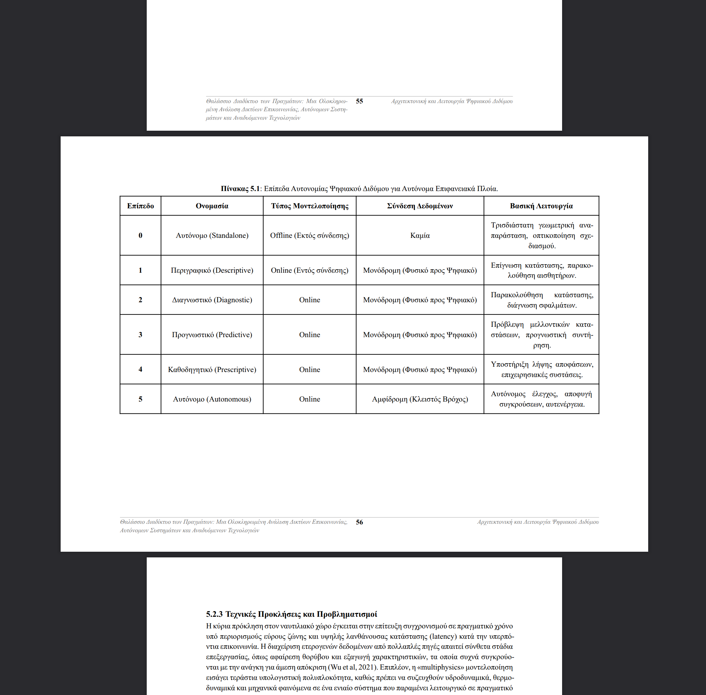

# TODOs

**Date**: 2025-1-03 14:27
**Iteration**: 002

## Typst Found Issues

### Chapter 2

- [x] Can you make the first column (Feature) a bit narrower? It has too much unnecessary space. Here is an image to better illustrate what I mean: 

### Chapter 5

- [x] The table looks great now, but when I said "rotate it", I did not meant the entire page, just the table. So the page remains as Portrait mode. Here is an image to better illustrate what I mean: 