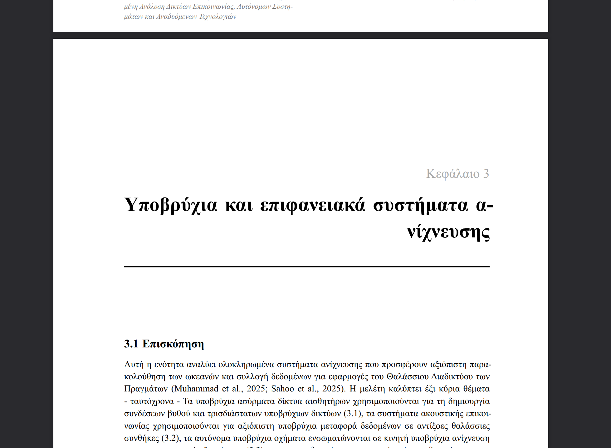

# TODOs

**Date**: 2025-1-03 14:32
**Iteration**: 003

## Typst Found Issues

### Front Matter

#### Cover Page

- Can you please fit the [University Logo](../../../assets/images/frontmatter/university-logo.png) nicely in the cover page? Having it there will make it look more official. I leave the positioning to you since you are the expert in Typst styling.

#### Declaration Page

- [ ] Please add a section for the Writer's Signature. Also, add a place holder for the name. The Signature should be signed above the name. Here is an example of how it should look like: [Example Declaration Page](./Example-of-Complete-Declaration.png).

#### Contents Table Page

- [ ] The Contents Table page looks good, but I believe it would be even better if we only showed up to the Sections level. So Chapters, Sections, but not the Subsections. Can you please do that?

#### Images List Page

- [ ] I do like it, just a minor detail. Can you remove the bold from the description of each image in the list? So only the "Εικόνα X.Y: " part should be bold, the rest normal font weight.

#### Tables List Page

- [ ] Same as above for the Tables List page. Please remove the bold from the description of each table in the list. So only the "Πίνακας X.Y: " part should be bold, the rest normal font weight.

### Chapter 1

#### 1.6 Δομή της Διατριβής

- [ ] Can you make bold the "Μέρος Ι", "Μέρος ΙΙ", "Μέρος ΙΙΙ" and "Μέρος IV" words in the paragraph? Just to make them stand out a bit more.

### Chapter 3

- [ ] In case the Thesis, Chapters' or Sections' titles are too long and need to be wrapped into 2 or more lines make sure that the words. It hard to explain so here is an image to illustrate what I mean: 

### Chapter 4

- [ ] Something is wrong with Chapter 4, it seems that the Sections are measing making the SubSections reach very high numbers like 4.1.41, 4.1.42 etc. Can you please check what is wrong there? It seems that the original Markdown file does have the Sections defined properly. Take a look and pleaes fix it. The original file's location: `chapters/Chapter-4/gr/Chapter-4-Final-no-refs.md`.

### Chapter 6

- [ ] Shares the same title wrapping issue as Chapter 3. I guess this is a template issue so fixing one will fix them all automatically.

### Chapter 7

#### 7.8 Συμπέρασμα

- [ ] Please make the following into sub sections (remove the ":" at the end and make them sub section titles):
  - `Κύρια Συμπεράσματα:`
  - `Περιορισμοί και Ερευνητικά Κενά:`
  - `Ερευνητικές Συνεισφορές:`

### Chapter 8

#### Table 8.2 Συστήματα Συλλογής Ενέργειας και Πράσινο Υλικό

- [ ] Can we make it so that the text inside the tables only does not break, yet the words wrap. This should also apply to the physics symbols like: `mW/cm²`. The symbols should be kept together and not be broken into different lines. This change is global for all tables in the Typst document.

### Chapter 9

#### Table 9.1: Συγκριτική Επισκόπηση Βασικών Προτύπων και Πλαισίων Ναυτιλιακού IoT

- [ ] Can you make the 3rd column (Κύριος Τομέας) a bit narrower to allow the 4th one that contains more text to have more space?

### Αλφαβητικό Ευρετήριο Όρων (Alphabetical Index of Terms)

- [ ] This is not a Chapter, its styling should follow the "Περίληψη", "Πίνακας Περιεχομένων", etc. So please remove the "Κεφάλαιο 11" from the title.

### Παραρτήματα (Appendices)

- [ ] This is not a Chapter, its styling should follow the "Περίληψη", "Πίνακας Περιεχομένων", etc. So please remove the "Κεφάλαιο 12" from the title.

### Βιβλιογραφία (References)

- [ ] This is not a Chapter, its styling should follow the "Περίληψη", "Πίνακας Περιεχομένων", etc. So please remove the "Κεφάλαιο 13" from the title.
